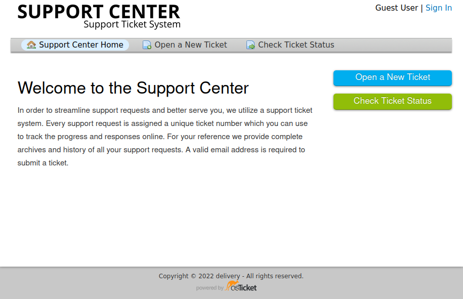
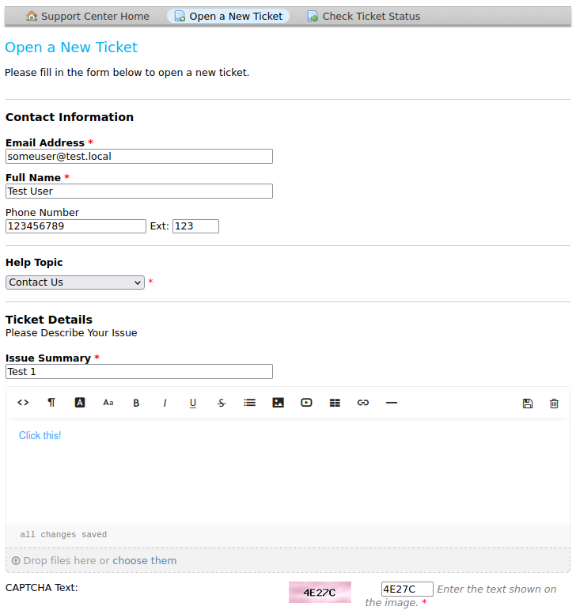
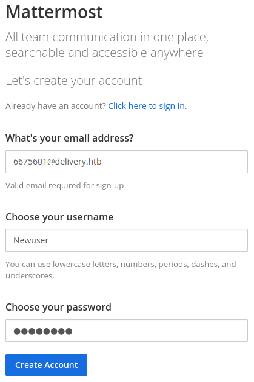
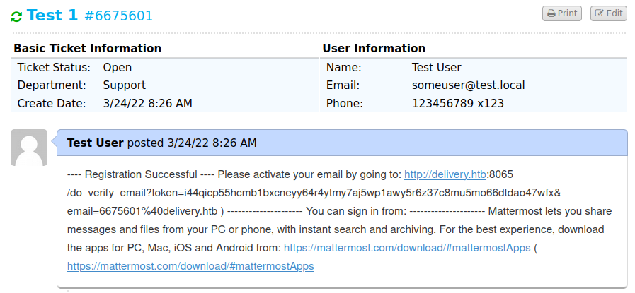

# Delivery

This is the write-up for the box Delivery that got retired at the 22nd May 2021.
My IP address was 10.10.14.4 while I did this.

Let's put this in our hosts file:
```markdown
10.10.10.222    delivery.htb
```

## Enumeration

Starting with a Nmap scan:

```
nmap -sC -sV -o nmap/delivery.nmap 10.10.10.222
```

```
PORT   STATE SERVICE VERSION
22/tcp open  ssh     OpenSSH 7.9p1 Debian 10+deb10u2 (protocol 2.0)
| ssh-hostkey:
|   2048 9c:40:fa:85:9b:01:ac:ac:0e:bc:0c:19:51:8a:ee:27 (RSA)
|   256 5a:0c:c0:3b:9b:76:55:2e:6e:c4:f4:b9:5d:76:17:09 (ECDSA)
|_  256 b7:9d:f7:48:9d:a2:f2:76:30:fd:42:d3:35:3a:80:8c (ED25519)
80/tcp open  http    nginx 1.14.2
|_http-server-header: nginx/1.14.2
|_http-title: Welcome
Service Info: OS: Linux; CPE: cpe:/o:linux:linux_kernel
```

## Checking HTTP (Port 80)

On the homepage is one message:
```
The best place to get all your email related support
For an account check out our helpdesk
```

The _Contact Us_ page has some more information:
```
For unregistered users, please use our HelpDesk to get in touch with our team.
Once you have an @delivery.htb email address, you'll be able to have access to our MatterMost server.
```

The word _HelpDesk_ contains a link that forwards to _helpdesk.delivery.htb_, which has to be added into our _/etc/hosts_ file.
This page is some kind of help desk portal powered by the open source Ticketing System [osTicket](https://osticket.com/).



There is a link on [Mattermost](https://mattermost.com/) to _delivery.htb:8065_, which is an open source collaboration tool server.

Creating a ticket:



After creating a ticket, it shows an email address _6675601@delivery.htb_:
```
Test User,

You may check the status of your ticket, by navigating to the Check Status page using ticket id: 6675601.

If you want to add more information to your ticket, just email 6675601@delivery.htb.
```

In the menu _Check Ticket Status_ it shows the mails that are sent to this mailbox.
By creating an account on the **Mattermost** server it should send an email to this official _delivery.htb_ email address and we should be able to access it as the _Contact Us_ notice said.

Creating account on **Mattermost**:



The verification email was sent to the email address, that can be seen in the Ticket Status:



After browsing to the activation link, the account is verified and access to the **Mattermost** server is granted.

## Enumerating Mattermost (Port 8065)

In the public channel _Internal_ are some messages from the user _root_:

```
Please update theme to the OSTicket before we go live.  Credentials to the server are maildeliverer:Youve_G0t_Mail!
Also please create a program to help us stop re-using the same passwords everywhere.... Especially those that are a variant of "PleaseSubscribe!"

PleaseSubscribe! may not be in RockYou but if any hacker manages to get our hashes, they can use hashcat rules to easily crack all variations of common words or phrases.
```

The credentials of the user _maildeliverer_ can be used to access the box on SSH:
```
ssh maildeliverer@10.10.10.222
```

## Privilege Escalation

Other than root there is another user on the box that can login called _mattermost_.

One of these users may use a combination of the _"PleaseSubscribe!"_ password as described in the **Mattermost** channel.
Creating a rule-based password list with **Hashcat**:
```
hashcat --stdout password.txt -r /usr/share/hashcat/rules/best64.rule > passwords.list
```

To brute-force the users, I will use the tool [sucrack](https://github.com/hemp3l/sucrack):
```
./sucrack -a -w 10 -u mattermost -r passwords.list
./sucrack -a -w 10 -u root -r passwords.list
```

It shows that the following password works for root:
> PleaseSubscribe!21

```
su - root
```

It is possible to switch users to root with this password!
