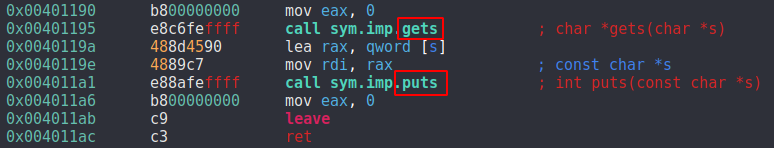
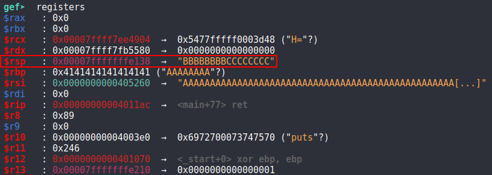

# Safe

This is the write-up for the box Safe that got retired at the 26th October 2019.
My IP address was 10.10.14.21 while I did this.

Let's put this in our hosts file:
```markdown
10.10.10.147    safe.htb
```

## Enumeration

Starting with a Nmap scan:

```markdown
nmap -sC -sV -o nmap/safe.nmap 10.10.10.147
```

```markdown
PORT   STATE SERVICE VERSION
22/tcp open  ssh     OpenSSH 7.4p1 Debian 10+deb9u6 (protocol 2.0)
| ssh-hostkey:
|   2048 6d:7c:81:3d:6a:3d:f9:5f:2e:1f:6a:97:e5:00:ba:de (RSA)
|   256 99:7e:1e:22:76:72:da:3c:c9:61:7d:74:d7:80:33:d2 (ECDSA)
|_  256 6a:6b:c3:8e:4b:28:f7:60:85:b1:62:ff:54:bc:d8:d6 (ED25519)
80/tcp open  http    Apache httpd 2.4.25 ((Debian))
|_http-server-header: Apache/2.4.25 (Debian)
|_http-title: Apache2 Debian Default Page: It works
Service Info: OS: Linux; CPE: cpe:/o:linux:linux_kernel
```

## Checking HTTP (Port 80)

On the web page there is the Apache2 Default Page and nothing else important.
When looking at the source code, there is a comment that is not default that says:
> <!-- 'myapp' can be downloaded to analyze from here its running on port 1337 -->

We can confirm that port 1337 is open with **Nmap**:
```markdown
nmap -p 1337 -sC -sV 10.10.10.147
```

```markdown
PORT     STATE SERVICE
1337/tcp open  waste
```

## Checking port 1337

When connecting to port 1337 via **Netcat**, it displays the output of the `uptime` command and then asks the question:
> What do you want me to echo back?

```markdown
nc 10.10.10.147 1337
```

We can input something and the input string gets echoed back. Simple command injection tricks don't seem to work, so we need to download the file and analyze it.

### Analyzing the app

The file _myapp_ can be downloaded from the initial web page:
```markdown
http://10.10.10.147/myapp
```

It is an ELF file that does the same thing as the service on port 1337, which means that we need to analyze this and then exploit the real service.
I use **gdb** and **radare2** to analyze this.

When looking at the _main function_, we can immediately see that it is vulnerable to a **Buffer Overflow** as it uses the `gets` and `puts` functions.



So lets execute this with a long string to overflow it on **gdb with gef installed**:
```markdown
(gdb) run

What do you want me to echo back? AAAAAAAAAAAAAAAAAAAAAAAAAAAAAAAAAAAAAAAAAAAAAAAAAAAAAAAAAAAAAAAAAAAAAAAAAAAAAAAAAAAAAAAAAAAAAAAAAAAAAAAAAAAAAAAAAAAAAAAAAAAAAAAA
AAAAAAAAAAAAAAAAAAAAAAAAAAAAAAAAAAAAAAAAAAAAAAAAAAAAAAAAAAAAAAAAAAAAAAAAAAAAAAAAAAAAAAAAAAAAAAAAAAAAAAAAAAAAAAAAAAAAAAAAAAAAAAAA
```

This results in a _Segmentation Fault_.
In order to see where we return, we need to put a pattern on this buffer.

```markdown
(gdb) pattern create 200
(gdb) pattern search $rsp
```

Running this again with the newly created pattern, it tells us that it found the _Offset on 120 (little-endian)_.
So we can put a memory address after 120, then we can continue the execution of the program.

With the following pattern we can see the registers:
```markdown
python -c 'print("A"\*120 + "B"\*8 + "C"\*8)

# Pattern
AAAAAAAAAAAAAAAAAAAAAAAAAAAAAAAAAAAAAAAAAAAAAAAAAAAAAAAAAAAAAAAAAAAAAAAAAAAAAAAAAAAAAAAAAAAAAAAAAAAAAAAAAAAAAAAAAAAAAAAABBBBBBBBCCCCCCCC
```



To write a script to exploit this, we need the starting address of the main function, which is at _0x40115f_.
Our goal is to hijack the system call `uptime` that we saw earlier, by putting our own string inside of _RDI_.

I wrote a Python exploit script that can be found in this repository called **safe_exploit.py**.
```markdown
python3 safe_exploit.py
```

After running the script, it opens a connection on the server and we get command execution.

## Privilege Escalation

We started a shell on the box as the user called _user_.
Before we look for an attack surface, it would be practical to drop some SSH keys on the box to get a stable SSH connection.
```markdown
ssh-keygen -f safe

chmod 600 safe
```

Copying the contents of _safe.pub_ on the box into the file _/.ssh/authorized_keys_ and we can login via SSH:
```markdown
ssh -i ssh/safe user@10.10.10.147
```

Looking at the home directory of the user, there are six _JPG image files_ and one _.kdbx file_ which is the extension for **KeePass databases**.
Downloading all files:
```markdown
scp -i ../ssh/safe user@10.10.10.147:* .
```

The images look like normal images and don't have any special metadata in them.
Lets extract the hash with the **KeePass module from JohnTheRipper**:
```markdown
keepass2john MyPasswords.kdbx > keepass_hashes
```

KeePass has the feature to use key files as the password. We can assume that the images could be potential key files for the database, so lets extract the hashes of those:
```markdown
for i in $(ls \*.JPG); do keepass2john -k $i MyPasswords.kdbx | sed "s/MyPasswords/$i/g"; done >> keepass_hashes
```

Now we got seven hashes in the _keepass_hashes_ file that we need to crack:
```markdown
hashcat -m 13400 -O keepass_hashes /usr/share/wordlists/rockyou.txt --user
```

A password from the file with the name _IMG_0547.JPG_ gets cracked and it is:
> bullshit

We can use either **kpcli** as a command line tool or the KeePass GUI tool to open the database.
The root password is in there but root login does not work but it is possible to use it to change the user with `su -` from _user_ to root!
